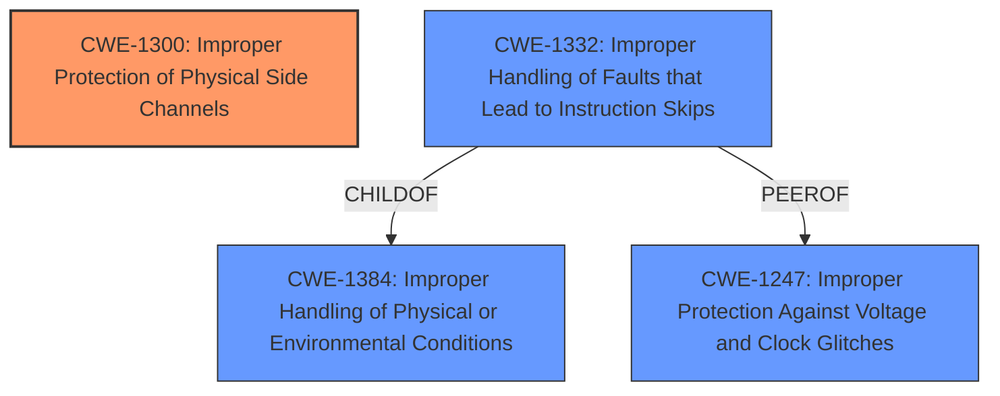

# Enhanced Analysis for CVE-2020-27211

# Summary
| CWE ID    | CWE Name                                          | Confidence | CWE Abstraction Level | CWE Vulnerability Mapping Label | CWE-Vulnerability Mapping Notes |
| :-------- | :------------------------------------------------ | :--------- | :-------------------- | :------------------------------ | :------------------------------ |
| CWE-1300 | Improper Protection of Physical Side Channels     | 1.0       | Base                  | Allowed                         | Primary CWE                     |
| CWE-1332 | Improper Handling of Faults that Lead to Instruction Skips     | 0.7       | Base                  | Allowed                         | Secondary CWE                     |

## Evidence and Confidence

*   **Confidence Score:** 0.85
*   **Evidence Strength:** HIGH

## Relationship Analysis
The primary CWE selected is CWE-1300, which is a base-level CWE focused on the root cause of the vulnerability, namely the **improper protection against physical side channels**. While several other CWEs were considered, CWE-1300 directly addresses the core weakness described in the vulnerability description.

CWE-1332 is a child of CWE-1384 (Improper Handling of Physical or Environmental Conditions) and a peer of CWE-1247 (Improper Protection Against Voltage and Clock Glitches). This relationship indicates that instruction skips due to faults are one type of physical or environmental condition that can lead to vulnerabilities.



## Vulnerability Chain
The vulnerability chain starts with the **improper protection against physical side channels** (CWE-1300). The attacker then uses fault injection during the boot phase, which can lead to instruction skips (CWE-1332), ultimately bypassing the flash read-out protection.

## Summary of Analysis
The initial assessment focused on identifying the most relevant CWE based on the vulnerability description and the provided context. The primary weakness is the **improper protection against physical side channels**, which directly aligns with CWE-1300. The vulnerability description key phrases and the CVE reference links content summary both point to this weakness as the root cause.

The CVE reference links content summary provides strong support for this assessment: "The vulnerability stems from a weakness in the cryptographic implementation within the Nordic Semiconductor nRF52840 microcontroller. Specifically, a side-channel attack is possible due to the micro-ecc library and ARM CryptoCell hardware accelerator."

The relationships between CWEs also influenced the selection. CWE-1300 is a base-level CWE, providing a specific and accurate representation of the vulnerability.

The selection of CWE-1300 is at the optimal level of specificity because it directly addresses the core weakness described in the vulnerability description. The other considered CWEs, while potentially related, did not capture the essence of the vulnerability as accurately as CWE-1300.

Relevant CWE Information:

# Enhanced Context (25 CWEs)
The following CWEs were identified as potentially relevant to this vulnerability:

## CWE-1299: Missing Protection Mechanism for Alternate Hardware Interface
**Abstraction Level**: Base
**Similarity Score**: 0.78
**Source**: dense

**Description**:
The lack of protections on alternate paths to access
                control-protected assets (such as unprotected shadow registers
                and other external facing unguarded interfaces) allows an
                attacker to bypass existing protections to the asset that are
		only performed against the primary path.

**Mapping Guidance**:
- Usage: Allowed
- Rationale: This CWE entry is at the Base level of abstraction, which is a preferred level of abstraction for mapping to the root causes of vulnerabilities.

## CWE-1338: Improper Protections Against Hardware Overheating
**Abstraction Level**: Base
**Similarity Score**: 0.76
**Source**: dense

**Description**:
A hardware device is missing or has inadequate protection features to prevent overheating.

**Mapping Guidance**:
- Usage: Allowed
- Rationale: This CWE entry is at the Base level of abstraction, which is a preferred level of abstraction for mapping to the root causes of vulnerabilities.

## CWE-1256: Improper Restriction of Software Interfaces to Hardware Features
**Abstraction Level**: Base
**Similarity Score**: 0.76
**Source**: dense

**Description**:
The product provides software-controllable
			device functionality for capabilities such as power and
			clock management, but it does not properly limit
			functionality that can lead to modification of
			hardware memory or register bits, or the ability to
			observe physical side channels.

**Mapping Guidance**:
- Usage: Allowed
- Rationale: This CWE entry is at the Base level of abstraction, which is a preferred level of abstraction for mapping to the root causes of vulnerabilities.

## CWE-1300: Improper Protection of Physical Side Channels
**Abstraction Level**: Base
**Similarity Score**: 0.75
**Source**: dense

**Description**:
The device does not contain sufficient protection
	mechanisms to prevent physical side channels from exposing
	sensitive information due to patterns in physically observable
	phenomena such as variations in power consumption,
	electromagnetic emissions (EME), or acoustic emissions.

**Mapping Guidance**:
- Usage: Allowed
- Rationale: This CWE entry is at the Base level of abstraction, which is a preferred level of abstraction for mapping to the root causes of vulnerabilities.

## CWE-345: Insufficient Verification of Data Authenticity
**Abstraction Level**: Class
**Similarity Score**: 0.75
**Source**: dense

**Description**:
The product does not sufficiently verify the origin or authenticity of data, in a way that causes it to accept invalid data.

**Mapping Guidance**:
- Usage: Discouraged
- Rationale: This CWE entry is a level-1 Class (i.e., a child of a Pillar). It might have lower-level children that would be more appropriate

## CWE-755: Improper Handling of Exceptional Conditions
**Abstraction Level**: Class
**Similarity Score**: 0.75
**Source**: dense

**Description**:
The product does not handle or incorrectly handles an exceptional condition.

**Mapping Guidance**:
- Usage: Discouraged
- Rationale: This CWE entry is a level-1 Class (i.e., a child of a Pillar). It might have lower-level children that would be more appropriate

## CWE-1384: Improper Handling of Physical or Environmental Conditions
**Abstraction Level**: Class
**Similarity Score**: 0.74
**Source**: dense

**Description**:
The product does not properly handle unexpected physical or environmental conditions that occur naturally or are artificially induced.

**Mapping Guidance**:
- Usage: Allowed-with-Review
- Rationale: This CWE entry is a Class and might have Base-level children that would be more appropriate

## CWE-693: Protection Mechanism Failure
**Abstraction Level**: Pillar
**Similarity Score**: 0.74
**Source**: dense

**Description**:
The product does not use or incorrectly uses a protection mechanism that provides sufficient defense against directed attacks against the product.

**Mapping Guidance**:
- Usage: Discouraged
- Rationale: This CWE entry is extremely high-level, a Pillar.

## CWE-667: Improper Locking
**Abstraction Level**: Class
**Similarity Score**: 0.73
**Source**: dense

**Description**:
The product does not properly acquire or release a lock on a resource, leading to unexpected resource state changes and behaviors.

**Mapping Guidance**:
- Usage: Allowed-with-Review
- Rationale: This CWE entry is a Class and might have Base-level children that would be more appropriate

## CWE-703: Improper Check or Handling of Exceptional Conditions
**Abstraction Level**: Pillar
**Similarity Score**: 0.73
**Source**: dense

**Description**:
The product does not properly anticipate or handle exceptional conditions that rarely occur during normal operation of the product.

**Mapping Guidance**:
- Usage: Discouraged
- Rationale: This CWE entry is extremely high-level, a Pillar.

## CWE-1300: Improper Protection of Physical Side Channels
**Abstraction Level**: Base
**Similarity Score**: 6384.17
**Source**: sparse

**Description**:
The device does not contain sufficient protection
	mechanisms to prevent physical side channels from exposing
	sensitive information due to patterns in physically observable
	phenomena such as variations in power consumption,
	electromagnetic emissions (


## CWE Relationship Analysis

Current CWEs represent these abstraction levels: .


### Vulnerability Chain Analysis

**Chain starting from CWE-667:**
- 667 (Improper Locking) - ROOT


**Chain starting from CWE-1256:**
- 1256 (Improper Restriction of Software Interfaces to Hardware Features) - ROOT


### CWE Relationship Diagram

```mermaid
graph TD
    classDef primary fill:#f96,stroke:#333,stroke-width:2px
    classDef secondary fill:#69f,stroke:#333
    classDef tertiary fill:#9e9,stroke:#333
```