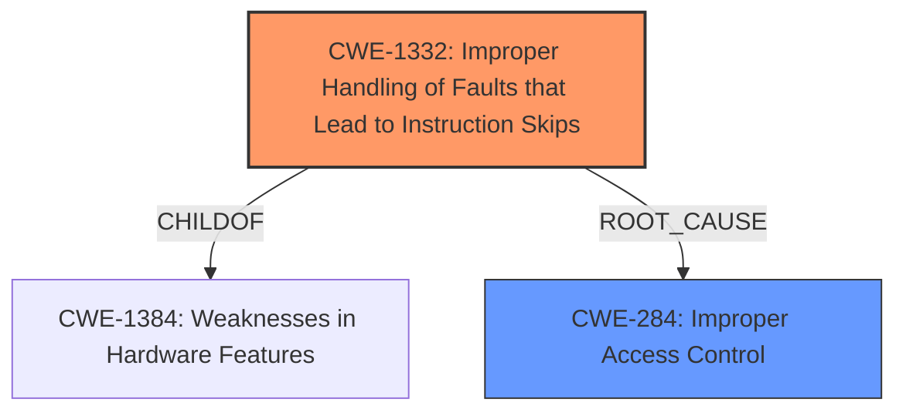

# Raw Analyzer Response for CVE-2020-27212

# Summary
| CWE ID  | CWE Name                                                    | Confidence | CWE Abstraction Level | CWE Vulnerability Mapping Label | CWE-Vulnerability Mapping Notes |
| :-------- | :---------------------------------------------------------- | :--------- | :---------------------- | :------------------------------ | :------------------------------ |
| CWE-1332 | Improper Handling of Faults that Lead to Instruction Skips | 0.85       | Base                    | Primary                         | Allowed                       |
| CWE-284 | Improper Access Control | 0.50       | Pillar                    | Secondary                         | Discouraged                       |

## Evidence and Confidence

*   **Confidence Score:** 0.8
*   **Evidence Strength:** HIGH

## Relationship Analysis
The primary CWE is CWE-1332, which describes the **improper handling of faults** that lead to instruction skips. The vulnerability involves **fault injection** during the boot phase. This aligns with the description of CWE-1332, where fault injection techniques are used to alter the operating conditions of hardware. The parent of CWE-1332 is CWE-1384, which is a Class-level CWE.

The secondary CWE is CWE-284, **Improper Access Control**, as the root cause is **incorrect access control**, which is explicitly mentioned in the vulnerability description. However, CWE-284 is a high-level Pillar and should be avoided if more specific CWEs are available.

## Vulnerability Chain
The vulnerability chain starts with the **incorrect access control** in STMicroelectronics STM32L4 devices. An attacker can then use **fault injection** during the boot phase to degrade the flash read-out protection (RDP) from level 2 to level 1, which leads to firmware extraction.

## Summary of Analysis
The initial assessment, based on the provided evidence, points to **incorrect access control** as the root cause. The evidence, especially the "Vulnerability Description Key Phrases," explicitly mentions "**incorrect access control**." However, the Retriever Results and Complete CWE Specifications suggest a more specific CWE related to the **fault injection** aspect.

The final decision is to assign CWE-1332 as the primary CWE, because of the **fault injection** vector is the key element that allows an attacker to change the RDP level. CWE-284 is assigned as a secondary CWE because the vulnerability description key phrases identified "**incorrect access control**" as the rootcause.

The selected CWEs are at the optimal level of specificity. CWE-1332 is a Base-level CWE that accurately represents the weakness of **improper handling of faults** leading to instruction skips. CWE-284, while high-level, captures the general **incorrect access control** aspect.

Relevant CWE Information:

# Enhanced Context (25 CWEs)
The following CWEs were identified as potentially relevant to this vulnerability:

## CWE-1299: Missing Protection Mechanism for Alternate Hardware Interface
**Abstraction Level**: Base
**Similarity Score**: 0.82
**Source**: dense

**Description**:
The lack of protections on alternate paths to access
                control-protected assets (such as unprotected shadow registers
                and other external facing unguarded interfaces) allows an
                attacker to bypass existing protections to the asset that are
		only performed against the primary path.

**Mapping Guidance**:
- Usage: Allowed
- Rationale: This CWE entry is at the Base level of abstraction, which is a preferred level of abstraction for mapping to the root causes of vulnerabilities.

## CWE-1263: Improper Physical Access Control
**Abstraction Level**: Class
**Similarity Score**: 0.78
**Source**: dense

**Description**:
The product is designed with access restricted to certain information, but it does not sufficiently protect against an unauthorized actor with physical access to these areas.

**Mapping Guidance**:
- Usage: Allowed-with-Review
- Rationale: This CWE entry is a Class and might have Base-level children that would be more appropriate

## CWE-1220: Insufficient Granularity of Access Control
**Abstraction Level**: Base
**Similarity Score**: 0.77
**Source**: dense

**Description**:
The product implements access controls via a policy or other feature with the intention to disable or restrict accesses (reads and/or writes) to assets in a system from untrusted agents. However, implemented access controls lack required granularity, which renders the control policy too broad because it allows accesses from unauthorized agents to the security-sensitive assets.

**Mapping Guidance**:
- Usage: Allowed
- Rationale: This CWE entry is at the Base level of abstraction, which is a preferred level of abstraction for mapping to the root causes of vulnerabilities.

## CWE-653: Improper Isolation or Compartmentalization
**Abstraction Level**: Class
**Similarity Score**: 0.77
**Source**: dense

**Description**:
The product does not properly compartmentalize or isolate functionality, processes, or resources that require different privilege levels, rights, or permissions.

**Mapping Guidance**:
- Usage: Allowed
- Rationale: This CWE entry is at the Base level of abstraction, which is a preferred level of abstraction for mapping to the root causes of vulnerabilities.

## CWE-691: Insufficient Control Flow Management
**Abstraction Level**: Pillar
**Similarity Score**: 0.76
**Source**: dense

**Description**:
The code does not sufficiently manage its control flow during execution, creating conditions in which the control flow can be modified in unexpected ways.

**Mapping Guidance**:
- Usage: Discouraged
- Rationale: This CWE entry is extremely high-level, a Pillar. However, classification research is limited for weaknesses of this type, so there can be gaps or organizational difficulties within CWE that force use of this weakness, even at such a high level of abstraction.

## CWE-424: Improper Protection of Alternate Path
**Abstraction Level**: Class
**Similarity Score**: 0.75
**Source**: dense

**Description**:
The product does not sufficiently protect all possible paths that a user can take to access restricted functionality or resources.

**Mapping Guidance**:
- Usage: Allowed-with-Review
- Rationale: This CWE entry is a Class and might have Base-level children that would be more appropriate

## CWE-345: Insufficient Verification of Data Authenticity
**Abstraction Level**: Class
**Similarity Score**: 0.75
**Source**: dense

**Description**:
The product does not sufficiently verify the origin or authenticity of data, in a way that causes it to accept invalid data.

**Mapping Guidance**:
- Usage: Discouraged
- Rationale: This CWE entry is a level-1 Class (i.e., a child of a Pillar). It might have lower-level children that would be more appropriate

## CWE-300: Channel Accessible by Non-Endpoint
**Abstraction Level**: Class
**Similarity Score**: 0.75
**Source**: dense

**Description**:
The product does not adequately verify the identity of actors at both ends of a communication channel, or does not adequately ensure the integrity of the channel, in a way that allows the channel to be accessed or influenced by an actor that is not an endpoint.

**Mapping Guidance**:
- Usage: Discouraged
- Rationale: CWE-300 is commonly misused for vulnerabilities in which the prerequisites for exploitation require the adversary to be in a privileged "in-the-middle" position.

## CWE-667: Improper Locking
**Abstraction Level**: Class
**Similarity Score**: 0.75
**Source**: dense

**Description**:
The product does not properly acquire or release a lock on a resource, leading to unexpected resource state changes and behaviors.

**Mapping Guidance**:
- Usage: Allowed-with-Review
- Rationale: This CWE entry is a Class and might have Base-level children that would be more appropriate

## CWE-420: Unprotected Alternate Channel
**Abstraction Level**: Base
**Similarity Score**: 0.75
**Source**: dense

**Description**:
The product protects a primary channel, but it does not use the same level of protection for an alternate channel.

**Mapping Guidance**:
- Usage: Allowed
- Rationale: This CWE entry is at the Base level of abstraction, which is a preferred level of abstraction for mapping to the root causes of vulnerabilities.

## CWE-1299: Missing Protection Mechanism for Alternate Hardware Interface
**Abstraction Level**: Base
**Similarity Score**: 6547.55
**Source**: sparse

**Description**:
The lack of protections on alternate paths to access
                control-protected assets (such as unprotected shadow registers
                and other external facing unguarded interfaces) allows an