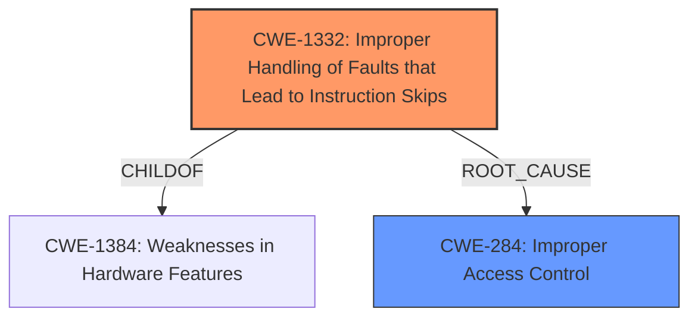

# Analysis for CVE-2020-27212

# Summary
| CWE ID  | CWE Name                                                    | Confidence | CWE Abstraction Level | CWE Vulnerability Mapping Label | CWE-Vulnerability Mapping Notes |
| :-------- | :---------------------------------------------------------- | :--------- | :---------------------- | :------------------------------ | :------------------------------ |
| CWE-1332 | Improper Handling of Faults that Lead to Instruction Skips | 0.85       | Base                    | Primary                         | Allowed                       |
| CWE-284 | Improper Access Control | 0.50       | Pillar                    | Secondary                         | Discouraged                       |

## Evidence and Confidence

*   **Confidence Score:** 0.8
*   **Evidence Strength:** HIGH

## Relationship Analysis
The primary CWE is CWE-1332, which describes the **improper handling of faults** that lead to instruction skips. The vulnerability involves **fault injection** during the boot phase. This aligns with the description of CWE-1332, where fault injection techniques are used to alter the operating conditions of hardware. The parent of CWE-1332 is CWE-1384, which is a Class-level CWE.

The secondary CWE is CWE-284, **Improper Access Control**, as the root cause is **incorrect access control**, which is explicitly mentioned in the vulnerability description. However, CWE-284 is a high-level Pillar and should be avoided if more specific CWEs are available.

## Vulnerability Chain
The vulnerability chain starts with the **incorrect access control** in STMicroelectronics STM32L4 devices. An attacker can then use **fault injection** during the boot phase to degrade the flash read-out protection (RDP) from level 2 to level 1, which leads to firmware extraction.

## Summary of Analysis
The initial assessment, based on the provided evidence, points to **incorrect access control** as the root cause. The evidence, especially the "Vulnerability Description Key Phrases," explicitly mentions "**incorrect access control**." However, the Retriever Results and Complete CWE Specifications suggest a more specific CWE related to the **fault injection** aspect.

The final decision is to assign CWE-1332 as the primary CWE, because of the **fault injection** vector is the key element that allows an attacker to change the RDP level. CWE-284 is assigned as a secondary CWE because the vulnerability description key phrases identified "**incorrect access control**" as the rootcause.

The selected CWEs are at the optimal level of specificity. CWE-1332 is a Base-level CWE that accurately represents the weakness of **improper handling of faults** leading to instruction skips. CWE-284, while high-level, captures the general **incorrect access control** aspect.

Relevant CWE Information:

# Enhanced Context (25 CWEs)
The following CWEs were identified as potentially relevant to this vulnerability:

## CWE-1299: Missing Protection Mechanism for Alternate Hardware Interface
**Abstraction Level**: Base
**Similarity Score**: 0.82
**Source**: dense

**Description**:
The lack of protections on alternate paths to access
                control-protected assets (such as unprotected shadow registers
                and other external facing unguarded interfaces) allows an
                attacker to bypass existing protections to the asset that are
		only performed against the primary path.

**Mapping Guidance**:
- Usage: Allowed
- Rationale: This CWE entry is at the Base level of abstraction, which is a preferred level of abstraction for mapping to the root causes of vulnerabilities.

## CWE-1263: Improper Physical Access Control
**Abstraction Level**: Class
**Similarity Score**: 0.78
**Source**: dense

**Description**:
The product is designed with access restricted to certain information, but it does not sufficiently protect against an unauthorized actor with physical access to these areas.

**Mapping Guidance**:
- Usage: Allowed-with-Review
- Rationale: This CWE entry is a Class and might have Base-level children that would be more appropriate

## CWE-1220: Insufficient Granularity of Access Control
**Abstraction Level**: Base
**Similarity Score**: 0.77
**Source**: dense

**Description**:
The product implements access controls via a policy or other feature with the intention to disable or restrict accesses (reads and/or writes) to assets in a system from untrusted agents. However, implemented access controls lack required granularity, which renders the control policy too broad because it allows accesses from unauthorized agents to the security-sensitive assets.

**Mapping Guidance**:
- Usage: Allowed
- Rationale: This CWE entry is at the Base level of abstraction, which is a preferred level of abstraction for mapping to the root causes of vulnerabilities.

## CWE-653: Improper Isolation or Compartmentalization
**Abstraction Level**: Class
**Similarity Score**: 0.77
**Source**: dense

**Description**:
The product does not properly compartmentalize or isolate functionality, processes, or resources that require different privilege levels, rights, or permissions.

**Mapping Guidance**:
- Usage: Allowed
- Rationale: This CWE entry is at the Base level of abstraction, which is a preferred level of abstraction for mapping to the root causes of vulnerabilities.

## CWE-691: Insufficient Control Flow Management
**Abstraction Level**: Pillar
**Similarity Score**: 0.76
**Source**: dense

**Description**:
The code does not sufficiently manage its control flow during execution, creating conditions in which the control flow can be modified in unexpected ways.

**Mapping Guidance**:
- Usage: Discouraged
- Rationale: This CWE entry is extremely high-level, a Pillar. However, classification research is limited for weaknesses of this type, so there can be gaps or organizational difficulties within CWE that force use of this weakness, even at such a high level of abstraction.

## CWE-424: Improper Protection of Alternate Path
**Abstraction Level**: Class
**Similarity Score**: 0.75
**Source**: dense

**Description**:
The product does not sufficiently protect all possible paths that a user can take to access restricted functionality or resources.

**Mapping Guidance**:
- Usage: Allowed-with-Review
- Rationale: This CWE entry is a Class and might have Base-level children that would be more appropriate

## CWE-345: Insufficient Verification of Data Authenticity
**Abstraction Level**: Class
**Similarity Score**: 0.75
**Source**: dense

**Description**:
The product does not sufficiently verify the origin or authenticity of data, in a way that causes it to accept invalid data.

**Mapping Guidance**:
- Usage: Discouraged
- Rationale: This CWE entry is a level-1 Class (i.e., a child of a Pillar). It might have lower-level children that would be more appropriate

## CWE-300: Channel Accessible by Non-Endpoint
**Abstraction Level**: Class
**Similarity Score**: 0.75
**Source**: dense

**Description**:
The product does not adequately verify the identity of actors at both ends of a communication channel, or does not adequately ensure the integrity of the channel, in a way that allows the channel to be accessed or influenced by an actor that is not an endpoint.

**Mapping Guidance**:
- Usage: Discouraged
- Rationale: CWE-300 is commonly misused for vulnerabilities in which the prerequisites for exploitation require the adversary to be in a privileged "in-the-middle" position.

## CWE-667: Improper Locking
**Abstraction Level**: Class
**Similarity Score**: 0.75
**Source**: dense

**Description**:
The product does not properly acquire or release a lock on a resource, leading to unexpected resource state changes and behaviors.

**Mapping Guidance**:
- Usage: Allowed-with-Review
- Rationale: This CWE entry is a Class and might have Base-level children that would be more appropriate

## CWE-420: Unprotected Alternate Channel
**Abstraction Level**: Base
**Similarity Score**: 0.75
**Source**: dense

**Description**:
The product protects a primary channel, but it does not use the same level of protection for an alternate channel.

**Mapping Guidance**:
- Usage: Allowed
- Rationale: This CWE entry is at the Base level of abstraction, which is a preferred level of abstraction for mapping to the root causes of vulnerabilities.

## CWE-1299: Missing Protection Mechanism for Alternate Hardware Interface
**Abstraction Level**: Base
**Similarity Score**: 6547.55
**Source**: sparse

**Description**:
The lack of protections on alternate paths to access
                control-protected assets (such as unprotected shadow registers
                and other external facing unguarded interfaces) allows an

# Enhanced Query for CVE-2020-27212

## Vulnerability Description
STMicroelectronics STM32L4 devices through 2020-10-19 have **incorrect access control**. The flash read-out protection (RDP) can be degraded from RDP level 2 (no access via debug interface) to level 1 (limited access via debug interface) by injecting a fault during the boot phase.

### Vulnerability Description Key Phrases
- **rootcause:** **incorrect access control**
- **impact:** degrade flash read-out protection (RDP) from level 2 to level 1
- **vector:** fault injection during boot phase
- **product:** STMicroelectronics STM32L4 devices
- **version:** through 2020-10-19

## CVE Reference Links Content Summary
Based on the provided content, here's a breakdown of the vulnerability related to CVE-2020-27212:

**Root Cause:**

The root cause is a flaw in the implementation of the read-out protection mechanism of the ST Microelectronics STM32L4 microcontroller. This flaw allows attackers to circumvent the intended protection. Specifically, fault injection attacks were used to bypass the read-out protection.

**Weaknesses/Vulnerabilities:**

*   **Circumvented Read-Out Protection:** The primary weakness is the ability to bypass the read-out protection mechanism of the STM32L4 microcontroller. This mechanism is meant to prevent the extraction of firmware from the device.

**Impact of Exploitation:**

*   **Firmware Extraction:** Successful exploitation allows an attacker to extract the firmware from the microcontroller, potentially exposing sensitive information like cryptographic keys, algorithms, and intellectual property.

**Attack Vectors:**

*   **Fault Injection:** The attack vector is fault injection. Fault injection techniques, in combination with side-channel analysis, are used to manipulate the behavior of the microcontroller and bypass the read-out protection mechanism.
*   **Physical Access:** The attack requires physical access to the device containing the vulnerable microcontroller.

**Required Attacker Capabilities/Position:**

*   **Physical Access:**  The attacker needs physical access to the device containing the STM32L4 microcontroller.
*   **Fault Injection Expertise:** The attacker needs expertise in fault injection techniques and side-channel analysis. They need to be able to setup and execute these types of attacks.
*   **Specialized Equipment:** The attacker requires access to specialized equipment for fault injection and side-channel analysis such as UV-C light sources, EM probes, and oscilloscopes.

**Additional Notes:**

*   The provided text mentions the STM32L4 is used in several devices, including the SoloKeys Solo & Somu, the Nitrokey FIDO2. This means that the vulnerability affects multiple products using this microcontroller.
*   The content also describes attacks against the nRF52840 microcontroller, which is related to CVE-2021-29415, and micro-ecc (CVE-2020-27209).
* Countermeasures are mentioned as a way to mitigate the vulnerabilities.

The provided text offers much more detail about the vulnerability than the typical CVE description and shows how the vulnerability can be practically exploited.

## Retriever Results

### Top Combined Results

| Rank | CWE ID | Name | Abstraction | Usage  | Retrievers | Individual Scores |
|------|--------|------|-------------|-------|------------|-------------------|
| 1 | 1332 | Improper Handling of Faults that Lead to Instruction Skips | Base | Allowed | sparse | 0.494 |
| 2 | 1296 | Incorrect Chaining or Granularity of Debug Components | Base | Allowed | sparse | 0.304 |
| 3 | 1300 | Improper Protection of Physical Side Channels | Base | Allowed | sparse | 0.268 |
| 4 | 1263 | Improper Physical Access Control | Class | Allowed-with-Review | sparse | 0.231 |
| 5 | 284 | Improper Access Control | Pillar | Discouraged | sparse | 0.224 |
| 6 | 1191 | On-Chip Debug and Test Interface With Improper Access Control | Base | Allowed | dense | 0.641 |
| 7 | 1262 | Improper Access Control for Register Interface | Base | Allowed | graph | 0.002 |
| 8 | 1299 | Missing Protection Mechanism for Alternate Hardware Interface | Base | Allowed | sparse | 0.224 |
| 9 | 287 | Improper Authentication | Class | Discouraged | sparse | 0.224 |
| 10 | 420 | Unprotected Alternate Channel | Base | Allowed | sparse | 0.222 |

# Complete CWE Specifications

## CWE-1332: Improper Handling of Faults that Lead to Instruction Skips
**Abstraction:** Base
**Status:** Stable

### Description
The device is missing or incorrectly implements circuitry or sensors that detect and mitigate the skipping of security-critical CPU instructions when they occur.

### Extended Description

The operating conditions of hardware may change in ways that cause unexpected behavior to occur, including the skipping of security-critical CPU instructions. Generally, this can occur due to electrical disturbances or when the device operates outside of its expected conditions.

In practice, application code may contain conditional branches that are security-sensitive (e.g., accepting or rejecting a user-provided password). These conditional branches are typically implemented by a single conditional branch instruction in the program binary which, if skipped, may lead to effectively flipping the branch condition - i.e., causing the wrong security-sensitive branch to be taken. This affects processes such as firmware authentication, password verification, and other security-sensitive decision points.

Attackers can use fault injection techniques to alter the operating conditions of hardware so that security-critical instructions are skipped more frequently or more reliably than they would in a "natural" setting.

### Alternative Terms
None

### Relationships
ChildOf -> CWE-1384
PeerOf -> CWE-1247

### Mapping Guidance
**Usage:** Allowed
**Rationale:** This CWE entry is at the Base level of abstraction, which is a preferred level of abstraction for mapping to the root causes of vulnerabilities.
**Comments:** Carefully read both the name and description to ensure that this mapping is an appropriate fit. Do not try to 'force' a mapping to a lower-level Base/Variant simply to comply with this preferred level of abstraction.
**Reasons:**
- Acceptable-Use

### Observed Examples
- **CVE-2019-15894:** fault injection attack bypasses the verification mode, potentially allowing arbitrary code execution.

## CWE-1296: Incorrect Chaining or Granularity of Debug Components
**Abstraction:** Base
**Status:** Incomplete

### Description
The product's debug components contain incorrect chaining or granularity of debug components.

### Extended Description

For debugging and troubleshooting a chip, several hardware design elements are often implemented, including:

  - Various Test Access Ports (TAPs) allow boundary scan commands to be executed.

  - For scanning the internal components of a chip, there are scan cells that allow the chip to be used as a "stimulus and response" mechanism.

  - Chipmakers might create custom methods to observe the internal components of their chips by placing various tracing hubs within their chip and creating hierarchical or interconnected structures among those hubs.

Logic errors during design or synthesis could misconfigure the interconnection of the debug components, which could allow unintended access permissions.

### Alternative Terms
None

### Relationships
ChildOf -> CWE-284

### Mapping Guidance
**Usage:** Allowed
**Rationale:** This CWE entry is at the Base level of abstraction, which is a preferred level of abstraction for mapping to the root causes of vulnerabilities.
**Comments:** Carefully read both the name and description to ensure that this mapping is an appropriate fit. Do not try to 'force' a mapping to a lower-level Base/Variant simply to comply with this preferred level of abstraction.
**Reasons:**
- Acceptable-Use

### Additional Notes
**[Maintenance]** This entry is still under development and will continue to see updates and content improvements.

### Observed Examples
- **CVE-2017-18347:** Incorrect access control in RDP Level 1 on STMicroelectronics STM32F0 series devices allows physically present attackers to extract the device's protected firmware via a special sequence of Serial Wire Debug (SWD) commands because there is a race condition between full initialization of the SWD interface and the setup of flash protection.
- **CVE-2020-1791:** There is an improper authorization vulnerability in several smartphones. The system has a logic-judging error, and, under certain scenarios, a successful exploit could allow the attacker to switch to third desktop after a series of operations in ADB mode. (Vulnerability ID: HWPSIRT-2019-10114).

## CWE-1300: Improper Protection of Physical Side Channels
**Abstraction:** Base
**Status:** Stable

### Description
The device does not contain sufficient protection
	mechanisms to prevent physical side channels from exposing
	sensitive information due to patterns in physically observable
	phenomena such as variations in power consumption,
	electromagnetic emissions (EME), or acoustic emissions.

### Extended Description

An adversary could monitor and measure physical phenomena to detect patterns and make inferences, even if it is not possible to extract the information in the digital domain.

Physical side channels have been well-studied for decades in the context of breaking implementations of cryptographic algorithms or other attacks against security features. These side channels may be easily observed by an adversary with physical access to the device, or using a tool that is in close proximity. If the adversary can monitor hardware operation and correlate its data processing with power, EME, and acoustic measurements, the adversary might be able to recover of secret keys and data.

### Alternative Terms
None

### Relationships
ChildOf -> CWE-203
ChildOf -> CWE-203

### Mapping Guidance
**Usage:** Allowed
**Rationale:** This CWE entry is at the Base level of abstraction, which is a preferred level of abstraction for mapping to the root causes of vulnerabilities.
**Comments:** Carefully read both the name and description to ensure that this mapping is an appropriate fit. Do not try to 'force' a mapping to a lower-level Base/Variant simply to comply with this preferred level of abstraction.
**Reasons:**
- Acceptable-Use

### Observed Examples
- **CVE-2022-35888:** Power side-channels leak secret information from processor
- **CVE-2021-3011:** electromagnetic-wave side-channel in security-related microcontrollers allows extraction of private key
- **CVE-2019-14353:** Crypto hardware wallet's power consumption relates to total number of pixels illuminated, creating a side channel in the USB connection that allows attackers to determine secrets displayed such as PIN numbers and passwords

## CWE-1263: Improper Physical Access Control
**Abstraction:** Class
**Status:** Incomplete

### Description
The product is designed with access restricted to certain information, but it does not sufficiently protect against an unauthorized actor with physical access to these areas.

### Extended Description
Sections of a product intended to have restricted access may be inadvertently or intentionally rendered accessible when the implemented physical protections are insufficient. The specific requirements around how robust the design of the physical protection mechanism needs to be depends on the type of product being protected. Selecting the correct physical protection mechanism and properly enforcing it through implementation and manufacturing are critical to the overall physical security of the product.

### Alternative Terms
None

### Relationships
ChildOf -> CWE-284
PeerOf -> CWE-1191

### Mapping Guidance
**Usage:** Allowed-with-Review
**Rationale:** This CWE entry is a Class and might have Base-level children that would be more appropriate
**Comments:** Examine children of this entry to see if there is a better fit
**Reasons:**
- Abstraction

### Additional Notes
**[Maintenance]** This entry is still under development and will continue to see updates and content improvements.

## CWE-284: Improper Access Control
**Abstraction:** Pillar
**Status:** Incomplete

### Description
The product does not restrict or incorrectly restricts access to a resource from an unauthorized actor.

### Extended Description

Access control involves the use of several protection mechanisms such as:

  - Authentication (proving the identity of an actor)

  - Authorization (ensuring that a given actor can access a resource), and

  - Accountability (tracking of activities that were performed)

When any mechanism is not applied or otherwise fails, attackers can compromise the security of the product by gaining privileges, reading sensitive information, executing commands, evading detection, etc.

There are two distinct behaviors that can introduce access control weaknesses:

  - Specification: incorrect privileges, permissions, ownership, etc. are explicitly specified for either the user or the resource (for example, setting a password file to be world-writable, or giving administrator capabilities to a guest user). This action could be performed by the program or the administrator.

  - Enforcement: the mechanism contains errors that prevent it from properly enforcing the specified access control requirements (e.g., allowing the user to specify their own privileges, or allowing a syntactically-incorrect ACL to produce insecure settings). This problem occurs within the program itself, in that it does not actually enforce the intended security policy that the administrator specifies.

### Alternative Terms
Authorization: The terms "access control" and "authorization" are often used interchangeably, although many people have distinct definitions. The CWE usage of "access control" is intended as a general term for the various mechanisms that restrict which users can access which resources, and "authorization" is more narrowly defined. It is unlikely that there will be community consensus on the use of these terms.

### Relationships
None

### Mapping Guidance
**Usage:** Discouraged
**Rationale:** CWE-284 is extremely high-level, a Pillar. Its name, "Improper Access Control," is often misused in low-information vulnerability reports [REF-1287] or by active use of the OWASP Top Ten, such as "A01:2021-Broken Access Control". It is not useful for trend analysis.
**Comments:** Consider using descendants of CWE-284 that are more specific to the kind of access control involved, such as those involving authorization (Missing Authorization (CWE-862), Incorrect Authorization (CWE-863), Incorrect Permission Assignment for Critical Resource (CWE-732), etc.); authentication (Missing Authentication (CWE-306) or Weak Authentication (CWE-1390)); Incorrect User Management (CWE-286); Improper Restriction of Communication Channel to Intended Endpoints (CWE-923); etc.
**Reasons:**
- Frequent Misuse
- Abstraction
**Suggested Alternatives:**
- CWE-862: Missing Authorization
- CWE-863: Incorrect Authorization
- CWE-732: Incorrect Permission Assignment for Critical Resource
- CWE-306: Missing Authentication
- CWE-1390: Weak Authentication
- CWE-923: Improper Restriction of Communication Channel to Intended Endpoints

### Additional Notes
**[Maintenance]** 

This entry needs more work. Possible sub-categories include:

  - Trusted group includes undesired entities (partially covered by CWE-286)

  - Group can perform undesired actions

  - ACL parse error does not fail closed

### Observed Examples
- **CVE-2022-24985:** A form hosting website only checks the session authentication status for a single form, making it possible to bypass authentication when there are multiple forms
- **CVE-2022-29238:** Access-control setting in web-based document collaboration tool is not properly implemented by the code, which prevents listing hidden directories but does not prevent direct requests to files in those directories.
- **CVE-2022-23607:** Python-based HTTP library did not scope cookies to a particular domain such that "supercookies" could be sent to any domain on redirect

## CWE-1191: On-Chip Debug and Test Interface With Improper Access Control
**Abstraction:** Base
**Status:** Stable

### Description
The chip does not implement or does not correctly perform access control to check whether users are authorized to access internal registers and test modes through the physical debug/test interface.

### Extended Description

A device's internal information may be accessed through a scan chain of interconnected internal registers, usually through a JTAG interface. The JTAG interface provides access to these registers in a serial fashion in the form of a scan chain for the purposes of debugging programs running on a device. Since almost all information contained within a device may be accessed over this interface, device manufacturers typically insert some form of authentication and authorization to prevent unintended use of this sensitive information. This mechanism is implemented in addition to on-chip protections that are already present.

If authorization, authentication, or some other form of access control is not implemented or not implemented correctly, a user may be able to bypass on-chip protection mechanisms through the debug interface.

Sometimes, designers choose not to expose the debug pins on the motherboard. Instead, they choose to hide these pins in the intermediate layers of the board. This is primarily done to work around the lack of debug authorization inside the chip. In such a scenario (without debug authorization), when the debug interface is exposed, chip internals are accessible to an attacker.

### Alternative Terms
None

### Relationships
ChildOf -> CWE-284

### Mapping Guidance
**Usage:** Allowed
**Rationale:** This CWE entry is at the Base level of abstraction, which is a preferred level of abstraction for mapping to the root causes of vulnerabilities.
**Comments:** Carefully read both the name and description to ensure that this mapping is an appropriate fit. Do not try to 'force' a mapping to a lower-level Base/Variant simply to comply with this preferred level of abstraction.
**Reasons:**
- Acceptable-Use

### Additional Notes
**[Relationship]** CWE-1191 and CWE-1244 both involve physical debug access, but the weaknesses are different. CWE-1191 is effectively about missing authorization for a debug interface, i.e. JTAG. CWE-1244 is about providing internal assets with the wrong debug access level, exposing the asset to untrusted debug agents.

### Observed Examples
- **CVE-2019-18827:** chain: JTAG interface is not disabled (CWE-1191) during ROM code execution, introducing a race condition (CWE-362) to extract encryption keys

## CWE-1262: Improper Access Control for Register Interface
**Abstraction:** Base
**Status:** Stable

### Description
The product uses memory-mapped I/O registers that act as an interface to hardware functionality from software, but there is improper access control to those registers.

### Extended Description

Software commonly accesses peripherals in a System-on-Chip (SoC) or other device through a memory-mapped register interface. Malicious software could tamper with any security-critical hardware data that is accessible directly or indirectly through the register interface, which could lead to a loss of confidentiality and integrity.

### Alternative Terms
None

### Relationships
ChildOf -> CWE-284

### Mapping Guidance
**Usage:** Allowed
**Rationale:** This CWE entry is at the Base level of abstraction, which is a preferred level of abstraction for mapping to the root causes of vulnerabilities.
**Comments:** Carefully read both the name and description to ensure that this mapping is an appropriate fit. Do not try to 'force' a mapping to a lower-level Base/Variant simply to comply with this preferred level of abstraction.
**Reasons:**
- Acceptable-Use

### Observed Examples
- **CVE-2014-2915:** virtualization product does not restrict access to debug and other processor registers in the hardware, allowing a crash of the host or guest OS
- **CVE-2021-3011:** virtual interrupt controller in a virtualization product allows crash of host by writing a certain invalid value to a register, which triggers a fatal error instead of returning an error code
- **CVE-2020-12446:** Driver exposes access to Model Specific Register (MSR) registers, allowing admin privileges.

## CWE-1299: Missing Protection Mechanism for Alternate Hardware Interface
**Abstraction:** Base
**Status:** Draft

### Description
The lack of protections on alternate paths to access
                control-protected assets (such as unprotected shadow registers
                and other external facing unguarded interfaces) allows an
                attacker to bypass existing protections to the asset that are
		only performed against the primary path.

### Extended Description

An asset inside a chip might have access-control protections through one interface. However, if all paths to the asset are not protected, an attacker might compromise the asset through alternate paths. These alternate paths could be through shadow or mirror registers inside the IP core, or could be paths from other external-facing interfaces to the IP core or SoC.

Consider an SoC with various interfaces such as UART, SMBUS, PCIe, USB, etc. If access control is implemented for SoC internal registers only over the PCIe interface, then an attacker could still modify the SoC internal registers through alternate paths by coming through interfaces such as UART, SMBUS, USB, etc. 

Alternatively, attackers might be able to bypass existing protections by exploiting unprotected, shadow registers. Shadow registers and mirror registers typically refer to registers that can be accessed from multiple addresses. Writing to or reading from the aliased/mirrored address has the same effect as writing to the address of the main register. They are typically implemented within an IP core or SoC to temporarily hold certain data. These data will later be updated to the main register, and both registers will be in synch. If the shadow registers are not access-protected, attackers could simply initiate transactions to the shadow registers and compromise system security. 

### Alternative Terms
None

### Relationships
PeerOf -> CWE-1191
ChildOf -> CWE-420
ChildOf -> CWE-288

### Mapping Guidance
**Usage:** Allowed
**Rationale:** This CWE entry is at the Base level of abstraction, which is a preferred level of abstraction for mapping to the root causes of vulnerabilities.
**Comments:** Carefully read both the name and description to ensure that this mapping is an appropriate fit. Do not try to 'force' a mapping to a lower-level Base/Variant simply to comply with this preferred level of abstraction.
**Reasons:**
- Acceptable-Use

### Observed Examples
- **CVE-2022-38399:** Missing protection mechanism on serial connection allows for arbitrary OS command execution.
- **CVE-2020-9285:** Mini-PCI Express slot does not restrict direct memory access.
- **CVE-2020-8004:** When the internal flash is protected by blocking access on the Data Bus (DBUS), it can still be indirectly accessed through the Instruction Bus (IBUS).

## CWE-287: Improper Authentication
**Abstraction:** Class
**Status:** Draft

### Description
When an actor claims to have a given identity, the product does not prove or insufficiently proves that the claim is correct.

### Extended Description
Not provided

### Alternative Terms
authentification: An alternate term is "authentification", which appears to be most commonly used by people from non-English-speaking countries.
AuthN: "AuthN" is typically used as an abbreviation of "authentication" within the web application security community. It is also distinct from "AuthZ," which is an abbreviation of "authorization." The use of "Auth" as an abbreviation is discouraged, since it could be used for either authentication or authorization.
AuthC: "AuthC" is used as an abbreviation of "authentication," but it appears to used less frequently than "AuthN."

### Relationships
ChildOf -> CWE-284
ChildOf -> CWE-284

### Mapping Guidance
**Usage:** Discouraged
**Rationale:** This CWE entry might be misused when lower-level CWE entries are likely to be applicable. It is a level-1 Class (i.e., a child of a Pillar).
**Comments:** Consider children or descendants, beginning with CWE-1390: Weak Authentication or CWE-306: Missing Authentication for Critical Function.
**Reasons:**
- Frequent Misuse
**Suggested Alternatives:**
- CWE-1390: Weak Authentication
- CWE-306: Missing Authentication for Critical Function

### Additional Notes
**[Relationship]** This can be resultant from SQL injection vulnerabilities and other issues.

**[Maintenance]** The Taxonomy_Mappings to ISA/IEC 62443 were added in CWE 4.10, but they are still under review and might change in future CWE versions. These draft mappings were performed by members of the "Mapping CWE to 62443" subgroup of the CWE-CAPEC ICS/OT Special Interest Group (SIG), and their work is incomplete as of CWE 4.10. The mappings are included to facilitate discussion and review by the broader ICS/OT community, and they are likely to change in future CWE versions.

### Observed Examples
- **CVE-2022-35248:** Chat application skips validation when Central Authentication Service (CAS) is enabled, effectively removing the second factor from two-factor authentication
- **CVE-2022-36436:** Python-based authentication proxy does not enforce password authentication during the initial handshake, allowing the client to bypass authentication by specifying a 'None' authentication type.
- **CVE-2022-30034:** Chain: Web UI for a Python RPC framework does not use regex anchors to validate user login emails (CWE-777), potentially allowing bypass of OAuth (CWE-1390).

## CWE-420: Unprotected Alternate Channel
**Abstraction:** Base
**Status:** Draft

### Description
The product protects a primary channel, but it does not use the same level of protection for an alternate channel.

### Extended Description
Not provided

### Alternative Terms
None

### Relationships
ChildOf -> CWE-923

### Mapping Guidance
**Usage:** Allowed
**Rationale:** This CWE entry is at the Base level of abstraction, which is a preferred level of abstraction for mapping to the root causes of vulnerabilities.
**Comments:** Carefully read both the name and description to ensure that this mapping is an appropriate fit. Do not try to 'force' a mapping to a lower-level Base/Variant simply to comply with this preferred level of abstraction.
**Reasons:**
- Acceptable-Use

### Additional Notes
**[Relationship]** This can be primary to authentication errors, and resultant from unhandled error conditions.

### Observed Examples
- **CVE-2020-8004:** When the internal flash is protected by blocking access on the Data Bus (DBUS), it can still be indirectly accessed through the Instruction Bus (IBUS).
- **CVE-2002-0567:** DB server assumes that local clients have performed authentication, allowing attacker to directly connect to a process to load libraries and execute commands; a socket interface also exists (another alternate channel), so attack can be remote.
- **CVE-2002-1578:** Product does not restrict access to underlying database, so attacker can bypass restrictions by directly querying the database.

