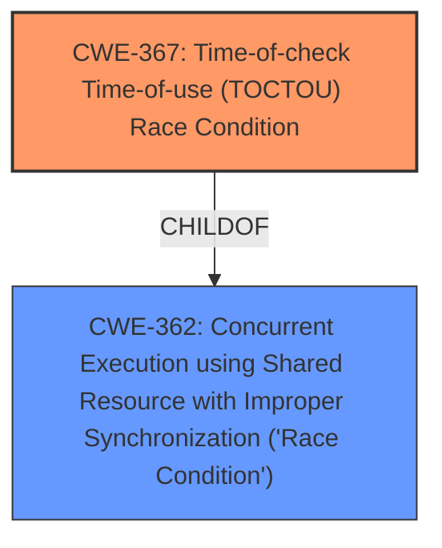

# Analysis Report for CVE-2020-27252

# Vulnerability Analysis Report: CVE-2020-27252

## Description


## Analysis (with Relationship Data)

# Summary
| CWE ID    | CWE Name                                                                                              | Confidence | CWE Abstraction Level | CWE Vulnerability Mapping Label | CWE-Vulnerability Mapping Notes |
| :-------- | :----------------------------------------------------------------------------------------------------- | :--------- | :---------------------- | :------------------------------ | :-------------------------------- |
| CWE-367   | Time-of-check Time-of-use (TOCTOU) Race Condition                                                      | 1.0        | Base                    | Primary                         | Allowed                           |
| CWE-362   | Concurrent Execution using Shared Resource with Improper Synchronization ('Race Condition')            | 0.7        | Class                   | Secondary                       | Allowed-with-Review             |

## Evidence and Confidence

*   **Confidence Score:** 0.9
*   **Evidence Strength:** HIGH

## Relationship Analysis
The primary CWE is CWE-367, which is a specific type of **race condition** where the state of a resource changes between the time it is checked and the time it is used. It is a child of CWE-362, which is a more general class of **race condition**.



## Vulnerability Chain
The vulnerability chain starts with a **race condition** (CWE-367) in the software update system, which leads to the ability to upload and execute unsigned firmware. The final impact is remote code execution and control of the device.

## Summary of Analysis
The initial analysis focused on the **race condition** as the root cause, specifically a Time-of-Check Time-of-Use (**TOCTOU**) vulnerability. This is supported by the vulnerability description mentioning "a **race condition** in the MCL Smart Patient Reader software update system, which allows unsigned firmware to be uploaded and executed on the Patient Reader." The CVE Reference Links Content Summary explicitly states that the root cause is a **TOCTOU race condition** (CWE-367).

The retriever results listed CWE-367 as a potential candidate with a good match, and CWE-362 as the top combined result. While CWE-362 is relevant, CWE-367 is more specific and accurately describes the vulnerability, making it the primary CWE.

CWE-367 is at the Base level of abstraction, which is preferred. It is also explicitly mentioned in the CVE Reference Links Content Summary. Therefore, CWE-367 is the most appropriate choice.
CWE-362 is a Class-level CWE and a parent of CWE-367. Since CWE-367 more accurately captures the weakness, CWE-362 is a secondary consideration only.

Relevant CWE Information:

# Enhanced Context (25 CWEs)

## CWE-1289: Improper Validation of Unsafe Equivalence in Input
**Abstraction Level**: Base
**Similarity Score**: 0.75
**Source**: dense

**Description**:
The product receives an input value that is used as a resource identifier or other type of reference, but it does not validate or incorrectly validates that the input is equivalent to a potentially-unsafe value.

**Mapping Guidance**:
- Usage: Allowed
- Rationale: This CWE entry is at the Base level of abstraction, which is a preferred level of abstraction for mapping to the root causes of vulnerabilities.

*Rationale for Exclusion*: While there might be a validation issue involved, the core problem is the **race condition**, not the validation of equivalence.

## CWE-226: Sensitive Information in Resource Not Removed Before Reuse
**Abstraction Level**: Base
**Similarity Score**: 0.75
**Source**: dense

**Description**:
The product releases a resource such as memory or a file so that it can be made available for reuse, but it does not clear or "zeroize" the information contained in the resource before the product performs a critical state transition or makes the resource available for reuse by other entities.

**Mapping Guidance**:
- Usage: Allowed
- Rationale: This CWE entry is at the Base level of abstraction, which is a preferred level of abstraction for mapping to the root causes of vulnerabilities.

*Rationale for Exclusion*: Not relevant to the **race condition** vulnerability described.

## CWE-807: Reliance on Untrusted Inputs in a Security Decision
**Abstraction Level**: Base
**Similarity Score**: 0.75
**Source**: dense

**Description**:
The product uses a protection mechanism that relies on the existence or values of an input, but the input can be modified by an untrusted actor in a way that bypasses the protection mechanism.

**Mapping Guidance**:
- Usage: Allowed
- Rationale: This CWE entry is at the Base level of abstraction, which is a preferred level of abstraction for mapping to the root causes of vulnerabilities.

*Rationale for Exclusion*: While untrusted input is involved, the core issue is the **race condition**, not directly a reliance on untrusted inputs.

## CWE-664: Improper Control of a Resource Through its Lifetime
**Abstraction Level**: Pillar
**Similarity Score**: 0.75
**Source**: dense

**Description**:
The product does not maintain or incorrectly maintains control over a resource throughout its lifetime of creation, use, and release.

**Mapping Guidance**:
- Usage: Discouraged
- Rationale: This CWE entry is high-level when lower-level children are available.

*Rationale for Exclusion*: Too high-level.

## CWE-404: Improper Resource Shutdown or Release
**Abstraction Level**: Class
**Similarity Score**: 0.74
**Source**: dense

**Description**:
The product does not release or incorrectly releases a resource before it is made available for re-use.

**Mapping Guidance**:
- Usage: Allowed-with-Review
- Rationale: This CWE entry is a Class and might have Base-level children that would be more appropriate

*Rationale for Exclusion*: Not relevant to the **race condition** vulnerability described.

## CWE-799: Improper Control of Interaction Frequency
**Abstraction Level**: Class
**Similarity Score**: 0.73
**Source**: dense

**Description**:
The product does not properly limit the number or frequency of interactions that it has with an actor, such as the number of incoming requests.

**Mapping Guidance**:
- Usage: Allowed-with-Review
- Rationale: This CWE entry is a Class and might have Base-level children that would be more appropriate

*Rationale for Exclusion*: Not relevant to the **race condition** vulnerability described.

## CWE-691: Insufficient Control Flow Management
**Abstraction Level**: Pillar
**Similarity Score**: 0.73
**Source**: dense

**Description**:
The code does not sufficiently manage its control flow during execution, creating conditions in which the control flow can be modified in unexpected ways.

**Mapping Guidance**:
- Usage: Discouraged
- Rationale: This CWE entry is extremely high-level, a Pillar. However, classification research is limited for weaknesses of this type, so there can be gaps or organizational difficulties within CWE that force use of this weakness, even at such a high level of abstraction.

*Rationale for Exclusion*: Too high-level.

## CWE-668: Exposure of Resource to Wrong Sphere
**Abstraction Level**: Class
**Similarity Score**: 0.73
**Source**: dense

**Description**:
The product exposes a resource to the wrong control sphere, providing unintended actors with inappropriate access to the resource.

**Mapping Guidance**:
- Usage: Discouraged
- Rationale: CWE-668 is high-level and is often misused as a catch-all when lower-level CWE IDs might be applicable. It is sometimes used for low-information vulnerability reports [REF-1287]. It is a level-1 Class (i.e., a child of a Pillar). It is not useful for trend analysis.

*Rationale for Exclusion*: Not relevant to the **race condition** vulnerability described.

## CWE-653: Improper Isolation or Compartmentalization
**Abstraction Level**: Class
**Similarity Score**: 0.73
**Source**: dense

**Description**:
The product does not properly compartmentalize or isolate functionality, processes, or resources that require different privilege levels, rights, or permissions.

**Mapping Guidance**:
- Usage: Allowed
- Rationale: This CWE entry is at the Base level of abstraction, which is a preferred level of abstraction for mapping to the root causes of vulnerabilities.

*Rationale for Exclusion*: Not relevant to the **race condition** vulnerability described.

## CWE-74: Improper Neutralization of Special Elements in Output Used by a Downstream Component ('Injection')
**Abstraction Level**: Class
**Similarity Score**: 0.73
**Source**: dense

**Description**:
The product constructs all or part of a command, data structure, or record using externally-influenced input from an upstream component, but it does not neutralize or incorrectly neutralizes special elements that could modify how


## CWE Relationship Analysis

Current CWEs represent these abstraction levels: .


### Vulnerability Chain Analysis

**Chain starting from CWE-691:**
- 691 (Insufficient Control Flow Management) - ROOT


**Chain starting from CWE-664:**
- 664 (Improper Control of a Resource Through its Lifetime) - ROOT


### CWE Relationship Diagram

```mermaid
graph TD
    classDef primary fill:#f96,stroke:#333,stroke-width:2px
    classDef secondary fill:#69f,stroke:#333
    classDef tertiary fill:#9e9,stroke:#333
```


*Report generated on 2025-04-01 17:02:30*
