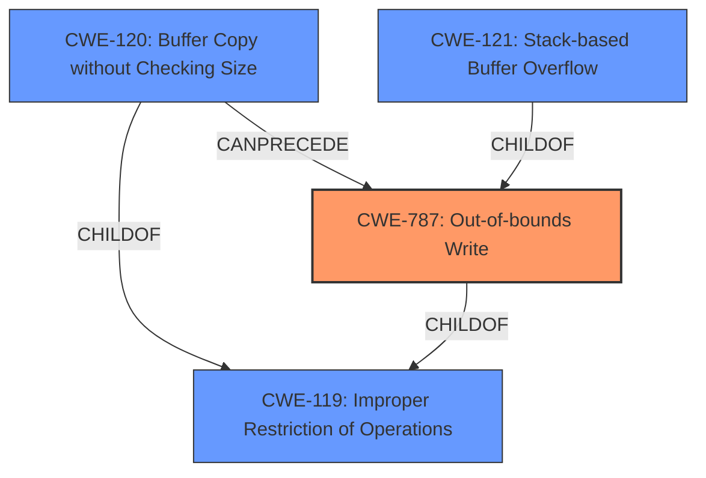

# Analysis for CVE-2020-27302

# Summary
| CWE ID | CWE Name | Confidence | CWE Abstraction Level | CWE Vulnerability Mapping Label | CWE-Vulnerability Mapping Notes |
|---|---|---|---|---|---|
| CWE-787 | Out-of-bounds Write | 1.0 | Base | Primary | Allowed |
| CWE-121 | Stack-based Buffer Overflow | 0.75 | Variant | Secondary | Allowed |
| CWE-120 | Buffer Copy without Checking Size of Input ('Classic Buffer Overflow') | 0.6 | Base | Secondary | Allowed-with-Review |
| CWE-119 | Improper Restriction of Operations within the Bounds of a Memory Buffer | 0.5 | Class | Secondary | Discouraged |

## Evidence and Confidence

*   **Confidence Score:** 0.9
*   **Evidence Strength:** HIGH

## Relationship Analysis
The primary CWE is CWE-787, which represents the **out-of-bounds write**. CWE-121, **stack-based buffer overflow**, is a variant of CWE-787 and describes the location of the buffer. CWE-120, **buffer copy without checking size**, is a base CWE that describes a common cause of buffer overflows, and it can precede CWE-787. CWE-119 is a class-level CWE that is a more general description of memory buffer errors. The relationships influenced the selection by ensuring the most specific and accurate representation of the vulnerability.

## Vulnerability Chain
The vulnerability chain starts with the **improper handling of the size of the encrypted GTK value** within the WPA2 4-way handshake. This leads to a **buffer copy without checking the size** (CWE-120). Because the size is not properly checked, data is written beyond the buffer's boundaries (**out-of-bounds write**, CWE-787) on the stack (**stack-based buffer overflow**, CWE-121), resulting in remote code execution.

## Summary of Analysis
The initial analysis correctly identified CWE-787 as the primary weakness, supported by the "CWE for similar CVE Descriptions". The retriever results also suggested CWE-119, CWE-190, CWE-121, and CWE-120.

The final conclusion is that the vulnerability is best represented by CWE-787 (**Out-of-bounds Write**), with additional context provided by CWE-121 (**Stack-based Buffer Overflow**) to specify the location of the buffer. The root cause is due to **buffer copy without checking size** (CWE-120).

The supporting evidence includes the vulnerability description stating a "**stack buffer overflow**", and the CVE Reference Links Content Summary which indicates that the `DecGTK()` function copies bytes to an output buffer (`kout`) with a fixed size of 0x80 bytes, but the size of the data copied is taken from user-controlled input (`v__size_1`) without proper bounds checking. Setting `v__size_1` to a value larger than 0x80 will cause a stack overflow, which is an **out-of-bounds write**.

The selected CWEs are at the optimal level of specificity because they accurately describe the **out-of-bounds write** (CWE-787) and the location of the buffer on the stack (CWE-121). The **lack of bounds checking** during the buffer copy contributes to the **out-of-bounds write**, which is described by CWE-120.

Relevant CWE Information:

# Enhanced Context (25 CWEs)
The following CWEs were identified as potentially relevant to this vulnerability:

## CWE-191: Integer Underflow (Wrap or Wraparound)
**Abstraction Level**: Base
**Similarity Score**: 0.78
**Source**: dense

**Description**:
The product subtracts one value from another, such that the result is less than the minimum allowable integer value, which produces a value that is not equal to the correct result.

**Mapping Guidance**:
- Usage: Allowed
- Rationale: This CWE entry is at the Base level of abstraction, which is a preferred level of abstraction for mapping to the root causes of vulnerabilities.

## CWE-131: Incorrect Calculation of Buffer Size
**Abstraction Level**: Base
**Similarity Score**: 0.78
**Source**: dense

**Description**:
The product does not correctly calculate the size to be used when allocating a buffer, which could lead to a buffer overflow.

**Mapping Guidance**:
- Usage: Allowed
- Rationale: This CWE entry is at the Base level of abstraction, which is a preferred level of abstraction for mapping to the root causes of vulnerabilities.

## CWE-124: Buffer Underwrite ('Buffer Underflow')
**Abstraction Level**: Base
**Similarity Score**: 0.77
**Source**: dense

**Description**:
The product writes to a buffer using an index or pointer that references a memory location prior to the beginning of the buffer.

**Mapping Guidance**:
- Usage: Allowed
- Rationale: This CWE entry is at the Base level of abstraction, which is a preferred level of abstraction for mapping to the root causes of vulnerabilities.

## CWE-805: Buffer Access with Incorrect Length Value
**Abstraction Level**: Base
**Similarity Score**: 0.77
**Source**: dense

**Description**:
The product uses a sequential operation to read or write a buffer, but it uses an incorrect length value that causes it to access memory that is outside of the bounds of the buffer.

**Mapping Guidance**:
- Usage: Allowed
- Rationale: This CWE entry is at the Base level of abstraction, which is a preferred level of abstraction for mapping to the root causes of vulnerabilities.

## CWE-193: Off-by-one Error
**Abstraction Level**: Base
**Similarity Score**: 0.77
**Source**: dense

**Description**:
A product calculates or uses an incorrect maximum or minimum value that is 1 more, or 1 less, than the correct value.

**Mapping Guidance**:
- Usage: Allowed
- Rationale: This CWE entry is at the Base level of abstraction, which is a preferred level of abstraction for mapping to the root causes of vulnerabilities.

## CWE-197: Numeric Truncation Error
**Abstraction Level**: Base
**Similarity Score**: 0.75
**Source**: dense

**Description**:
Truncation errors occur when a primitive is cast to a primitive of a smaller size and data is lost in the conversion.

**Mapping Guidance**:
- Usage: Allowed
- Rationale: This CWE entry is at the Base level of abstraction, which is a preferred level of abstraction for mapping to the root causes of vulnerabilities.

## CWE-126: Buffer Over-read
**Abstraction Level**: Variant
**Similarity Score**: 0.75
**Source**: dense

**Description**:
The product reads from a buffer using buffer access mechanisms such as indexes or pointers that reference memory locations after the targeted buffer.

**Mapping Guidance**:
- Usage: Allowed
- Rationale: This CWE entry is at the Variant level of abstraction, which is a preferred level of abstraction for mapping to the root causes of vulnerabilities.

## CWE-681: Incorrect Conversion between Numeric Types
**Abstraction Level**: Base
**Similarity Score**: 0.75
**Source**: dense

**Description**:
When converting from one data type to another, such as long to integer, data can be omitted or translated in a way that produces unexpected values. If the resulting values are used in a sensitive context, then dangerous behaviors may occur.

**Mapping Guidance**:
- Usage: Allowed
- Rationale: This CWE entry is at the Base level of abstraction, which is a preferred level of abstraction for mapping to the root causes of vulnerabilities.

## CWE-680: Integer Overflow to Buffer Overflow
**Abstraction Level**: Compound
**Similarity Score**: 0.75
**Source**: dense

**Description**:
The product performs a calculation to determine how much memory to allocate, but an integer overflow can occur that causes less memory to be allocated than expected, leading to a buffer overflow.

**Mapping Guidance**:
- Usage: Discouraged
- Rationale: This CWE entry is a named chain, which combines multiple weaknesses.

## CWE-125: Out-