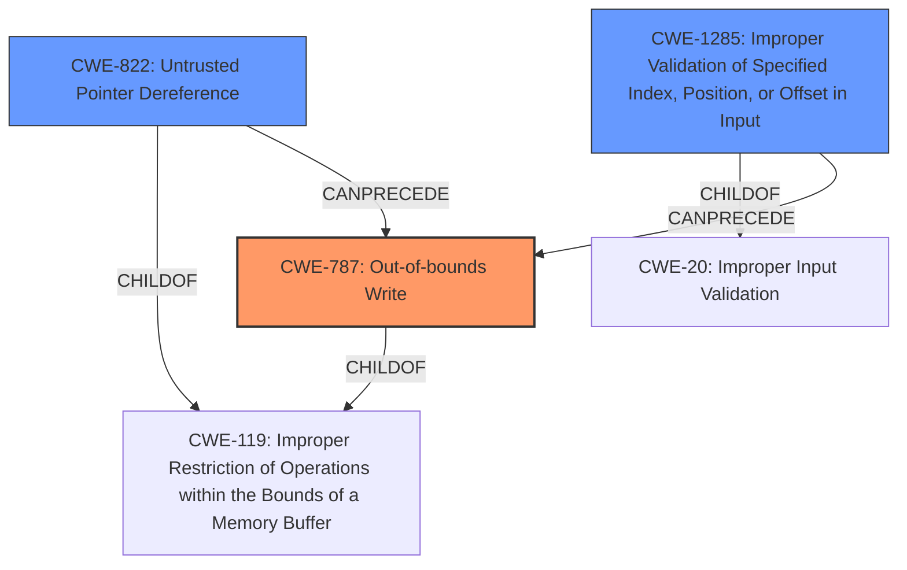

# Enhanced Analysis for CVE-2020-27339

# Summary
| CWE ID | CWE Name | Confidence | CWE Abstraction Level | CWE Vulnerability Mapping Label | CWE-Vulnerability Mapping Notes |
|---|---|---|---|---|---|
| CWE-787 | Out-of-bounds Write | 0.9 | Base | Allowed | Primary CWE |
| CWE-822 | Untrusted Pointer Dereference | 0.8 | Base | Allowed | Secondary Candidate |
| CWE-1285 | Improper Validation of Specified Index, Position, or Offset in Input | 0.7 | Base | Allowed | Secondary Candidate |

## Evidence and Confidence

*   **Confidence Score:** 0.8
*   **Evidence Strength:** HIGH

## Relationship Analysis
The primary CWE is CWE-787, representing the **out-of-bounds write** condition that results from improper validation. CWE-822 and CWE-1285 are related in that the **untrusted pointer dereference** can lead to an **out-of-bounds write**, and the root cause is due to the **improper validation of the index/position/offset** of the input.



## Vulnerability Chain
The vulnerability chain starts with **improper input validation** (implied by the lack of validation of `CommBuffer` and `CommBufferSize`), which can lead to an **untrusted pointer dereference** and ultimately results in an **out-of-bounds write** that corrupts firmware or OS memory.

## Summary of Analysis
The primary weakness is the **out-of-bounds write (CWE-787)**, which stems from the fact that the "SMM drivers **did not correctly validate the CommBuffer and CommBufferSize parameters**". This lack of validation can allow callers to **corrupt either the firmware or the OS memory**.

The evidence for this assessment is directly from the vulnerability description: "In the kernel in Insyde InsydeH2O 5.x, certain SMM drivers **did not correctly validate the CommBuffer and CommBufferSize parameters**, allowing callers to corrupt either the firmware or the OS memory."

The graph relationships show that **CWE-787** is often preceded by **CWE-822 (Untrusted Pointer Dereference)** and that both are children of **CWE-119 (Improper Restriction of Operations within the Bounds of a Memory Buffer)**. The Complete CWE Specifications of **CWE-787** describes the weakness as: "The product writes data past the end, or before the beginning, of the intended buffer." which is consistent with the vulnerability description.

The selected CWEs are at the optimal level of specificity because they directly describe the root cause and resulting condition of the vulnerability.

Relevant CWE Information:

# Enhanced Context (25 CWEs)
The following CWEs were identified as potentially relevant to this vulnerability:

## CWE-787: Out-of-bounds Write
**CWE-787 (Out-of-bounds Write)** is selected as the primary CWE because the vulnerability description explicitly states that the lack of validation leads to memory corruption, which aligns with the definition of an **out-of-bounds write**.

## CWE-822: Untrusted Pointer Dereference
**CWE-822 (Untrusted Pointer Dereference)** is a secondary CWE because the NetApp advisory indicates that the handler dereferences the `gRT` pointer, which is located outside SMRAM. This suggests that an **untrusted pointer dereference** is involved in the vulnerability.

## CWE-1285: Improper Validation of Specified Index, Position, or Offset in Input
**CWE-1285 (Improper Validation of Specified Index, Position, or Offset in Input)** is another secondary CWE because the core issue is the lack of validation of `CommBuffer` and `CommBufferSize` parameters. If these parameters are not correctly validated, they could be used as an index or offset, which aligns with the description of **CWE-1285**.


## CWE Relationship Analysis

Current CWEs represent these abstraction levels: .


### Vulnerability Chain Analysis

**Chain starting from CWE-787:**
- 787 (Out-of-bounds Write) - ROOT


**Chain starting from CWE-822:**
- 822 (Untrusted Pointer Dereference) - ROOT


### CWE Relationship Diagram

```mermaid
graph TD
    classDef primary fill:#f96,stroke:#333,stroke-width:2px
    classDef secondary fill:#69f,stroke:#333
    classDef tertiary fill:#9e9,stroke:#333
```