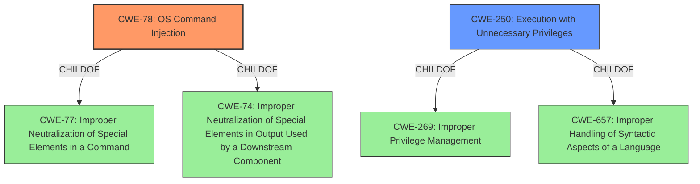

# Analysis for CVE-2020-27362

# Summary
| CWE ID | CWE Name | Confidence | CWE Abstraction Level | CWE Vulnerability Mapping Label | CWE-Vulnerability Mapping Notes |
|---|---|---|---|---|---|
| CWE-78 | Improper Neutralization of Special Elements used in an OS Command ('OS Command Injection') | 0.9 | Base | Allowed | Primary CWE |
| CWE-250 | Execution with Unnecessary Privileges | 0.6 | Base | Allowed | Secondary Candidate |

## Evidence and Confidence

*   **Confidence Score:** 0.75
*   **Evidence Strength:** MEDIUM

## Relationship Analysis
The primary CWE selected is CWE-78, which is a base-level CWE. It is related to CWE-77 (Improper Neutralization of Special Elements in a Command) and CWE-74 (Improper Neutralization of Special Elements in Output Used by a Downstream Component). CWE-78 is a child of both CWE-77 and CWE-74, indicating that it's a more specific type of command injection. CWE-250, Execution with Unnecessary Privileges, is a child of CWE-269 and CWE-657.

## Vulnerability Chain
The vulnerability chain starts with a **low-level privileged user** gaining the ability to **escape the web configuration file editor** and then **escalating privileges**. This suggests a weakness in how the application handles commands or input within the editor, leading to command injection (CWE-78) and potentially execution with unnecessary privileges (CWE-250).

## Summary of Analysis
The initial assessment points to a privilege escalation vulnerability due to escaping the web configuration file editor. The analysis focuses on identifying the root cause of this escape and privilege escalation.

The vulnerability description mentions that a **low-level privileged user** can **escape the web configuration file editor and escalate privileges**. This suggests that the user can execute commands or access functionalities beyond their intended scope.

Based on the vulnerability description, the primary weakness is likely CWE-78 (Improper Neutralization of Special Elements used in an OS Command ('OS Command Injection')). This is because escaping the web configuration file editor typically involves injecting commands or special elements that are not properly neutralized, allowing the user to execute arbitrary OS commands with elevated privileges. The **impact** of this vulnerability is privilege escalation.

CWE-250 (Execution with Unnecessary Privileges) is considered a secondary candidate because the low-level user might already have some privileges, but the vulnerability allows them to execute commands with even higher privileges than necessary. This could amplify the impact of the command injection vulnerability.

The decision to choose CWE-78 as the primary CWE is based on the specific detail of escaping the web configuration file editor, which strongly suggests a command injection vulnerability. The abstraction level of CWE-78 is Base, which is the preferred level.

Other CWEs were considered but not selected:

*   CWE-269 (Improper Privilege Management) was considered but deemed too general.
*   CWE-863 (Incorrect Authorization) was considered but deemed less specific than command injection.
*   CWE-22 (Improper Limitation of a Pathname to a Restricted Directory ('Path Traversal')) and CWE-59 (Improper Link Resolution Before File Access ('Link Following')) were considered, but the description does not indicate file access.

Relevant CWE Information:

# Enhanced Context (25 CWEs)
The following CWEs were identified as potentially relevant to this vulnerability:

## CWE-274: Improper Handling of Insufficient Privileges
**Abstraction Level**: Base
**Similarity Score**: 0.77
**Source**: dense

**Description**:
The product does not handle or incorrectly handles when it has insufficient privileges to perform an operation, leading to resultant weaknesses.

**Mapping Guidance**:
- Usage: Discouraged
- Rationale: This CWE entry could be deprecated in a future version of CWE.

## CWE-280: Improper Handling of Insufficient Permissions or Privileges 
**Abstraction Level**: Base
**Similarity Score**: 0.77
**Source**: dense

**Description**:
The product does not handle or incorrectly handles when it has insufficient privileges to access resources or functionality as specified by their permissions. This may cause it to follow unexpected code paths that may leave the product in an invalid state.

**Mapping Guidance**:
- Usage: Allowed
- Rationale: This CWE entry is at the Base level of abstraction, which is a preferred level of abstraction for mapping to the root causes of vulnerabilities.

## CWE-266: Incorrect Privilege Assignment
**Abstraction Level**: Base
**Similarity Score**: 0.77
**Source**: dense

**Description**:
A product incorrectly assigns a privilege to a particular actor, creating an unintended sphere of control for that actor.

**Mapping Guidance**:
- Usage: Allowed
- Rationale: This CWE entry is at the Base level of abstraction, which is a preferred level of abstraction for mapping to the root causes of vulnerabilities.

## CWE-653: Improper Isolation or Compartmentalization
**Abstraction Level**: Class
**Similarity Score**: 0.76
**Source**: dense

**Description**:
The product does not properly compartmentalize or isolate functionality, processes, or resources that require different privilege levels, rights, or permissions.

**Mapping Guidance**:
- Usage: Allowed
- Rationale: This CWE entry is at the Base level of abstraction, which is a preferred level of abstraction for mapping to the root causes of vulnerabilities.

## CWE-184: Incomplete List of Disallowed Inputs
**Abstraction Level**: Base
**Similarity Score**: 0.76
**Source**: dense

**Description**:
The product implements a protection mechanism that relies on a list of inputs (or properties of inputs) that are not allowed by policy or otherwise require other action to neutralize before additional processing takes place, but the list is incomplete.

**Mapping Guidance**:
- Usage: Allowed
- Rationale: This CWE entry is at the Base level of abstraction, which is a preferred level of abstraction for mapping to the root causes of vulnerabilities.

## CWE-267: Privilege Defined With Unsafe Actions
**Abstraction Level**: Base
**Similarity Score**: 0.75
**Source**: dense

**Description**:
A particular privilege, role, capability, or right can be used to perform unsafe actions that were not intended, even when it is assigned to the correct entity.

**Mapping Guidance**:
- Usage: Allowed
- Rationale: This CWE entry is at the Base level of abstraction, which is a preferred level of abstraction for mapping to the root causes of vulnerabilities.

## CWE-807: Reliance on Untrusted Inputs in a Security Decision
**Abstraction Level**: Base
**Similarity Score**: 0.75
**Source**: dense

**Description**:
The product uses a protection mechanism that relies on the existence or values of an input, but the input can be modified by an untrusted actor in a way that bypasses the protection mechanism.

**Mapping Guidance**:
- Usage: Allowed
- Rationale: This CWE entry is at the Base level of abstraction, which is a preferred level of abstraction for mapping to the root causes of vulnerabilities.

## CWE-668: Exposure of Resource to Wrong Sphere
**Abstraction Level**: Class
**Similarity Score**: 0.75
**Source**: dense

**Description**:
The product exposes a resource to the wrong control sphere, providing unintended actors with inappropriate access to the resource.

**Mapping Guidance**:
- Usage: Discouraged
- Rationale: CWE-668 is high-level and is often misused as a catch-all when lower-level CWE IDs might be applicable. It is sometimes used for low-information vulnerability reports [REF-1287]. It is a level-1 Class (i.e., a child of a Pillar). It is not useful for trend analysis.

## CWE-639: Authorization Bypass Through User-Controlled Key
**Abstraction Level**: Base
**Similarity Score**: 0.75
**Source**: dense

**Description**:
The system's authorization functionality does not prevent one user from gaining access to another