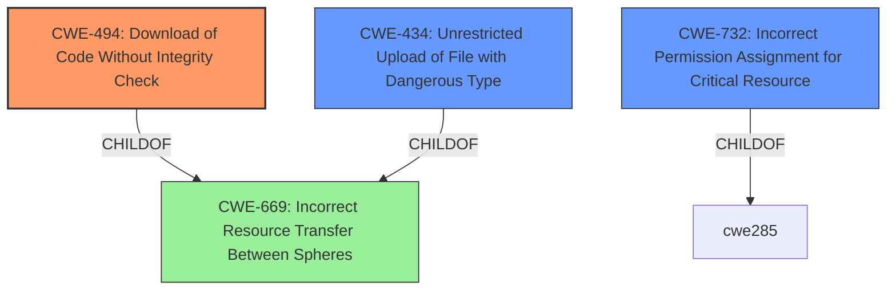

# Analysis for CVE-2020-27464

# Summary
| CWE ID  | CWE Name                                                                  | Confidence | CWE Abstraction Level | CWE Vulnerability Mapping Label | CWE-Vulnerability Mapping Notes |
| :-------- | :------------------------------------------------------------------------ | :--------- | :-------------------- | :------------------------------ | :------------------------------ |
| CWE-494   | Download of Code Without Integrity Check                                   | 0.95       | Base                  | Primary                         | Allowed                       |
| CWE-434   | Unrestricted Upload of File with Dangerous Type                           | 0.75       | Base                  | Secondary                       | Allowed                       |
| CWE-732   | Incorrect Permission Assignment for Critical Resource                    | 0.65       | Class                 | Secondary                       | Allowed-with-Review           |

## Evidence and Confidence

*   **Confidence Score:** 0.85
*   **Evidence Strength:** HIGH

## Relationship Analysis
The primary relationship influencing the selection was a parent-child relationship with `CWE-669`, highlighting the broader context of code management issues. `CWE-434` and `CWE-732` are related to the root cause, but `CWE-494` more accurately captures the core issue of downloading code without proper verification.

## Vulnerability Chain
The vulnerability chain starts with an **insecure update feature**, leading to the download of a crafted ZIP file without integrity checks. This results in the execution of arbitrary code.

*   **Root Cause:** **Insecure update feature** in `/updater.php` leading to insufficient validation of uploaded ZIP files.
*   **Weakness:** Download of code without integrity check (`CWE-494`).
*   **Impact:** Execution of arbitrary code.

## Summary of Analysis
The initial analysis identified the **insecure update feature** as the root cause, with the impact being arbitrary code execution. The retriever results pointed to several CWEs, including `CWE-59`, `CWE-23`, `CWE-732`, `CWE-434`, and `CWE-494`. After reviewing the vulnerability description and the reference links content summary, `CWE-494` was selected as the primary CWE because the vulnerability specifically involves downloading a ZIP file without proper integrity checks. This aligns directly with the description of `CWE-494`: "The product downloads source code or an executable from a remote location and executes the code without sufficiently verifying the origin and integrity of the code."

The evidence from the "CVE Reference Links Content Summary" supports this: "Insufficient checks in the `updater.php` file that allows a malicious ZIP to be uploaded and installed, leading to arbitrary code execution" and "**Weakness:** Insufficient validation of uploaded ZIP files during the update process".

`CWE-434` was considered as a secondary CWE because it relates to unrestricted upload of dangerous file types, but the core issue is the lack of integrity check after the file is downloaded. `CWE-732` was also considered as a secondary CWE due to potential permission issues when extracting the ZIP file, but again, the primary weakness is the lack of integrity verification.

The selection of `CWE-494` is at the optimal level of specificity because it accurately captures the root cause of the vulnerability, which is the download of code without integrity checks. This is a Base level CWE, which is the preferred level of abstraction.

**CWEs Considered but Not Used:**

*   `CWE-59` and `CWE-23`: These relate to path traversal and link following, which are not the primary issues in this vulnerability.
*   `CWE-639`: This relates to authorization bypass, which is not directly related to the described vulnerability.
*   `CWE-96`: This relates to static code injection, which is not the core issue here.
*   `CWE-78`: This relates to OS command injection, which is a potential impact but not the root cause.
*   `CWE-1336`: This relates to template engine injection, which is not relevant to this vulnerability.
*   `CWE-285`: This relates to improper authorization, which isn't the central issue.
*   `CWE-430`: Deployment of Wrong Handler doesn't apply here because the handler being deployed is not "wrong" but rather the code being handled is unverified.
*   `CWE-351`: Insufficient Type Distinction doesn't fit well because the issue isn't about type confusion but about lack of verification.
*   `CWE-22`: Improper Limitation of a Pathname to a Restricted Directory ('Path Traversal') is related to path traversal vulnerabilities. The primary issue isn't path traversal but lack of integrity.
*   `CWE-472`: External Control of Assumed-Immutable Web Parameter focuses on web parameter tampering, which isn't the core issue.
*   `CWE-41`: Improper Resolution of Path Equivalence which focuses on file system path manipulation, but doesn't address the primary vulnerability.
*    CWE-184: Incomplete List of Disallowed Inputs, doesn't apply well because the issue isn't about incomplete lists but lack of integrity checking of downloaded code.
*    CWE-807: Reliance on Untrusted Inputs in a Security Decision, this is a broader category. While the update process relies on untrusted input, the core weakness is the lack of integrity checking.
*    CWE-280: Improper Handling of Insufficient Permissions or Privileges this issue is more about the lack of integrity check, not permissions.
*    CWE-74: Improper Neutralization of Special Elements in Output Used by a Downstream Component ('Injection'), this is more general injection and the issue is with code download.
*    CWE-266: Incorrect Privilege Assignment, the core issue here is downloading code without integrity checks, not privilege assignment.
*   `CWE-183`: Permissive List of Allowed Inputs, the issue isn't about allow lists but the lack of integrity checking.

Relevant CWE Information: