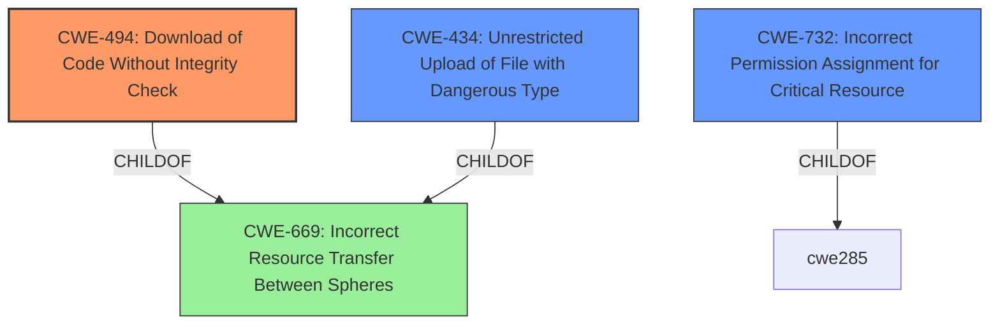

# Analysis for CVE-2020-27464

# Summary
| CWE ID  | CWE Name                                                                  | Confidence | CWE Abstraction Level | CWE Vulnerability Mapping Label | CWE-Vulnerability Mapping Notes |
| :-------- | :------------------------------------------------------------------------ | :--------- | :-------------------- | :------------------------------ | :------------------------------ |
| CWE-494   | Download of Code Without Integrity Check                                   | 0.95       | Base                  | Primary                         | Allowed                       |
| CWE-434   | Unrestricted Upload of File with Dangerous Type                           | 0.75       | Base                  | Secondary                       | Allowed                       |
| CWE-732   | Incorrect Permission Assignment for Critical Resource                    | 0.65       | Class                 | Secondary                       | Allowed-with-Review           |

## Evidence and Confidence

*   **Confidence Score:** 0.85
*   **Evidence Strength:** HIGH

## Relationship Analysis
The primary relationship influencing the selection was a parent-child relationship with `CWE-669`, highlighting the broader context of code management issues. `CWE-434` and `CWE-732` are related to the root cause, but `CWE-494` more accurately captures the core issue of downloading code without proper verification.

## Vulnerability Chain
The vulnerability chain starts with an **insecure update feature**, leading to the download of a crafted ZIP file without integrity checks. This results in the execution of arbitrary code.

*   **Root Cause:** **Insecure update feature** in `/updater.php` leading to insufficient validation of uploaded ZIP files.
*   **Weakness:** Download of code without integrity check (`CWE-494`).
*   **Impact:** Execution of arbitrary code.

## Summary of Analysis
The initial analysis identified the **insecure update feature** as the root cause, with the impact being arbitrary code execution. The retriever results pointed to several CWEs, including `CWE-59`, `CWE-23`, `CWE-732`, `CWE-434`, and `CWE-494`. After reviewing the vulnerability description and the reference links content summary, `CWE-494` was selected as the primary CWE because the vulnerability specifically involves downloading a ZIP file without proper integrity checks. This aligns directly with the description of `CWE-494`: "The product downloads source code or an executable from a remote location and executes the code without sufficiently verifying the origin and integrity of the code."

The evidence from the "CVE Reference Links Content Summary" supports this: "Insufficient checks in the `updater.php` file that allows a malicious ZIP to be uploaded and installed, leading to arbitrary code execution" and "**Weakness:** Insufficient validation of uploaded ZIP files during the update process".

`CWE-434` was considered as a secondary CWE because it relates to unrestricted upload of dangerous file types, but the core issue is the lack of integrity check after the file is downloaded. `CWE-732` was also considered as a secondary CWE due to potential permission issues when extracting the ZIP file, but again, the primary weakness is the lack of integrity verification.

The selection of `CWE-494` is at the optimal level of specificity because it accurately captures the root cause of the vulnerability, which is the download of code without integrity checks. This is a Base level CWE, which is the preferred level of abstraction.

**CWEs Considered but Not Used:**

*   `CWE-59` and `CWE-23`: These relate to path traversal and link following, which are not the primary issues in this vulnerability.
*   `CWE-639`: This relates to authorization bypass, which is not directly related to the described vulnerability.
*   `CWE-96`: This relates to static code injection, which is not the core issue here.
*   `CWE-78`: This relates to OS command injection, which is a potential impact but not the root cause.
*   `CWE-1336`: This relates to template engine injection, which is not relevant to this vulnerability.
*   `CWE-285`: This relates to improper authorization, which isn't the central issue.
*   `CWE-430`: Deployment of Wrong Handler doesn't apply here because the handler being deployed is not "wrong" but rather the code being handled is unverified.
*   `CWE-351`: Insufficient Type Distinction doesn't fit well because the issue isn't about type confusion but about lack of verification.
*   `CWE-22`: Improper Limitation of a Pathname to a Restricted Directory ('Path Traversal') is related to path traversal vulnerabilities. The primary issue isn't path traversal but lack of integrity.
*   `CWE-472`: External Control of Assumed-Immutable Web Parameter focuses on web parameter tampering, which isn't the core issue.
*   `CWE-41`: Improper Resolution of Path Equivalence which focuses on file system path manipulation, but doesn't address the primary vulnerability.
*    CWE-184: Incomplete List of Disallowed Inputs, doesn't apply well because the issue isn't about incomplete lists but lack of integrity checking of downloaded code.
*    CWE-807: Reliance on Untrusted Inputs in a Security Decision, this is a broader category. While the update process relies on untrusted input, the core weakness is the lack of integrity checking.
*    CWE-280: Improper Handling of Insufficient Permissions or Privileges this issue is more about the lack of integrity check, not permissions.
*    CWE-74: Improper Neutralization of Special Elements in Output Used by a Downstream Component ('Injection'), this is more general injection and the issue is with code download.
*    CWE-266: Incorrect Privilege Assignment, the core issue here is downloading code without integrity checks, not privilege assignment.
*   `CWE-183`: Permissive List of Allowed Inputs, the issue isn't about allow lists but the lack of integrity checking.

Relevant CWE Information:

# Enhanced Query for CVE-2020-27464

## Vulnerability Description
An **insecure update feature** in the /updater.php component of rConfig 3.9.6 and below allows attackers to execute arbitrary code via a crafted ZIP file.

### Vulnerability Description Key Phrases
- **rootcause:** **insecure update feature**
- **impact:** execute arbitrary code
- **vector:** crafted ZIP file
- **attacker:** attackers
- **product:** rConfig
- **version:** 3.9.6 and below
- **component:** /updater.php component

## CVE Reference Links Content Summary
Based on the provided content, here's a breakdown of the vulnerabilities:

**Vulnerability 1: Unauthenticated RCE via `ajaxArchiveFiles.php`**

*   **Root Cause:** Blind command injection in the `ext` parameter of the `ajaxArchiveFiles.php` file.
*   **Weakness:** Unsanitized user-supplied input passed to a system command.
*   **Impact:** Remote, unauthenticated attacker can execute arbitrary system commands on the server with the privileges of the webserver user (typically `apache`).
*   **Attack Vector:** Sending a crafted HTTP GET request to `ajaxArchiveFiles.php` with a malicious payload in the `ext` parameter.
*   **Required Attacker Capabilities/Position:** No authentication is required; the attacker needs network access to the vulnerable rConfig instance.

**Vulnerability 2: Authenticated RCE via `ajaxEditTemplate.php`**

*   **Root Cause:**  Lack of proper sanitization when saving connection templates, allowing injection of PHP code into a file accessible via the web.
*   **Weakness:** Insecure file handling and lack of input validation. The application appends `.yml` to filenames, but an attacker can use `../` to place the php file in the webroot.
*   **Impact:** Remote attacker can execute arbitrary PHP code on the server.
*   **Attack Vector:** Attacker must be authenticated and send a POST request to `ajaxEditTemplate.php` with the PHP payload inside the `code` parameter.
*   **Required Attacker Capabilities/Position:** Attacker must be authenticated (or use the described auth bypasses).

**Vulnerability 3: Unauthenticated RCE via `updater.php`**

*   **Root Cause:** Insufficient checks in the `updater.php` file that allows a malicious ZIP to be uploaded and installed, leading to arbitrary code execution.
*  **Weakness:** Insufficient validation of uploaded ZIP files during the update process
*   **Impact:** Remote unauthenticated attacker can execute arbitrary code via a modified update package.
*  **Attack Vector:** The attacker needs to create a malicious update ZIP file, upload it to the server using `updater.php` via an HTTP GET request.
*   **Required Attacker Capabilities/Position:** No authentication is required; the attacker needs network access to the vulnerable rConfig instance.

**Vulnerability 4: Unauthenticated Authentication Bypass via `userprocess.php` (User Creation)**

*   **Root Cause:** The `register` function in `userprocess.php` does not enforce authentication, allowing the creation of an administrative user account.
*   **Weakness:** Lack of authentication checks on user creation function.
*   **Impact:** Remote unauthenticated attacker can create a new administrative account.
*   **Attack Vector:** Sending a crafted HTTP POST request to `userprocess.php` with user registration data.
*   **Required Attacker Capabilities/Position:** No authentication is required; the attacker needs network access to the vulnerable rConfig instance.

**Vulnerability 5: Unauthenticated Authentication Bypass via `useradmin.inc.php` and `userprocess.php` (User Modification)**

*   **Root Cause:** Information leakage in `useradmin.inc.php` reveals existing user details and lack of authentication when modifying user accounts via `userprocess.php`.
*   **Weakness:** Information leakage and missing authentication checks on user modification functions.
*   **Impact:** Remote unauthenticated attacker can modify existing user accounts, including resetting passwords of administrative accounts.
*   **Attack Vector:** Attacker first sends an HTTP GET to `useradmin.inc.php` to retrieve usernames. Then, sends a crafted HTTP POST request to `userprocess.php` to modify a selected user account.
*   **Required Attacker Capabilities/Position:** No authentication is required; the attacker needs network access to the vulnerable rConfig instance.

**Summary of Exploitation Chain**

The advisory highlights that these vulnerabilities can be chained together:

1.  An unauthenticated attacker can use the authentication bypass in `userprocess.php` to create a new admin user.
2.  The attacker can then use the `ajaxArchiveFiles.php` vulnerability to achieve unauthenticated RCE, or log in using the created account and use the `ajaxEditTemplate.php` to achieve RCE. Alternatively the attacker can use the `updater.php` vulnerability to achieve RCE.
3.  Alternatively, an attacker can use information leakage on `useradmin.inc.php` and then modify an existing account including the admin password, using the unauthenticated user edit function on `userprocess.php` to gain access to the system.

**Additional Notes**

*   The advisory mentions that `CVE-2019-19509` (related to command injection) was not resolved and remains present.
*   The vendor was not responsive to the security researchers and has not released a patch at the time of the advisory publication.
*   The advisory includes a Python exploit that demonstrates the vulnerability chain.

## Retriever Results

### Top Combined Results

| Rank | CWE ID | Name | Abstraction | Usage  | Retrievers | Individual Scores |
|------|--------|------|-------------|-------|------------|-------------------|
| 1 | 59 | Improper Link Resolution Before File Access ('Link Following') | Base | Allowed | sparse | 0.187 |
| 2 | 23 | Relative Path Traversal | Base | Allowed | sparse | 0.177 |
| 3 | 732 | Incorrect Permission Assignment for Critical Resource | Class | Allowed-with-Review | sparse | 0.177 |
| 4 | 434 | Unrestricted Upload of File with Dangerous Type | Base | Allowed | sparse | 0.175 |
| 5 | 639 | Authorization Bypass Through User-Controlled Key | Base | Allowed | sparse | 0.171 |
| 6 | 96 | Improper Neutralization of Directives in Statically Saved Code ('Static Code Injection') | Base | Allowed | dense | 0.528 |
| 7 | 494 | Download of Code Without Integrity Check | Base | Allowed | graph | 0.002 |
| 8 | 78 | Improper Neutralization of Special Elements used in an OS Command ('OS Command Injection') | Base | Allowed | sparse | 0.165 |
| 9 | 1336 | Improper Neutralization of Special Elements Used in a Template Engine | Base | Allowed | sparse | 0.156 |
| 10 | 285 | Improper Authorization | Class | Discouraged | sparse | 0.156 |

# Complete CWE Specifications

## CWE-59: Improper Link Resolution Before File Access ('Link Following')
**Abstraction:** Base
**Status:** Draft

### Description
The product attempts to access a file based on the filename, but it does not properly prevent that filename from identifying a link or shortcut that resolves to an unintended resource.

### Extended Description
Not provided

### Alternative Terms
insecure temporary file: Some people use the phrase "insecure temporary file" when referring to a link following weakness, but other weaknesses can produce insecure temporary files without any symlink involvement at all.
Zip Slip: "Zip slip" is an attack that uses file archives (e.g., ZIP, tar, rar, etc.) that contain filenames with path traversal sequences that cause the files to be written outside of the directory under which the archive is expected to be extracted [REF-1282]. It is most commonly used for relative path traversal (CWE-23) and link following (CWE-59).

### Relationships
ChildOf -> CWE-706
ChildOf -> CWE-706

### Mapping Guidance
**Usage:** Allowed
**Rationale:** This CWE entry is at the Base level of abstraction, which is a preferred level of abstraction for mapping to the root causes of vulnerabilities.
**Comments:** Carefully read both the name and description to ensure that this mapping is an appropriate fit. Do not try to 'force' a mapping to a lower-level Base/Variant simply to comply with this preferred level of abstraction.
**Reasons:**
- Acceptable-Use

### Additional Notes
**[Theoretical]** 

Link following vulnerabilities are Multi-factor Vulnerabilities (MFV). They are the combination of multiple elements: file or directory permissions, filename predictability, race conditions, and in some cases, a design limitation in which there is no mechanism for performing atomic file creation operations.

Some potential factors are race conditions, permissions, and predictability.

### Observed Examples
- **CVE-1999-1386:** Some versions of Perl follow symbolic links when running with the -e option, which allows local users to overwrite arbitrary files via a symlink attack.
- **CVE-2000-1178:** Text editor follows symbolic links when creating a rescue copy during an abnormal exit, which allows local users to overwrite the files of other users.
- **CVE-2004-0217:** Antivirus update allows local users to create or append to arbitrary files via a symlink attack on a logfile.

## CWE-23: Relative Path Traversal
**Abstraction:** Base
**Status:** Draft

### Description
The product uses external input to construct a pathname that should be within a restricted directory, but it does not properly neutralize sequences such as ".." that can resolve to a location that is outside of that directory.

### Extended Description
This allows attackers to traverse the file system to access files or directories that are outside of the restricted directory.

### Alternative Terms
Zip Slip: "Zip slip" is an attack that uses file archives (e.g., ZIP, tar, rar, etc.) that contain filenames with path traversal sequences that cause the files to be written outside of the directory under which the archive is expected to be extracted [REF-1282]. It is most commonly used for relative path traversal (CWE-23) and link following (CWE-59).

### Relationships
ChildOf -> CWE-22
ChildOf -> CWE-22
ChildOf -> CWE-22

### Mapping Guidance
**Usage:** Allowed
**Rationale:** This CWE entry is at the Base level of abstraction, which is a preferred level of abstraction for mapping to the root causes of vulnerabilities.
**Comments:** Carefully read both the name and description to ensure that this mapping is an appropriate fit. Do not try to 'force' a mapping to a lower-level Base/Variant simply to comply with this preferred level of abstraction.
**Reasons:**
- Acceptable-Use

### Observed Examples
- **CVE-2024-37032:** Large language model (LLM) management tool does not validate the format of a digest value (CWE-1287) from a private, untrusted model registry, enabling relative path traversal (CWE-23), a.k.a. Probllama
- **CVE-2022-45918:** Chain: a learning management tool debugger uses external input to locate previous session logs (CWE-73) and does not properly validate the given path (CWE-20), allowing for filesystem path traversal using "../" sequences (CWE-24)
- **CVE-2019-20916:** Python package manager does not correctly restrict the filename specified in a Content-Disposition header, allowing arbitrary file read using path traversal sequences such as "../"

## CWE-732: Incorrect Permission Assignment for Critical Resource
**Abstraction:** Class
**Status:** Draft

### Description
The product specifies permissions for a security-critical resource in a way that allows that resource to be read or modified by unintended actors.

### Extended Description
When a resource is given a permission setting that provides access to a wider range of actors than required, it could lead to the exposure of sensitive information, or the modification of that resource by unintended parties. This is especially dangerous when the resource is related to program configuration, execution, or sensitive user data. For example, consider a misconfigured storage account for the cloud that can be read or written by a public or anonymous user.

### Alternative Terms
None

### Relationships
ChildOf -> CWE-285
ChildOf -> CWE-668

### Mapping Guidance
**Usage:** Allowed-with-Review
**Rationale:** While the name itself indicates an assignment of permissions for resources, this is often misused for vulnerabilities in which "permissions" are not checked, which is an "authorization" weakness (CWE-285 or descendants) within CWE's model [REF-1287].
**Comments:** Closely analyze the specific mistake that is allowing the resource to be exposed, and perform a CWE mapping for that mistake.
**Reasons:**
- Frequent Misuse

### Additional Notes
**[Maintenance]** The relationships between privileges, permissions, and actors (e.g. users and groups) need further refinement within the Research view. One complication is that these concepts apply to two different pillars, related to control of resources (CWE-664) and protection mechanism failures (CWE-693).

### Observed Examples
- **CVE-2022-29527:** Go application for cloud management creates a world-writable sudoers file that allows local attackers to inject sudo rules and escalate privileges to root by winning a race condition.
- **CVE-2009-3482:** Anti-virus product sets insecure "Everyone: Full Control" permissions for files under the "Program Files" folder, allowing attackers to replace executables with Trojan horses.
- **CVE-2009-3897:** Product creates directories with 0777 permissions at installation, allowing users to gain privileges and access a socket used for authentication.

## CWE-434: Unrestricted Upload of File with Dangerous Type
**Abstraction:** Base
**Status:** Draft

### Description
The product allows the upload or transfer of dangerous file types that are automatically processed within its environment.

### Extended Description
Not provided

### Alternative Terms
Unrestricted File Upload: Used in vulnerability databases and elsewhere, but it is insufficiently precise. The phrase could be interpreted as the lack of restrictions on the size or number of uploaded files, which is a resource consumption issue.

### Relationships
ChildOf -> CWE-669
ChildOf -> CWE-669
PeerOf -> CWE-351
PeerOf -> CWE-436
PeerOf -> CWE-430

### Mapping Guidance
**Usage:** Allowed
**Rationale:** This CWE entry is at the Base level of abstraction, which is a preferred level of abstraction for mapping to the root causes of vulnerabilities.
**Comments:** Carefully read both the name and description to ensure that this mapping is an appropriate fit. Do not try to 'force' a mapping to a lower-level Base/Variant simply to comply with this preferred level of abstraction.
**Reasons:**
- Acceptable-Use

### Additional Notes
**[Relationship]** 

This can have a chaining relationship with incomplete denylist / permissive allowlist errors when the product tries, but fails, to properly limit which types of files are allowed (CWE-183, CWE-184).

This can also overlap multiple interpretation errors for intermediaries, e.g. anti-virus products that do not remove or quarantine attachments with certain file extensions that can be processed by client systems.

### Observed Examples
- **CVE-2023-5227:** PHP-based FAQ management app does not check the MIME type for uploaded images
- **CVE-2001-0901:** Web-based mail product stores ".shtml" attachments that could contain SSI
- **CVE-2002-1841:** PHP upload does not restrict file types

## CWE-639: Authorization Bypass Through User-Controlled Key
**Abstraction:** Base
**Status:** Incomplete

### Description
The system's authorization functionality does not prevent one user from gaining access to another user's data or record by modifying the key value identifying the data.

### Extended Description

Retrieval of a user record occurs in the system based on some key value that is under user control. The key would typically identify a user-related record stored in the system and would be used to lookup that record for presentation to the user. It is likely that an attacker would have to be an authenticated user in the system. However, the authorization process would not properly check the data access operation to ensure that the authenticated user performing the operation has sufficient entitlements to perform the requested data access, hence bypassing any other authorization checks present in the system.

For example, attackers can look at places where user specific data is retrieved (e.g. search screens) and determine whether the key for the item being looked up is controllable externally. The key may be a hidden field in the HTML form field, might be passed as a URL parameter or as an unencrypted cookie variable, then in each of these cases it will be possible to tamper with the key value.

One manifestation of this weakness is when a system uses sequential or otherwise easily-guessable session IDs that would allow one user to easily switch to another user's session and read/modify their data.

### Alternative Terms
Insecure Direct Object Reference / IDOR: The "Insecure Direct Object Reference" term, as described in the OWASP Top Ten, is broader than this CWE because it also covers path traversal (CWE-22). Within the context of vulnerability theory, there is a similarity between the OWASP concept and CWE-706: Use of Incorrectly-Resolved Name or Reference.
Broken Object Level Authorization / BOLA: BOLA is used in the 2019 OWASP API Security Top 10 and is said to be the same as IDOR.
Horizontal Authorization: "Horizontal Authorization" is used to describe situations in which two users have the same privilege level, but must be prevented from accessing each other's resources. This is fairly common when using key-based access to resources in a multi-user context.

### Relationships
ChildOf -> CWE-863
ChildOf -> CWE-863
ChildOf -> CWE-284

### Mapping Guidance
**Usage:** Allowed
**Rationale:** This CWE entry is at the Base level of abstraction, which is a preferred level of abstraction for mapping to the root causes of vulnerabilities.
**Comments:** Carefully read both the name and description to ensure that this mapping is an appropriate fit. Do not try to 'force' a mapping to a lower-level Base/Variant simply to comply with this preferred level of abstraction.
**Reasons:**
- Acceptable-Use

### Observed Examples
- **CVE-2021-36539:** An educational application does not appropriately restrict file IDs to a particular user. The attacker can brute-force guess IDs, indicating IDOR.

## CWE-96: Improper Neutralization of Directives in Statically Saved Code ('Static Code Injection')
**Abstraction:** Base
**Status:** Draft

### Description
The product receives input from an upstream component, but it does not neutralize or incorrectly neutralizes code syntax before inserting the input into an executable resource, such as a library, configuration file, or template.

### Extended Description
Not provided

### Alternative Terms
None

### Relationships
ChildOf -> CWE-94

### Mapping Guidance
**Usage:** Allowed
**Rationale:** This CWE entry is at the Base level of abstraction, which is a preferred level of abstraction for mapping to the root causes of vulnerabilities.
**Comments:** Carefully read both the name and description to ensure that this mapping is an appropriate fit. Do not try to 'force' a mapping to a lower-level Base/Variant simply to comply with this preferred level of abstraction.
**Reasons:**
- Acceptable-Use

### Additional Notes
**[Relationship]** "HTML injection" (see CWE-79: XSS) could be thought of as an example of this, but the code is injected and executed on the client side, not the server side. Server-Side Includes (SSI) are an example of direct static code injection.

### Observed Examples
- **CVE-2002-0495:** Perl code directly injected into CGI library file from parameters to another CGI program.
- **CVE-2005-1876:** Direct PHP code injection into supporting template file.
- **CVE-2005-1894:** Direct code injection into PHP script that can be accessed by attacker.

## CWE-494: Download of Code Without Integrity Check
**Abstraction:** Base
**Status:** Draft

### Description
The product downloads source code or an executable from a remote location and executes the code without sufficiently verifying the origin and integrity of the code.

### Extended Description
An attacker can execute malicious code by compromising the host server, performing DNS spoofing, or modifying the code in transit.

### Alternative Terms
None

### Relationships
ChildOf -> CWE-345
ChildOf -> CWE-669
ChildOf -> CWE-669

### Mapping Guidance
**Usage:** Allowed
**Rationale:** This CWE entry is at the Base level of abstraction, which is a preferred level of abstraction for mapping to the root causes of vulnerabilities.
**Comments:** Carefully read both the name and description to ensure that this mapping is an appropriate fit. Do not try to 'force' a mapping to a lower-level Base/Variant simply to comply with this preferred level of abstraction.
**Reasons:**
- Acceptable-Use

### Additional Notes
**[Research Gap]** This is critical for mobile code, but it is likely to become more and more common as developers continue to adopt automated, network-based product distributions and upgrades. Software-as-a-Service (SaaS) might introduce additional subtleties. Common exploitation scenarios may include ad server compromises and bad upgrades.

### Observed Examples
- **CVE-2019-9534:** Satellite phone does not validate its firmware image.
- **CVE-2021-22909:** Chain: router's firmware update procedure uses curl with "-k" (insecure) option that disables certificate validation (CWE-295), allowing adversary-in-the-middle (AITM) compromise with a malicious firmware image (CWE-494).
- **CVE-2008-3438:** OS does not verify authenticity of its own updates.

## CWE-78: Improper Neutralization of Special Elements used in an OS Command ('OS Command Injection')
**Abstraction:** Base
**Status:** Stable

### Description
The product constructs all or part of an OS command using externally-influenced input from an upstream component, but it does not neutralize or incorrectly neutralizes special elements that could modify the intended OS command when it is sent to a downstream component.

### Extended Description

This weakness can lead to a vulnerability in environments in which the attacker does not have direct access to the operating system, such as in web applications. Alternately, if the weakness occurs in a privileged program, it could allow the attacker to specify commands that normally would not be accessible, or to call alternate commands with privileges that the attacker does not have. The problem is exacerbated if the compromised process does not follow the principle of least privilege, because the attacker-controlled commands may run with special system privileges that increases the amount of damage.

There are at least two subtypes of OS command injection:

  - The application intends to execute a single, fixed program that is under its own control. It intends to use externally-supplied inputs as arguments to that program. For example, the program might use system("nslookup [HOSTNAME]") to run nslookup and allow the user to supply a HOSTNAME, which is used as an argument. Attackers cannot prevent nslookup from executing. However, if the program does not remove command separators from the HOSTNAME argument, attackers could place the separators into the arguments, which allows them to execute their own program after nslookup has finished executing.

  - The application accepts an input that it uses to fully select which program to run, as well as which commands to use. The application simply redirects this entire command to the operating system. For example, the program might use "exec([COMMAND])" to execute the [COMMAND] that was supplied by the user. If the COMMAND is under attacker control, then the attacker can execute arbitrary commands or programs. If the command is being executed using functions like exec() and CreateProcess(), the attacker might not be able to combine multiple commands together in the same line.

From a weakness standpoint, these variants represent distinct programmer errors. In the first variant, the programmer clearly intends that input from untrusted parties will be part of the arguments in the command to be executed. In the second variant, the programmer does not intend for the command to be accessible to any untrusted party, but the programmer probably has not accounted for alternate ways in which malicious attackers can provide input.

### Alternative Terms
Shell injection
Shell metacharacters
OS Command Injection

### Relationships
ChildOf -> CWE-77
ChildOf -> CWE-74
ChildOf -> CWE-77
ChildOf -> CWE-77
CanAlsoBe -> CWE-88

### Mapping Guidance
**Usage:** Allowed
**Rationale:** This CWE entry is at the Base level of abstraction, which is a preferred level of abstraction for mapping to the root causes of vulnerabilities.
**Comments:** Carefully read both the name and description to ensure that this mapping is an appropriate fit. Do not try to 'force' a mapping to a lower-level Base/Variant simply to comply with this preferred level of abstraction.
**Reasons:**
- Acceptable-Use

### Additional Notes
**[Terminology]** The "OS command injection" phrase carries different meanings to different people. For some people, it only refers to cases in which the attacker injects command separators into arguments for an application-controlled program that is being invoked. For some people, it refers to any type of attack that can allow the attacker to execute OS commands of their own choosing. This usage could include untrusted search path weaknesses (CWE-426) that cause the application to find and execute an attacker-controlled program. Further complicating the issue is the case when argument injection (CWE-88) allows alternate command-line switches or options to be inserted into the command line, such as an "-exec" switch whose purpose may be to execute the subsequent argument as a command (this -exec switch exists in the UNIX "find" command, for example). In this latter case, however, CWE-88 could be regarded as the primary weakness in a chain with CWE-78.

**[Research Gap]** More investigation is needed into the distinction between the OS command injection variants, including the role with argument injection (CWE-88). Equivalent distinctions may exist in other injection-related problems such as SQL injection.

### Observed Examples
- **CVE-2020-10987:** OS command injection in Wi-Fi router, as exploited in the wild per CISA KEV.
- **CVE-2020-10221:** Template functionality in network configuration management tool allows OS command injection, as exploited in the wild per CISA KEV.
- **CVE-2020-9054:** Chain: improper input validation (CWE-20) in username parameter, leading to OS command injection (CWE-78), as exploited in the wild per CISA KEV.

## CWE-1336: Improper Neutralization of Special Elements Used in a Template Engine
**Abstraction:** Base
**Status:** Incomplete

### Description
The product uses a template engine to insert or process externally-influenced input, but it does not neutralize or incorrectly neutralizes special elements or syntax that can be interpreted as template expressions or other code directives when processed by the engine.

### Extended Description

Many web applications use template engines that allow developers to insert externally-influenced values into free text or messages in order to generate a full web page, document, message, etc. Such engines include Twig, Jinja2, Pug, Java Server Pages, FreeMarker, Velocity, ColdFusion, Smarty, and many others - including PHP itself. Some CMS (Content Management Systems) also use templates.

Template engines often have their own custom command or expression language. If an attacker can influence input into a template before it is processed, then the attacker can invoke arbitrary expressions, i.e. perform injection attacks. For example, in some template languages, an attacker could inject the expression "{{7*7}}" and determine if the output returns "49" instead. The syntax varies depending on the language.

In some cases, XSS-style attacks can work, which can obscure the root cause if the developer does not closely investigate the root cause of the error.

Template engines can be used on the server or client, so both "sides" could be affected by injection. The mechanisms of attack or the affected technologies might be different, but the mistake is fundamentally the same.

### Alternative Terms
Server-Side Template Injection / SSTI: This term is used for injection into template engines being used by a server.
Client-Side Template Injection / CSTI: This term is used for injection into template engines being used by a client.

### Relationships
ChildOf -> CWE-94

### Mapping Guidance
**Usage:** Allowed
**Rationale:** This CWE entry is at the Base level of abstraction, which is a preferred level of abstraction for mapping to the root causes of vulnerabilities.
**Comments:** Carefully read both the name and description to ensure that this mapping is an appropriate fit. Do not try to 'force' a mapping to a lower-level Base/Variant simply to comply with this preferred level of abstraction.
**Reasons:**
- Acceptable-Use

### Additional Notes
**[Relationship]** Since expression languages are often used in templating languages, there may be some overlap with CWE-917 (Expression Language Injection). XSS (CWE-79) is also co-located with template injection.

**[Maintenance]** The interrelationships and differences between CWE-917 and CWE-1336 need to be further clarified.

### Observed Examples
- **CVE-2024-34359:** Chain: Python bindings for LLM library do not use a sandboxed environment when parsing a template and constructing a prompt, allowing jinja2 Server Side Template Injection and code execution - one variant of a "prompt injection" attack.
- **CVE-2017-16783:** server-side template injection in content management server
- **CVE-2020-9437:** authentication / identity management product has client-side template injection

## CWE-285: Improper Authorization
**Abstraction:** Class
**Status:** Draft

### Description
The product does not perform or incorrectly performs an authorization check when an actor attempts to access a resource or perform an action.

### Extended Description

Assuming a user with a given identity, authorization is the process of determining whether that user can access a given resource, based on the user's privileges and any permissions or other access-control specifications that apply to the resource.

When access control checks are not applied consistently - or not at all - users are able to access data or perform actions that they should not be allowed to perform. This can lead to a wide range of problems, including information exposures, denial of service, and arbitrary code execution.

### Alternative Terms
AuthZ: "AuthZ" is typically used as an abbreviation of "authorization" within the web application security community. It is distinct from "AuthN" (or, sometimes, "AuthC") which is an abbreviation of "authentication." The use of "Auth" as an abbreviation is discouraged, since it could be used for either authentication or authorization.

### Relationships
ChildOf -> CWE-284
ChildOf -> CWE-284

### Mapping Guidance
**Usage:** Discouraged
**Rationale:** CWE-285 is high-level and lower-level CWEs can frequently be used instead. It is a level-1 Class (i.e., a child of a Pillar).
**Comments:** Look at CWE-285's children and consider mapping to CWEs such as CWE-862: Missing Authorization, CWE-863: Incorrect Authorization, CWE-732: Incorrect Permission Assignment for Critical Resource, or others.
**Reasons:**
- Abstraction
**Suggested Alternatives:**
- CWE-862: Missing Authorization
- CWE-863: Incorrect Authorization
- CWE-732: Incorrect Permission Assignment for Critical Resource

### Observed Examples
- **CVE-2022-24730:** Go-based continuous deployment product does not check that a user has certain privileges to update or create an app, allowing adversaries to read sensitive repository information
- **CVE-2009-3168:** Web application does not restrict access to admin scripts, allowing authenticated users to reset administrative passwords.
- **CVE-2009-2960:** Web application does not restrict access to admin scripts, allowing authenticated users to modify passwords of other users.

