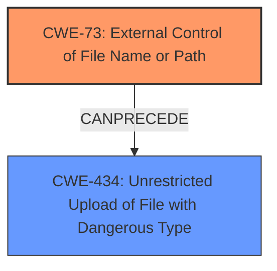

# Enhanced Analysis for CVE-2020-27466

# Summary
| CWE ID  | CWE Name                                                                                                | Confidence | CWE Abstraction Level | CWE Vulnerability Mapping Label | CWE-Vulnerability Mapping Notes |
| :-------- | :-------------------------------------------------------------------------------------------------------- | :--------- | :---------------------- | :------------------------------ | :------------------------------ |
| CWE-73 | External Control of File Name or Path | 0.9  | Base                    | Allowed                     | Primary CWE |
| CWE-434 | Unrestricted Upload of File with Dangerous Type | 0.7  | Base                    | Allowed                     | Secondary CWE |

## Evidence and Confidence

*   **Confidence Score:** 0.8
*   **Evidence Strength:** HIGH

## Relationship Analysis
The primary relationship influencing the decision is that **CWE-73** (External Control of File Name or Path) can precede **CWE-434** (Unrestricted Upload of File with Dangerous Type). This is relevant because the vulnerability involves an attacker controlling a file name, potentially leading to the upload of a dangerous file type. The **Base** abstraction level of both CWEs is appropriate because they directly describe the nature of the vulnerability.



## Vulnerability Chain
The chain of weaknesses starts with the external control of the file name or path (**CWE-73**), which then allows the attacker to write an arbitrary file. If the application does not properly restrict file types, it could result in unrestricted upload of a file with a dangerous type (**CWE-434**), which allows code execution.

## Summary of Analysis
The analysis focused on the provided vulnerability description, CVE Reference Links Content Summary, and the Retriever Results.

The **Vulnerability Description** states an "**arbitrary file write**" vulnerability. The **CVE Reference Links Content Summary** confirms "**Arbitrary file creation in `ajaxEditTemplate.php` allowing PHP code injection.**" This points toward the attacker's ability to control the file name and path, which is a key characteristic of **CWE-73**.

**CWE-73 (External Control of File Name or Path)** is selected as the primary CWE because the vulnerability description specifically mentions the ability to write an arbitrary file. This directly indicates that the attacker has control over the file's name or path. The Complete CWE Specifications for **CWE-73** states: "The product uses external input to construct a pathname that is intended to identify a file or directory...". The evidence directly supports this.

**CWE-434 (Unrestricted Upload of File with Dangerous Type)** is considered a secondary CWE. The CVE summary mentions "**Arbitrary file creation in `ajaxEditTemplate.php` allowing PHP code injection.**" This could suggest that the system doesn't restrict the type of file being written. However, the primary issue is still the ability to control the filename and path. The "Additional Notes" for CWE-434 mentions a chaining relationship with incomplete allowlist errors.

I am selecting **CWE-73** as the primary CWE because the **weakness** is the ability to control the filename.
I am selecting **CWE-434** as the secondary CWE because the result of that **weakness** is the ability to write a php file and inject code leading to remote code execution.

Relevant CWE Information:

# Enhanced Context (25 CWEs)

## CWE-131: Incorrect Calculation of Buffer Size
**Abstraction Level**: Base
**Similarity Score**: 0.77
**Source**: dense

**Description**:
The product does not correctly calculate the size to be used when allocating a buffer, which could lead to a buffer overflow.

**Mapping Guidance**:
- Usage: Allowed
- Rationale: This CWE entry is at the Base level of abstraction, which is a preferred level of abstraction for mapping to the root causes of vulnerabilities.

**Why Not Used**: Buffer size calculation isn't the primary issue described in the vulnerability.

## CWE-191: Integer Underflow (Wrap or Wraparound)
**Abstraction Level**: Base
**Similarity Score**: 0.76
**Source**: dense

**Description**:
The product subtracts one value from another, such that the result is less than the minimum allowable integer value, which produces a value that is not equal to the correct result.

**Mapping Guidance**:
- Usage: Allowed
- Rationale: This CWE entry is at the Base level of abstraction, which is a preferred level of abstraction for mapping to the root causes of vulnerabilities.

**Why Not Used**: Integer underflow is not relevant to the vulnerability description.

## CWE-126: Buffer Over-read
**Abstraction Level**: Variant
**Similarity Score**: 0.75
**Source**: dense

**Description**:
The product reads from a buffer using buffer access mechanisms such as indexes or pointers that reference memory locations after the targeted buffer.

**Mapping Guidance**:
- Usage: Allowed
- Rationale: This CWE entry is at the Variant level of abstraction, which is a preferred level of abstraction for mapping to the root causes of vulnerabilities.

**Why Not Used**: The vulnerability is about writing files, not reading buffers.

## CWE-125: Out-of-bounds Read
**Abstraction Level**: Base
**Similarity Score**: 0.75
**Source**: dense

**Description**:
The product reads data past the end, or before the beginning, of the intended buffer.

**Mapping Guidance**:
- Usage: Allowed
- Rationale: This CWE entry is at the Base level of abstraction, which is a preferred level of abstraction for mapping to the root causes of vulnerabilities.

**Why Not Used**: The vulnerability is about writing files, not reading buffers.

## CWE-193: Off-by-one Error
**Abstraction Level**: Base
**Similarity Score**: 0.75
**Source**: dense

**Description**:
A product calculates or uses an incorrect maximum or minimum value that is 1 more, or 1 less, than the correct value.

**Mapping Guidance**:
- Usage: Allowed
- Rationale: This CWE entry is at the Base level of abstraction, which is a preferred level of abstraction for mapping to the root causes of vulnerabilities.

**Why Not Used**: Off-by-one errors are not relevant to the vulnerability description.

## CWE-789: Memory Allocation with Excessive Size Value
**Abstraction Level**: Variant
**Similarity Score**: 0.75
**Source**: dense

**Description**:
The product allocates memory based on an untrusted, large size value, but it does not ensure that the size is within expected limits, allowing arbitrary amounts of memory to be allocated.

**Mapping Guidance**:
- Usage: Allowed
- Rationale: This CWE entry is at the Variant level of abstraction, which is a preferred level of abstraction for mapping to the root causes of vulnerabilities.

**Why Not Used**: Memory allocation size is not the primary issue described in the vulnerability.

## CWE-129: Improper Validation of Array Index
**Abstraction Level**: Variant
**Similarity Score**: 0.75
**Source**: dense

**Description**:
The product uses untrusted input when calculating or using an array index, but the product does not validate or incorrectly validates the index to ensure the index references a valid position within the array.

**Mapping Guidance**:
- Usage: Allowed
- Rationale: This CWE entry is at the Variant level of abstraction, which is a preferred level of abstraction for mapping to the root causes of vulnerabilities.

**Why Not Used**: Array index validation is not relevant to the vulnerability description.

## CWE-197: Numeric Truncation Error
**Abstraction Level**: Base
**Similarity Score**: 0.75
**Source**: dense

**Description**:
Truncation errors occur when a primitive is cast to a primitive of a smaller size and data is lost in the conversion.

**Mapping Guidance**:
- Usage: Allowed
- Rationale: This CWE entry is at the Base level of abstraction, which is a preferred level of abstraction for mapping to the root causes of vulnerabilities.

**Why Not Used**: Numeric truncation errors are not relevant to the vulnerability description.

## CWE-404: Improper Resource Shutdown or Release
**Abstraction Level**: Class
**Similarity Score**: 0.75
**Source**: dense

**Description**:
The product does not release or incorrectly releases a resource before it is made available for re-use.

**Mapping Guidance**:
- Usage: Allowed-with-Review
- Rationale: This CWE entry is a Class and might have Base-level children that would be more appropriate

**Why Not Used**: Resource shutdown/release is not the primary issue described in the vulnerability.

## CWE-674: Uncontrolled Recursion
**Abstraction Level**: Class
**Similarity Score**: 0.75
**Source**: dense

**Description**:
The product does not properly control the amount of recursion that takes place, consuming excessive resources, such as allocated memory or the program stack.

**Mapping Guidance**:
- Usage:


## CWE Relationship Analysis

Current CWEs represent these abstraction levels: .


### Vulnerability Chain Analysis

**Chain starting from CWE-674:**
- 674 (Uncontrolled Recursion) - ROOT


**Chain starting from CWE-193:**
- 193 (Off-by-one Error) - ROOT


### CWE Relationship Diagram

```mermaid
graph TD
    classDef primary fill:#f96,stroke:#333,stroke-width:2px
    classDef secondary fill:#69f,stroke:#333
    classDef tertiary fill:#9e9,stroke:#333
```