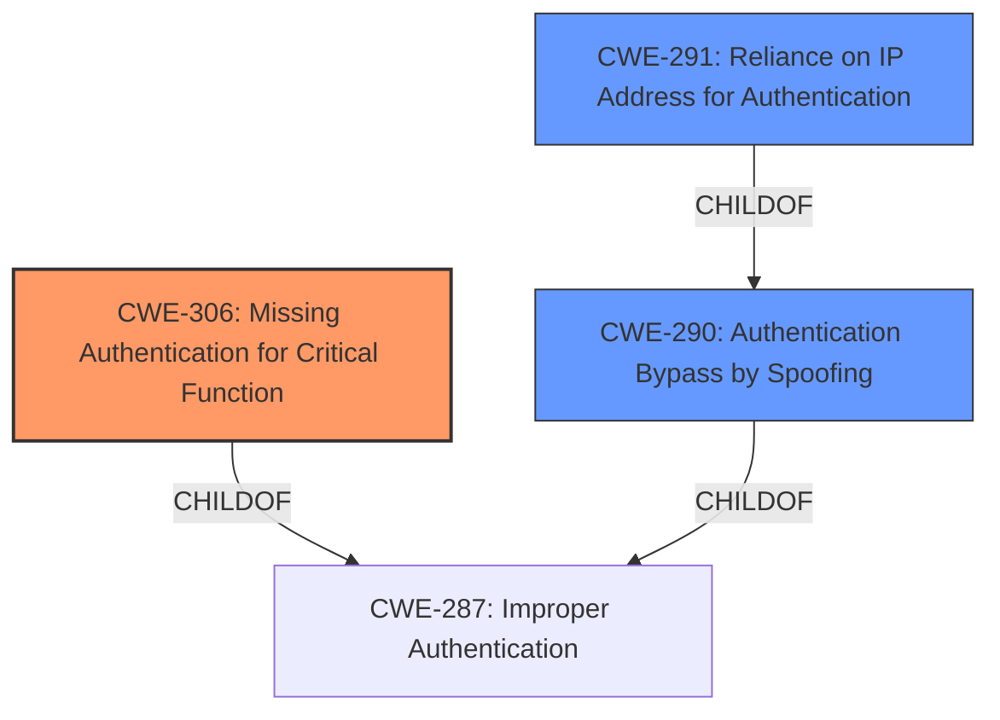

# Analysis for CVE-2020-27488

# Summary
| CWE ID | CWE Name | Confidence | CWE Abstraction Level | CWE Vulnerability Mapping Label | CWE-Vulnerability Mapping Notes |
|---|---|---|---|---|---|
| CWE-306 | Missing Authentication for Critical Function | 1.0 | Base | Primary | Allowed |
| CWE-290 | Authentication Bypass by Spoofing | 0.7 | Base | Secondary | Allowed |
| CWE-291 | Reliance on IP Address for Authentication | 0.5 | Variant | Secondary | Allowed |

## Evidence and Confidence

*   **Confidence Score:** 0.8
*   **Evidence Strength:** HIGH

## Relationship Analysis
The primary CWE is CWE-306 which describes the **missing authentication** for the IP address update function. CWE-290 is a parent of CWE-291 and both describe the **authentication bypass by spoofing** using the IP address. Since the product relied on the IP address for authentication, which could be spoofed, CWE-291 is also considered.

## Vulnerability Chain
The chain of events is as follows: The Loxone Miniserver Cloud DNS service **lacked authentication (CWE-306)** for IP address updates. This **missing authentication** allowed attackers to **spoof** the Miniserver's IP address (**CWE-290**), potentially leading to credential theft, denial of service, or unauthorized access. The reliance on IP address for authentication is a **reliance on IP address for authentication (CWE-291)**.

## Summary of Analysis
The primary weakness is the **missing authentication** for a critical function, specifically updating the IP address in the cloud DNS service. This directly led to the ability to **spoof** the IP address and potentially compromise the system. The vulnerability description and CVE reference links content summary provide sufficient evidence to support the selection of CWE-306 as the primary CWE.

The selection of CWE-306 is based on the following evidence from the "CVE Reference Links Content Summary": "The primary weakness was the **absence of authentication** for IP address updates sent to the Loxone Cloud DNS service. This allowed any device to register an arbitrary IP address for a given Miniserver MAC address."

The selection of CWE-290 and CWE-291 are based on the following evidence from the "CVE Reference Links Content Summary": "The Miniserver used an unauthenticated UDP datagram to announce its public IP address. The contents of the UDP datagram were not cryptographically signed, allowing an attacker to easily craft a fake message."

CWE-287, Improper Authentication, was considered but not selected as the primary CWE because it is a Class-level CWE, and CWE-306 provides a more specific description of the **missing authentication** issue.

CWE-347, Improper Verification of Cryptographic Signature, was considered but not selected because the vulnerability was due to a **complete lack of authentication**, not an improper verification of a signature.

CWE-345, Insufficient Verification of Data Authenticity, was considered but not selected because it is a Class-level CWE. The root cause was **missing authentication**.

CWE-295, Improper Certificate Validation, was considered but not selected, as there was no mention of certificates being used, rather the issue was regarding the **missing authentication** of the IP address update.

CWE-613, Insufficient Session Expiration, was considered, but the description does not match the **missing authentication** root cause.

CWE-259, Use of Hard-coded Password, was considered but not selected as there was no mention of hard-coded passwords.