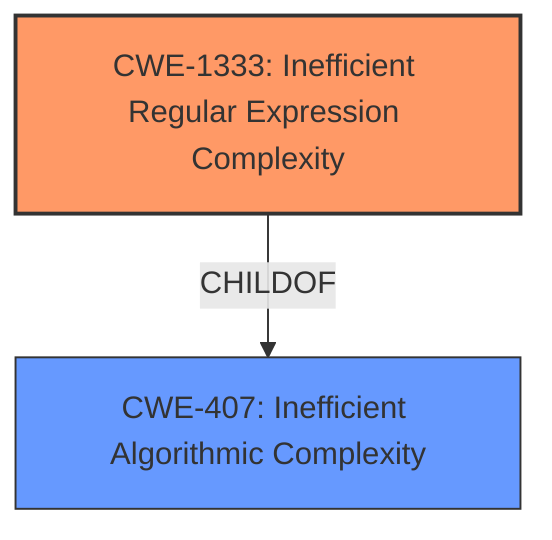

# Enhanced Analysis for CVE-2020-27511

# Summary 
| CWE ID    | CWE Name                                                           | Confidence | CWE Abstraction Level | CWE Vulnerability Mapping Label | CWE-Vulnerability Mapping Notes |
| --------- | ------------------------------------------------------------------ | ---------- | --------------------- | ------------------------------- | ------------------------------- |
| CWE-1333 | Inefficient Regular Expression Complexity                        | 1.0        | Base                  | Allowed                         |                                 |

## Evidence and Confidence

*   **Confidence Score:** 1.0
*   **Evidence Strength:** HIGH

## Relationship Analysis
The primary relationship that influenced the decision was the ChildOf relationship between CWE-1333 and CWE-407 (Inefficient Algorithmic Complexity). While CWE-407 is a broader class, CWE-1333 specifically addresses inefficiencies in regular expressions, making it a more precise fit. There are no chain relationships that were relevant in this instance.mermaid



## Vulnerability Chain
The vulnerability chain consists of the following:
1.  **Root Cause:** **Inefficient Regular Expression Complexity** (CWE-1333) in the `stripTags()` function.
2.  **Weakness:** A crafted HTML tag is processed by the vulnerable regular expression.
3.  **Impact:** Excessive CPU consumption leading to a Denial of Service (DoS).

## Summary of Analysis
The initial analysis focused on identifying the root cause of the vulnerability. The vulnerability description and the CVE Reference Links Content Summary clearly indicated a **regular expression denial of service** (ReDoS) in the `stripTags()` function due to an inefficient regular expression.

The evidence supporting CWE-1333 is strong:
*   "The vulnerability is a Regular Expression Denial of Service (ReDoS) found in the `stripTags()` function"
*   "The `stripTags()` function uses a regular expression that is vulnerable to ReDoS attacks."
*   "The regular expression `/<\w+(\s+([^\"]*\"|'[^']*'|[^>])+)?(\/)?>|<\/\w+>/gi` can lead to excessive backtracking when processing specially crafted input strings, causing the function to consume excessive CPU resources."
*   "An attacker can cause a denial of service by providing a specially crafted input string to the `stripTags()` function, leading to excessive CPU usage and potentially making the server unresponsive."
*   "The attacker needs the ability to provide input to the `stripTags()` function. This could be through a web application that uses the Prototype library or any other application that utilizes this function."

The retriever results also listed CWE-1333 as the top match with a score of 1.0.

The selected CWE is at the optimal level of specificity because it directly addresses the inefficiency in the regular expression that leads to the denial of service. While CWE-407 (Inefficient Algorithmic Complexity) is a parent class, CWE-1333 provides a more precise description of the vulnerability.

Relevant CWE Information:

# Enhanced Context (25 CWEs)
The following CWEs were identified as potentially relevant to this vulnerability:

## CWE-186: Overly Restrictive Regular Expression
**Abstraction Level**: Base
**Similarity Score**: 0.77
**Source**: dense

**Description**:
A regular expression is overly restrictive, which prevents dangerous values from being detected.
*This CWE was not selected because the problem isn't that the regex is too restrictive, but rather that it is inefficient.*

## CWE-625: Permissive Regular Expression
**Abstraction Level**: Base
**Similarity Score**: 0.77
**Source**: dense

**Description**:
The product uses a regular expression that does not sufficiently restrict the set of allowed values.
*This CWE was not selected because the problem isn't that the regex is too permissive, but rather that it is inefficient.*

## CWE-185: Incorrect Regular Expression
**Abstraction Level**: Class
**Similarity Score**: 0.77
**Source**: dense

**Description**:
The product specifies a regular expression in a way that causes data to be improperly matched or compared.
*This CWE was not selected because it is too broad, CWE-1333 is more specific to ReDoS.*

## CWE-1289: Improper Validation of Unsafe Equivalence in Input
**Abstraction Level**: Base
**Similarity Score**: 0.74
**Source**: dense

**Description**:
The product receives an input value that is used as a resource identifier or other type of reference, but it does not validate or incorrectly validates that the input is equivalent to a potentially-unsafe value.
*This CWE was not selected because the vulnerability does not revolve around validation of unsafe equivalences in input.*

## CWE-184: Incomplete List of Disallowed Inputs
**Abstraction Level**: Base
**Similarity Score**: 0.74
**Source**: dense

**Description**:
The product implements a protection mechanism that relies on a list of inputs (or properties of inputs) that are not allowed by policy or otherwise require other action to neutralize before additional processing takes place, but the list is incomplete.
*This CWE was not selected because the vulnerability doesn't revolve around an incomplete list of disallowed inputs.*

## CWE-1333: Inefficient Regular Expression Complexity
**Abstraction Level**: Base
**Similarity Score**: 0.74
**Source**: dense

**Description**:
The product uses a regular expression with an inefficient, possibly exponential worst-case computational complexity that consumes excessive CPU cycles.

**Mapping Guidance**:
- Usage: Allowed
- Rationale: This CWE entry is at the Base level of abstraction, which is a preferred level of abstraction for mapping to the root causes of vulnerabilities.

## CWE-41: Improper Resolution of Path Equivalence
**Abstraction Level**: Base
**Similarity Score**: 0.73
**Source**: dense

**Description**:
The product is vulnerable to file system contents disclosure through path equivalence. Path equivalence involves the use of special characters in file and directory names. The associated manipulations are intended to generate multiple names for the same object.
*This CWE was not selected because the vulnerability is not related to path equivalence issues.*

## CWE-129: Improper Validation of Array Index
**Abstraction Level**: Variant
**Similarity Score**: 0.73
**Source**: dense

**Description**:
The product uses untrusted input when calculating or using an array index, but the product does not validate or incorrectly validates the index to ensure the index references a valid position within the array.
*This CWE was not selected because the vulnerability does not involve improper validation of array indices.*

## CWE-754: Improper Check for Unusual or Exceptional Conditions
**Abstraction Level**: Class
**Similarity Score**: 0.73
**Source**: dense

**Description**:
The product does not check or incorrectly checks for unusual or exceptional conditions that are not expected to occur frequently during day to day operation of the product.
*This CWE was not selected because it is too general, the problem is a ReDoS.*

## CWE-407: Inefficient Algorithmic Complexity
**Abstraction Level**: Class
**Similarity Score**: 0.73
**Source**: dense

**Description**:
An algorithm in a product has an inefficient worst-case computational complexity that may be detrimental to system performance and can be triggered by an attacker, typically using crafted manipulations that ensure that the worst case is being reached.
*This CWE was not selected because CWE-1333 is a child of this and is a more accurate description of the vulnerability.*

## CWE-1333: Inefficient Regular Expression Complexity
**Abstraction Level**: Base
**Similarity Score**: 5265.38
**Source**: sparse

**Description**:
The product uses a regular expression with an inefficient, possibly exponential worst-case computational complexity that consumes excessive CPU cycles.

**Mapping Guidance**:
- Usage: Allowed
- Rationale: This CWE entry is at the Base level of abstraction, which is a preferred level of abstraction for mapping to the root causes of vulnerabilities.

## CWE-617: Reachable Assertion
**Abstraction Level**: Base
**Similarity Score**: 5011.82
**Source**: sparse

**Description**:
The product contains an assert() or similar statement that can be triggered by an attacker, which leads to an application exit or other behavior that is more severe than necessary.
*This CWE was not selected because the issue is an inefficient regex.*

## CWE-193: Off-by-one Error
**Abstraction Level**: Base
**Similarity Score**: 4977.00
**Source**: sparse

**Description**:
A product calculates or uses an incorrect maximum or minimum value that is 1 more, or 1 less, than the correct value.
*This CWE was not selected because the issue is an inefficient regex.*

## CWE-125: Out-of-bounds Read
**Abstraction Level


## CWE Relationship Analysis

Current CWEs represent these abstraction levels: .


### Vulnerability Chain Analysis

**Chain starting from CWE-186:**
- 186 (Overly Restrictive Regular Expression) - ROOT


**Chain starting from CWE-754:**
- 754 (Improper Check for Unusual or Exceptional Conditions) - ROOT


### CWE Relationship Diagram

```mermaid
graph TD
    classDef primary fill:#f96,stroke:#333,stroke-width:2px
    classDef secondary fill:#69f,stroke:#333
    classDef tertiary fill:#9e9,stroke:#333
```