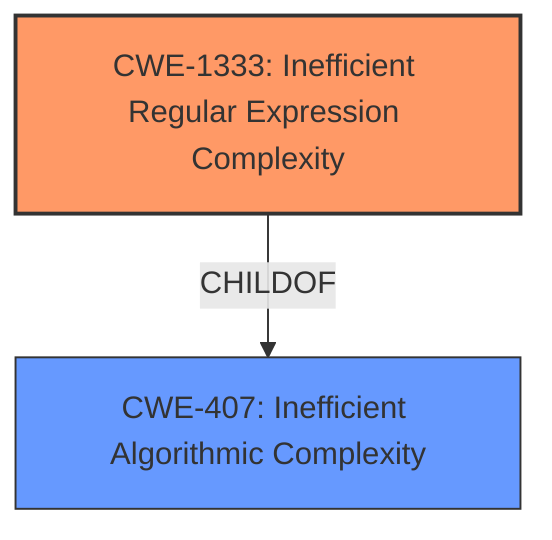

# Analysis for CVE-2020-27511

```markdown
# Summary 
| CWE ID    | CWE Name                                                           | Confidence | CWE Abstraction Level | CWE Vulnerability Mapping Label | CWE-Vulnerability Mapping Notes |
| --------- | ------------------------------------------------------------------ | ---------- | --------------------- | ------------------------------- | ------------------------------- |
| CWE-1333 | Inefficient Regular Expression Complexity                        | 1.0        | Base                  | Allowed                         |                                 |

## Evidence and Confidence

*   **Confidence Score:** 1.0
*   **Evidence Strength:** HIGH

## Relationship Analysis
The primary relationship that influenced the decision was the ChildOf relationship between CWE-1333 and CWE-407 (Inefficient Algorithmic Complexity). While CWE-407 is a broader class, CWE-1333 specifically addresses inefficiencies in regular expressions, making it a more precise fit. There are no chain relationships that were relevant in this instance.



## Vulnerability Chain
The vulnerability chain consists of the following:
1.  **Root Cause:** **Inefficient Regular Expression Complexity** (CWE-1333) in the `stripTags()` function.
2.  **Weakness:** A crafted HTML tag is processed by the vulnerable regular expression.
3.  **Impact:** Excessive CPU consumption leading to a Denial of Service (DoS).

## Summary of Analysis
The initial analysis focused on identifying the root cause of the vulnerability. The vulnerability description and the CVE Reference Links Content Summary clearly indicated a **regular expression denial of service** (ReDoS) in the `stripTags()` function due to an inefficient regular expression.

The evidence supporting CWE-1333 is strong:
*   "The vulnerability is a Regular Expression Denial of Service (ReDoS) found in the `stripTags()` function"
*   "The `stripTags()` function uses a regular expression that is vulnerable to ReDoS attacks."
*   "The regular expression `/<\w+(\s+([^\"]*\"|'[^']*'|[^>])+)?(\/)?>|<\/\w+>/gi` can lead to excessive backtracking when processing specially crafted input strings, causing the function to consume excessive CPU resources."
*   "An attacker can cause a denial of service by providing a specially crafted input string to the `stripTags()` function, leading to excessive CPU usage and potentially making the server unresponsive."
*   "The attacker needs the ability to provide input to the `stripTags()` function. This could be through a web application that uses the Prototype library or any other application that utilizes this function."

The retriever results also listed CWE-1333 as the top match with a score of 1.0.

The selected CWE is at the optimal level of specificity because it directly addresses the inefficiency in the regular expression that leads to the denial of service. While CWE-407 (Inefficient Algorithmic Complexity) is a parent class, CWE-1333 provides a more precise description of the vulnerability.

Relevant CWE Information:

# Enhanced Context (25 CWEs)
The following CWEs were identified as potentially relevant to this vulnerability:

## CWE-186: Overly Restrictive Regular Expression
**Abstraction Level**: Base
**Similarity Score**: 0.77
**Source**: dense

**Description**:
A regular expression is overly restrictive, which prevents dangerous values from being detected.
*This CWE was not selected because the problem isn't that the regex is too restrictive, but rather that it is inefficient.*

## CWE-625: Permissive Regular Expression
**Abstraction Level**: Base
**Similarity Score**: 0.77
**Source**: dense

**Description**:
The product uses a regular expression that does not sufficiently restrict the set of allowed values.
*This CWE was not selected because the problem isn't that the regex is too permissive, but rather that it is inefficient.*

## CWE-185: Incorrect Regular Expression
**Abstraction Level**: Class
**Similarity Score**: 0.77
**Source**: dense

**Description**:
The product specifies a regular expression in a way that causes data to be improperly matched or compared.
*This CWE was not selected because it is too broad, CWE-1333 is more specific to ReDoS.*

## CWE-1289: Improper Validation of Unsafe Equivalence in Input
**Abstraction Level**: Base
**Similarity Score**: 0.74
**Source**: dense

**Description**:
The product receives an input value that is used as a resource identifier or other type of reference, but it does not validate or incorrectly validates that the input is equivalent to a potentially-unsafe value.
*This CWE was not selected because the vulnerability does not revolve around validation of unsafe equivalences in input.*

## CWE-184: Incomplete List of Disallowed Inputs
**Abstraction Level**: Base
**Similarity Score**: 0.74
**Source**: dense

**Description**:
The product implements a protection mechanism that relies on a list of inputs (or properties of inputs) that are not allowed by policy or otherwise require other action to neutralize before additional processing takes place, but the list is incomplete.
*This CWE was not selected because the vulnerability doesn't revolve around an incomplete list of disallowed inputs.*

## CWE-1333: Inefficient Regular Expression Complexity
**Abstraction Level**: Base
**Similarity Score**: 0.74
**Source**: dense

**Description**:
The product uses a regular expression with an inefficient, possibly exponential worst-case computational complexity that consumes excessive CPU cycles.

**Mapping Guidance**:
- Usage: Allowed
- Rationale: This CWE entry is at the Base level of abstraction, which is a preferred level of abstraction for mapping to the root causes of vulnerabilities.

## CWE-41: Improper Resolution of Path Equivalence
**Abstraction Level**: Base
**Similarity Score**: 0.73
**Source**: dense

**Description**:
The product is vulnerable to file system contents disclosure through path equivalence. Path equivalence involves the use of special characters in file and directory names. The associated manipulations are intended to generate multiple names for the same object.
*This CWE was not selected because the vulnerability is not related to path equivalence issues.*

## CWE-129: Improper Validation of Array Index
**Abstraction Level**: Variant
**Similarity Score**: 0.73
**Source**: dense

**Description**:
The product uses untrusted input when calculating or using an array index, but the product does not validate or incorrectly validates the index to ensure the index references a valid position within the array.
*This CWE was not selected because the vulnerability does not involve improper validation of array indices.*

## CWE-754: Improper Check for Unusual or Exceptional Conditions
**Abstraction Level**: Class
**Similarity Score**: 0.73
**Source**: dense

**Description**:
The product does not check or incorrectly checks for unusual or exceptional conditions that are not expected to occur frequently during day to day operation of the product.
*This CWE was not selected because it is too general, the problem is a ReDoS.*

## CWE-407: Inefficient Algorithmic Complexity
**Abstraction Level**: Class
**Similarity Score**: 0.73
**Source**: dense

**Description**:
An algorithm in a product has an inefficient worst-case computational complexity that may be detrimental to system performance and can be triggered by an attacker, typically using crafted manipulations that ensure that the worst case is being reached.
*This CWE was not selected because CWE-1333 is a child of this and is a more accurate description of the vulnerability.*

## CWE-1333: Inefficient Regular Expression Complexity
**Abstraction Level**: Base
**Similarity Score**: 5265.38
**Source**: sparse

**Description**:
The product uses a regular expression with an inefficient, possibly exponential worst-case computational complexity that consumes excessive CPU cycles.

**Mapping Guidance**:
- Usage: Allowed
- Rationale: This CWE entry is at the Base level of abstraction, which is a preferred level of abstraction for mapping to the root causes of vulnerabilities.

## CWE-617: Reachable Assertion
**Abstraction Level**: Base
**Similarity Score**: 5011.82
**Source**: sparse

**Description**:
The product contains an assert() or similar statement that can be triggered by an attacker, which leads to an application exit or other behavior that is more severe than necessary.
*This CWE was not selected because the issue is an inefficient regex.*

## CWE-193: Off-by-one Error
**Abstraction Level**: Base
**Similarity Score**: 4977.00
**Source**: sparse

**Description**:
A product calculates or uses an incorrect maximum or minimum value that is 1 more, or 1 less, than the correct value.
*This CWE was not selected because the issue is an inefficient regex.*

## CWE-125: Out-of-bounds Read
**Abstraction Level

# Enhanced Query for CVE-2020-27511

## Vulnerability Description
An issue was discovered in the stripTags and unescapeHTML components in Prototype 1.7.3 where an attacker can cause a Regular Expression Denial of Service (ReDOS) through stripping crafted HTML tags.

### Vulnerability Description Key Phrases
- **weakness:** **regular expression denial of service**
- **vector:** crafted HTML tags
- **attacker:** attacker
- **product:** Prototype
- **version:** 1.7.3
- **component:** stripTags and unescapeHTML components

## CVE Reference Links Content Summary
```
{
  "vulnerability": {
    "root_cause": "The vulnerability is a Regular Expression Denial of Service (ReDoS) found in the `stripTags()` function of the Prototype JavaScript library.",
    "weaknesses": [
      "The `stripTags()` function uses a regular expression that is vulnerable to ReDoS attacks. Specifically, the regex `/<\w+(\s+([^\"]*\"|'[^']*'|[^>])+)?(\/)?>|<\/\w+>/gi` can lead to excessive backtracking when processing specially crafted input strings, causing the function to consume excessive CPU resources.",
      "The regular expression `/<\\w+(\\s+([^\"]*\"|'[^']*'|[^>])+)?(\\/)?>|<\\/\\w+>/gi` used in `stripTags` is vulnerable to catastrophic backtracking because of nested quantifiers and alternations in the regex."
    ],
    "impact": "An attacker can cause a denial of service by providing a specially crafted input string to the `stripTags()` function, leading to excessive CPU usage and potentially making the server unresponsive.",
    "attack_vectors": [
      "The attack vector is through input to the `stripTags()` function. A crafted string, designed to exploit the regex, is passed to this function.",
        "An attacker can exploit this vulnerability by providing a string with a large number of single quotes inside a tag, like `<a ''''''... >`"
    ],
    "attacker_capabilities": "The attacker needs the ability to provide input to the `stripTags()` function. This could be through a web application that uses the Prototype library or any other application that utilizes this function.",
      "additional_details": "The provided proof of concept code demonstrates that by increasing the number of single quotes within a tag in the input string, the execution time of the `stripTags()` function increases significantly, indicating the ReDoS vulnerability. The vulnerable regex can cause catastrophic backtracking, consuming excessive resources."
  }
}
```

## Retriever Results

### Top Combined Results

| Rank | CWE ID | Name | Abstraction | Usage  | Retrievers | Individual Scores |
|------|--------|------|-------------|-------|------------|-------------------|
| 1 | 1333 | Inefficient Regular Expression Complexity | Base | Allowed | alternate_terms | 1.000 |
| 2 | 617 | Reachable Assertion | Base | Allowed | sparse | 0.212 |
| 3 | 674 | Uncontrolled Recursion | Class | Allowed-with-Review | sparse | 0.199 |
| 4 | 843 | Access of Resource Using Incompatible Type ('Type Confusion') | Base | Allowed | sparse | 0.199 |
| 5 | 1321 | Improperly Controlled Modification of Object Prototype Attributes ('Prototype Pollution') | Variant | Allowed | sparse | 0.198 |
| 6 | 185 | Incorrect Regular Expression | Class | Allowed-with-Review | dense | 0.554 |
| 7 | 193 | Off-by-one Error | Base | Allowed | graph | 0.002 |
| 8 | 626 | Null Byte Interaction Error (Poison Null Byte) | Variant | Allowed | sparse | 0.190 |
| 9 | 122 | Heap-based Buffer Overflow | Variant | Allowed | sparse | 0.183 |
| 10 | 186 | Overly Restrictive Regular Expression | Base | Allowed | sparse | 0.183 |


# Complete CWE Specifications


## CWE-1333: Inefficient Regular Expression Complexity
**Abstraction:** Base
**Status:** Draft

### Description
The product uses a regular expression with an inefficient, possibly exponential worst-case computational complexity that consumes excessive CPU cycles.

### Extended Description
Some regular expression engines have a feature called "backtracking". If the token cannot match, the engine "backtracks" to a position that may result in a different token that can match.
 Backtracking becomes a weakness if all of these conditions are met:


  - The number of possible backtracking attempts are exponential relative to the length of the input.

  - The input can fail to match the regular expression.

  - The input can be long enough.

 Attackers can create crafted inputs that intentionally cause the regular expression to use excessive backtracking in a way that causes the CPU consumption to spike. 

### Alternative Terms
ReDoS: ReDoS is an abbreviation of "Regular expression Denial of Service".
Regular Expression Denial of Service: While this term is attack-focused, this is commonly used to describe the weakness.
Catastrophic backtracking: This term is used to describe the behavior of the regular expression as a negative technical impact.

### Relationships
ChildOf -> CWE-407
ChildOf -> CWE-407

### Mapping Guidance
**Usage:** Allowed
**Rationale:** This CWE entry is at the Base level of abstraction, which is a preferred level of abstraction for mapping to the root causes of vulnerabilities.
**Comments:** Carefully read both the name and description to ensure that this mapping is an appropriate fit. Do not try to 'force' a mapping to a lower-level Base/Variant simply to comply with this preferred level of abstraction.
**Reasons:**
- Acceptable-Use


### Observed Examples
- **CVE-2020-5243:** server allows ReDOS with crafted User-Agent strings, due to overlapping capture groups that cause excessive backtracking.
- **CVE-2021-21317:** npm package for user-agent parser prone to ReDoS due to overlapping capture groups
- **CVE-2019-16215:** Markdown parser uses inefficient regex when processing a message, allowing users to cause CPU consumption and delay preventing processing of other messages.


## CWE-617: Reachable Assertion
**Abstraction:** Base
**Status:** Draft

### Description
The product contains an assert() or similar statement that can be triggered by an attacker, which leads to an application exit or other behavior that is more severe than necessary.

### Extended Description


While assertion is good for catching logic errors and reducing the chances of reaching more serious vulnerability conditions, it can still lead to a denial of service.


For example, if a server handles multiple simultaneous connections, and an assert() occurs in one single connection that causes all other connections to be dropped, this is a reachable assertion that leads to a denial of service.


### Alternative Terms
assertion failure

### Relationships
ChildOf -> CWE-670
ChildOf -> CWE-670

### Mapping Guidance
**Usage:** Allowed
**Rationale:** This CWE entry is at the Base level of abstraction, which is a preferred level of abstraction for mapping to the root causes of vulnerabilities.
**Comments:** Carefully read both the name and description to ensure that this mapping is an appropriate fit. Do not try to 'force' a mapping to a lower-level Base/Variant simply to comply with this preferred level of abstraction.
**Reasons:**
- Acceptable-Use


### Observed Examples
- **CVE-2023-49286:** Chain: function in web caching proxy does not correctly check a return value (CWE-253) leading to a reachable assertion (CWE-617)
- **CVE-2006-6767:** FTP server allows remote attackers to cause a denial of service (daemon abort) via crafted commands which trigger an assertion failure.
- **CVE-2006-6811:** Chat client allows remote attackers to cause a denial of service (crash) via a long message string when connecting to a server, which causes an assertion failure.


## CWE-674: Uncontrolled Recursion
**Abstraction:** Class
**Status:** Draft

### Description
The product does not properly control the amount of recursion that takes place,  consuming excessive resources, such as allocated memory or the program stack.

### Extended Description
Not provided

### Alternative Terms
Stack Exhaustion

### Relationships
ChildOf -> CWE-834

### Mapping Guidance
**Usage:** Allowed-with-Review
**Rationale:** This CWE entry is a Class and might have Base-level children that would be more appropriate
**Comments:** Examine children of this entry to see if there is a better fit
**Reasons:**
- Abstraction


### Observed Examples
- **CVE-2007-1285:** Deeply nested arrays trigger stack exhaustion.
- **CVE-2007-3409:** Self-referencing pointers create infinite loop and resultant stack exhaustion.
- **CVE-2016-10707:** Javascript application accidentally changes input in a way that prevents a recursive call from detecting an exit condition.


## CWE-843: Access of Resource Using Incompatible Type ('Type Confusion')
**Abstraction:** Base
**Status:** Incomplete

### Description
The product allocates or initializes a resource such as a pointer, object, or variable using one type, but it later accesses that resource using a type that is incompatible with the original type.

### Extended Description


When the product accesses the resource using an incompatible type, this could trigger logical errors because the resource does not have expected properties. In languages without memory safety, such as C and C++, type confusion can lead to out-of-bounds memory access.


While this weakness is frequently associated with unions when parsing data with many different embedded object types in C, it can be present in any application that can interpret the same variable or memory location in multiple ways.


This weakness is not unique to C and C++. For example, errors in PHP applications can be triggered by providing array parameters when scalars are expected, or vice versa. Languages such as Perl, which perform automatic conversion of a variable of one type when it is accessed as if it were another type, can also contain these issues.


### Alternative Terms
Object Type Confusion

### Relationships
ChildOf -> CWE-704
ChildOf -> CWE-704
CanPrecede -> CWE-119

### Mapping Guidance
**Usage:** Allowed
**Rationale:** This CWE entry is at the Base level of abstraction, which is a preferred level of abstraction for mapping to the root causes of vulnerabilities.
**Comments:** Carefully read both the name and description to ensure that this mapping is an appropriate fit. Do not try to 'force' a mapping to a lower-level Base/Variant simply to comply with this preferred level of abstraction.
**Reasons:**
- Acceptable-Use


### Additional Notes
**[Applicable Platform]** 

This weakness is possible in any type-unsafe programming language.


**[Research Gap]** 

Type confusion weaknesses have received some attention by applied researchers and major software vendors for C and C++ code. Some publicly-reported vulnerabilities probably have type confusion as a root-cause weakness, but these may be described as "memory corruption" instead.


For other languages, there are very few public reports of type confusion weaknesses. These are probably under-studied. Since many programs rely directly or indirectly on loose typing, a potential "type confusion" behavior might be intentional, possibly requiring more manual analysis.


### Observed Examples
- **CVE-2010-4577:** Type confusion in CSS sequence leads to out-of-bounds read.
- **CVE-2011-0611:** Size inconsistency allows code execution, first discovered when it was actively exploited in-the-wild.
- **CVE-2010-0258:** Improperly-parsed file containing records of different types leads to code execution when a memory location is interpreted as a different object than intended.


## CWE-1321: Improperly Controlled Modification of Object Prototype Attributes ('Prototype Pollution')
**Abstraction:** Variant
**Status:** Incomplete

### Description
The product receives input from an upstream component that specifies attributes that are to be initialized or updated in an object, but it does not properly control modifications of attributes of the object prototype.

### Extended Description


By adding or modifying attributes of an object prototype, it is possible to create attributes that exist on every object, or replace critical attributes with malicious ones. This can be problematic if the product depends on existence or non-existence of certain attributes, or uses pre-defined attributes of object prototype (such as hasOwnProperty, toString or valueOf).


This weakness is usually exploited by using a special attribute of objects called proto, constructor or prototype. Such attributes give access to the object prototype. This weakness is often found in code that assigns object attributes based on user input, or merges or clones objects recursively.


### Alternative Terms
None

### Relationships
ChildOf -> CWE-915
ChildOf -> CWE-913
CanPrecede -> CWE-471

### Mapping Guidance
**Usage:** Allowed
**Rationale:** This CWE entry is at the Variant level of abstraction, which is a preferred level of abstraction for mapping to the root causes of vulnerabilities.
**Comments:** Carefully read both the name and description to ensure that this mapping is an appropriate fit. Do not try to 'force' a mapping to a lower-level Base/Variant simply to comply with this preferred level of abstraction.
**Reasons:**
- Acceptable-Use


### Observed Examples
- **CVE-2018-3721:** Prototype pollution by merging objects.
- **CVE-2019-10744:** Prototype pollution by setting default values to object attributes recursively.
- **CVE-2019-11358:** Prototype pollution by merging objects recursively.


## CWE-185: Incorrect Regular Expression
**Abstraction:** Class
**Status:** Draft

### Description
The product specifies a regular expression in a way that causes data to be improperly matched or compared.

### Extended Description
When the regular expression is used in protection mechanisms such as filtering or validation, this may allow an attacker to bypass the intended restrictions on the incoming data.

### Alternative Terms
None

### Relationships
ChildOf -> CWE-697
CanPrecede -> CWE-187
CanPrecede -> CWE-182

### Mapping Guidance
**Usage:** Allowed-with-Review
**Rationale:** This CWE entry is a Class and might have Base-level children that would be more appropriate
**Comments:** Examine children of this entry to see if there is a better fit
**Reasons:**
- Abstraction


### Additional Notes
**[Relationship]** While there is some overlap with allowlist/denylist problems, this entry is intended to deal with incorrectly written regular expressions, regardless of their intended use. Not every regular expression is intended for use as an allowlist or denylist. In addition, allowlists and denylists can be implemented using other mechanisms besides regular expressions.

**[Research Gap]** Regexp errors are likely a primary factor in many MFVs, especially those that require multiple manipulations to exploit. However, they are rarely diagnosed at this level of detail.


### Observed Examples
- **CVE-2002-2109:** Regexp isn't "anchored" to the beginning or end, which allows spoofed values that have trusted values as substrings.
- **CVE-2005-1949:** Regexp for IP address isn't anchored at the end, allowing appending of shell metacharacters.
- **CVE-2001-1072:** Bypass access restrictions via multiple leading slash, which causes a regular expression to fail.


## CWE-193: Off-by-one Error
**Abstraction:** Base
**Status:** Draft

### Description
A product calculates or uses an incorrect maximum or minimum value that is 1 more, or 1 less, than the correct value.

### Extended Description
Not provided

### Alternative Terms
off-by-five: An "off-by-five" error was reported for sudo in 2002 (CVE-2002-0184), but that is more like a "length calculation" error.

### Relationships
ChildOf -> CWE-682
ChildOf -> CWE-682
CanPrecede -> CWE-617
CanPrecede -> CWE-170
CanPrecede -> CWE-119

### Mapping Guidance
**Usage:** Allowed
**Rationale:** This CWE entry is at the Base level of abstraction, which is a preferred level of abstraction for mapping to the root causes of vulnerabilities.
**Comments:** Carefully read both the name and description to ensure that this mapping is an appropriate fit. Do not try to 'force' a mapping to a lower-level Base/Variant simply to comply with this preferred level of abstraction.
**Reasons:**
- Acceptable-Use


### Additional Notes
**[Relationship]** This is not always a buffer overflow. For example, an off-by-one error could be a factor in a partial comparison, a read from the wrong memory location, an incorrect conditional, etc.


### Observed Examples
- **CVE-2003-0252:** Off-by-one error allows remote attackers to cause a denial of service and possibly execute arbitrary code via requests that do not contain newlines.
- **CVE-2001-1391:** Off-by-one vulnerability in driver allows users to modify kernel memory.
- **CVE-2002-0083:** Off-by-one error allows local users or remote malicious servers to gain privileges.


## CWE-626: Null Byte Interaction Error (Poison Null Byte)
**Abstraction:** Variant
**Status:** Draft

### Description
The product does not properly handle null bytes or NUL characters when passing data between different representations or components.

### Extended Description


A null byte (NUL character) can have different meanings across representations or languages. For example, it is a string terminator in standard C libraries, but Perl and PHP strings do not treat it as a terminator. When two representations are crossed - such as when Perl or PHP invokes underlying C functionality - this can produce an interaction error with unexpected results. Similar issues have been reported for ASP. Other interpreters written in C might also be affected.


The poison null byte is frequently useful in path traversal attacks by terminating hard-coded extensions that are added to a filename. It can play a role in regular expression processing in PHP.


### Alternative Terms
None

### Relationships
ChildOf -> CWE-147
ChildOf -> CWE-436

### Mapping Guidance
**Usage:** Allowed
**Rationale:** This CWE entry is at the Variant level of abstraction, which is a preferred level of abstraction for mapping to the root causes of vulnerabilities.
**Comments:** Carefully read both the name and description to ensure that this mapping is an appropriate fit. Do not try to 'force' a mapping to a lower-level Base/Variant simply to comply with this preferred level of abstraction.
**Reasons:**
- Acceptable-Use


### Additional Notes
**[Terminology]** Current usage of "poison null byte" is typically related to this C/Perl/PHP interaction error, but the original term in 1998 was applied to an off-by-one buffer overflow involving a null byte.

**[Research Gap]** There are not many CVE examples, because the poison NULL byte is a design limitation, which typically is not included in CVE by itself. It is typically used as a facilitator manipulation to widen the scope of potential attacks against other vulnerabilities.


### Observed Examples
- **CVE-2005-4155:** NUL byte bypasses PHP regular expression check
- **CVE-2005-3153:** inserting SQL after a NUL byte bypasses allowlist regexp, enabling SQL injection


## CWE-122: Heap-based Buffer Overflow
**Abstraction:** Variant
**Status:** Draft

### Description
A heap overflow condition is a buffer overflow, where the buffer that can be overwritten is allocated in the heap portion of memory, generally meaning that the buffer was allocated using a routine such as malloc().

### Extended Description
Not provided

### Alternative Terms
None

### Relationships
ChildOf -> CWE-788
ChildOf -> CWE-787

### Mapping Guidance
**Usage:** Allowed
**Rationale:** This CWE entry is at the Variant level of abstraction, which is a preferred level of abstraction for mapping to the root causes of vulnerabilities.
**Comments:** Carefully read both the name and description to ensure that this mapping is an appropriate fit. Do not try to 'force' a mapping to a lower-level Base/Variant simply to comply with this preferred level of abstraction.
**Reasons:**
- Acceptable-Use


### Additional Notes
**[Relationship]** Heap-based buffer overflows are usually just as dangerous as stack-based buffer overflows.


### Observed Examples
- **CVE-2021-43537:** Chain: in a web browser, an unsigned 64-bit integer is forcibly cast to a 32-bit integer (CWE-681) and potentially leading to an integer overflow (CWE-190). If an integer overflow occurs, this can cause heap memory corruption (CWE-122)
- **CVE-2007-4268:** Chain: integer signedness error (CWE-195) passes signed comparison, leading to heap overflow (CWE-122)
- **CVE-2009-2523:** Chain: product does not handle when an input string is not NULL terminated (CWE-170), leading to buffer over-read (CWE-125) or heap-based buffer overflow (CWE-122).


## CWE-186: Overly Restrictive Regular Expression
**Abstraction:** Base
**Status:** Draft

### Description
A regular expression is overly restrictive, which prevents dangerous values from being detected.

### Extended Description
This weakness is not about regular expression complexity. Rather, it is about a regular expression that does not match all values that are intended. Consider the use of a regexp to identify acceptable values or to spot unwanted terms. An overly restrictive regexp misses some potentially security-relevant values leading to either false positives *or* false negatives, depending on how the regexp is being used within the code. Consider the expression /[0-8]/ where the intention was /[0-9]/. This expression is not "complex" but the value "9" is not matched when maybe the programmer planned to check for it.

### Alternative Terms
None

### Relationships
ChildOf -> CWE-185
CanAlsoBe -> CWE-184
CanAlsoBe -> CWE-183

### Mapping Guidance
**Usage:** Allowed
**Rationale:** This CWE entry is at the Base level of abstraction, which is a preferred level of abstraction for mapping to the root causes of vulnerabilities.
**Comments:** Carefully read both the name and description to ensure that this mapping is an appropriate fit. Do not try to 'force' a mapping to a lower-level Base/Variant simply to comply with this preferred level of abstraction.
**Reasons:**
- Acceptable-Use


### Additional Notes
**[Relationship]** Can overlap allowlist/denylist errors (CWE-183/CWE-184)


### Observed Examples
- **CVE-2005-1604:** MIE. ".php.ns" bypasses ".php$" regexp but is still parsed as PHP by Apache. (manipulates an equivalence property under Apache)

