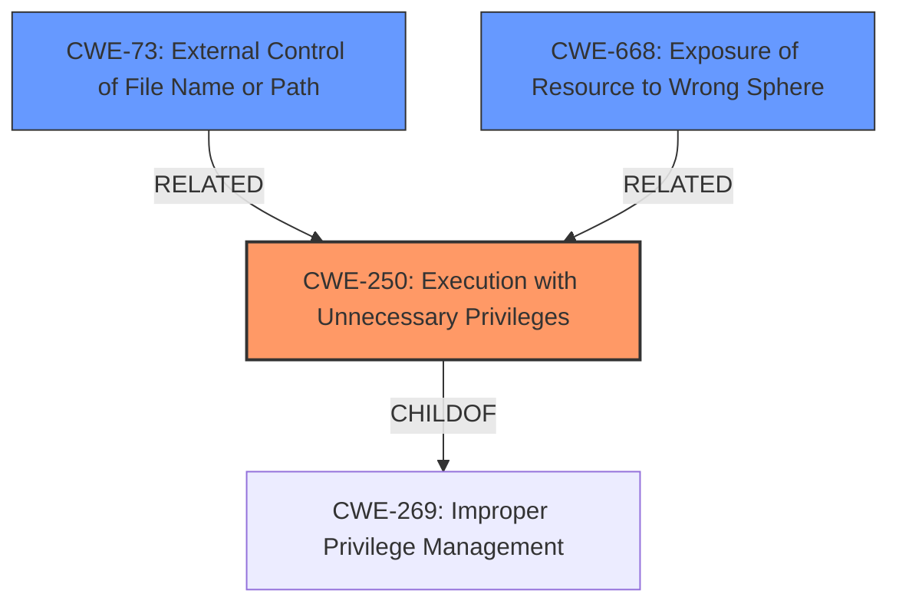

# Analysis for CVE-2020-27518

# Summary
| CWE ID | CWE Name | Confidence | CWE Abstraction Level | CWE Vulnerability Mapping Label | CWE-Vulnerability Mapping Notes |
|---|---|---|---|---|---|
| CWE-250 | Execution with Unnecessary Privileges | 0.9 | Base | Allowed | Primary CWE |
| CWE-73 | External Control of File Name or Path | 0.7 | Base | Allowed | Secondary Candidate |
| CWE-668 | Exposure of Resource to Wrong Sphere | 0.6 | Class | Discouraged | Secondary Candidate |

## Evidence and Confidence

*   **Confidence Score:** 0.8
*   **Evidence Strength:** HIGH

## Relationship Analysis
The primary CWE, CWE-250 (Execution with Unnecessary Privileges), is a base-level CWE. It is a child of CWE-269 (Improper Privilege Management), which is a class-level CWE. While CWE-269 is related, CWE-250 provides a more specific description of the vulnerability. CWE-73 is related to the path manipulation aspect of the vulnerability, where a user can control the path of the OpenVPN configuration file. However, it is not the primary cause of the vulnerability. CWE-668 (Exposure of Resource to Wrong Sphere) is a class-level CWE and is too broad for this specific vulnerability.

## Vulnerability Chain
The vulnerability chain starts with the **unnecessary privileges** granted to the OpenVPN executable. This allows the execution of user-supplied configuration files without proper validation (CWE-250). An attacker leverages the ability to control the file path through the openvpn options (CWE-73), ultimately leading to arbitrary code execution with elevated privileges as root/SYSTEM. The chain can be represented as:

`CWE-250` -> `CWE-73` -> `Privilege Escalation / Arbitrary Code Execution`

## Summary of Analysis
The initial assessment focused on the **local privilege escalation** caused by the WindscribeService component. The core issue is that the OpenVPN executable runs with SYSTEM privileges, allowing a low-privilege user to **execute code as root/SYSTEM** by specifying custom OpenVPN configuration files.

The evidence from the vulnerability description and the CVE reference summary strongly supports CWE-250 (Execution with Unnecessary Privileges) as the primary CWE. The Windscribe VPN application allows users to specify custom OpenVPN configuration files, which are then processed by an OpenVPN executable that runs with SYSTEM privileges. This aligns perfectly with the CWE-250 description: "The product performs an operation at a privilege level that is higher than the minimum level required."

CWE-73 (External Control of File Name or Path) was considered as a secondary factor because the vulnerability involves user-controlled OpenVPN configuration files. However, the core issue is not merely the ability to control the file path, but the combination of this control with the excessive privileges granted to the OpenVPN executable.
CWE-668 (Exposure of Resource to Wrong Sphere) was considered but deemed too abstract. While the vulnerability does involve exposing a resource (the OpenVPN executable) to the wrong control sphere (user-supplied configuration files), CWE-250 provides a more precise description of the root cause.

The final selection of CWE-250 is at the optimal level of specificity because it directly addresses the root cause of the vulnerability: the execution of the OpenVPN executable with unnecessary SYSTEM privileges. This unnecessary privilege level creates the opportunity for a low-privilege user to escalate their privileges by exploiting OpenVPN configuration options.

Relevant CWE Information:

# Enhanced Context (25 CWEs)

## CWE-59: Improper Link Resolution Before File Access ('Link Following')
**Abstraction Level**: Base
**Similarity Score**: 0.82
**Source**: dense

**Description**:
The product attempts to access a file based on the filename, but it does not properly prevent that filename from identifying a link or shortcut that resolves to an unintended resource.

**Mapping Guidance**:
- Usage: Allowed
- Rationale: This CWE entry is at the Base level of abstraction, which is a preferred level of abstraction for mapping to the root causes of vulnerabilities.

## CWE-41: Improper Resolution of Path Equivalence
**Abstraction Level**: Base
**Similarity Score**: 0.79
**Source**: dense

**Description**:
The product is vulnerable to file system contents disclosure through path equivalence. Path equivalence involves the use of special characters in file and directory names. The associated manipulations are intended to generate multiple names for the same object.

**Mapping Guidance**:
- Usage: Allowed
- Rationale: This CWE entry is at the Base level of abstraction, which is a preferred level of abstraction for mapping to the root causes of vulnerabilities.

## CWE-61: UNIX Symbolic Link (Symlink) Following
**Abstraction Level**: Compound
**Similarity Score**: 0.78
**Source**: dense

**Description**:
The product, when opening a file or directory, does not sufficiently account for when the file is a symbolic link that resolves to a target outside of the intended control sphere. This could allow an attacker to cause the product to operate on unauthorized files.

**Mapping Guidance**:
- Usage: Allowed
- Rationale: This is a well-known Composite of multiple weaknesses that must all occur simultaneously, although it is attack-oriented in nature.

## CWE-73: External Control of File Name or Path
**Abstraction Level**: Base
**Similarity Score**: 0.77
**Source**: dense

**Description**:
The product allows user input to control or influence paths or file names that are used in filesystem operations.

**Mapping Guidance**:
- Usage: Allowed
- Rationale: This CWE entry is at the Base level of abstraction, which is a preferred level of abstraction for mapping to the root causes of vulnerabilities.

## CWE-23: Relative Path Traversal
**Abstraction Level**: Base
**Similarity Score**: 0.77
**Source**: dense

**Description**:
The product uses external input to construct a pathname that should be within a restricted directory, but it does not properly neutralize sequences such as ".." that can resolve to a location that is outside of that directory.

**Mapping Guidance**:
- Usage: Allowed
- Rationale: This CWE entry is at the Base level of abstraction, which is a preferred level of abstraction for mapping to the root causes of vulnerabilities.

## CWE-427: Uncontrolled Search Path Element
**Abstraction Level**: Base
**Similarity Score**: 0.77
**Source**: dense

**Description**:
The product uses a fixed or controlled search path to find resources, but one or more locations in that path can be under the control of unintended actors.

**Mapping Guidance**:
- Usage: Allowed
- Rationale: This CWE entry is at the Base level of abstraction, which is a preferred level of abstraction for mapping to the root causes of vulnerabilities.

## CWE-668: Exposure of Resource to Wrong Sphere
**Abstraction Level**: Class
**Similarity Score**: 0.76
**Source**: dense

**Description**:
The product exposes a resource to the wrong control sphere, providing unintended actors with inappropriate access to the resource.

**Mapping Guidance**:
- Usage: Discouraged
- Rationale: CWE-668 is high-level and is often misused as a catch-all when lower-level CWE IDs might be applicable. It is sometimes used for low-information vulnerability reports [REF-1287]. It is a level-1 Class (i.e., a child of a Pillar). It is not useful for trend analysis.

## CWE-1289: Improper Validation of Unsafe Equivalence in Input
**Abstraction Level**: Base
**Similarity Score**: 0.75
**Source**: dense

**Description**:
The product receives an input value that is used as a resource identifier or other type of reference, but it does not validate or incorrectly validates that the input is equivalent to a potentially-unsafe value.

**Mapping Guidance**:
- Usage: Allowed
- Rationale: This CWE entry is at the Base level of abstraction, which is a preferred level of abstraction for mapping to the root causes of vulnerabilities.

## CWE-184: Incomplete List of Disallowed Inputs
**Abstraction Level**: Base
**Similarity Score**: 0.75
**Source**: dense

**Description**:
The product implements a protection mechanism that relies on a list of inputs (or properties of inputs) that are not allowed by policy or otherwise require other action to neutralize before additional processing takes place,