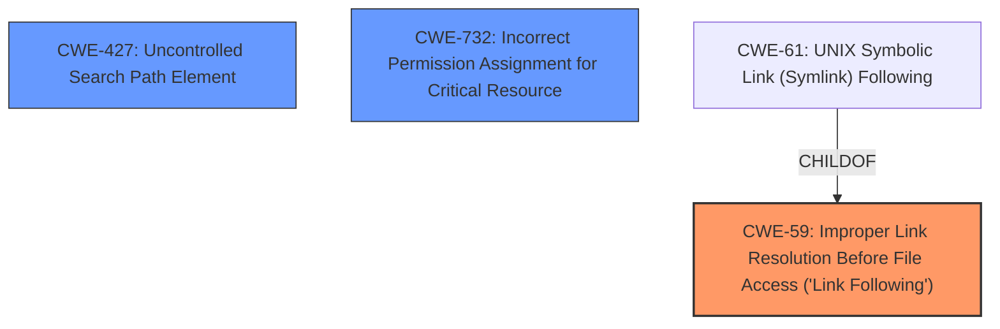

# Raw Analyzer Response for CVE-2020-27697

# Summary
| CWE ID | CWE Name | Confidence | CWE Abstraction Level | CWE Vulnerability Mapping Label | CWE-Vulnerability Mapping Notes |
|---|---|---|---|---|---|
| CWE-59 | Improper Link Resolution Before File Access ('Link Following') | 0.9 | Base | Allowed | Primary CWE |
| CWE-427 | Uncontrolled Search Path Element | 0.7 | Base | Allowed | Secondary Candidate |
| CWE-732 | Incorrect Permission Assignment for Critical Resource | 0.6 | Class | Allowed-with-Review | Secondary Candidate |

## Evidence and Confidence

*   **Confidence Score:** 0.8
*   **Evidence Strength:** HIGH

## Relationship Analysis
The primary CWE is CWE-59, "Improper Link Resolution Before File Access," which is a Base level CWE. CWE-61, "UNIX Symbolic Link (Symlink) Following," is a Compound CWE that requires CWE-59 as a prerequisite, along with other weaknesses. The vulnerability description indicates a symlink attack, making CWE-59 a relevant choice. CWE-427 is a peer of CWE-426. The retriever results listed CWE-59, CWE-427, and CWE-732 as possible candidates.

## Vulnerability Chain
The vulnerability chain begins with a **symlink attack** where a malicious DLL is placed in a non-protected location. This leads to the **improper link resolution** and ultimately results in the attacker **obtaining administrative privileges**.

## Summary of Analysis
The initial assessment identified CWE-59 as the primary candidate based on the vulnerability description referencing a **symlink attack**. The retriever results also support this choice. The vulnerability description states that a **malicious DLL can be placed in a non-protected location with high privileges (symlink attack) which can lead to obtaining administrative privileges during the installation of the product.** The reference links content summary supports this, stating that **the installer package is susceptible to a symlink attack** and that successful exploitation can lead to obtaining administrative privileges. CWE-59 is at the Base level of abstraction, which is preferred.

CWE-427, "Uncontrolled Search Path Element," was considered because the malicious DLL is placed in a non-protected location. However, the core issue is the symlink, making CWE-59 a more direct fit. CWE-427 is still a possibility because the non-protected location could be part of the search path.

CWE-732, "Incorrect Permission Assignment for Critical Resource" was also considered because the malicious DLL is placed in a non-protected location with high privileges. However, the primary issue is the symlink, not the permission assignment, although incorrect permissions could exacerbate the problem.

Ultimately, CWE-59 is the most appropriate because it directly addresses the **improper link resolution** caused by the **symlink attack**.

Relevant CWE Information:

# Enhanced Context (25 CWEs)
The following CWEs were identified as potentially relevant to this vulnerability:

## CWE-59: Improper Link Resolution Before File Access ('Link Following')
**Abstraction Level**: Base
**Similarity Score**: 0.77
**Source**: dense

**Description**:
The product attempts to access a file based on the filename, but it does not properly prevent that filename from identifying a link or shortcut that resolves to an unintended resource.

**Mapping Guidance**:
- Usage: Allowed
- Rationale: This CWE entry is at the Base level of abstraction, which is a preferred level of abstraction for mapping to the root causes of vulnerabilities.

**Technical Explanation for CWE-59:**
The Trend Micro Security 2020 installer package is vulnerable because it doesn't properly validate or handle symbolic links. An attacker can place a malicious DLL, create a symlink pointing to it, and when the installer attempts to access a legitimate file, it instead follows the symlink to the malicious DLL. This allows the attacker to execute arbitrary code with the privileges of the installer, leading to administrative privilege escalation. The security implication is complete system compromise. This is the primary weakness because it directly describes the root cause of the vulnerability.

## CWE-427: Uncontrolled Search Path Element
**Abstraction Level**: Base
**Similarity Score**: 8136.66
**Source**: sparse

**Description**:
The product uses a fixed or controlled search path to find resources, but one or more locations in that path can be under the control of unintended actors.

**Mapping Guidance**:
- Usage: Allowed
- Rationale: This CWE entry is at the Base level of abstraction, which is a preferred level of abstraction for mapping to the root causes of vulnerabilities.

**Technical Explanation for CWE-427:**
While the vulnerability description focuses on the symlink attack, a secondary aspect involves placing the malicious DLL in a "non-protected location with high privileges." This could potentially mean that the installer uses a search path that includes this location, allowing the malicious DLL to be loaded instead of the intended one. In that case, CWE-427 is relevant. The security implication is arbitrary code execution with the privileges of the installer.

## CWE-732: Incorrect Permission Assignment for Critical Resource
**Abstraction Level**: Class
**Similarity Score**: 0.101
**Source**: sparse

**Description**:
The product specifies permissions for a security-critical resource in a way that allows that resource to be read or modified by unintended actors.

**Mapping Guidance**:
- Usage: Allowed-with-Review
- Rationale: While the name itself indicates an assignment of permissions for resources, this is often misused for vulnerabilities in which "permissions" are not checked, which is an "authorization" weakness (CWE-285 or descendants) within CWE's model [REF-1287].

**Technical Explanation for CWE-732:**
The description mentions placing the malicious DLL in a "non-protected location with high privileges." This suggests a potential issue with the permission settings of that location, allowing the attacker to place the DLL there. While this is a contributing factor, the core vulnerability is the symlink following, making CWE-59 more relevant. CWE-732 could be considered a secondary weakness that enables the attack. The security implication is that the attacker can modify critical resources, in this case, placing the malicious DLL.

## Other CWEs Considered:
- **CWE-61: UNIX Symbolic Link (Symlink) Following:** While highly related, this is a Compound CWE. The evidence supports the base case of improper link resolution (CWE-59) without necessarily requiring all conditions of the compound.
- **CWE-250: Execution with Unnecessary Privileges**: Not applicable as the focus is not on unnecessary privileges during execution but rather on the symlink resolution itself.
- **CWE-798: Use of Hard-coded Credentials**: Not relevant to the vulnerability description.
- **CWE-287: Improper Authentication**: Not applicable as the vulnerability is not related to authentication.
- **CWE-347: Improper Verification of Cryptographic Signature**: Not relevant as cryptographic signatures are not mentioned.