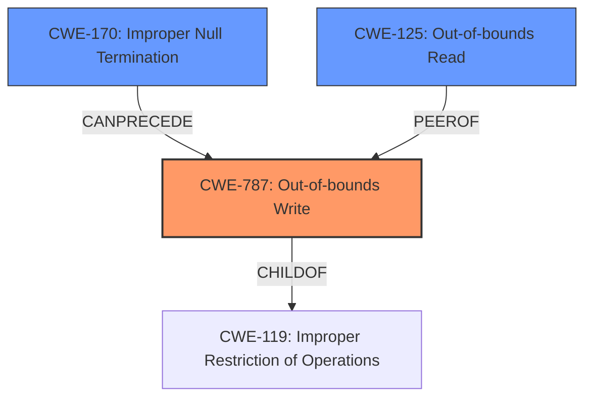

# Analysis for CVE-2020-27736

# Summary
| CWE ID  | CWE Name                                                                  | Confidence | CWE Abstraction Level | CWE Vulnerability Mapping Label | CWE-Vulnerability Mapping Notes |
| :-------- | :------------------------------------------------------------------------ | :--------- | :---------------------- | :------------------------------ | :-------------------------------- |
| CWE-787 | Out-of-bounds Write                                                       | 0.95       | Base                    | Primary CWE                     | Allowed                           |
| CWE-170 | Improper Null Termination                                                 | 0.75       | Base                    | Secondary Candidate             | Allowed                           |
| CWE-125 | Out-of-bounds Read                                                        | 0.60       | Base                    | Secondary Candidate             | Allowed                           |

## Evidence and Confidence

*   **Confidence Score:** 0.85
*   **Evidence Strength:** HIGH

## Relationship Analysis
The primary relationship is that CWE-787 **Out-of-bounds Write** is a child of CWE-119 **Improper Restriction of Operations within the Bounds of a Memory Buffer**. CWE-170 **Improper Null Termination** can precede CWE-787 in a vulnerability chain, as the lack of proper null termination can lead to writing beyond the intended buffer. CWE-125 **Out-of-bounds Read** is a peer of CWE-787, representing a similar memory safety issue but involving reading instead of writing. These relationships help to understand how the vulnerability arises and its potential consequences.

## Vulnerability Chain
The vulnerability chain starts with **improper validation** of the null-terminated name in DNS responses. This **lack of validation** leads to the potential for an **out-of-bounds read**, and because the code continues to process data based on the invalid name, it results in an **out-of-bounds write** condition when parsing the malformed DNS response. This can then lead to a denial-of-service condition or a memory leak as a result of reading memory outside of the intended buffer.

## Summary of Analysis
The initial assessment strongly indicates that the primary weakness is CWE-787 **Out-of-bounds Write**, due to the description stating that parsing malformed responses can result in a read past the end of an allocated structure. The **root cause** is the **DNS domain name label parsing functionality that does not properly validate the null-terminated name in DNS-responses**.

The Retriever results also list CWE-787 and CWE-170, and CWE-125 as potential candidates, reinforcing the assessment. The final decision is primarily based on the vulnerability description and the CVE Reference Links Content Summary.

CWE-787 is selected as the primary CWE because the description explicitly mentions a "**read past the end of an allocated structure**," which directly leads to an out-of-bounds write when the system attempts to write data based on the incorrect read.

CWE-170 is considered a secondary CWE because the **improper validation** of the null-terminated name is the **root cause** that allows the out-of-bounds write to occur.

CWE-125 is also considered because the description includes the phrase "read past the end of an allocated structure". This is a valid candidate since the read operation is what triggers the vulnerability.

The selected CWEs are at the optimal level of specificity because they accurately represent the **root cause** (CWE-170) and the direct consequence (CWE-787, CWE-125) of the vulnerability. These CWEs are base level, which is the preferred level of abstraction.

Relevant CWE Information:

# Enhanced Context (25 CWEs)

## CWE-99: Improper Control of Resource Identifiers ('Resource Injection')
**Abstraction Level**: Class
**Similarity Score**: 0.74
**Source**: dense

**Description**:
The product receives input from an upstream component, but it does not restrict or incorrectly restricts the input before it is used as an identifier for a resource that may be outside the intended sphere of control.

**Mapping Guidance**:
- Usage: Allowed-with-Review
- Rationale: This CWE entry is a Class and might have Base-level children that would be more appropriate

*Not Selected:* While the vulnerability involves DNS responses, it is more about memory safety than resource identifier control.

## CWE-74: Improper Neutralization of Special Elements in Output Used by a Downstream Component ('Injection')
**Abstraction Level**: Class
**Similarity Score**: 0.73
**Source**: dense

**Description**:
The product constructs all or part of a command, data structure, or record using externally-influenced input from an upstream component, but it does not neutralize or incorrectly neutralizes special elements that could modify how it is parsed or interpreted when it is sent to a downstream component.

**Mapping Guidance**:
- Usage: Discouraged
- Rationale: CWE-74 is high-level and often misused when lower-level weaknesses are more appropriate.

*Not Selected:* This CWE is too broad and doesn't specifically address the memory safety issues.

## CWE-226: Sensitive Information in Resource Not Removed Before Reuse
**Abstraction Level**: Base
**Similarity Score**: 0.73
**Source**: dense

**Description**:
The product releases a resource such as memory or a file so that it can be made available for reuse, but it does not clear or "zeroize" the information contained in the resource before the product performs a critical state transition or makes the resource available for reuse by other entities.

**Mapping Guidance**:
- Usage: Allowed
- Rationale: This CWE entry is at the Base level of abstraction, which is a preferred level of abstraction for mapping to the root causes of vulnerabilities.

*Not Selected:* This vulnerability is about parsing DNS responses, not about reusing resources.

## CWE-405: Asymmetric Resource Consumption (Amplification)
**Abstraction Level**: Class
**Similarity Score**: 0.72
**Source**: dense

**Description**:
The product does not properly control situations in which an adversary can cause the product to consume or produce excessive resources without requiring the adversary to invest equivalent work or otherwise prove authorization, i.e., the adversary's influence is "asymmetric."

**Mapping Guidance**:
- Usage: Allowed-with-Review
- Rationale: This CWE entry is a Class and might have Base-level children that would be more appropriate

*Not Selected:* The primary issue is not about resource consumption, but about memory corruption due to improper validation.

## CWE-1289: Improper Validation of Unsafe Equivalence in Input
**Abstraction Level**: Base
**Similarity Score**: 0.72
**Source**: dense

**Description**:
The product receives an input value that is used as a resource identifier or other type of reference, but it does not validate or incorrectly validates that the input is equivalent to a potentially-unsafe value.

**Mapping Guidance**:
- Usage: Allowed
- Rationale: This CWE entry is at the Base level of abstraction, which is a preferred level of abstraction for mapping to the root causes of vulnerabilities.

*Not Selected:* While the vulnerability involves improper validation, it specifically involves null termination, making CWE-170 a better fit.

## CWE-691: Insufficient Control Flow Management
**Abstraction Level**: Pillar
**Similarity Score**: 0.72
**Source**: dense

**Description**:
The code does not sufficiently manage its control flow during execution, creating conditions in which the control flow can be modified in unexpected ways.

**Mapping Guidance**:
- Usage: Discouraged
- Rationale: This CWE entry is extremely high-level, a Pillar. However, classification research is limited for weaknesses of this type, so there can be gaps or organizational difficulties within CWE that force use of this weakness, even at such a high level of abstraction.

*Not Selected:* This is too high-level and doesn't capture the specific nature of the vulnerability.

## CWE-664: Improper Control of a Resource Through its Lifetime
**Abstraction Level**: Pillar
**Similarity Score**: 0.72
**Source**: dense

**Description**:
The product does not maintain or incorrectly maintains control over a resource throughout its lifetime of creation, use, and release.

**Mapping Guidance**:
- Usage: Discouraged
- Rationale: This CWE entry is high-level when lower-level children are available.

*Not Selected:* Too high-level; the issue is more specific to null termination and memory safety.

## CWE-