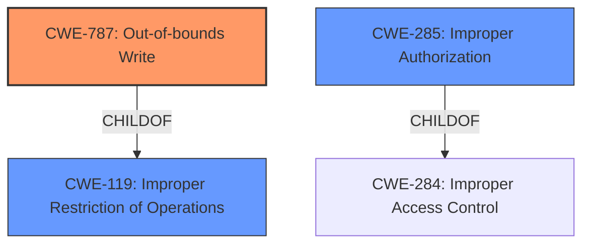

# Analysis for CVE-2020-27779

# Summary
| CWE ID | CWE Name | Confidence | CWE Abstraction Level | CWE Vulnerability Mapping Label | CWE-Vulnerability Mapping Notes |
|---|---|---|---|---|---|
| CWE-787 | Out-of-bounds Write | 0.9 | Base | Allowed | Primary CWE |
| CWE-285 | Improper Authorization | 0.7 | Class | Discouraged | Secondary Candidate |
| CWE-119 | Improper Restriction of Operations within the Bounds of a Memory Buffer | 0.6 | Class | Discouraged | Secondary Candidate |

## Evidence and Confidence

*   **Confidence Score:** 0.8
*   **Evidence Strength:** HIGH

## Relationship Analysis
The primary weakness is an Out-of-bounds Write (CWE-787), which is a child of Improper Restriction of Operations within the Bounds of a Memory Buffer (CWE-119). CWE-787 is selected because it is a base level CWE which is more specific than CWE-119, which is a class level CWE. The **cutmem command does not honor secure boot locking** (root cause) allowing a privileged attacker to remove address ranges from memory creating an opportunity to circumvent SecureBoot protections after proper triage about grubs memory layout. This leads to the ability to circumvent secure boot, which is an Improper Authorization (CWE-285). The relationship that influenced the selection was the parent-child relationship between CWE-787 and CWE-119 and the parent relationship between CWE-285 and CWE-284.

## Vulnerability Chain
The vulnerability chain starts with the **cutmem command does not honor secure boot locking** (root cause), which allows an attacker to remove memory ranges. This leads to an Out-of-bounds Write (CWE-787) and ultimately allows the attacker to circumvent SecureBoot protections, resulting in Improper Authorization (CWE-285).

## Summary of Analysis
Initially, several CWEs were considered based on the retriever results, including CWE-285 (Improper Authorization) and CWE-119 (Improper Restriction of Operations within the Bounds of a Memory Buffer). However, based on the evidence that **the cutmem command does not honor secure boot locking**, allowing an attacker to remove address ranges from memory, the most specific root cause is an Out-of-bounds Write (CWE-787). This is because the attacker is writing outside of the intended memory boundaries by using the `cutmem` command to remove protected memory regions.

The evidence supports this decision: "The `cutmem` command does not properly enforce Secure Boot locking. This means that even when Secure Boot is enabled, an attacker can use `cutmem` to remove address ranges from memory." This directly indicates a memory manipulation issue, making CWE-787 the most accurate and specific classification.

CWE-285 (Improper Authorization) is a relevant secondary weakness, as the ultimate goal of the attack is to circumvent Secure Boot protections. However, CWE-787 represents the direct technical flaw that enables this bypass.

CWE-119 is a parent of CWE-787, it is less specific.

The selected CWEs are at the optimal level of specificity, with CWE-787 representing the base cause and CWE-285 representing the resulting impact of circumventing secure boot.

Relevant CWE Information:

# Enhanced Context (25 CWEs)
The following CWEs were identified as potentially relevant to this vulnerability:

## CWE-226: Sensitive Information in Resource Not Removed Before Reuse
**Abstraction Level**: Base
**Similarity Score**: 0.78
**Source**: dense

**Description**:
The product releases a resource such as memory or a file so that it can be made available for reuse, but it does not clear or "zeroize" the information contained in the resource before the product performs a critical state transition or makes the resource available for reuse by other entities.

**Mapping Guidance**:
- Usage: Allowed
- Rationale: This CWE entry is at the Base level of abstraction, which is a preferred level of abstraction for mapping to the root causes of vulnerabilities.

## CWE-404: Improper Resource Shutdown or Release
**Abstraction Level**: Class
**Similarity Score**: 0.78
**Source**: dense

**Description**:
The product does not release or incorrectly releases a resource before it is made available for re-use.

**Mapping Guidance**:
- Usage: Allowed-with-Review
- Rationale: This CWE entry is a Class and might have Base-level children that would be more appropriate

## CWE-667: Improper Locking
**Abstraction Level**: Class
**Similarity Score**: 0.78
**Source**: dense

**Description**:
The product does not properly acquire or release a lock on a resource, leading to unexpected resource state changes and behaviors.

**Mapping Guidance**:
- Usage: Allowed-with-Review
- Rationale: This CWE entry is a Class and might have Base-level children that would be more appropriate

## CWE-909: Missing Initialization of Resource
**Abstraction Level**: Class
**Similarity Score**: 0.75
**Source**: dense

**Description**:
The product does not initialize a critical resource.

**Mapping Guidance**:
- Usage: Allowed-with-Review
- Rationale: This CWE entry is a Class and might have Base-level children that would be more appropriate

## CWE-665: Improper Initialization
**Abstraction Level**: Class
**Similarity Score**: 0.75
**Source**: dense

**Description**:
The product does not initialize or incorrectly initializes a resource, which might leave the resource in an unexpected state when it is accessed or used.

**Mapping Guidance**:
- Usage: Discouraged
- Rationale: This CWE entry is a level-1 Class (i.e., a child of a Pillar). It might have lower-level children that would be more appropriate

## CWE-703: Improper Check or Handling of Exceptional Conditions
**Abstraction Level**: Pillar
**Similarity Score**: 0.74
**Source**: dense

**Description**:
The product does not properly anticipate or handle exceptional conditions that rarely occur during normal operation of the product.

**Mapping Guidance**:
- Usage: Discouraged
- Rationale: This CWE entry is extremely high-level, a Pillar.

## CWE-754: Improper Check for Unusual or Exceptional Conditions
**Abstraction Level**: Class
**Similarity Score**: 0.74
**Source**: dense

**Description**:
The product does not check or incorrectly checks for unusual or exceptional conditions that are not expected to occur frequently during day to day operation of the product.

**Mapping Guidance**:
- Usage: Allowed-with-Review
- Rationale: This CWE entry is a Class and might have Base-level children that would be more appropriate

## CWE-131: Incorrect Calculation of Buffer Size
**Abstraction Level**: Base
**Similarity Score**: 0.74
**Source**: dense

**Description**:
The product does not correctly calculate the size to be used when allocating a buffer, which could lead to a buffer overflow.

**Mapping Guidance**:
- Usage: Allowed
- Rationale: This CWE entry is at the Base level of abstraction, which is a preferred level of abstraction for mapping to the root causes of vulnerabilities.

## CWE-274: Improper Handling of Insufficient Privileges
**Abstraction Level**: Base
**Similarity Score**: 0.74
**Source**: dense

**Description**:
The product does not handle or incorrectly handles when it has insufficient privileges to perform an operation, leading to resultant weaknesses.

**Mapping Guidance**:
- Usage: Discouraged
- Rationale: This CWE entry could be deprecated in a future version of CWE.

## CWE-212: Improper Removal of Sensitive Information Before Storage or Transfer
**Abstraction Level**: Base
**Similarity Score**: 0.74
**Source**: dense

**Description**:
The product stores, transfers, or shares a resource that contains sensitive information, but it does not properly remove that information before the product makes the resource available to unauthorized actors.

**Mapping Guidance**:
- Usage: Allowed
- Rationale: This CWE entry is at the Base level of abstraction, which is a preferred level of abstraction for mapping to the root causes of vulnerabilities.

## CWE-367: Time-of-check Time-of-use (TOCTOU) Race Condition
**Abstraction Level**: Base
**Similarity Score**: 6251.64
**Source**: sparse

**Description**: