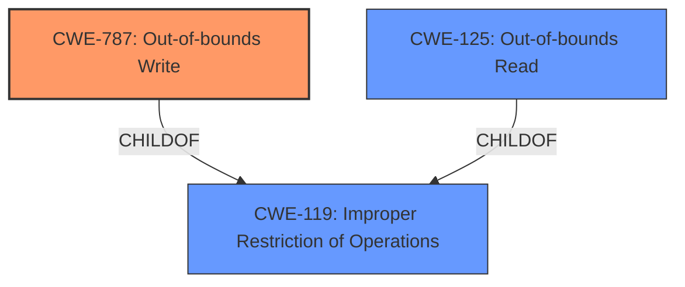

# Analysis for CVE-2020-27815

# Summary
| CWE ID | CWE Name | Confidence | CWE Abstraction Level | CWE Vulnerability Mapping Label | CWE-Vulnerability Mapping Notes |
|---|---|---|---|---|---|
| CWE-787 | Out-of-bounds Write | 0.9 | Base | Allowed | Primary CWE |
| CWE-125 | Out-of-bounds Read | 0.7 | Base | Allowed | Secondary Candidate |
| CWE-119 | Improper Restriction of Operations within the Bounds of a Memory Buffer | 0.6 | Class | Discouraged | Secondary Candidate |

## Evidence and Confidence

*   **Confidence Score:** 0.8
*   **Evidence Strength:** HIGH

## Relationship Analysis
The primary CWE is CWE-787 (**Out-of-bounds Write**), a **Base** level CWE. It is a child of CWE-119 (**Improper Restriction of Operations within the Bounds of a Memory Buffer**), which is a **Class** level CWE. CWE-125 (**Out-of-bounds Read**) is also a child of CWE-119. The vulnerability involves writing data beyond the intended buffer, which aligns with CWE-787. Given that the vulnerability description and CVE Reference Links Content Summary explicitly mention an "array-index-out-of-bounds" issue and the possibility of system crashing due to out-of-bounds access, **CWE-787** is selected as the primary root cause. CWE-119 is the more generic parent, while CWE-125 might be a consequence if the attacker tries to read memory outside the buffer.

## Vulnerability Chain
The vulnerability chain starts with an **incorrect size check** or the use of different size structures, leading to an **array-index-out-of-bounds** condition. This allows a local attacker with the ability to set extended attributes to trigger an **out-of-bounds write**, potentially causing **memory corruption** and **escalating privileges**, ultimately resulting in a denial of service or system crash.

## Summary of Analysis
The initial assessment identified **CWE-787 (Out-of-bounds Write)** as the primary candidate due to the vulnerability description highlighting memory corruption and the CVE Reference Links Content Summary explicitly stating an "array-index-out-of-bounds" condition. The selection is also supported by the Retriever Results, where CWE-787 is the top-ranked CWE.

The vulnerability description states: "A flaw was found in the JFS filesystem code in the Linux Kernel which allows a local attacker with the ability to set extended attributes to panic the system, causing memory corruption or escalating privileges."
The CVE Reference Links Content Summary states: "The `dmt_stree` member, used in the `dbAdjTree` function, can refer to the `stree` array in either the `dmaptree` or `dmapctl` structure. These structures have different sizes for their `stree` member, leading to a potential array-index-out-of-bounds vulnerability if the smaller `dmaptree.stree` is accessed with an index intended for the larger `dmapctl.stree`."

This evidence strongly supports the selection of **CWE-787** as the primary CWE, because it directly leads to memory corruption through out-of-bounds write.

CWE-119 is a more general class of weakness. While applicable, it is less specific than CWE-787. CWE-125 (Out-of-bounds Read) could potentially occur as a consequence of the initial out-of-bounds access, but the primary issue is the write operation, making CWE-787 more accurate.

The selected CWEs are at the optimal level of specificity because **CWE-787** directly addresses the root cause of the vulnerability which is writing beyond the boundaries of a buffer.

Relevant CWE Information:

# Enhanced Context (25 CWEs)
The following CWEs were identified as potentially relevant to this vulnerability:

## CWE-367: Time-of-check Time-of-use (TOCTOU) Race Condition
**Abstraction Level**: Base
**Similarity Score**: 0.80
**Source**: dense

**Description**:
The product checks the state of a resource before using that resource, but the resource's state can change between the check and the use in a way that invalidates the results of the check. This can cause the product to perform invalid actions when the resource is in an unexpected state.

**Mapping Guidance**:
- Usage: Allowed
- Rationale: This CWE entry is at the Base level of abstraction, which is a preferred level of abstraction for mapping to the root causes of vulnerabilities.

## CWE-667: Improper Locking
**Abstraction Level**: Class
**Similarity Score**: 0.79
**Source**: dense

**Description**:
The product does not properly acquire or release a lock on a resource, leading to unexpected resource state changes and behaviors.

**Mapping Guidance**:
- Usage: Allowed-with-Review
- Rationale: This CWE entry is a Class and might have Base-level children that would be more appropriate

## CWE-362: Concurrent Execution using Shared Resource with Improper Synchronization ('Race Condition')
**Abstraction Level**: Class
**Similarity Score**: 0.79
**Source**: dense

**Description**:
The product contains a concurrent code sequence that requires temporary, exclusive access to a shared resource, but a timing window exists in which the shared resource can be modified by another code sequence operating concurrently.

**Mapping Guidance**:
- Usage: Allowed-with-Review
- Rationale: This CWE entry is a Class and might have Base-level children that would be more appropriate

## CWE-366: Race Condition within a Thread
**Abstraction Level**: Base
**Similarity Score**: 0.78
**Source**: dense

**Description**:
If two threads of execution use a resource simultaneously, there exists the possibility that resources may be used while invalid, in turn making the state of execution undefined.

**Mapping Guidance**:
- Usage: Allowed
- Rationale: This CWE entry is at the Base level of abstraction, which is a preferred level of abstraction for mapping to the root causes of vulnerabilities.

## CWE-404: Improper Resource Shutdown or Release
**Abstraction Level**: Class
**Similarity Score**: 0.78
**Source**: dense

**Description**:
The product does not release or incorrectly releases a resource before it is made available for re-use.

**Mapping Guidance**:
- Usage: Allowed-with-Review
- Rationale: This CWE entry is a Class and might have Base-level children that would be more appropriate

## CWE-125: Out-of-bounds Read
**Abstraction Level**: Base
**Similarity Score**: 0.77
**Source**: dense

**Description**:
The product reads data past the end, or before the beginning, of the intended buffer.

**Mapping Guidance**:
- Usage: Allowed
- Rationale: This CWE entry is at the Base level of abstraction, which is a preferred level of abstraction for mapping to the root causes of vulnerabilities.

## CWE-754: Improper Check for Unusual or Exceptional Conditions
**Abstraction Level**: Class
**Similarity Score**: 0.76
**Source**: dense

**Description**:
The product does not check or incorrectly checks for unusual or exceptional conditions that are not expected to occur frequently during day to day operation of the product.

**Mapping Guidance**:
- Usage: Allowed-with-Review
- Rationale: This CWE entry is a Class and might have Base-level children that would be more appropriate

## CWE-662: Improper Synchronization
**Abstraction Level**: Class
**Similarity Score**: 0.76
**Source**: dense

**Description**:
The product utilizes multiple threads or processes to allow temporary access to a shared resource that can only be exclusive to one process at a time, but it does not properly synchronize these actions, which might cause simultaneous accesses of this resource by multiple threads or processes.

**Mapping Guidance**:
- Usage: Discouraged
- Rationale: This CWE entry is a level-1 Class (i.e., a child of a Pillar). It might have lower-level children that would be more appropriate

## CWE-131: Incorrect Calculation of Buffer Size
**Abstraction Level**: Base
**Similarity Score**: 0.76
**Source**: dense

**Description**:
The product does not correctly calculate the size to be used when allocating a buffer, which could lead to a buffer overflow.

**Mapping Guidance**:
- Usage: Allowed
- Rationale: This CWE entry is at the Base level of abstraction