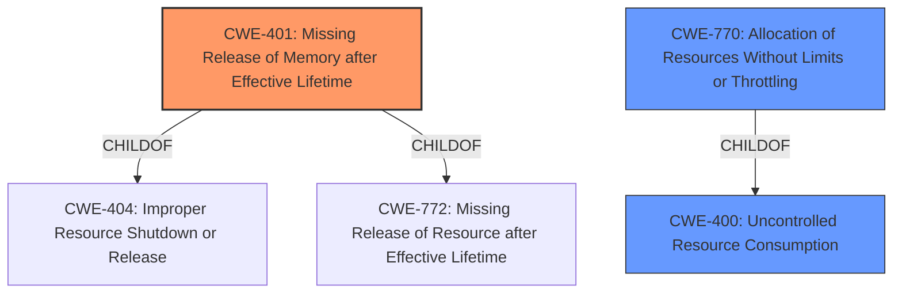

# Analysis Report for CVE-2020-27827

# Vulnerability Analysis Report: CVE-2020-27827

## Description


## Analysis (with Relationship Data)

# Summary
| CWE ID | CWE Name | Confidence | CWE Abstraction Level | CWE Vulnerability Mapping Label | CWE-Vulnerability Mapping Notes |
|---|---|---|---|---|---|
| CWE-401 | Missing Release of Memory after Effective Lifetime | 1.0 | Variant | Allowed | Primary CWE. The vulnerability involves a **memory leak** due to improper handling of TLVs, which directly corresponds to memory not being released after use. |
| CWE-770 | Allocation of Resources Without Limits or Throttling | 0.7 | Base | Allowed | Secondary CWE. The vulnerability involves the allocation of memory without proper control, leading to potential resource exhaustion. |
| CWE-400 | Uncontrolled Resource Consumption | 0.5 | Class | Discouraged | Secondary CWE. While the primary issue is a memory leak, the uncontrolled allocation of resources contributes to the overall problem of resource consumption. |

## Evidence and Confidence

*   **Confidence Score:** 0.9
*   **Evidence Strength:** HIGH

## Relationship Analysis
The primary CWE is CWE-401 (Missing Release of Memory after Effective Lifetime), which is a Variant of CWE-404 (Improper Resource Shutdown or Release) and CWE-772 (Missing Release of Resource after Effective Lifetime). CWE-770 (Allocation of Resources Without Limits or Throttling) is a Base CWE related to resource management, and it is a child of CWE-400 (Uncontrolled Resource Consumption). The relationship between these CWEs highlights the progression from a specific memory leak to a broader issue of resource management. Choosing CWE-401 provides a precise description of the **memory leak**, while CWE-770 and CWE-400 provide additional context regarding resource consumption.



## Vulnerability Chain
The chain of events is as follows:
1.  Specially crafted LLDP packets are received.
2.  Improper handling of optional TLVs leads to memory allocation.
3.  Memory is not released after use (**CWE-401**).
4.  Repeated occurrences lead to uncontrolled resource consumption (**CWE-770** and **CWE-400**).
5.  System availability is impacted, resulting in a denial of service.

## Summary of Analysis
The initial assessment focused on identifying the root cause of the vulnerability. The description clearly indicates a **memory leak** due to improper handling of TLVs in LLDP packets. The "CVE Reference Links Content Summary" confirms that a **memory leak** occurs due to improper handling of optional Type-Length-Value (TLV) fields within crafted LLDP packets. This directly aligns with CWE-401 (Missing Release of Memory after Effective Lifetime).

The retriever results also highlight CWE-401 as the top candidate. The relationship analysis further supports this choice, as CWE-401 is a Variant of CWE-404 and CWE-772, providing a more specific classification than the Class-level CWE-404.

CWE-770 (Allocation of Resources Without Limits or Throttling) and CWE-400 (Uncontrolled Resource Consumption) are considered secondary candidates because the allocation of memory without proper limits exacerbates the **memory leak**, leading to resource exhaustion.

The final decision is based on the evidence provided, the retriever results, and the hierarchical relationships between CWEs. CWE-401 is the most specific and accurate representation of the **memory leak** vulnerability.

Relevant CWE Information:

# Enhanced Context (25 CWEs)

## CWE-404: Improper Resource Shutdown or Release
**Abstraction Level**: Class
**Similarity Score**: 0.77
**Source**: dense

**Description**:
The product does not release or incorrectly releases a resource before it is made available for re-use.

**Mapping Guidance**:
- Usage: Allowed-with-Review
- Rationale: This CWE entry is a Class and might have Base-level children that would be more appropriate

## CWE-226: Sensitive Information in Resource Not Removed Before Reuse
**Abstraction Level**: Base
**Similarity Score**: 0.77
**Source**: dense

**Description**:
The product releases a resource such as memory or a file so that it can be made available for reuse, but it does not clear or "zeroize" the information contained in the resource before the product performs a critical state transition or makes the resource available for reuse by other entities.

**Mapping Guidance**:
- Usage: Allowed
- Rationale: This CWE entry is at the Base level of abstraction, which is a preferred level of abstraction for mapping to the root causes of vulnerabilities.

## CWE-664: Improper Control of a Resource Through its Lifetime
**Abstraction Level**: Pillar
**Similarity Score**: 0.75
**Source**: dense

**Description**:
The product does not maintain or incorrectly maintains control over a resource throughout its lifetime of creation, use, and release.

**Mapping Guidance**:
- Usage: Discouraged
- Rationale: This CWE entry is high-level when lower-level children are available.

## CWE-1325: Improperly Controlled Sequential Memory Allocation
**Abstraction Level**: Base
**Similarity Score**: 0.75
**Source**: dense

**Description**:
The product manages a group of objects or resources and performs a separate memory allocation for each object, but it does not properly limit the total amount of memory that is consumed by all of the combined objects.

**Mapping Guidance**:
- Usage: Allowed
- Rationale: This CWE entry is at the Base level of abstraction, which is a preferred level of abstraction for mapping to the root causes of vulnerabilities.

## CWE-789: Memory Allocation with Excessive Size Value
**Abstraction Level**: Variant
**Similarity Score**: 0.74
**Source**: dense

**Description**:
The product allocates memory based on an untrusted, large size value, but it does not ensure that the size is within expected limits, allowing arbitrary amounts of memory to be allocated.

**Mapping Guidance**:
- Usage: Allowed
- Rationale: This CWE entry is at the Variant level of abstraction, which is a preferred level of abstraction for mapping to the root causes of vulnerabilities.

## CWE-191: Integer Underflow (Wrap or Wraparound)
**Abstraction Level**: Base
**Similarity Score**: 0.74
**Source**: dense

**Description**:
The product subtracts one value from another, such that the result is less than the minimum allowable integer value, which produces a value that is not equal to the correct result.

**Mapping Guidance**:
- Usage: Allowed
- Rationale: This CWE entry is at the Base level of abstraction, which is a preferred level of abstraction for mapping to the root causes of vulnerabilities.

## CWE-754: Improper Check for Unusual or Exceptional Conditions
**Abstraction Level**: Class
**Similarity Score**: 0.74
**Source**: dense

**Description**:
The product does not check or incorrectly checks for unusual or exceptional conditions that are not expected to occur frequently during day to day operation of the product.

**Mapping Guidance**:
- Usage: Allowed-with-Review
- Rationale: This CWE entry is a Class and might have Base-level children that would be more appropriate

## CWE-667: Improper Locking
**Abstraction Level**: Class
**Similarity Score**: 0.74
**Source**: dense

**Description**:
The product does not properly acquire or release a lock on a resource, leading to unexpected resource state changes and behaviors.

**Mapping Guidance**:
- Usage: Allowed-with-Review
- Rationale: This CWE entry is a Class and might have Base-level children that would be more appropriate

## CWE-405: Asymmetric Resource Consumption (Amplification)
**Abstraction Level**: Class
**Similarity Score**: 0.73
**Source**: dense

**Description**:
The product does not properly control situations in which an adversary can cause the product to consume or produce excessive resources without requiring the adversary to invest equivalent work or otherwise prove authorization, i.e., the adversary's influence is "asymmetric."

**Mapping Guidance**:
- Usage: Allowed-with-Review
- Rationale: This CWE entry is a Class and might have Base-level children that would be more appropriate

## CWE-131: Incorrect Calculation of Buffer Size
**Abstraction Level**:


## CWE Relationship Analysis

Current CWEs represent these abstraction levels: .


### Vulnerability Chain Analysis

**Chain starting from CWE-754:**
- 754 (Improper Check for Unusual or Exceptional Conditions) - ROOT


**Chain starting from CWE-667:**
- 667 (Improper Locking) - ROOT


### CWE Relationship Diagram

```mermaid
graph TD
    classDef primary fill:#f96,stroke:#333,stroke-width:2px
    classDef secondary fill:#69f,stroke:#333
    classDef tertiary fill:#9e9,stroke:#333
```


*Report generated on 2025-04-02 07:41:39*
