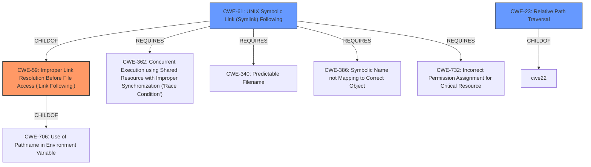

# Analysis for CVE-2020-27833

# Summary
| CWE ID | CWE Name | Confidence | CWE Abstraction Level | CWE Vulnerability Mapping Label | CWE-Vulnerability Mapping Notes |
|---|---|---|---|---|---|
| CWE-59 | Improper Link Resolution Before File Access ('Link Following') | 0.9 | Base | Allowed | Primary CWE |
| CWE-23 | Relative Path Traversal | 0.8 | Base | Allowed | Secondary Candidate |
| CWE-61 | UNIX Symbolic Link (Symlink) Following | 0.7 | Compound | Allowed | Secondary Candidate |

## Evidence and Confidence

*   **Confidence Score:** 0.9
*   **Evidence Strength:** HIGH

## Relationship Analysis
The primary CWE is CWE-59, which describes the core issue of improper handling of symbolic links. CWE-23, Relative Path Traversal, is a closely related weakness, especially since the vulnerability allows writing outside the intended directory. CWE-61, UNIX Symbolic Link (Symlink) Following, is a compound CWE that encompasses the elements that must occur simultaneously for the vulnerability to be exploited.

## Vulnerability Chain
The vulnerability chain starts with a specially crafted container image containing symbolic links. The `oc image extract` command **fails to properly resolve these links**, leading to **arbitrary file writes** outside the intended directory. This can then result in **overwriting executables or configuration files**, ultimately leading to **arbitrary code execution**.

## Summary of Analysis
The primary weakness is the **improper handling of symbolic links** (CWE-59) within the `oc image extract` command, which allows for writing files outside the intended directory. The vulnerability description clearly states that a crafted container image with symbolic links can be used to overwrite files, which aligns with the core concept of CWE-59. The "CVE Reference Links Content Summary" section further supports this by highlighting "Symbolic Link Handling: The vulnerability lies in how `oc image extract` handles symbolic links within a tar archive. It improperly validates the paths of symbolic links, allowing for links pointing outside the intended extraction directory." This evidence strongly supports the selection of CWE-59 as the primary CWE.

CWE-23 is a secondary consideration because the crafted image allows writing files outside the intended directory. However, the root cause is the **improper resolution of the symbolic links**, not the path traversal itself.

CWE-61, UNIX Symbolic Link (Symlink) Following, is also considered since it is a compound of multiple weaknesses that must occur simultaneously. However, mapping to the individual weaknesses that comprise CWE-61 is better.

The provided evidence clearly points to the improper handling of symbolic links as the root cause, making CWE-59 the most specific and appropriate classification.

Relevant CWE Information:

# Enhanced Context (25 CWEs)
The following CWEs were identified as potentially relevant to this vulnerability:

## CWE-59: Improper Link Resolution Before File Access ('Link Following')
**Abstraction Level**: Base
**Similarity Score**: 0.79
**Source**: dense

**Description**:
The product attempts to access a file based on the filename, but it does not properly prevent that filename from identifying a link or shortcut that resolves to an unintended resource.

**Mapping Guidance**:
- Usage: Allowed
- Rationale: This CWE entry is at the Base level of abstraction, which is a preferred level of abstraction for mapping to the root causes of vulnerabilities.

## CWE-23: Relative Path Traversal
**Abstraction Level**: Base
**Similarity Score**: 0.78
**Source**: dense

**Description**:
The product uses external input to construct a pathname that should be within a restricted directory, but it does not properly neutralize sequences such as ".." that can resolve to a location that is outside of that directory.

**Mapping Guidance**:
- Usage: Allowed
- Rationale: This CWE entry is at the Base level of abstraction, which is a preferred level of abstraction for mapping to the root causes of vulnerabilities.

## CWE-61: UNIX Symbolic Link (Symlink) Following
**Abstraction Level**: Compound
**Similarity Score**: 0.76
**Source**: dense

**Description**:
The product, when opening a file or directory, does not sufficiently account for when the file is a symbolic link that resolves to a target outside of the intended control sphere. This could allow an attacker to cause the product to operate on unauthorized files.

**Mapping Guidance**:
- Usage: Allowed
- Rationale: This is a well-known Composite of multiple weaknesses that must all occur simultaneously, although it is attack-oriented in nature.

# Enhanced Query for CVE-2020-27833

## Vulnerability Description
A **Zip Slip** vulnerability was found in the oc binary in openshift-clients where an arbitrary file write is achieved by using a specially crafted raw container image (.tar file) which contains symbolic links. The vulnerability is limited to the command `oc image extract`. If a symbolic link is first created pointing within the tarball, this allows further symbolic links to bypass the existing path check. This flaw allows the tarball to create links outside the tarballs parent directory, allowing for executables or configuration files to be overwritten, resulting in arbitrary code execution. The highest threat from this vulnerability is to confidentiality, integrity, as well as system availability. Versions up to and including openshift-clients-4.7.0-202104250659.p0.git.95881af are affected.

### Vulnerability Description Key Phrases
- **weakness:** **Zip Slip**
- **impact:** arbitrary file write
- **vector:** specially crafted raw container image (.tar file) which contains symbolic links
- **product:** oc binary in openshift-clients
- **version:** up to and including openshift-clients-4.7.0-202104250659.p0.git.95881af
- **component:** oc image extract

## CVE Reference Links Content Summary
Based on the provided content, here's an analysis of CVE-2020-27833:

**Root Cause of Vulnerability:**
The vulnerability stems from a flaw in the `oc image extract` command within the `openshift-clients` package. The command is susceptible to a "zip slip" vulnerability when extracting a specially crafted container image (.tar file).

**Weaknesses/Vulnerabilities Present:**
- **Symbolic Link Handling:** The vulnerability lies in how `oc image extract` handles symbolic links within a tar archive. It improperly validates the paths of symbolic links, allowing for links pointing outside the intended extraction directory.
- **Path Traversal:** The ability to create symbolic links pointing outside the intended extraction directory makes the system vulnerable to path traversal attacks, enabling writing to locations outside the expected directory.

**Impact of Exploitation:**
- **Arbitrary File Write:** By crafting a malicious container image with specific symbolic links, an attacker can overwrite existing files outside the target directory when the image is extracted with `oc image extract`.
- **Arbitrary Code Execution:** If an attacker can overwrite executable files or configuration files, it allows for arbitrary code execution on the system where the `oc` command is being used.
- **Confidentiality, Integrity, and Availability:** The vulnerability poses a significant threat to system confidentiality, integrity, and availability due to the potential for data manipulation and code execution.

**Attack Vectors:**
- **Malicious Container Image:** The primary attack vector is the delivery of a crafted container image containing malicious symbolic links.
- **`oc image extract` Command:** Exploitation is triggered when the vulnerable `oc image extract` command is used to extract the crafted image.

**Required Attacker Capabilities/Position:**
- **Ability to Craft Container Image:** Attackers need to be able to create a container image (.tar file) with specially crafted symbolic links to trigger the vulnerability.
- **Access to `oc` Tool:** The attacker needs to have access to a system where the `oc` command is available and used.
- **User Interaction:** The vulnerability is triggered when a user attempts to extract the crafted container image using the vulnerable command.
- **No Privilege Required:** The attacker does not require any special privileges to exploit the vulnerability.

**Additional Details:**
- The vulnerability is described as a "zip slip" type vulnerability, where attackers use symbolic links to escape the intended extraction directory.
- A mitigation for this is to use the `--only-files=true` option with `oc image extract`.
- This forces extraction of files/directories and ignores symbolic links, preventing malicious path traversal, albeit also preventing legitimate symbolic link extraction.
- The vulnerability was found in all versions of the `oc` binary within the `openshift-clients` package.
- The bug was closed with a status of WONTFIX

## Retriever Results

### Top Combined Results

| Rank | CWE ID | Name | Abstraction | Usage  | Retrievers | Individual Scores |
|------|--------|------|-------------|-------|------------|-------------------|
| 1 | 23 | Relative Path Traversal | Base | Allowed | alternate_terms | 1.000 |
| 2 | 59 | Improper Link Resolution Before File Access ('Link Following') | Base | Allowed | alternate_terms | 1.000 |
| 3 | 61 | UNIX Symbolic Link (Symlink) Following | Compound | Allowed | sparse | 0.753 |
| 4 | 22 | Improper Limitation of a Pathname to a Restricted Directory ('Path Traversal') | Base | Allowed | sparse | 0.656 |
| 5 | 62 | UNIX Hard Link | Variant | Allowed | sparse | 0.628 |
| 6 | 532 | Insertion of Sensitive Information into Log File | Base | Allowed | dense | 0.557 |
| 7 | 363 | Race Condition Enabling Link Following | Base | Allowed | graph | 0.002 |
| 8 | 732 | Incorrect Permission Assignment for Critical Resource | Class | Allowed-with-Review | sparse | 0.595 |
| 9 | 306 | Missing Authentication for Critical Function | Base | Allowed | sparse | 0.575 |
| 10 | 863 | Incorrect Authorization | Class | Allowed-with-Review | sparse | 0.565 |

# Complete CWE Specifications

## CWE-23: Relative Path Traversal
**Abstraction:** Base
**Status:** Draft

### Description
The product uses external input to construct a pathname that should be within a restricted directory, but it does not properly neutralize sequences such as ".." that can resolve to a location that is outside of that directory.

### Extended Description
This allows attackers to traverse the file system to access files or directories that are outside of the restricted directory.

### Alternative Terms
Zip Slip: "Zip slip" is an attack that uses file archives (e.g., ZIP, tar, rar, etc.) that contain filenames with path traversal sequences that cause the files to be written outside of the directory under which the archive is expected to be extracted [REF-1282]. It is most commonly used for relative path traversal (CWE-23) and link following (CWE-59).

### Relationships
ChildOf -> CWE-22
ChildOf -> CWE-22
ChildOf -> CWE-22

### Mapping Guidance
**Usage:** Allowed
**Rationale:** This CWE entry is at the Base level of abstraction, which is a preferred level of abstraction for mapping to the root causes of vulnerabilities.
**Comments:** Carefully read both the name and description to ensure that this mapping is an appropriate fit. Do not try to 'force' a mapping to a lower-level Base/Variant simply to comply with this preferred level of abstraction.
**Reasons:**
- Acceptable-Use

### Observed Examples
- **CVE-2024-37032:** Large language model (LLM) management tool does not validate the format of a digest value (CWE-1287) from a private, untrusted model registry, enabling relative path traversal (CWE-23), a.k.a. Probllama
- **CVE-2022-45918:** Chain: a learning management tool debugger uses external input to locate previous session logs (CWE-73) and does not properly validate the given path (CWE-20), allowing for filesystem path traversal using "../" sequences (CWE-24)
- **CVE-2019-20916:** Python package manager does not correctly restrict the filename specified in a Content-Disposition header, allowing arbitrary file read using path traversal sequences such as "../"

## CWE-59: Improper Link Resolution Before File Access ('Link Following')
**Abstraction:** Base
**Status:** Draft

### Description
The product attempts to access a file based on the filename, but it does not properly prevent that filename from identifying a link or shortcut that resolves to an unintended resource.

### Extended Description
Not provided

### Alternative Terms
insecure temporary file: Some people use the phrase "insecure temporary file" when referring to a link following weakness, but other weaknesses can produce insecure temporary files without any symlink involvement at all.
Zip Slip: "Zip slip" is an attack that uses file archives (e.g., ZIP, tar, rar, etc.) that contain filenames with path traversal sequences that cause the files to be written outside of the directory under which the archive is expected to be extracted [REF-1282]. It is most commonly used for relative path traversal (CWE-23) and link following (CWE-59).

### Relationships
ChildOf -> CWE-706
ChildOf -> CWE-706

### Mapping Guidance
**Usage:** Allowed
**Rationale:** This CWE entry is at the Base level of abstraction, which is a preferred level of abstraction for mapping to the root causes of vulnerabilities.
**Comments:** Carefully read both the name and description to ensure that this mapping is an appropriate fit. Do not try to 'force' a mapping to a lower-level Base/Variant simply to comply with this preferred level of abstraction.
**Reasons:**
- Acceptable-Use

### Additional Notes
**[Theoretical]** 

Link following vulnerabilities are Multi-factor Vulnerabilities (MFV). They are the combination of multiple elements: file or directory permissions, filename predictability, race conditions, and in some cases, a design limitation in which there is no mechanism for performing atomic file creation operations.

Some potential factors are race conditions, permissions, and predictability.

### Observed Examples
- **CVE-1999-1386:** Some versions of Perl follow symbolic links when running with the -e option, which allows local users to overwrite arbitrary files via a symlink attack.
- **CVE-2000-1178:** Text editor follows symbolic links when creating a rescue copy during an abnormal exit, which allows local users to overwrite the files of other users.
- **CVE-2004-0217:** Antivirus update allows local users to create or append to arbitrary files via a symlink attack on a logfile.

## CWE-61: UNIX Symbolic Link (Symlink) Following
**Abstraction:** Compound
**Status:** Incomplete

### Description
The product, when opening a file or directory, does not sufficiently account for when the file is a symbolic link that resolves to a target outside of the intended control sphere. This could allow an attacker to cause the product to operate on unauthorized files.

### Extended Description
A product that allows UNIX symbolic links (symlink) as part of paths whether in internal code or through user input can allow an attacker to spoof the symbolic link and traverse the file system to unintended locations or access arbitrary files. The symbolic link can permit an attacker to read/write/corrupt a file that they originally did not have permissions to access.

### Alternative Terms
Symlink following
symlink vulnerability

### Relationships
ChildOf -> CWE-59
Requires -> CWE-362
Requires -> CWE-340
Requires -> CWE-386
Requires -> CWE-732

### Mapping Guidance
**Usage:** Allowed
**Rationale:** This is a well-known Composite of multiple weaknesses that must all occur simultaneously, although it is attack-oriented in nature.
**Comments:** While attack-oriented composites are supported in CWE, they have not been a focus of research. There is a chance that future research or CWE scope clarifications will change or deprecate them. Perform root-cause analysis to determine which weaknesses allow symlink following to occur, and map to those weaknesses. For example, predictable file names might be intended functionality, but creation in a directory with insecure permissions might not.
**Reasons:**
- Other

### Additional Notes
**[Research Gap]** 

Symlink vulnerabilities are regularly found in C and shell programs, but all programming languages can have this problem. Even shell programs are probably under-reported.

"Second-order symlink vulnerabilities" may exist in programs that invoke other programs that follow symlinks. They are rarely reported but are likely to be fairly common when process invocation is used [REF-493].

### Observed Examples
- **CVE-1999-1386:** Some versions of Perl follow symbolic links when running with the -e option, which allows local users to overwrite arbitrary files via a symlink attack.
- **CVE-2000-1178:** Text editor follows symbolic links when creating a rescue copy during an abnormal exit, which allows local users to overwrite the files of other users.
- **CVE-2004-0217:** Antivirus update allows local users to create or append to arbitrary files via a symlink attack on a logfile.

## CWE-22: Improper Limitation of a Pathname to a Restricted Directory ('Path Traversal')
**Abstraction:** Base
**Status:** Stable

### Description
The product uses external input to construct a pathname that is intended to identify a file or directory that is located underneath a restricted parent directory, but the product does not properly neutralize special elements within the pathname that can cause the pathname to resolve to a location that is outside of the restricted directory.

### Extended Description

Many file operations are intended to take place within a restricted directory. By using special elements such as ".." and "/" separators, attackers can escape outside of the restricted location to access files or directories that are elsewhere on the system. One of the most common special elements is the "../" sequence, which in most modern operating systems is interpreted as the parent directory of the current location. This is referred to as relative path traversal. Path traversal also covers the use of absolute pathnames such as "/usr/local/bin" to access unexpected files. This is referred to as absolute path traversal.

### Alternative Terms
Directory traversal
Path traversal: "Path traversal" is preferred over "directory traversal," but both terms are attack-focused.

### Relationships
ChildOf -> CWE-706
ChildOf -> CWE-706
ChildOf -> CWE-668

### Mapping Guidance
**Usage:** Allowed
**Rationale:** This CWE entry is at the Base level of abstraction, which is a preferred level of abstraction for mapping to the root causes of vulnerabilities.
**Comments:** Carefully read both the name and description to ensure that this mapping is an appropriate fit. Do not try to 'force' a mapping to a lower-level Base/Variant simply to comply with this preferred level of abstraction.
**Reasons:**
- Acceptable-Use

### Additional Notes
**[Other]** In many programming languages, the injection of a null byte (the 0 or NUL) may allow an attacker to truncate a generated filename to apply to a wider range of files. For example, the product may add ".txt" to any pathname, thus limiting the attacker to text files, but a null injection may effectively remove this restriction.

**[Relationship]** Pathname equivalence can be regarded as a type of canonicalization error.

**[Relationship]** Some pathname equivalence issues are not directly related to directory traversal, rather are used to bypass security-relevant checks for whether a file/directory can be accessed by the attacker (e.g. a trailing "/" on a filename could bypass access rules that don't expect a trailing /, causing a server to provide the file when it normally would not).

**[Terminology]** 

Like other weaknesses, terminology is often based on the types of manipulations used, instead of the underlying weaknesses. Some people use "directory traversal" only to refer to the injection of ".." and equivalent sequences whose specific meaning is to traverse directories.

Other variants like "absolute pathname" and "drive letter" have the *effect* of directory traversal, but some people may not call it such, since it doesn't involve ".." or equivalent.

**[Research Gap]** Many variants of path traversal attacks are probably under-studied with respect to root cause. CWE-790 and CWE-182 begin to cover part of this gap.

**[Research Gap]** 

Incomplete diagnosis or reporting of vulnerabilities can make it difficult to know which variant is affected. For example, a researcher might say that "..\" is vulnerable, but not test "../" which may also be vulnerable.

Any combination of directory separators ("/", "\", etc.) and numbers of "." (e.g. "....") can produce unique variants; for example, the "//../" variant is not listed (CVE-2004-0325). See this entry's children and lower-level descendants.

### Observed Examples
- **CVE-2024-37032:** Large language model (LLM) management tool does not validate the format of a digest value (CWE-1287) from a private, untrusted model registry, enabling relative path traversal (CWE-23), a.k.a. Probllama
- **CVE-2024-4315:** Chain: API for text generation using Large Language Models (LLMs) does not include the "\" Windows folder separator in its denylist (CWE-184) when attempting to prevent Local File Inclusion via path traversal (CWE-22), allowing deletion of arbitrary files on Windows systems.
- **CVE-2022-45918:** Chain: a learning management tool debugger uses external input to locate previous session logs (CWE-73) and does not properly validate the given path (CWE-20), allowing for filesystem path traversal using "../" sequences (CWE-24)

## CWE-62: UNIX Hard Link
**Abstraction:** Variant
**Status:** Incomplete

### Description
The product, when opening a file or directory, does not sufficiently account for when the name is associated with a hard link to a target that is outside of the intended control sphere. This could allow an attacker to cause the product to operate on unauthorized files.

### Extended Description
Failure for a system to check for hard links can result in vulnerability to different types of attacks. For example, an attacker can escalate their privileges if a file used by a privileged program is replaced with a hard link to a sensitive file (e.g. /etc/passwd). When the process opens the file, the attacker can assume the privileges of that process.

### Alternative Terms
None

### Relationships
ChildOf -> CWE-59

### Mapping Guidance
**Usage:** Allowed
**Rationale:** This CWE entry is at the Variant level of abstraction, which is a preferred level of abstraction for mapping to the root causes of vulnerabilities.
**Comments:** Carefully read both the name and description to ensure that this mapping is an appropriate fit. Do not try to 'force' a mapping to a lower-level Base/Variant simply to comply with this preferred level of abstraction.
**Reasons:**
- Acceptable-Use

### Observed Examples
- **CVE-2001-1494:** Hard link attack, file overwrite; interesting because program checks against soft links
- **CVE-2002-0793:** Hard link and possibly symbolic link following vulnerabilities in embedded operating system allow local users to overwrite arbitrary files.
- **CVE-2003-0578:** Server creates hard links and unlinks files as root, which allows local users to gain privileges by deleting and overwriting arbitrary files.

## CWE-532: Insertion of Sensitive Information into Log File
**Abstraction:** Base
**Status:** Incomplete

### Description
The product writes sensitive information to a log file.

### Extended Description
Not provided

### Alternative Terms
None

### Relationships
ChildOf -> CWE-538
ChildOf -> CWE-200

### Mapping Guidance
**Usage:** Allowed
**Rationale:** This CWE entry is at the Base level of abstraction, which is a preferred level of abstraction for mapping to the root causes of vulnerabilities.
**Comments:** Carefully read both the name and description to ensure that this mapping is an appropriate fit. Do not try to 'force' a mapping to a lower-level Base/Variant simply to comply with this preferred level of abstraction.
**Reasons:**
- Acceptable-Use

### Observed Examples
- **CVE-2017-9615:** verbose logging stores admin credentials in a world-readable log file
- **CVE-2018-1999036:** SSH password for private key stored in build log

## CWE-363: Race Condition Enabling Link Following
**Abstraction:** Base
**Status:** Draft

### Description
The product checks the status of a file or directory before accessing it, which produces a race condition in which the file can be replaced with a link before the access is performed, causing the product to access the wrong file.

### Extended Description
While developers might expect that there is a very narrow time window between the time of check and time of use, there is still a race condition. An attacker could cause the product to slow down (e.g. with memory consumption), causing the time window to become larger. Alternately, in some situations, the attacker could win the race by performing a large number of attacks.

### Alternative Terms
None

### Relationships
ChildOf -> CWE-367
CanPrecede -> CWE-59

### Mapping Guidance
**Usage:** Allowed
**Rationale:** This CWE entry is at the Base level of abstraction, which is a preferred level of abstraction for mapping to the root causes of vulnerabilities.
**Comments:** Carefully read both the name and description to ensure that this mapping is an appropriate fit. Do not try to 'force' a mapping to a lower-level Base/Variant simply to comply with this preferred level of abstraction.
**Reasons:**
- Acceptable-Use

### Additional Notes
**[Relationship]** This is already covered by the "Link Following" weakness (CWE-59). It is included here because so many people associate race conditions with link problems; however, not all link following issues involve race conditions.

## CWE-732: Incorrect Permission Assignment for Critical Resource
**Abstraction:** Class
**Status:** Draft

### Description
The product specifies permissions for a security-critical resource in a way that allows that resource to be read or modified by unintended actors.

### Extended Description
When a resource is given a permission setting that provides access to a wider range of actors than required, it could lead to the exposure of sensitive information, or the modification of that resource by unintended parties. This is especially dangerous when the resource is related to program configuration, execution, or sensitive user data. For example, consider a misconfigured storage account for the cloud that can be read or written by a public or anonymous user.

### Alternative Terms
None

### Relationships
ChildOf -> CWE-285
ChildOf -> CWE-668

### Mapping Guidance
**Usage:** Allowed-with-Review
**Rationale:** While the name itself indicates an assignment of permissions for resources, this is often misused for vulnerabilities in which "permissions" are not checked, which is an "authorization" weakness (CWE-285 or descendants) within CWE's model [REF-1287].
**Comments:** Closely analyze the specific mistake that is allowing the resource to be exposed, and perform a CWE mapping for that mistake.
**Reasons:**
- Frequent Misuse

### Additional Notes
**[Maintenance]** The relationships between privileges, permissions, and actors (e.g. users and groups) need further refinement within the Research view. One complication is that these concepts apply to two different pillars, related to control of resources (CWE-664) and protection mechanism failures (CWE-693).

### Observed Examples
- **CVE-2022-29527:** Go application for cloud management creates a world-writable sudoers file that allows local attackers to inject sudo rules and escalate privileges to root by winning a race condition.
- **CVE-2009-3482:** Anti-virus product sets insecure "Everyone: Full Control" permissions for files under the "Program Files" folder, allowing attackers to replace executables with Trojan horses.
- **CVE-2009-3897:** Product creates directories with 0777 permissions at installation, allowing users to gain privileges and access a socket used for authentication.

## CWE-306: Missing Authentication for Critical Function
**Abstraction:** Base
**Status:** Draft

### Description
The product does not perform any authentication for functionality that requires a provable user identity or consumes a significant amount of resources.

### Extended Description
Not provided

### Alternative Terms
None

### Relationships
ChildOf -> CWE-287
ChildOf -> CWE-287

### Mapping Guidance
**Usage:** Allowed
**Rationale:** This CWE entry is at the Base level of abstraction, which is a preferred level of abstraction for mapping to the root causes of vulnerabilities.
**Comments:** Carefully read both the name and description to ensure that this mapping is an appropriate fit. Do not try to 'force' a mapping to a lower-level Base/Variant simply to comply with this preferred level of abstraction.
**Reasons:**
- Acceptable-Use

### Observed Examples
- **CVE-2022-31260:** Chain: a digital asset management program has an undisclosed backdoor in the legacy version of a PHP script (CWE-912) that could allow an unauthenticated user to export metadata (CWE-306)
- **CVE-2022-29951:** TCP-based protocol in Programmable Logic Controller (PLC) has no authentication.
- **CVE-2022-29952:** Condition Monitor firmware uses a protocol that does not require authentication.

## CWE-863: Incorrect Authorization
**Abstraction:** Class
**Status:** Incomplete

### Description
The product performs an authorization check when an actor attempts to access a resource or perform an action, but it does not correctly perform the check.

### Extended Description
Not provided

### Alternative Terms
AuthZ: "AuthZ" is typically used as an abbreviation of "authorization" within the web application security community. It is distinct from "AuthN" (or, sometimes, "AuthC") which is an abbreviation of "authentication." The use of "Auth" as an abbreviation is discouraged, since it could be used for either authentication or authorization.

### Relationships
ChildOf -> CWE-285
ChildOf -> CWE-284

### Mapping Guidance
**Usage:** Allowed-with-Review
**Rationale:** This CWE entry is a Class and might have Base-level children that would be more appropriate
**Comments:** Examine children of this entry to see if there is a better fit
**Reasons:**
- Abstraction

### Additional Notes
**[Terminology]** 

Assuming a user with a given identity, authorization is the process of determining whether that user can access a given resource, based on the user's privileges and any permissions or other access-control specifications that apply to the resource.

### Observed Examples
- **CVE-2021-39155:** Chain: A microservice integration and management platform compares the hostname in the HTTP Host header in a case-sensitive way (CWE-178, CWE-1289), allowing bypass of the authorization policy (CWE-863) using a hostname with mixed case or other variations.
- **CVE-2019-15900:** Chain: sscanf() call is used to check if a username and group exists, but the return value of sscanf() call is not checked (CWE-252), causing an uninitialized variable to be checked (CWE-457), returning success to allow authorization bypass for executing a privileged (CWE-863).
- **CVE-2009-2213:** Gateway uses default "Allow" configuration for its authorization settings.

