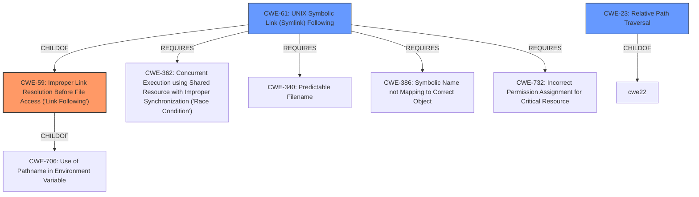

# Analysis Report for CVE-2020-27833

# Vulnerability Analysis Report: CVE-2020-27833

## Description


## Analysis (with Relationship Data)

# Summary
| CWE ID | CWE Name | Confidence | CWE Abstraction Level | CWE Vulnerability Mapping Label | CWE-Vulnerability Mapping Notes |
|---|---|---|---|---|---|
| CWE-59 | Improper Link Resolution Before File Access ('Link Following') | 0.9 | Base | Allowed | Primary CWE |
| CWE-23 | Relative Path Traversal | 0.8 | Base | Allowed | Secondary Candidate |
| CWE-61 | UNIX Symbolic Link (Symlink) Following | 0.7 | Compound | Allowed | Secondary Candidate |

## Evidence and Confidence

*   **Confidence Score:** 0.9
*   **Evidence Strength:** HIGH

## Relationship Analysis
The primary CWE is CWE-59, which describes the core issue of improper handling of symbolic links. CWE-23, Relative Path Traversal, is a closely related weakness, especially since the vulnerability allows writing outside the intended directory. CWE-61, UNIX Symbolic Link (Symlink) Following, is a compound CWE that encompasses the elements that must occur simultaneously for the vulnerability to be exploited.



## Vulnerability Chain
The vulnerability chain starts with a specially crafted container image containing symbolic links. The `oc image extract` command **fails to properly resolve these links**, leading to **arbitrary file writes** outside the intended directory. This can then result in **overwriting executables or configuration files**, ultimately leading to **arbitrary code execution**.

## Summary of Analysis
The primary weakness is the **improper handling of symbolic links** (CWE-59) within the `oc image extract` command, which allows for writing files outside the intended directory. The vulnerability description clearly states that a crafted container image with symbolic links can be used to overwrite files, which aligns with the core concept of CWE-59. The "CVE Reference Links Content Summary" section further supports this by highlighting "Symbolic Link Handling: The vulnerability lies in how `oc image extract` handles symbolic links within a tar archive. It improperly validates the paths of symbolic links, allowing for links pointing outside the intended extraction directory." This evidence strongly supports the selection of CWE-59 as the primary CWE.

CWE-23 is a secondary consideration because the crafted image allows writing files outside the intended directory. However, the root cause is the **improper resolution of the symbolic links**, not the path traversal itself.

CWE-61, UNIX Symbolic Link (Symlink) Following, is also considered since it is a compound of multiple weaknesses that must occur simultaneously. However, mapping to the individual weaknesses that comprise CWE-61 is better.

The provided evidence clearly points to the improper handling of symbolic links as the root cause, making CWE-59 the most specific and appropriate classification.

Relevant CWE Information:

# Enhanced Context (25 CWEs)
The following CWEs were identified as potentially relevant to this vulnerability:

## CWE-59: Improper Link Resolution Before File Access ('Link Following')
**Abstraction Level**: Base
**Similarity Score**: 0.79
**Source**: dense

**Description**:
The product attempts to access a file based on the filename, but it does not properly prevent that filename from identifying a link or shortcut that resolves to an unintended resource.

**Mapping Guidance**:
- Usage: Allowed
- Rationale: This CWE entry is at the Base level of abstraction, which is a preferred level of abstraction for mapping to the root causes of vulnerabilities.

## CWE-23: Relative Path Traversal
**Abstraction Level**: Base
**Similarity Score**: 0.78
**Source**: dense

**Description**:
The product uses external input to construct a pathname that should be within a restricted directory, but it does not properly neutralize sequences such as ".." that can resolve to a location that is outside of that directory.

**Mapping Guidance**:
- Usage: Allowed
- Rationale: This CWE entry is at the Base level of abstraction, which is a preferred level of abstraction for mapping to the root causes of vulnerabilities.

## CWE-61: UNIX Symbolic Link (Symlink) Following
**Abstraction Level**: Compound
**Similarity Score**: 0.76
**Source**: dense

**Description**:
The product, when opening a file or directory, does not sufficiently account for when the file is a symbolic link that resolves to a target outside of the intended control sphere. This could allow an attacker to cause the product to operate on unauthorized files.

**Mapping Guidance**:
- Usage: Allowed
- Rationale: This is a well-known Composite of multiple weaknesses that must all occur simultaneously, although it is attack-oriented in nature.


## CWE Relationship Analysis

Current CWEs represent these abstraction levels: .


### Vulnerability Chain Analysis

**Chain starting from CWE-732:**
- 732 (Incorrect Permission Assignment for Critical Resource) - ROOT


**Chain starting from CWE-386:**
- 386 (Symbolic Name not Mapping to Correct Object) - ROOT


### CWE Relationship Diagram

```mermaid
graph TD
    classDef primary fill:#f96,stroke:#333,stroke-width:2px
    classDef secondary fill:#69f,stroke:#333
    classDef tertiary fill:#9e9,stroke:#333
```


*Report generated on 2025-04-02 05:18:43*
