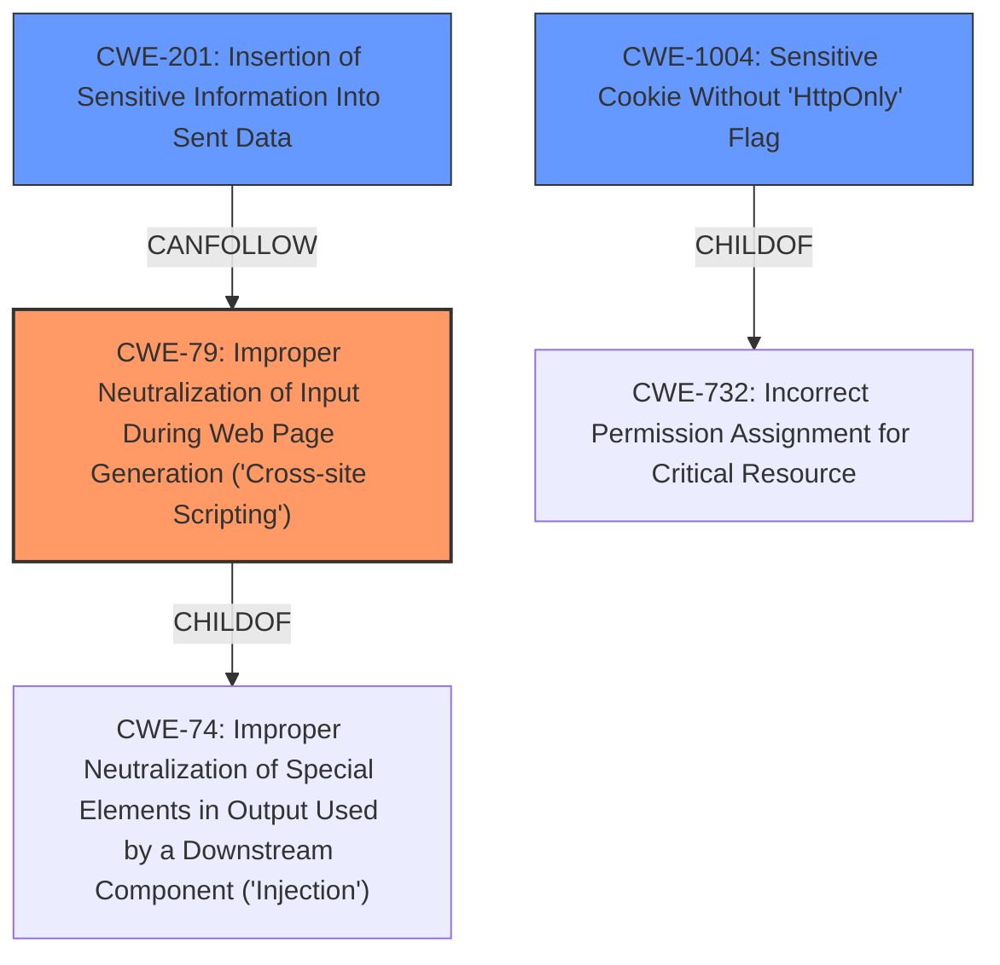

# Enhanced Analysis for CVE-2020-27839

# Summary
| CWE ID | CWE Name | Confidence | CWE Abstraction Level | CWE Vulnerability Mapping Label | CWE-Vulnerability Mapping Notes |
|---|---|---|---|---|---|
| CWE-79 | Improper Neutralization of Input During Web Page Generation ('Cross-site Scripting') | 1.0 | Base | Allowed | Primary CWE. The JWT is stored in localStorage, making it accessible to JavaScript, and thus vulnerable to XSS. |
| CWE-201 | Insertion of Sensitive Information Into Sent Data | 0.7 | Base | Allowed | Secondary CWE. The JWT token, a sensitive piece of data, is stored in a location (localStorage) where it can be exposed. |
| CWE-1004 | Sensitive Cookie Without 'HttpOnly' Flag | 0.6 | Variant | Allowed | Secondary CWE. The description mentions mitigation to stop using localStorage for JWT storage and to use secure cookies with the appropriate HttpOnly flag. |

## Evidence and Confidence

*   **Confidence Score:** 0.8
*   **Evidence Strength:** HIGH

## Relationship Analysis
The primary weakness is CWE-79, which allows for the exfiltration of the JWT. CWE-201 describes the root cause of sending sensitive data, and CWE-1004 is related to the storage of the JWT in a cookie without the HttpOnly flag. CWE-79 is a peer of CWE-352 (Cross-Site Request Forgery).



## Vulnerability Chain
The vulnerability chain starts with the **improper JWT storage** in localStorage, leading to a **cross-site scripting** (XSS) vulnerability that can compromise data confidentiality and integrity.

## Summary of Analysis
The primary CWE is CWE-79 because the vulnerability allows an attacker to inject malicious code and steal the JWT token, which is a classic XSS attack scenario. The vulnerability description specifically mentions the **weakness** as being related to **cross-site scripting**, and the CVE reference links mention the potential for XSS attacks due to the storage of the JWT in localStorage. "Using localStorage for sensitive data like JWTs makes it vulnerable to XSS attacks". This aligns directly with the CWE-79 description. The evidence is high because the description explicitly states the XSS vulnerability.

CWE-201 is also selected because the **improper JWT storage** in localStorage results in the **insertion of sensitive information into sent data**, specifically the JWT token being accessible to unauthorized actors. This is further supported by the vulnerability description stating that the JWT token is "stored by the frontend application in the browsers localStorage which is potentially vulnerable to attackers". This aligns with the CWE-201 description: "The code transmits data to another actor, but a portion of the data includes sensitive information that should not be accessible to that actor."

CWE-1004 is added because the suggested mitigation for the vulnerability involves using secure cookies with the HttpOnly flag. This directly relates to the CWE-1004 description: "The product uses a cookie to store sensitive information, but the cookie is not marked with the HttpOnly flag." The reference link content summary notes that "The suggested mitigation was to stop using localStorage for JWT storage and to use secure cookies with appropriate flags (secure, HttpOnly, SameSite)."

The selected CWEs are at the optimal level of specificity because they directly address the root cause (**improper JWT storage**) and resulting impact (**cross-site scripting**) of the vulnerability.


## CWE Relationship Analysis

Current CWEs represent these abstraction levels: .


### Vulnerability Chain Analysis

**Chain starting from CWE-732:**
- 732 (Incorrect Permission Assignment for Critical Resource) - ROOT


**Chain starting from CWE-79:**
- 79 (Improper Neutralization of Input During Web Page Generation ('Cross-site Scripting')) - ROOT


### CWE Relationship Diagram

```mermaid
graph TD
    classDef primary fill:#f96,stroke:#333,stroke-width:2px
    classDef secondary fill:#69f,stroke:#333
    classDef tertiary fill:#9e9,stroke:#333
```