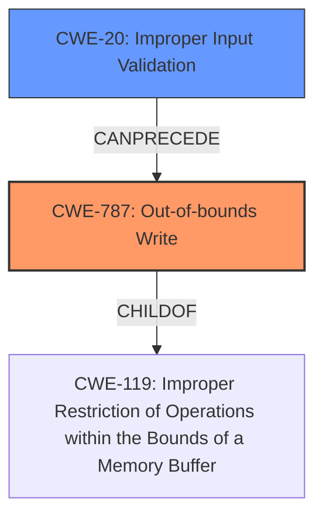

# Analysis for CVE-2020-27914

# Summary
| CWE ID  | CWE Name                          | Confidence | CWE Abstraction Level | CWE Vulnerability Mapping Label | CWE-Vulnerability Mapping Notes |
|---------|-----------------------------------|------------|-----------------------|---------------------------------|-----------------------------------|
| CWE-787 | Out-of-bounds Write               | 1.0        | Base                  | Allowed                          | Primary CWE                       |
| CWE-20  | Improper Input Validation         | 0.7        | Class                 | Discouraged                      | Secondary Candidate               |

## Evidence and Confidence

*   **Confidence Score:** 0.9
*   **Evidence Strength:** HIGH

## Relationship Analysis
The primary relationship that impacted my decision was the parent-child relationship between CWE-787 (**Out-of-bounds Write**) and CWE-119 (**Improper Restriction of Operations within the Bounds of a Memory Buffer**). CWE-787 is a specific type of memory corruption, which aligns with the provided description. While CWE-20 (**Improper Input Validation**) is related, the description explicitly mentions **memory corruption**, making CWE-787 a more precise root cause.

## Vulnerability Chain
The vulnerability chain starts with **memory corruption** due to **insufficient input validation**, leading to arbitrary code execution.

-   **Root Cause:** **Memory Corruption** (CWE-787)
-   **Contributing Factor:** **Insufficient Input Validation** (CWE-20)
-   **Impact:** Arbitrary Code Execution

## Summary of Analysis
The initial assessment identified CWE-787 (**Out-of-bounds Write**) as the primary candidate due to the explicit mention of **memory corruption** in the vulnerability description and the CVE Reference Links Content Summary.

The retriever results also strongly supported CWE-787 with the highest score. The "CWE for similar CVE Descriptions" section also listed CWE-787 as the Primary CWE Match.

CWE-20 (**Improper Input Validation**) was considered as a secondary factor since the provided content mentions that the **memory corruption** issue was addressed with improved input validation. This suggests that **insufficient input validation** contributed to the vulnerability.

The selection of CWE-787 is at the optimal level of specificity because it directly describes the **memory corruption** issue. While CWE-119 is a parent of CWE-787, it is more general. CWE-20, while relevant, is a contributing factor rather than the direct cause of the **memory corruption**.

Relevant CWE Information:

# Enhanced Context (25 CWEs)

## CWE-823: Use of Out-of-range Pointer Offset
**Abstraction Level**: Base
**Similarity Score**: 0.78
**Source**: dense

**Description**:
The product performs pointer arithmetic on a valid pointer, but it uses an offset that can point outside of the intended range of valid memory locations for the resulting pointer.
*Not Selected*: This is related to pointer arithmetic, but the vulnerability description focuses on general **memory corruption** rather than pointer-specific issues.

## CWE-125: Out-of-bounds Read
**Abstraction Level**: Base
**Similarity Score**: 0.77
**Source**: dense

**Description**:
The product reads data past the end, or before the beginning, of the intended buffer.
*Not Selected*: The vulnerability description focuses on writing to memory (**memory corruption**) rather than reading.

## CWE-131: Incorrect Calculation of Buffer Size
**Abstraction Level**: Base
**Similarity Score**: 0.77
**Source**: dense

**Description**:
The product does not correctly calculate the size to be used when allocating a buffer, which could lead to a buffer overflow.
*Not Selected*: This is related to buffer size calculation, but the vulnerability description focuses on the **memory corruption** itself, not the buffer size calculation.

## CWE-805: Buffer Access with Incorrect Length Value
**Abstraction Level**: Base
**Similarity Score**: 0.76
**Source**: dense

**Description**:
The product uses a sequential operation to read or write a buffer, but it uses an incorrect length value that causes it to access memory that is outside of the bounds of the buffer.
*Not Selected*: The description states memory corruption, but not how the buffer access happens.

## CWE-191: Integer Underflow (Wrap or Wraparound)
**Abstraction Level**: Base
**Similarity Score**: 0.76
**Source**: dense

**Description**:
The product subtracts one value from another, such that the result is less than the minimum allowable integer value, which produces a value that is not equal to the correct result.
*Not Selected*: This is related to integer underflow, but the vulnerability description focuses on general **memory corruption**.

## CWE-1289: Improper Validation of Unsafe Equivalence in Input
**Abstraction Level**: Base
**Similarity Score**: 0.76
**Source**: dense

**Description**:
The product receives an input value that is used as a resource identifier or other type of reference, but it does not validate or incorrectly validates that the input is equivalent to a potentially-unsafe value.
*Not Selected*: Although **insufficient input validation** is present, it doesn't focus on the equivalence of inputs.

## CWE-197: Numeric Truncation Error
**Abstraction Level**: Base
**Similarity Score**: 0.76
**Source**: dense

**Description**:
Truncation errors occur when a primitive is cast to a primitive of a smaller size and data is lost in the conversion.
*Not Selected*: This is related to numeric truncation, but the vulnerability description focuses on general **memory corruption**.

## CWE-126: Buffer Over-read
**Abstraction Level**: Variant
**Similarity Score**: 0.75
**Source**: dense

**Description**:
The product reads from a buffer using buffer access mechanisms such as indexes or pointers that reference memory locations after the targeted buffer.
*Not Selected*: The vulnerability description focuses on writing to memory (**memory corruption**) rather than reading.

## CWE-667: Improper Locking
**Abstraction Level**: Class
**Similarity Score**: 0.75
**Source**: dense

**Description**:
The product does not properly acquire or release a lock on a resource, leading to unexpected resource state changes and behaviors.
*Not Selected*: This is related to locking mechanisms, but the vulnerability description focuses on general **memory corruption**.

## CWE-404: Improper Resource Shutdown or Release
**Abstraction Level**: Class
**Similarity Score**: 0.75
**Source**: dense

**Description**:
The product does not release or incorrectly releases a resource before it is made available for re-use.
*Not Selected*: The vulnerability description focuses on general **memory corruption**, not resource management.

## CWE-125: Out-of-bounds Read
**Abstraction Level**: Base
**Similarity Score**: 6464.56
**Source**: sparse

**Description**:
The product reads data past the end, or before the beginning, of the intended buffer.
*Not Selected*: The vulnerability description focuses on writing to memory (**memory corruption**) rather than reading.

## CWE-823: Use of Out-of-range Pointer Offset
**Abstraction Level**: Base
**Similarity Score**: 6453.84
**Source**: sparse

**Description**:
The product performs pointer arithmetic on a valid pointer, but it uses an offset that can point outside of the intended range of valid memory locations for the resulting pointer.
*Not Selected*: This is related to pointer arithmetic, but the vulnerability description focuses on general **memory corruption** rather than pointer-specific issues.

## CWE-190: Integer Overflow or Wraparound
**Abstraction Level**: Base
**Similarity Score**: 6286.11
**Source**: sparse

**Description**:
The product performs a calculation that can
         produce an integer overflow or wraparound when the logic
         assumes that the resulting value will always be larger than
         the original value. This occurs when an integer value is
         incremented to a value that is too large to store in the
         associated representation. When this occurs, the value may
         become a very small or negative number.
*Not Selected*: This is related to integer overflow, but the vulnerability description focuses on general **memory corruption**.

## CWE-667: Improper Locking
**Abstraction Level**: Class
**Similarity Score**: 6270.16
**Source**: sparse

**Description**:
The product does not properly acquire or release a lock on a resource, leading to unexpected resource state changes and behaviors.
*Not Selected*: This is