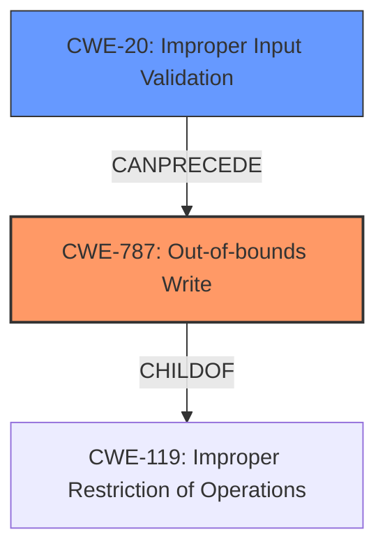

# Raw Analyzer Response for CVE-2020-27915

# Summary
| CWE ID | CWE Name | Confidence | CWE Abstraction Level | CWE Vulnerability Mapping Label | CWE-Vulnerability Mapping Notes |
|---|---|---|---|---|---|
| CWE-787 | Out-of-bounds Write | 1.0 | Base | Allowed | Primary CWE |
| CWE-20 | Improper Input Validation | 0.6 | Class | Discouraged | Secondary CWE |

## Evidence and Confidence

*   **Confidence Score:** 0.9
*   **Evidence Strength:** HIGH

## Relationship Analysis
The primary CWE is CWE-787, which is a base-level CWE that is child of CWE-119 (Improper Restriction of Operations within the Bounds of a Memory Buffer). CWE-20 (Improper Input Validation) can precede CWE-787. This relationship suggests that the lack of proper input validation could lead to an out-of-bounds write.

## Vulnerability Chain
The vulnerability chain starts with **improper input validation** (CWE-20), which leads to **memory corruption**, specifically an **out-of-bounds write** (CWE-787). The impact is **arbitrary code execution with system privileges**.

## Summary of Analysis
The primary weakness is **memory corruption** due to **insufficient input validation**, leading to a possible **out-of-bounds write**. The selection of CWE-787 is based on the **root cause of the vulnerability**.

The evidence for CWE-787 is found in these sections of the provided text:
*   **Vulnerability Description Key Phrases**: "**weakness:** **memory corruption**"
*   **CVE Reference Links Content Summary**: "**Root cause of vulnerability**: Memory corruption"
*   **Retriever Results**: "CWE ID: 787 Name: Out-of-bounds Write Abstraction: Base Usage: Allowed Retrievers: alternate_terms Individual Scores: 1.000"

CWE-20 is included as a secondary weakness because the description states that "A **memory corruption** issue was addressed with improved input validation." This suggests that the lack of proper input validation contributed to the memory corruption.

The graph relationships influenced the selection by illustrating how improper input validation (CWE-20) can lead to out-of-bounds writes (CWE-787). The selected CWEs are at the optimal level of specificity because CWE-787 is a Base-level CWE, which is preferred, and CWE-20 captures the high-level failure to validate input.

Relevant CWE Information:

# Enhanced Context (25 CWEs)
The following CWEs were identified as potentially relevant to this vulnerability:

## CWE-404: Improper Resource Shutdown or Release
**Abstraction Level**: Class
**Similarity Score**: 0.76
**Source**: dense

**Description**:
The product does not release or incorrectly releases a resource before it is made available for re-use.

**Mapping Guidance**:
- Usage: Allowed-with-Review
- Rationale: This CWE entry is a Class and might have Base-level children that would be more appropriate

*Not Selected*: This CWE is not relevant because the vulnerability description focuses on memory corruption due to input validation, not resource management.*

## CWE-131: Incorrect Calculation of Buffer Size
**Abstraction Level**: Base
**Similarity Score**: 0.76
**Source**: dense

**Description**:
The product does not correctly calculate the size to be used when allocating a buffer, which could lead to a buffer overflow.

**Mapping Guidance**:
- Usage: Allowed
- Rationale: This CWE entry is at the Base level of abstraction, which is a preferred level of abstraction for mapping to the root causes of vulnerabilities.

*Not Selected*: While incorrect buffer size calculation could lead to memory corruption, the description emphasizes **improved input validation** as the fix, suggesting that the root cause is more related to how the input is handled rather than the size calculation itself.*

## CWE-226: Sensitive Information in Resource Not Removed Before Reuse
**Abstraction Level**: Base
**Similarity Score**: 0.76
**Source**: dense

**Description**:
The product releases a resource such as memory or a file so that it can be made available for reuse, but it does not clear or "zeroize" the information contained in the resource before the product performs a critical state transition or makes the resource available for reuse by other entities.

**Mapping Guidance**:
- Usage: Allowed
- Rationale: This CWE entry is at the Base level of abstraction, which is a preferred level of abstraction for mapping to the root causes of vulnerabilities.

*Not Selected*: This CWE is not relevant because the vulnerability description focuses on memory corruption due to input validation, not the reuse of resources containing sensitive information.*

## CWE-1289: Improper Validation of Unsafe Equivalence in Input
**Abstraction Level**: Base
**Similarity Score**: 0.76
**Source**: dense

**Description**:
The product receives an input value that is used as a resource identifier or other type of reference, but it does not validate or incorrectly validates that the input is equivalent to a potentially-unsafe value.

**Mapping Guidance**:
- Usage: Allowed
- Rationale: This CWE entry is at the Base level of abstraction, which is a preferred level of abstraction for mapping to the root causes of vulnerabilities.

*Not Selected*: This CWE is too specific. The description mentions input validation generally, not specifically related to unsafe equivalence.*

## CWE-125: Out-of-bounds Read
**Abstraction Level**: Base
**Similarity Score**: 0.76
**Source**: dense

**Description**:
The product reads data past the end, or before the beginning, of the intended buffer.

**Mapping Guidance**:
- Usage: Allowed
- Rationale: This CWE entry is at the Base level of abstraction, which is a preferred level of abstraction for mapping to the root causes of vulnerabilities.

*Not Selected*: The description focuses on **memory corruption**, which is generally associated with writes rather than reads.*

## CWE-805: Buffer Access with Incorrect Length Value
**Abstraction Level**: Base
**Similarity Score**: 0.76
**Source**: dense

**Description**:
The product uses a sequential operation to read or write a buffer, but it uses an incorrect length value that causes it to access memory that is outside of the bounds of the buffer.

**Mapping Guidance**:
- Usage: Allowed
- Rationale: This CWE entry is at the Base level of abstraction, which is a preferred level of abstraction for mapping to the root causes of vulnerabilities.

*Not Selected*: Similar to CWE-131, it's too specific. The vulnerability is fixed with improved input validation, so not specific to incorrect length values.*

## CWE-191: Integer Underflow (Wrap or Wraparound)
**Abstraction Level**: Base
**Similarity Score**: 0.76
**Source**: dense

**Description**:
The product subtracts one value from another, such that the result is less than the minimum allowable integer value, which produces a value that is not equal to the correct result.

**Mapping Guidance**:
- Usage: Allowed
- Rationale: This CWE entry is at the Base level of abstraction, which is a preferred level of abstraction for mapping to the root causes of vulnerabilities.

*Not Selected*: This CWE is not relevant because the vulnerability description focuses on memory corruption due to input validation, not integer underflow.*

## CWE-667: Improper Locking
**Abstraction Level**: Class
**Similarity Score**: 0.75
**Source**: dense

**Description**:
The product does not properly acquire or release a lock on a resource, leading to unexpected resource state changes and behaviors.

**Mapping Guidance**:
- Usage: Allowed-with-Review
- Rationale: This CWE entry is a Class and might have Base-level children that would be more appropriate

*Not Selected*: This CWE is not relevant because the vulnerability description focuses on memory corruption due to input validation, not improper locking.*

## CWE-197: Numeric Truncation Error
**Abstraction Level**: Base
**Similarity Score**: 0.75
**Source**: dense

**Description**:
Truncation errors occur when a primitive is cast to a primitive of a smaller size and data is lost in the conversion.

**Mapping Guidance**:
- Usage: Allowed
- Rationale: This CWE entry is at the Base level of abstraction, which is a preferred level of abstraction for mapping to the root causes of vulnerabilities.

*Not Selected*: This CWE is not relevant because the vulnerability description focuses on memory corruption due to input validation, not numeric truncation.*

## CWE-126: Buffer Over-read
**Abstraction Level**: Variant