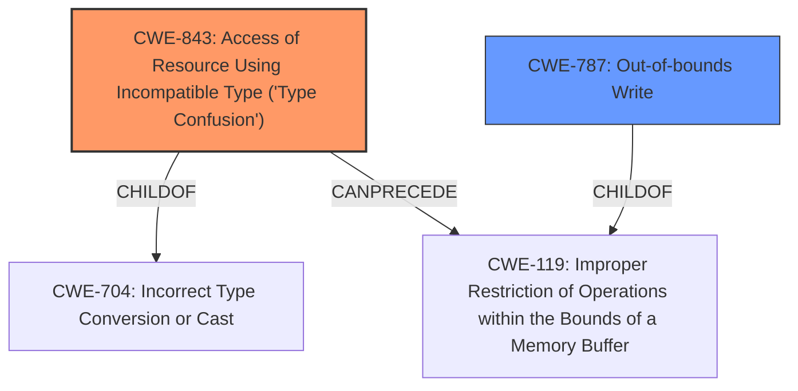

# Raw Analyzer Response for CVE-2020-27932

# Summary
| CWE ID | CWE Name | Confidence | CWE Abstraction Level | CWE Vulnerability Mapping Label | CWE-Vulnerability Mapping Notes |
|---|---|---|---|---|---|
| CWE-843 | Access of Resource Using Incompatible Type ('Type Confusion') | 1.0 | Base | Allowed | Primary CWE |
| CWE-787 | Out-of-bounds Write | 0.7 | Base | Allowed | Secondary Candidate |

## Evidence and Confidence

*   **Confidence Score:** 0.9
*   **Evidence Strength:** HIGH

## Relationship Analysis
The primary CWE, CWE-843, is a base-level weakness that can lead to CWE-119 (Improper Restriction of Operations within the Bounds of a Memory Buffer). It is also related to CWE-704 (Incorrect Type Conversion or Cast). CWE-787, a secondary candidate, is a child of CWE-119.

## Vulnerability Chain
The vulnerability chain starts with a **type confusion** (CWE-843). This can potentially lead to memory corruption and out-of-bounds write (CWE-787), eventually resulting in arbitrary code execution with kernel privileges.

## Summary of Analysis
The initial analysis identified a **type confusion** vulnerability, leading to arbitrary code execution. The Retriever Results strongly suggest CWE-843 (Access of Resource Using Incompatible Type ('Type Confusion')) as the primary candidate. The evidence provided in the "Vulnerability Description Key Phrases" and "CVE Reference Links Content Summary" sections confirms this. Specifically, the root cause is listed as **"type confusion issue in the Kernel."** The impact of exploitation is "Arbitrary code execution with kernel privileges."

The graph relationships and descriptions of CWE-843, CWE-119, and CWE-787 influenced the selection of CWE-843 as the primary weakness and CWE-787 as a secondary candidate because **type confusion** can lead to memory corruption and out-of-bounds write.

The selected CWEs are at the optimal level of specificity. CWE-843 is a Base level CWE, which is preferred.

Relevant CWE Information:

# Enhanced Context (25 CWEs)

## CWE-667: Improper Locking
**Abstraction Level**: Class
**Similarity Score**: 0.76
**Source**: dense

**Description**:
The product does not properly acquire or release a lock on a resource, leading to unexpected resource state changes and behaviors.

**Mapping Guidance**:
- Usage: Allowed-with-Review
- Rationale: This CWE entry is a Class and might have Base-level children that would be more appropriate

*This CWE was considered but is not relevant as the vulnerability is not related to locking mechanisms.*

## CWE-1263: Improper Physical Access Control
**Abstraction Level**: Class
**Similarity Score**: 0.75
**Source**: dense

**Description**:
The product is designed with access restricted to certain information, but it does not sufficiently protect against an unauthorized actor with physical access to these areas.

**Mapping Guidance**:
- Usage: Allowed-with-Review
- Rationale: This CWE entry is a Class and might have Base-level children that would be more appropriate

*This CWE was considered but is not relevant as the vulnerability is not related to physical access control.*

## CWE-653: Improper Isolation or Compartmentalization
**Abstraction Level**: Class
**Similarity Score**: 0.75
**Source**: dense

**Description**:
The product does not properly compartmentalize or isolate functionality, processes, or resources that require different privilege levels, rights, or permissions.

**Mapping Guidance**:
- Usage: Allowed
- Rationale: This CWE entry is at the Base level of abstraction, which is a preferred level of abstraction for mapping to the root causes of vulnerabilities.

*This CWE was considered but is not relevant as the vulnerability is not about improper isolation.*

## CWE-404: Improper Resource Shutdown or Release
**Abstraction Level**: Class
**Similarity Score**: 0.75
**Source**: dense

**Description**:
The product does not release or incorrectly releases a resource before it is made available for re-use.

**Mapping Guidance**:
- Usage: Allowed-with-Review
- Rationale: This CWE entry is a Class and might have Base-level children that would be more appropriate

*This CWE was considered but is not relevant as the vulnerability is not related to resource shutdown or release.*

## CWE-1289: Improper Validation of Unsafe Equivalence in Input
**Abstraction Level**: Base
**Similarity Score**: 0.74
**Source**: dense

**Description**:
The product receives an input value that is used as a resource identifier or other type of reference, but it does not validate or incorrectly validates that the input is equivalent to a potentially-unsafe value.

**Mapping Guidance**:
- Usage: Allowed
- Rationale: This CWE entry is at the Base level of abstraction, which is a preferred level of abstraction for mapping to the root causes of vulnerabilities.

*This CWE was considered but the vulnerability doesn't seem to involve improper validation of unsafe equivalence in input.*

## CWE-657: Violation of Secure Design Principles
**Abstraction Level**: Class
**Similarity Score**: 0.74
**Source**: dense

**Description**:
The product violates well-established principles for secure design.

**Mapping Guidance**:
- Usage: Discouraged
- Rationale: This CWE entry is a level-1 Class (i.e., a child of a Pillar). It might have lower-level children that would be more appropriate

*This CWE is too broad and doesn't accurately describe the specific weakness.*

## CWE-274: Improper Handling of Insufficient Privileges
**Abstraction Level**: Base
**Similarity Score**: 0.74
**Source**: dense

**Description**:
The product does not handle or incorrectly handles when it has insufficient privileges to perform an operation, leading to resultant weaknesses.

**Mapping Guidance**:
- Usage: Discouraged
- Rationale: This CWE entry could be deprecated in a future version of CWE.

*This CWE is not relevant as the vulnerability is not related to handling insufficient privileges.*

## CWE-664: Improper Control of a Resource Through its Lifetime
**Abstraction Level**: Pillar
**Similarity Score**: 0.74
**Source**: dense

**Description**:
The product does not maintain or incorrectly maintains control over a resource throughout its lifetime of creation, use, and release.

**Mapping Guidance**:
- Usage: Discouraged
- Rationale: This CWE entry is high-level when lower-level children are available.

*This CWE is too broad and doesn't accurately describe the specific weakness.*

## CWE-668: Exposure of Resource to Wrong Sphere
**Abstraction Level**: Class
**Similarity Score**: 0.74
**Source**: dense

**Description**:
The product exposes a resource to the wrong control sphere, providing unintended actors with inappropriate access to the resource.

**Mapping Guidance**:
- Usage: Discouraged
- Rationale: CWE-668 is high-level and is often misused as a catch-all when lower-level CWE IDs might be applicable. It is sometimes used for low-information vulnerability reports [REF-1287]. It is a level-1 Class (i.e., a child of a Pillar). It is not useful for trend analysis.

*This CWE is not relevant as the vulnerability is not related to exposure of resources.*

## CWE-807: Reliance on Untrusted Inputs in a Security Decision
**Abstraction Level**: Base
**Similarity Score**: 0.73
**Source**: dense

**Description**:
The product uses a protection mechanism that relies on the existence or values of an input, but the input can be modified by an untrusted actor in a way that bypasses the protection mechanism.

**Mapping Guidance**:
- Usage: Allowed
- Rationale: This CWE entry is at the Base level of abstraction, which is a preferred level of abstraction for mapping to the root causes of vulnerabilities.

*This CWE is not relevant as the vulnerability doesn't appear to involve reliance on untrusted inputs in security decisions.*

## CWE-125: Out-of-bounds Read
**Abstraction Level**: Base
**Similarity Score**: 5536.16
**Source**: sparse

**Description**:
The product reads data past the end, or before the beginning, of the intended buffer.

**Mapping Guidance**: