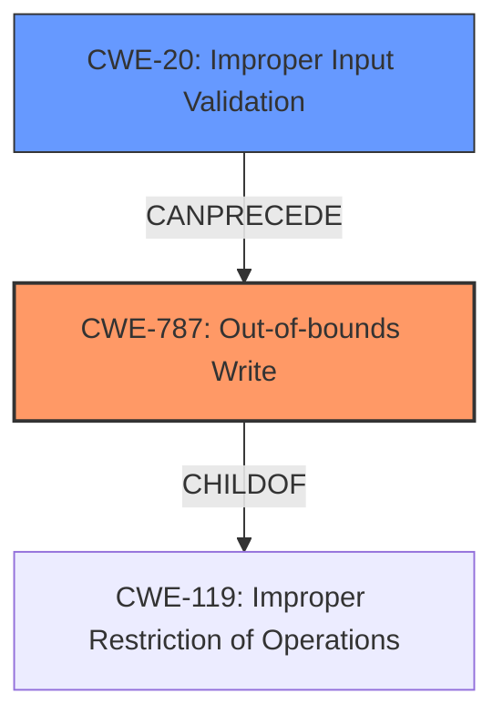

# Analysis for CVE-2020-27947

# Summary
| CWE ID  | CWE Name                         | Confidence | CWE Abstraction Level | CWE Vulnerability Mapping Label | CWE-Vulnerability Mapping Notes |
|---------|----------------------------------|------------|-----------------------|---------------------------------|---------------------------------|
| CWE-787 | Out-of-bounds Write              | 1          | Base                  | Primary CWE                     | Allowed                         |
| CWE-20  | Improper Input Validation        | 0.7        | Class                 | Secondary Candidate             | Discouraged                     |

## Evidence and Confidence

*   **Confidence Score:** 0.9
*   **Evidence Strength:** HIGH

## Relationship Analysis
The primary relationship is that CWE-787 **Out-of-bounds Write** is a child of CWE-119 **Improper Restriction of Operations within the Bounds of a Memory Buffer**. CWE-20 **Improper Input Validation** can precede CWE-787, as insufficient validation can lead to out-of-bounds writes. Although CWE-20 is a class, the description focuses on an input validation problem, which led to the selection of this CWE.

## Vulnerability Chain
The vulnerability chain starts with **improper input validation** (CWE-20), which leads to **memory corruption**, specifically an **out-of-bounds write** (CWE-787), and ultimately results in the ability to execute arbitrary code with kernel privileges.

## Summary of Analysis
The initial analysis identified CWE-787 as the primary candidate due to the explicit mention of "memory corruption" and the fact that "a **memory corruption** issue was addressed with improved input validation." This directly aligns with the description of CWE-787 **Out-of-bounds Write**, which involves writing data past the end or before the beginning of an intended buffer, which can lead to **memory corruption**.

The vulnerability description key phrases point to **improper input validation** as the root cause and **memory corruption** as the weakness. The CVE Reference Links Content Summary reinforces this by stating, "A **memory corruption** issue was addressed with improved input validation."

The Retriever Results also strongly suggest CWE-787, with a score of 1.000. The "CWE for similar CVE Descriptions" section also lists CWE-787 as the primary match.

CWE-20 **Improper Input Validation** was considered as a secondary CWE because the vulnerability was addressed with improved input validation, which indicates that **improper input validation** was the root cause of the vulnerability. While CWE-20 is a class, it accurately reflects the **rootcause** of the vulnerability as stated in the description.

CWE-843 **Access of Resource Using Incompatible Type ('Type Confusion')** was considered, but the description does not provide enough evidence to support this.

CWE-125 **Out-of-bounds Read** was also considered because it is related to memory access issues. However, the description specifically mentions "**memory corruption**," suggesting a write operation rather than a read operation.

The selection of CWE-787 is at the optimal level of specificity because it directly describes the **memory corruption** issue.

Relevant CWE Information:

# Enhanced Context (25 CWEs)
The following CWEs were identified as potentially relevant to this vulnerability:

## CWE-823: Use of Out-of-range Pointer Offset
**Abstraction Level**: Base
**Similarity Score**: 0.77
**Source**: dense

**Description**:
The product performs pointer arithmetic on a valid pointer, but it uses an offset that can point outside of the intended range of valid memory locations for the resulting pointer.

**Mapping Guidance**:
- Usage: Allowed
- Rationale: This CWE entry is at the Base level of abstraction, which is a preferred level of abstraction for mapping to the root causes of vulnerabilities.

## CWE-131: Incorrect Calculation of Buffer Size
**Abstraction Level**: Base
**Similarity Score**: 0.76
**Source**: dense

**Description**:
The product does not correctly calculate the size to be used when allocating a buffer, which could lead to a buffer overflow.

**Mapping Guidance**:
- Usage: Allowed
- Rationale: This CWE entry is at the Base level of abstraction, which is a preferred level of abstraction for mapping to the root causes of vulnerabilities.

## CWE-125: Out-of-bounds Read
**Abstraction Level**: Base
**Similarity Score**: 0.76
**Source**: dense

**Description**:
The product reads data past the end, or before the beginning, of the intended buffer.

**Mapping Guidance**:
- Usage: Allowed
- Rationale: This CWE entry is at the Base level of abstraction, which is a preferred level of abstraction for mapping to the root causes of vulnerabilities.

## CWE-667: Improper Locking
**Abstraction Level**: Class
**Similarity Score**: 0.76
**Source**: dense

**Description**:
The product does not properly acquire or release a lock on a resource, leading to unexpected resource state changes and behaviors.

**Mapping Guidance**:
- Usage: Allowed-with-Review
- Rationale: This CWE entry is a Class and might have Base-level children that would be more appropriate

## CWE-805: Buffer Access with Incorrect Length Value
**Abstraction Level**: Base
**Similarity Score**: 0.76
**Source**: dense

**Description**:
The product uses a sequential operation to read or write a buffer, but it uses an incorrect length value that causes it to access memory that is outside of the bounds of the buffer.

**Mapping Guidance**:
- Usage: Allowed
- Rationale: This CWE entry is at the Base level of abstraction, which is a preferred level of abstraction for mapping to the root causes of vulnerabilities.

## CWE-404: Improper Resource Shutdown or Release
**Abstraction Level**: Class
**Similarity Score**: 0.76
**Source**: dense

**Description**:
The product does not release or incorrectly releases a resource before it is made available for re-use.

**Mapping Guidance**:
- Usage: Allowed-with-Review
- Rationale: This CWE entry is a Class and might have Base-level children that would be more appropriate

## CWE-1289: Improper Validation of Unsafe Equivalence in Input
**Abstraction Level**: Base
**Similarity Score**: 0.76
**Source**: dense

**Description**:
The product receives an input value that is used as a resource identifier or other type of reference, but it does not validate or incorrectly validates that the input is equivalent to a potentially-unsafe value.

**Mapping Guidance**:
- Usage: Allowed
- Rationale: This CWE entry is at the Base level of abstraction, which is a preferred level of abstraction for mapping to the root causes of vulnerabilities.

## CWE-191: Integer Underflow (Wrap or Wraparound)
**Abstraction Level**: Base
**Similarity Score**: 0.76
**Source**: dense

**Description**:
The product subtracts one value from another, such that the result is less than the minimum allowable integer value, which produces a value that is not equal to the correct result.

**Mapping Guidance**:
- Usage: Allowed
- Rationale: This CWE entry is at the Base level of abstraction, which is a preferred level of abstraction for mapping to the root causes of vulnerabilities.

## CWE-226: Sensitive Information in Resource Not Removed Before Reuse
**Abstraction Level**: Base
**Similarity Score**: 0.76
**Source**: dense

**Description**:
The product releases a resource such as memory or a file so that it can be made available for reuse, but it does not clear or "zeroize" the information contained in the resource before the product performs a critical state transition or makes the resource available for reuse by other entities.

**Mapping Guidance**:
- Usage: Allowed
- Rationale: This CWE entry is at the Base level of abstraction, which is a preferred level of abstraction for mapping to the root causes of vulnerabilities.

## CWE-824: Access of Uninitialized Pointer
**Abstraction Level**: Base
**Similarity Score**: 0.75
**Source**: dense

**Description**:
The product accesses or uses a pointer that has not been initialized.

**Mapping Guidance**:
- Usage: Allowed
- Rationale: This CWE entry is at the Base level of abstraction, which is a preferred level of abstraction for mapping to the root causes of vulnerabilities.

## CWE-823: Use of Out-of-range Pointer Offset
**Abstraction Level**: Base
**Similarity Score**: 6198.66
**Source**: sparse

**Description**:
The product performs pointer arithmetic on a valid pointer, but it uses an offset that can point outside of the intended range of valid