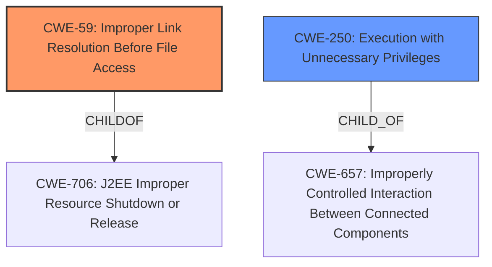

# Analysis for CVE-2020-28007

# Summary
| CWE ID  | CWE Name                                                        | Confidence | CWE Abstraction Level | CWE Vulnerability Mapping Label | CWE-Vulnerability Mapping Notes |
| ------- | --------------------------------------------------------------- | ---------- | ----------------------- | ------------------------------- | ------------------------------- |
| CWE-59  | Improper Link Resolution Before File Access ('Link Following') | 0.9        | Base                    | Primary                         | Allowed                       |
| CWE-250 | Execution with Unnecessary Privileges                            | 0.7        | Base                    | Secondary                       | Allowed                       |

## Evidence and Confidence

*   **Confidence Score:** 0.8
*   **Evidence Strength:** HIGH

## Relationship Analysis
The primary CWE is CWE-59, which represents the **improper link resolution** vulnerability. The secondary CWE is CWE-250, which indicates the issue of **execution with unnecessary privileges**, exacerbating the impact of the symlink attack. The relationship between CWE-250 and CWE-59 is that the unnecessary privileges allow the symlink attack to overwrite critical root-owned files.



## Vulnerability Chain
The vulnerability chain starts with Exim operating as root in the log directory (owned by a non-root user). This leads to a **symlink or hard link attack**, allowing the attacker to overwrite critical root-owned files.
  - **Root Cause:** Exim operates as root in the log directory, combined with **insecure handling of log files by opening in append mode** and **use of a format string that is potentially controllable via symlink**.
  - **Weakness:** **Improper Link Resolution** (CWE-59)
  - **Impact:** Overwriting critical root-owned files, leading to Local Privilege Escalation from "exim" user to root.

## Summary of Analysis
The initial assessment focused on the **symlink attack** as the primary weakness. The retriever results indicated CWE-59 (Improper Link Resolution Before File Access) and CWE-61 (UNIX Symbolic Link (Symlink) Following) as potential candidates.

The vulnerability description states, "Because Exim operates as root in the log directory (owned by a non-root user), a **symlink or hard link attack** allows overwriting critical root-owned files anywhere on the filesystem." The CVE Reference Links Content Summary confirms this, stating, "An attacker with 'exim' user privileges can create a symlink or hardlink in the log directory, leading to arbitrary file modification when the log file is written."

CWE-59 is chosen as the primary CWE because it directly addresses the **improper link resolution** issue. CWE-61 is more of a compound weakness. CWE-250 (Execution with Unnecessary Privileges) is included because Exim's operation as root exacerbates the impact.

The selected CWEs are at the optimal level of specificity. CWE-59 is a Base level CWE, and CWE-250 is also a Base level CWE, both preferred levels of abstraction. These CWEs accurately represent the root cause and contributing factors to the vulnerability.

Relevant CWE Information:

# Enhanced Context (25 CWEs)

## CWE-59: Improper Link Resolution Before File Access ('Link Following')
**Abstraction Level**: Base
**Similarity Score**: 0.83
**Source**: dense

**Description**:
The product attempts to access a file based on the filename, but it does not properly prevent that filename from identifying a link or shortcut that resolves to an unintended resource.

**Mapping Guidance**:
- Usage: Allowed
- Rationale: This CWE entry is at the Base level of abstraction, which is a preferred level of abstraction for mapping to the root causes of vulnerabilities.

## CWE-41: Improper Resolution of Path Equivalence
**Abstraction Level**: Base
**Similarity Score**: 0.80
**Source**: dense

**Description**:
The product is vulnerable to file system contents disclosure through path equivalence. Path equivalence involves the use of special characters in file and directory names. The associated manipulations are intended to generate multiple names for the same object.

**Mapping Guidance**:
- Usage: Allowed
- Rationale: This CWE entry is at the Base level of abstraction, which is a preferred level of abstraction for mapping to the root causes of vulnerabilities.

## CWE-23: Relative Path Traversal
**Abstraction Level**: Base
**Similarity Score**: 0.80
**Source**: dense

**Description**:
The product uses external input to construct a pathname that should be within a restricted directory, but it does not properly neutralize sequences such as ".." that can resolve to a location that is outside of that directory.

**Mapping Guidance**:
- Usage: Allowed
- Rationale: This CWE entry is at the Base level of abstraction, which is a preferred level of abstraction for mapping to the root causes of vulnerabilities.

## CWE-61: UNIX Symbolic Link (Symlink) Following
**Abstraction Level**: Compound
**Similarity Score**: 0.79
**Source**: dense

**Description**:
The product, when opening a file or directory, does not sufficiently account for when the file is a symbolic link that resolves to a target outside of the intended control sphere. This could allow an attacker to cause the product to operate on unauthorized files.

**Mapping Guidance**:
- Usage: Allowed
- Rationale: This is a well-known Composite of multiple weaknesses that must all occur simultaneously, although it is attack-oriented in nature.

## CWE-73: External Control of File Name or Path
**Abstraction Level**: Base
**Similarity Score**: 0.79
**Source**: dense

**Description**:
The product allows user input to control or influence paths or file names that are used in filesystem operations.

**Mapping Guidance**:
- Usage: Allowed
- Rationale: This CWE entry is at the Base level of abstraction, which is a preferred level of abstraction for mapping to the root causes of vulnerabilities.

## CWE-24: Path Traversal: '../filedir'
**Abstraction Level**: Variant
**Similarity Score**: 0.78
**Source**: dense

**Description**:
The product uses external input to construct a pathname that should be within a restricted directory, but it does not properly neutralize "../" sequences that can resolve to a location that is outside of that directory.

**Mapping Guidance**:
- Usage: Allowed
- Rationale: This CWE entry is at the Variant level of abstraction, which is a preferred level of abstraction for mapping to the root causes of vulnerabilities.

## CWE-36: Absolute Path Traversal
**Abstraction Level**: Base
**Similarity Score**: 0.78
**Source**: dense

**Description**:
The product uses external input to construct a pathname that should be within a restricted directory, but it does not properly neutralize absolute path sequences such as "/abs/path" that can resolve to a location that is outside of that directory.

**Mapping Guidance**:
- Usage: Allowed
- Rationale: This CWE entry is at the Base level of abstraction, which is a preferred level of abstraction for mapping to the root causes of vulnerabilities.

## CWE-552: Files or Directories Accessible to External Parties
**Abstraction Level**: Base
**Similarity Score**: 0.77
**Source**: dense

**Description**:
The product makes files or directories accessible to unauthorized actors, even though they should not be.

**Mapping Guidance**:
- Usage: Allowed
- Rationale: This CWE entry is at the Base level of abstraction, which is a preferred level of abstraction for mapping to the root causes of vulnerabilities.

## CWE-427: Uncontrolled Search Path Element
**Abstraction Level**: Base
**Similarity Score**: 0.77
**Source**: dense

**Description**:
The product uses a fixed or controlled search path to find resources, but one or more locations in that path can be under the control of unintended actors.

**Mapping Guidance**:
- Usage: Allowed
- Rationale: This CWE entry is at the Base level of abstraction, which is a preferred level of abstraction for mapping to the root causes of vulnerabilities.

## CWE-668: Exposure of Resource to Wrong Sphere
**Abstraction Level**: Class
**Similarity Score**: 0.77
**Source**: dense

**Description**:
The product exposes a resource to the wrong control sphere, providing unintended actors with inappropriate access to the resource.

**Mapping Guidance**:
- Usage: Discouraged
- Rationale: CWE-668 is high-level and is often misused as a catch-all when lower-level CWE IDs might be applicable. It is sometimes used for low-information vulnerability reports [REF-1287]. It is a level-1

# Enhanced Query for CVE-2020-28007

## Vulnerability Description
Exim 4 before 4.94.2 allows Execution with Unnecessary Privileges. Because Exim operates as root in the log directory (owned by a non-root user), a **symlink or hard link attack** allows overwriting critical root-owned files anywhere on the filesystem.

### Vulnerability Description Key Phrases
- **weakness:** **symlink or hard link attack**
- **impact:** overwriting critical root-owned files
- **product:** Exim
- **version:** 4 before 4.94.2

## CVE Reference Links Content Summary
```
{
  "vulnerability": {
    "root_cause": "Exim operates as root in its log directory, which belongs to the \"exim\" user. It opens log files in append mode, using a format string derived from the configuration. An attacker with \"exim\" user privileges can create a symlink or hardlink in the log directory, leading to arbitrary file modification when the log file is written.",
    "weaknesses": [
      "Insecure handling of log files by opening in append mode.",
      "Use of a format string that is potentially controllable via symlink."
     ],
    "impact": "Local Privilege Escalation from \"exim\" user to root. Arbitrary file contents can be appended, allowing for modification of system files like /etc/passwd and achieving root access.",
    "attack_vectors": [
      "Creating symlinks or hardlinks in Exim's log directory (e.g., /var/log/exim4).",
      "Triggering a log write operation by sending an email."
    ],
    "required_capabilities": "Attacker must have gained \"exim\" user privileges. This can be achieved by exploiting other vulnerabilities in Exim such as CVE-2020-28020 or CVE-2020-28018."
  }
}
```

## Retriever Results

### Top Combined Results

| Rank | CWE ID | Name | Abstraction | Usage  | Retrievers | Individual Scores |
|------|--------|------|-------------|-------|------------|-------------------|
| 1 | 64 | Windows Shortcut Following (.LNK) | Variant | Allowed | alternate_terms | 1.000 |
| 2 | 61 | UNIX Symbolic Link (Symlink) Following | Compound | Allowed | alternate_terms | 0.700 |
| 3 | 59 | Improper Link Resolution Before File Access ('Link Following') | Base | Allowed | sparse | 0.362 |
| 4 | 250 | Execution with Unnecessary Privileges | Base | Allowed | sparse | 0.273 |
| 5 | 62 | UNIX Hard Link | Variant | Allowed | sparse | 0.234 |
| 6 | 403 | Exposure of File Descriptor to Unintended Control Sphere ('File Descriptor Leak') | Base | Allowed | dense | 0.498 |
| 7 | 363 | Race Condition Enabling Link Following | Base | Allowed | graph | 0.002 |
| 8 | 708 | Incorrect Ownership Assignment | Base | Allowed | sparse | 0.226 |
| 9 | 259 | Use of Hard-coded Password | Variant | Allowed | sparse | 0.220 |
| 10 | 23 | Relative Path Traversal | Base | Allowed | sparse | 0.208 |


# Complete CWE Specifications


## CWE-64: Windows Shortcut Following (.LNK)
**Abstraction:** Variant
**Status:** Incomplete

### Description
The product, when opening a file or directory, does not sufficiently handle when the file is a Windows shortcut (.LNK) whose target is outside of the intended control sphere. This could allow an attacker to cause the product to operate on unauthorized files.

### Extended Description
The shortcut (file with the .lnk extension) can permit an attacker to read/write a file that they originally did not have permissions to access.

### Alternative Terms
Windows symbolic link following
symlink

### Relationships
ChildOf -> CWE-59

### Mapping Guidance
**Usage:** Allowed
**Rationale:** This CWE entry is at the Variant level of abstraction, which is a preferred level of abstraction for mapping to the root causes of vulnerabilities.
**Comments:** Carefully read both the name and description to ensure that this mapping is an appropriate fit. Do not try to 'force' a mapping to a lower-level Base/Variant simply to comply with this preferred level of abstraction.
**Reasons:**
- Acceptable-Use


### Additional Notes
**[Research Gap]** Under-studied. Windows .LNK files are more "portable" than Unix symlinks and have been used in remote exploits. Some Windows API's will access LNK's as if they are regular files, so one would expect that they would be reported more frequently.


### Observed Examples
- **CVE-2019-19793:** network access control service executes program with high privileges and allows symlink to invoke another executable or perform DLL injection.
- **CVE-2000-0342:** Mail client allows remote attackers to bypass the user warning for executable attachments such as .exe, .com, and .bat by using a .lnk file that refers to the attachment, aka "Stealth Attachment."
- **CVE-2001-1042:** FTP server allows remote attackers to read arbitrary files and directories by uploading a .lnk (link) file that points to the target file.


## CWE-61: UNIX Symbolic Link (Symlink) Following
**Abstraction:** Compound
**Status:** Incomplete

### Description
The product, when opening a file or directory, does not sufficiently account for when the file is a symbolic link that resolves to a target outside of the intended control sphere. This could allow an attacker to cause the product to operate on unauthorized files.

### Extended Description
A product that allows UNIX symbolic links (symlink) as part of paths whether in internal code or through user input can allow an attacker to spoof the symbolic link and traverse the file system to unintended locations or access arbitrary files. The symbolic link can permit an attacker to read/write/corrupt a file that they originally did not have permissions to access.

### Alternative Terms
Symlink following
symlink vulnerability

### Relationships
ChildOf -> CWE-59
Requires -> CWE-362
Requires -> CWE-340
Requires -> CWE-386
Requires -> CWE-732

### Mapping Guidance
**Usage:** Allowed
**Rationale:** This is a well-known Composite of multiple weaknesses that must all occur simultaneously, although it is attack-oriented in nature.
**Comments:** While attack-oriented composites are supported in CWE, they have not been a focus of research. There is a chance that future research or CWE scope clarifications will change or deprecate them. Perform root-cause analysis to determine which weaknesses allow symlink following to occur, and map to those weaknesses. For example, predictable file names might be intended functionality, but creation in a directory with insecure permissions might not.
**Reasons:**
- Other


### Additional Notes
**[Research Gap]** 

Symlink vulnerabilities are regularly found in C and shell programs, but all programming languages can have this problem. Even shell programs are probably under-reported.


"Second-order symlink vulnerabilities" may exist in programs that invoke other programs that follow symlinks. They are rarely reported but are likely to be fairly common when process invocation is used [REF-493].


### Observed Examples
- **CVE-1999-1386:** Some versions of Perl follow symbolic links when running with the -e option, which allows local users to overwrite arbitrary files via a symlink attack.
- **CVE-2000-1178:** Text editor follows symbolic links when creating a rescue copy during an abnormal exit, which allows local users to overwrite the files of other users.
- **CVE-2004-0217:** Antivirus update allows local users to create or append to arbitrary files via a symlink attack on a logfile.


## CWE-59: Improper Link Resolution Before File Access ('Link Following')
**Abstraction:** Base
**Status:** Draft

### Description
The product attempts to access a file based on the filename, but it does not properly prevent that filename from identifying a link or shortcut that resolves to an unintended resource.

### Extended Description
Not provided

### Alternative Terms
insecure temporary file: Some people use the phrase "insecure temporary file" when referring to a link following weakness, but other weaknesses can produce insecure temporary files without any symlink involvement at all.
Zip Slip: "Zip slip" is an attack that uses file archives (e.g., ZIP, tar, rar, etc.) that contain filenames with path traversal sequences that cause the files to be written outside of the directory under which the archive is expected to be extracted [REF-1282]. It is most commonly used for relative path traversal (CWE-23) and link following (CWE-59).

### Relationships
ChildOf -> CWE-706
ChildOf -> CWE-706

### Mapping Guidance
**Usage:** Allowed
**Rationale:** This CWE entry is at the Base level of abstraction, which is a preferred level of abstraction for mapping to the root causes of vulnerabilities.
**Comments:** Carefully read both the name and description to ensure that this mapping is an appropriate fit. Do not try to 'force' a mapping to a lower-level Base/Variant simply to comply with this preferred level of abstraction.
**Reasons:**
- Acceptable-Use


### Additional Notes
**[Theoretical]** 

Link following vulnerabilities are Multi-factor Vulnerabilities (MFV). They are the combination of multiple elements: file or directory permissions, filename predictability, race conditions, and in some cases, a design limitation in which there is no mechanism for performing atomic file creation operations.


Some potential factors are race conditions, permissions, and predictability.


### Observed Examples
- **CVE-1999-1386:** Some versions of Perl follow symbolic links when running with the -e option, which allows local users to overwrite arbitrary files via a symlink attack.
- **CVE-2000-1178:** Text editor follows symbolic links when creating a rescue copy during an abnormal exit, which allows local users to overwrite the files of other users.
- **CVE-2004-0217:** Antivirus update allows local users to create or append to arbitrary files via a symlink attack on a logfile.


## CWE-250: Execution with Unnecessary Privileges
**Abstraction:** Base
**Status:** Draft

### Description
The product performs an operation at a privilege level that is higher than the minimum level required, which creates new weaknesses or amplifies the consequences of other weaknesses.

### Extended Description


New weaknesses can be exposed because running with extra privileges, such as root or Administrator, can disable the normal security checks being performed by the operating system or surrounding environment. Other pre-existing weaknesses can turn into security vulnerabilities if they occur while operating at raised privileges.


Privilege management functions can behave in some less-than-obvious ways, and they have different quirks on different platforms. These inconsistencies are particularly pronounced if you are transitioning from one non-root user to another. Signal handlers and spawned processes run at the privilege of the owning process, so if a process is running as root when a signal fires or a sub-process is executed, the signal handler or sub-process will operate with root privileges.


### Alternative Terms
None

### Relationships
ChildOf -> CWE-269
ChildOf -> CWE-657

### Mapping Guidance
**Usage:** Allowed
**Rationale:** This CWE entry is at the Base level of abstraction, which is a preferred level of abstraction for mapping to the root causes of vulnerabilities.
**Comments:** Carefully read both the name and description to ensure that this mapping is an appropriate fit. Do not try to 'force' a mapping to a lower-level Base/Variant simply to comply with this preferred level of abstraction.
**Reasons:**
- Acceptable-Use


### Additional Notes
**[Relationship]** There is a close association with CWE-653 (Insufficient Separation of Privileges). CWE-653 is about providing separate components for each privilege; CWE-250 is about ensuring that each component has the least amount of privileges possible.

**[Maintenance]** CWE-271, CWE-272, and CWE-250 are all closely related and possibly overlapping. CWE-271 is probably better suited as a category. Both CWE-272 and CWE-250 are in active use by the community. The "least privilege" phrase has multiple interpretations.

**[Maintenance]** The Taxonomy_Mappings to ISA/IEC 62443 were added in CWE 4.10, but they are still under review and might change in future CWE versions. These draft mappings were performed by members of the "Mapping CWE to 62443" subgroup of the CWE-CAPEC ICS/OT Special Interest Group (SIG), and their work is incomplete as of CWE 4.10. The mappings are included to facilitate discussion and review by the broader ICS/OT community, and they are likely to change in future CWE versions.


### Observed Examples
- **CVE-2007-4217:** FTP client program on a certain OS runs with setuid privileges and has a buffer overflow. Most clients do not need extra privileges, so an overflow is not a vulnerability for those clients.
- **CVE-2008-1877:** Program runs with privileges and calls another program with the same privileges, which allows read of arbitrary files.
- **CVE-2007-5159:** OS incorrectly installs a program with setuid privileges, allowing users to gain privileges.


## CWE-62: UNIX Hard Link
**Abstraction:** Variant
**Status:** Incomplete

### Description
The product, when opening a file or directory, does not sufficiently account for when the name is associated with a hard link to a target that is outside of the intended control sphere. This could allow an attacker to cause the product to operate on unauthorized files.

### Extended Description
Failure for a system to check for hard links can result in vulnerability to different types of attacks. For example, an attacker can escalate their privileges if a file used by a privileged program is replaced with a hard link to a sensitive file (e.g. /etc/passwd). When the process opens the file, the attacker can assume the privileges of that process.

### Alternative Terms
None

### Relationships
ChildOf -> CWE-59

### Mapping Guidance
**Usage:** Allowed
**Rationale:** This CWE entry is at the Variant level of abstraction, which is a preferred level of abstraction for mapping to the root causes of vulnerabilities.
**Comments:** Carefully read both the name and description to ensure that this mapping is an appropriate fit. Do not try to 'force' a mapping to a lower-level Base/Variant simply to comply with this preferred level of abstraction.
**Reasons:**
- Acceptable-Use


### Observed Examples
- **CVE-2001-1494:** Hard link attack, file overwrite; interesting because program checks against soft links
- **CVE-2002-0793:** Hard link and possibly symbolic link following vulnerabilities in embedded operating system allow local users to overwrite arbitrary files.
- **CVE-2003-0578:** Server creates hard links and unlinks files as root, which allows local users to gain privileges by deleting and overwriting arbitrary files.


## CWE-403: Exposure of File Descriptor to Unintended Control Sphere ('File Descriptor Leak')
**Abstraction:** Base
**Status:** Draft

### Description
A process does not close sensitive file descriptors before invoking a child process, which allows the child to perform unauthorized I/O operations using those descriptors.

### Extended Description
When a new process is forked or executed, the child process inherits any open file descriptors. When the child process has fewer privileges than the parent process, this might introduce a vulnerability if the child process can access the file descriptor but does not have the privileges to access the associated file.

### Alternative Terms
File descriptor leak: While this issue is frequently called a file descriptor leak, the "leak" term is often used in two different ways - exposure of a resource, or consumption of a resource. Use of this term could cause confusion.

### Relationships
ChildOf -> CWE-402

### Mapping Guidance
**Usage:** Allowed
**Rationale:** This CWE entry is at the Base level of abstraction, which is a preferred level of abstraction for mapping to the root causes of vulnerabilities.
**Comments:** Carefully read both the name and description to ensure that this mapping is an appropriate fit. Do not try to 'force' a mapping to a lower-level Base/Variant simply to comply with this preferred level of abstraction.
**Reasons:**
- Acceptable-Use


### Observed Examples
- **CVE-2003-0740:** Server leaks a privileged file descriptor, allowing the server to be hijacked.
- **CVE-2004-1033:** File descriptor leak allows read of restricted files.
- **CVE-2000-0094:** Access to restricted resource using modified file descriptor for stderr.


## CWE-363: Race Condition Enabling Link Following
**Abstraction:** Base
**Status:** Draft

### Description
The product checks the status of a file or directory before accessing it, which produces a race condition in which the file can be replaced with a link before the access is performed, causing the product to access the wrong file.

### Extended Description
While developers might expect that there is a very narrow time window between the time of check and time of use, there is still a race condition. An attacker could cause the product to slow down (e.g. with memory consumption), causing the time window to become larger. Alternately, in some situations, the attacker could win the race by performing a large number of attacks.

### Alternative Terms
None

### Relationships
ChildOf -> CWE-367
CanPrecede -> CWE-59

### Mapping Guidance
**Usage:** Allowed
**Rationale:** This CWE entry is at the Base level of abstraction, which is a preferred level of abstraction for mapping to the root causes of vulnerabilities.
**Comments:** Carefully read both the name and description to ensure that this mapping is an appropriate fit. Do not try to 'force' a mapping to a lower-level Base/Variant simply to comply with this preferred level of abstraction.
**Reasons:**
- Acceptable-Use


### Additional Notes
**[Relationship]** This is already covered by the "Link Following" weakness (CWE-59). It is included here because so many people associate race conditions with link problems; however, not all link following issues involve race conditions.


## CWE-708: Incorrect Ownership Assignment
**Abstraction:** Base
**Status:** Incomplete

### Description
The product assigns an owner to a resource, but the owner is outside of the intended control sphere.

### Extended Description
This may allow the resource to be manipulated by actors outside of the intended control sphere.

### Alternative Terms
None

### Relationships
ChildOf -> CWE-282
CanAlsoBe -> CWE-345

### Mapping Guidance
**Usage:** Allowed
**Rationale:** This CWE entry is at the Base level of abstraction, which is a preferred level of abstraction for mapping to the root causes of vulnerabilities.
**Comments:** Carefully read both the name and description to ensure that this mapping is an appropriate fit. Do not try to 'force' a mapping to a lower-level Base/Variant simply to comply with this preferred level of abstraction.
**Reasons:**
- Acceptable-Use


### Additional Notes
**[Maintenance]** 

This overlaps verification errors, permissions, and privileges.


A closely related weakness is the incorrect assignment of groups to a resource. It is not clear whether it would fall under this entry or require a different entry.


### Observed Examples
- **CVE-2007-5101:** File system sets wrong ownership and group when creating a new file.
- **CVE-2007-4238:** OS installs program with bin owner/group, allowing modification.
- **CVE-2007-1716:** Manager does not properly restore ownership of a reusable resource when a user logs out, allowing privilege escalation.


## CWE-259: Use of Hard-coded Password
**Abstraction:** Variant
**Status:** Draft

### Description
The product contains a hard-coded password, which it uses for its own inbound authentication or for outbound communication to external components.

### Extended Description


A hard-coded password typically leads to a significant authentication failure that can be difficult for the system administrator to detect. Once detected, it can be difficult to fix, so the administrator may be forced into disabling the product entirely. There are two main variations:

```
		Inbound: the product contains an authentication mechanism that checks for a hard-coded password.
		Outbound: the product connects to another system or component, and it contains hard-coded password for connecting to that component.
```
In the Inbound variant, a default administration account is created, and a simple password is hard-coded into the product and associated with that account. This hard-coded password is the same for each installation of the product, and it usually cannot be changed or disabled by system administrators without manually modifying the program, or otherwise patching the product. If the password is ever discovered or published (a common occurrence on the Internet), then anybody with knowledge of this password can access the product. Finally, since all installations of the product will have the same password, even across different organizations, this enables massive attacks such as worms to take place.

The Outbound variant applies to front-end systems that authenticate with a back-end service. The back-end service may require a fixed password which can be easily discovered. The programmer may simply hard-code those back-end credentials into the front-end product. Any user of that program may be able to extract the password. Client-side systems with hard-coded passwords pose even more of a threat, since the extraction of a password from a binary is usually very simple.


### Alternative Terms
None

### Relationships
ChildOf -> CWE-798
ChildOf -> CWE-798
ChildOf -> CWE-798
PeerOf -> CWE-321
PeerOf -> CWE-257

### Mapping Guidance
**Usage:** Allowed
**Rationale:** This CWE entry is at the Variant level of abstraction, which is a preferred level of abstraction for mapping to the root causes of vulnerabilities.
**Comments:** Carefully read both the name and description to ensure that this mapping is an appropriate fit. Do not try to 'force' a mapping to a lower-level Base/Variant simply to comply with this preferred level of abstraction.
**Reasons:**
- Acceptable-Use


### Additional Notes
**[Maintenance]** This entry could be split into multiple variants: an inbound variant (as seen in the second demonstrative example) and an outbound variant (as seen in the first demonstrative example). These variants are likely to have different consequences, detectability, etc. More importantly, from a vulnerability theory perspective, they could be characterized as different behaviors.


### Observed Examples
- **CVE-2022-29964:** Distributed Control System (DCS) has hard-coded passwords for local shell access
- **CVE-2021-37555:** Telnet service for IoT feeder for dogs and cats has hard-coded password [REF-1288]
- **CVE-2021-35033:** Firmware for a WiFi router uses a hard-coded password for a BusyBox shell, allowing bypass of authentication through the UART port


## CWE-23: Relative Path Traversal
**Abstraction:** Base
**Status:** Draft

### Description
The product uses external input to construct a pathname that should be within a restricted directory, but it does not properly neutralize sequences such as ".." that can resolve to a location that is outside of that directory.

### Extended Description
This allows attackers to traverse the file system to access files or directories that are outside of the restricted directory.

### Alternative Terms
Zip Slip: "Zip slip" is an attack that uses file archives (e.g., ZIP, tar, rar, etc.) that contain filenames with path traversal sequences that cause the files to be written outside of the directory under which the archive is expected to be extracted [REF-1282]. It is most commonly used for relative path traversal (CWE-23) and link following (CWE-59).

### Relationships
ChildOf -> CWE-22
ChildOf -> CWE-22
ChildOf -> CWE-22

### Mapping Guidance
**Usage:** Allowed
**Rationale:** This CWE entry is at the Base level of abstraction, which is a preferred level of abstraction for mapping to the root causes of vulnerabilities.
**Comments:** Carefully read both the name and description to ensure that this mapping is an appropriate fit. Do not try to 'force' a mapping to a lower-level Base/Variant simply to comply with this preferred level of abstraction.
**Reasons:**
- Acceptable-Use


### Observed Examples
- **CVE-2024-37032:** Large language model (LLM) management tool does not validate the format of a digest value (CWE-1287) from a private, untrusted model registry, enabling relative path traversal (CWE-23), a.k.a. Probllama
- **CVE-2022-45918:** Chain: a learning management tool debugger uses external input to locate previous session logs (CWE-73) and does not properly validate the given path (CWE-20), allowing for filesystem path traversal using "../" sequences (CWE-24)
- **CVE-2019-20916:** Python package manager does not correctly restrict the filename specified in a Content-Disposition header, allowing arbitrary file read using path traversal sequences such as "../"

