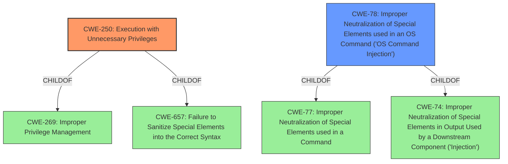

# Analysis Report for CVE-2020-28008

# Vulnerability Analysis Report: CVE-2020-28008

## Description


## Analysis (with Relationship Data)

# Summary
| CWE ID | CWE Name | Confidence | CWE Abstraction Level | CWE Vulnerability Mapping Label | CWE-Vulnerability Mapping Notes |
|---|---|---|---|---|---|
| CWE-250 | Execution with Unnecessary Privileges | 0.9 | Base | Allowed | Primary CWE |
| CWE-78 | Improper Neutralization of Special Elements used in an OS Command ('OS Command Injection') | 0.7 | Base | Allowed | Secondary CWE |

## Evidence and Confidence

*   **Confidence Score:** 0.8
*   **Evidence Strength:** HIGH

## Relationship Analysis
The primary CWE is CWE-250, which indicates that the program is running with more privileges than necessary. The secondary CWE is CWE-78, indicating a command injection vulnerability. CWE-250 is a child of CWE-269 (Improper Privilege Management) and CWE-657 (Failure to Sanitize Special Elements into the Correct Syntax). CWE-78 is a child of CWE-77 (Improper Neutralization of Special Elements used in a Command) and CWE-74 (Improper Neutralization of Special Elements in Output Used by a Downstream Component ('Injection')).



## Vulnerability Chain
The vulnerability chain begins with Exim running with **Execution with Unnecessary Privileges** (CWE-250). This allows an attacker with limited privileges to write to a spool header file. This leads to a crafted recipient address causing **OS Command Injection** (CWE-78), resulting in command execution.

## Summary of Analysis
The initial assessment pointed to CWE-250 as the primary weakness because the vulnerability description explicitly mentions **"Execution with Unnecessary Privileges."** The CVE reference links content summary also supports this by stating that Exim operates as root in its spool directory.

However, the vulnerability also involves the injection of commands via a crafted recipient address, which aligns with CWE-78. This is a consequence of the unnecessary privileges, so it is classified as a secondary weakness.

The evidence supports these classifications because it is stated that an attacker can write to a spool header file, in which a crafted recipient address can indirectly lead to command execution.

The graph relationships reinforce the selection of CWE-250 as the root cause, enabling the subsequent CWE-78. The unnecessary privileges allow the attacker to manipulate the system in a way that would not be possible otherwise, resulting in the command injection vulnerability.

CWE-250 and CWE-78 are at the Base level of specificity, which is optimal for capturing the root cause and mechanism of the vulnerability.

Other CWEs Considered but Not Used:

*   CWE-20: Improper Input Validation - This is a higher-level class and not as specific as CWE-78, which directly addresses the command injection aspect of the vulnerability.
*   CWE-59: Improper Link Resolution Before File Access ('Link Following') - This is related to symlink attacks within the spool directory, but is not the primary attack vector described in the vulnerability.
*   CWE-367: Time-of-check Time-of-use (TOCTOU) Race Condition & CWE-362: Concurrent Execution using Shared Resource with Improper Synchronization ('Race Condition') - These are related to concurrency issues, but the primary vulnerability is not a race condition.
*   CWE-403: Exposure of File Descriptor to Unintended Control Sphere ('File Descriptor Leak') - While file system related, it does not apply to the described vulnerability.
*   CWE-190: Integer Overflow or Wraparound & CWE-128: Wrap-around Error - These relate to integer manipulation, not the primary vulnerability.


## CWE Relationship Analysis

Current CWEs represent these abstraction levels: .


### Vulnerability Chain Analysis

**Chain starting from CWE-657:**
- 657 (Violation of Secure Design Principles) - ROOT


**Chain starting from CWE-128:**
- 128 (Wrap-around Error) - ROOT


### CWE Relationship Diagram

```mermaid
graph TD
    classDef primary fill:#f96,stroke:#333,stroke-width:2px
    classDef secondary fill:#69f,stroke:#333
    classDef tertiary fill:#9e9,stroke:#333
```


*Report generated on 2025-04-02 12:05:53*
