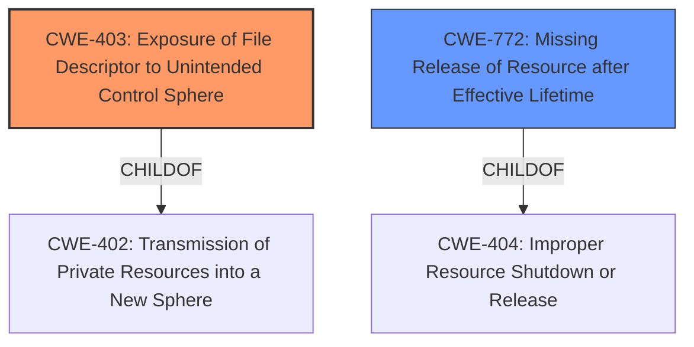

# Analysis for CVE-2020-28012

# Summary
| CWE ID | CWE Name | Confidence | CWE Abstraction Level | CWE Vulnerability Mapping Label | CWE-Vulnerability Mapping Notes |
|---|---|---|---|---|---|
| CWE-403 | Exposure of File Descriptor to Unintended Control Sphere ('File Descriptor Leak') | 1.0 | Base | Allowed | Primary CWE |
| CWE-772 | Missing Release of Resource after Effective Lifetime | 0.6 | Base | Allowed | Secondary CWE |

## Evidence and Confidence

*   **Confidence Score:** 0.9
*   **Evidence Strength:** HIGH

## Relationship Analysis
The primary CWE is CWE-403, which is a Base level CWE. It is a child of CWE-402 (Transmission of Private Resources into a New Sphere ('Resource Leak')), which is a Class level CWE. CWE-772 is a child of CWE-404 and peer of CWE-405.

## Vulnerability Chain
The vulnerability chain starts with the **missing close-on-exec flag**, which leads to the **exposure of a file descriptor to an unintended control sphere**. This allows an unprivileged process to write to a privileged pipe, potentially leading to local privilege escalation.

## Summary of Analysis
The initial assessment pointed strongly towards CWE-403, given the vulnerability description and the CVE summary both explicitly mention "**Exposure of File Descriptor to Unintended Control Sphere**". The analysis also considered CWE-772 since the file descriptor was not released.

The evidence provided in the vulnerability description and CVE Reference Links Content Summary sections clearly supports the classification. The CVE summary states that "The write end of this communication pipe is not set to close-on-exec, meaning that the file descriptor for the pipe remains open in the spawned filter process." This directly aligns with the description of CWE-403.

CWE-403 is at the Base level of abstraction, which is the preferred level.

**CWE-403: Exposure of File Descriptor to Unintended Control Sphere ('File Descriptor Leak')**
*   **How the vulnerability's details match the CWE's characteristics:** The vulnerability occurs because the rda\_interpret function in Exim uses a privileged pipe that lacks a close-on-exec flag. This means that the file descriptor for the pipe remains open in child processes (unintended control sphere), allowing them to perform unauthorized I/O operations.
*   **The security implications and potential impact:** This allows an unprivileged local attacker to write crafted data through the pipe to the privileged Exim process, leading to local privilege escalation.
*   **Any parent-child relationships or chain patterns that influenced your mapping:** CWE-403 is a child of CWE-402 (Transmission of Private Resources into a New Sphere ('Resource Leak')).
*   **Whether the weakness is primary or secondary in the vulnerability:** This is the primary weakness.
*   **How the official MITRE mapping guidance influenced your decision:** The mapping guidance states that CWE-403 is at the Base level of abstraction, which is preferred, and the description aligns well with the vulnerability.

**CWE-772: Missing Release of Resource after Effective Lifetime**
*   **How the vulnerability's details match the CWE's characteristics:** The file descriptor is not closed after the child process no longer needs it.
*   **The security implications and potential impact:** While the primary impact is the exposure, a secondary concern is the potential for resource exhaustion if many file descriptors are left open.
*   **Any parent-child relationships or chain patterns that influenced your mapping:** CWE-772 is a child of CWE-404 (Improper Resource Shutdown or Release).
*   **Whether the weakness is primary or secondary in the vulnerability:** This is a secondary weakness.
*   **How the official MITRE mapping guidance influenced your decision:** The mapping guidance states that CWE-772 is at the Variant level of abstraction, which is preferred, and the description aligns well with the vulnerability.

**CWEs Considered But Not Used:**

*   **CWE-668: Exposure of Resource to Wrong Sphere:** While this is related, it is a higher-level Class CWE, and CWE-403 provides a more specific description of the vulnerability. The mapping guidance discourages its use when lower-level CWEs are applicable.
*   **CWE-404: Improper Resource Shutdown or Release:** This is a Class level CWE. The more specific CWE-772 is more appropriate.
*   **CWE-497: Exposure of Sensitive System Information to an Unauthorized Control Sphere:** This CWE focuses on the exposure of system-level information, which is not the primary concern here. The vulnerability is about the exposure of a file descriptor.
*   **CWE-59: Improper Link Resolution Before File Access ('Link Following'):** This is not relevant because the vulnerability is not related to symbolic links or path traversal.

# Enhanced Query for CVE-2020-28012

## Vulnerability Description
Exim 4 before 4.94.2 allows **Exposure of File Descriptor to Unintended Control Sphere** because rda_interpret uses a privileged pipe that lacks a close-on-exec flag.

### Vulnerability Description Key Phrases
- **rootcause:** **Exposure of File Descriptor to Unintended Control Sphere**
- **product:** Exim
- **version:** 4 before 4.94.2
- **component:** rda_interpret

## CVE Reference Links Content Summary
Based on the provided content, here's a breakdown of CVE-2020-28012:

**Root Cause of Vulnerability:**
The Exim mail server, when configured to allow exim filters (allow\_filter is true), creates a pipe for communication between the privileged Exim process (running as root) and an unprivileged filter process. The write end of this communication pipe is not set to close-on-exec, meaning that the file descriptor for the pipe remains open in the spawned filter process. This allows the unprivileged filter process to write to the pipe.

**Weaknesses/Vulnerabilities Present:**
- **Missing close-on-exec flag:** The core vulnerability lies in the lack of the close-on-exec flag for the writable end of the communication pipe. This is a common vulnerability where file descriptors are inherited by child processes.
- **Abuse of rda\_interpret():** The privileged Exim process reads data from the pipe using `rda_interpret()`. It reads an integer representing the filter type, another integer for a size, and two strings based on the size specified. This design allows for a heap-based back-jump and forward-overflow primitive if a negative size is provided.

**Impact of Exploitation:**
- **Local Privilege Escalation (LPE):** An unprivileged local attacker can exploit this vulnerability to gain full root privileges. The attacker does this by writing crafted data through the pipe to the privileged Exim process. The crafted data will cause a controlled overwrite of a file path which leads to the ability to append content to `/etc/passwd`.

**Attack Vectors:**
- **Local Access:** The attacker must be able to execute code as an unprivileged user on the system where Exim is running, and allow_filter must be set to true.
- **Pipe Communication:** The attacker sends crafted data through the writable end of the pipe created for the exim filter process.

**Required Attacker Capabilities/Position:**
- The attacker needs to be a local user on the system where Exim is running with the `allow_filter` option enabled.
- The attacker needs to be able to execute code as an unprivileged local user.
- The attacker needs to be able to create an "exim filter" which runs in an unprivileged process.

**Technical Details:**
- The vulnerability occurs during the processing of an "exim filter". The unprivileged process writes data to the pipe using a file descriptor that should have been closed.
- The privileged process reads the data, which includes the length of the string.
- By manipulating the length to be a negative integer, it can cause a "back-jump" primitive, and perform a controlled overwrite in Exim's heap, specifically a file path variable `file_path`.
- The overwritten file\_path is used to open log files with `open_log()`. By writing to the path for panic logs the attacker can append arbitrary content to the file system.

This vulnerability is not directly related to the typical injection vulnerabilities seen in web applications. It exploits the combination of a missing close-on-exec flag and an integer overflow, which allows controlled memory corruption leading to local privilege escalation.

## Retriever Results

### Top Combined Results

| Rank | CWE ID | Name | Abstraction | Usage  | Retrievers | Individual Scores |
|------|--------|------|-------------|-------|------------|-------------------|
| 1 | 403 | Exposure of File Descriptor to Unintended Control Sphere ('File Descriptor Leak') | Base | Allowed | sparse | 0.401 |
| 2 | 668 | Exposure of Resource to Wrong Sphere | Class | Discouraged | sparse | 0.208 |
| 3 | 404 | Improper Resource Shutdown or Release | Class | Allowed-with-Review | sparse | 0.177 |
| 4 | 497 | Exposure of Sensitive System Information to an Unauthorized Control Sphere | Base | Allowed | sparse | 0.170 |
| 5 | 59 | Improper Link Resolution Before File Access ('Link Following') | Base | Allowed | sparse | 0.162 |
| 6 | 529 | Exposure of Access Control List Files to an Unauthorized Control Sphere | Variant | Allowed | dense | 0.525 |
| 7 | 619 | Dangling Database Cursor ('Cursor Injection') | Base | Allowed | graph | 0.003 |
| 8 | 775 | Missing Release of File Descriptor or Handle after Effective Lifetime | Variant | Allowed | sparse | 0.161 |
| 9 | 402 | Transmission of Private Resources into a New Sphere ('Resource Leak') | Class | Allowed-with-Review | sparse | 0.156 |
| 10 | 250 | Execution with Unnecessary Privileges | Base | Allowed | sparse | 0.149 |

# Complete CWE Specifications

## CWE-403: Exposure of File Descriptor to Unintended Control Sphere ('File Descriptor Leak')
**Abstraction:** Base
**Status:** Draft

### Description
A process does not close sensitive file descriptors before invoking a child process, which allows the child to perform unauthorized I/O operations using those descriptors.

### Extended Description
When a new process is forked or executed, the child process inherits any open file descriptors. When the child process has fewer privileges than the parent process, this might introduce a vulnerability if the child process can access the file descriptor but does not have the privileges to access the associated file.

### Alternative Terms
File descriptor leak: While this issue is frequently called a file descriptor leak, the "leak" term is often used in two different ways - exposure of a resource, or consumption of a resource. Use of this term could cause confusion.

### Relationships
ChildOf -> CWE-402

### Mapping Guidance
**Usage:** Allowed
**Rationale:** This CWE entry is at the Base level of abstraction, which is a preferred level of abstraction for mapping to the root causes of vulnerabilities.
**Comments:** Carefully read both the name and description to ensure that this mapping is an appropriate fit. Do not try to 'force' a mapping to a lower-level Base/Variant simply to comply with this preferred level of abstraction.
**Reasons:**
- Acceptable-Use

### Observed Examples
- **CVE-2003-0740:** Server leaks a privileged file descriptor, allowing the server to be hijacked.
- **CVE-2004-1033:** File descriptor leak allows read of restricted files.
- **CVE-2000-0094:** Access to restricted resource using modified file descriptor for stderr.

## CWE-668: Exposure of Resource to Wrong Sphere
**Abstraction:** Class
**Status:** Draft

### Description
The product exposes a resource to the wrong control sphere, providing unintended actors with inappropriate access to the resource.

### Extended Description

Resources such as files and directories may be inadvertently exposed through mechanisms such as insecure permissions, or when a program accidentally operates on the wrong object. For example, a program may intend that private files can only be provided to a specific user. This effectively defines a control sphere that is intended to prevent attackers from accessing these private files. If the file permissions are insecure, then parties other than the user will be able to access those files.

A separate control sphere might effectively require that the user can only access the private files, but not any other files on the system. If the program does not ensure that the user is only requesting private files, then the user might be able to access other files on the system.

In either case, the end result is that a resource has been exposed to the wrong party.

### Alternative Terms
None

### Relationships
ChildOf -> CWE-664

### Mapping Guidance
**Usage:** Discouraged
**Rationale:** CWE-668 is high-level and is often misused as a catch-all when lower-level CWE IDs might be applicable. It is sometimes used for low-information vulnerability reports [REF-1287]. It is a level-1 Class (i.e., a child of a Pillar). It is not useful for trend analysis.
**Comments:** Closely analyze the specific mistake that is allowing the resource to be exposed, and perform a CWE mapping for that mistake.
**Reasons:**
- Frequent Misuse
- Abstraction

### Additional Notes
**[Theoretical]** A "control sphere" is a set of resources and behaviors that are accessible to a single actor, or a group of actors. A product's security model will typically define multiple spheres, possibly implicitly. For example, a server might define one sphere for "administrators" who can create new user accounts with subdirectories under /home/server/, and a second sphere might cover the set of users who can create or delete files within their own subdirectories. A third sphere might be "users who are authenticated to the operating system on which the product is installed." Each sphere has different sets of actors and allowable behaviors.

## CWE-404: Improper Resource Shutdown or Release
**Abstraction:** Class
**Status:** Draft

### Description
The product does not release or incorrectly releases a resource before it is made available for re-use.

### Extended Description
When a resource is created or allocated, the developer is responsible for properly releasing the resource as well as accounting for all potential paths of expiration or invalidation, such as a set period of time or revocation.

### Alternative Terms
None

### Relationships
ChildOf -> CWE-664
PeerOf -> CWE-405
CanPrecede -> CWE-619

### Mapping Guidance
**Usage:** Allowed-with-Review
**Rationale:** This CWE entry is a Class and might have Base-level children that would be more appropriate
**Comments:** Examine children of this entry to see if there is a better fit
**Reasons:**
- Abstraction

### Additional Notes
**[Relationship]** Overlaps memory leaks, asymmetric resource consumption, malformed input errors.

### Observed Examples
- **CVE-1999-1127:** Does not shut down named pipe connections if malformed data is sent.
- **CVE-2001-0830:** Sockets not properly closed when attacker repeatedly connects and disconnects from server.
- **CVE-2002-1372:** Chain: Return values of file/socket operations are not checked (CWE-252), allowing resultant consumption of file descriptors (CWE-772).

## CWE-497: Exposure of Sensitive System Information to an Unauthorized Control Sphere
**Abstraction:** Base
**Status:** Incomplete

### Description
The product does not properly prevent sensitive system-level information from being accessed by unauthorized actors who do not have the same level of access to the underlying system as the product does.

### Extended Description

Network-based products, such as web applications, often run on top of an operating system or similar environment. When the product communicates with outside parties, details about the underlying system are expected to remain hidden, such as path names for data files, other OS users, installed packages, the application environment, etc. This system information may be provided by the product itself, or buried within diagnostic or debugging messages. Debugging information helps an adversary learn about the system and form an attack plan.

An information exposure occurs when system data or debugging information leaves the program through an output stream or logging function that makes it accessible to unauthorized parties. Using other weaknesses, an attacker could cause errors to occur; the response to these errors can reveal detailed system information, along with other impacts. An attacker can use messages that reveal technologies, operating systems, and product versions to tune the attack against known vulnerabilities in these technologies. A product may use diagnostic methods that provide significant implementation details such as stack traces as part of its error handling mechanism.

### Alternative Terms
None

### Relationships
ChildOf -> CWE-200

### Mapping Guidance
**Usage:** Allowed
**Rationale:** This CWE entry is at the Base level of abstraction, which is a preferred level of abstraction for mapping to the root causes of vulnerabilities.
**Comments:** Carefully read both the name and description to ensure that this mapping is an appropriate fit. Do not try to 'force' a mapping to a lower-level Base/Variant simply to comply with this preferred level of abstraction.
**Reasons:**
- Acceptable-Use

### Observed Examples
- **CVE-2021-32638:** Code analysis product passes access tokens as a command-line parameter or through an environment variable, making them visible to other processes via the ps command.

## CWE-59: Improper Link Resolution Before File Access ('Link Following')
**Abstraction:** Base
**Status:** Draft

### Description
The product attempts to access a file based on the filename, but it does not properly prevent that filename from identifying a link or shortcut that resolves to an unintended resource.

### Extended Description
Not provided

### Alternative Terms
insecure temporary file: Some people use the phrase "insecure temporary file" when referring to a link following weakness, but other weaknesses can produce insecure temporary files without any symlink involvement at all.
Zip Slip: "Zip slip" is an attack that uses file archives (e.g., ZIP, tar, rar, etc.) that contain filenames with path traversal sequences that cause the files to be written outside of the directory under which the archive is expected to be extracted [REF-1282]. It is most commonly used for relative path traversal (CWE-23) and link following (CWE-59).

### Relationships
ChildOf -> CWE-706
ChildOf -> CWE-706

### Mapping Guidance
**Usage:** Allowed
**Rationale:** This CWE entry is at the Base level of abstraction, which is a preferred level of abstraction for mapping to the root causes of vulnerabilities.
**Comments:** Carefully read both the name and description to ensure that this mapping is an appropriate fit. Do not try to 'force' a mapping to a lower-level Base/Variant simply to comply with this preferred level of abstraction.
**Reasons:**
- Acceptable-Use

### Additional Notes
**[Theoretical]** 

Link following vulnerabilities are Multi-factor Vulnerabilities (MFV). They are the combination of multiple elements: file or directory permissions, filename predictability, race conditions, and in some cases, a design limitation in which there is no mechanism for performing atomic file creation operations.

Some potential factors are race conditions, permissions, and predictability.

### Observed Examples
- **CVE-1999-1386:** Some versions of Perl follow symbolic links when running with the -e option, which allows local users to overwrite arbitrary files via a symlink attack.
- **CVE-2000-1178:** Text editor follows symbolic links when creating a rescue copy during an abnormal exit, which allows local users to overwrite the files of other users.
- **CVE-2004-0217:** Antivirus update allows local users to create or append to arbitrary files via a symlink attack on a logfile.

## CWE-529: Exposure of Access Control List Files to an Unauthorized Control Sphere
**Abstraction:** Variant
**Status:** Incomplete

### Description
The product stores access control list files in a directory or other container that is accessible to actors outside of the intended control sphere.

### Extended Description
Exposure of these access control list files may give the attacker information about the configuration of the site or system. This information may then be used to bypass the intended security policy or identify trusted systems from which an attack can be launched.

### Alternative Terms
None

### Relationships
ChildOf -> CWE-552

### Mapping Guidance
**Usage:** Allowed
**Rationale:** This CWE entry is at the Variant level of abstraction, which is a preferred level of abstraction for mapping to the root causes of vulnerabilities.
**Comments:** Carefully read both the name and description to ensure that this mapping is an appropriate fit. Do not try to 'force' a mapping to a lower-level Base/Variant simply to comply with this preferred level of abstraction.
**Reasons:**
- Acceptable-Use

## CWE-619: Dangling Database Cursor ('Cursor Injection')
**Abstraction:** Base
**Status:** Incomplete

### Description
If a database cursor is not closed properly, then it could become accessible to other users while retaining the same privileges that were originally assigned, leaving the cursor "dangling."

### Extended Description
For example, an improper dangling cursor could arise from unhandled exceptions. The impact of the issue depends on the cursor's role, but SQL injection attacks are commonly possible.

### Alternative Terms
None

### Relationships
ChildOf -> CWE-402

### Mapping Guidance
**Usage:** Allowed
**Rationale:** This CWE entry is at the Base level of abstraction, which is a preferred level of abstraction for mapping to the root causes of vulnerabilities.
**Comments:** Carefully read both the name and description to ensure that this mapping is an appropriate fit. Do not try to 'force' a mapping to a lower-level Base/Variant simply to comply with this preferred level of abstraction.
**Reasons:**
- Acceptable-Use

## CWE-775: Missing Release of File Descriptor or Handle after Effective Lifetime
**Abstraction:** Variant
**Status:** Incomplete

### Description
The product does not release a file descriptor or handle after its effective lifetime has ended, i.e., after the file descriptor/handle is no longer needed.

### Extended Description
When a file descriptor or handle is not released after use (typically by explicitly closing it), attackers can cause a denial of service by consuming all available file descriptors/handles, or otherwise preventing other system processes from obtaining their own file descriptors/handles.

### Alternative Terms
None

### Relationships
ChildOf -> CWE-772
ChildOf -> CWE-404
ChildOf -> CWE-404

### Mapping Guidance
**Usage:** Allowed
**Rationale:** This CWE entry is at the Variant level of abstraction, which is a preferred level of abstraction for mapping to the root causes of vulnerabilities.
**Comments:** Carefully read both the name and description to ensure that this mapping is an appropriate fit. Do not try to 'force' a mapping to a lower-level Base/Variant simply to comply with this preferred level of abstraction.
**Reasons:**
- Acceptable-Use

### Observed Examples
- **CVE-2007-0897:** Chain: anti-virus product encounters a malformed file but returns from a function without closing a file descriptor (CWE-775) leading to file descriptor consumption (CWE-400) and failed scans.

## CWE-402: Transmission of Private Resources into a New Sphere ('Resource Leak')
**Abstraction:** Class
**Status:** Draft

### Description
The product makes resources available to untrusted parties when those resources are only intended to be accessed by the product.

### Extended Description
Not provided

### Alternative Terms
Resource Leak

### Relationships
ChildOf -> CWE-668

### Mapping Guidance
**Usage:** Allowed-with-Review
**Rationale:** This CWE entry is a Class and might have Base-level children that would be more appropriate
**Comments:** Examine children of this entry to see if there is a better fit
**Reasons:**
- Abstraction

### Observed Examples
- **CVE-2003-0740:** Server leaks a privileged file descriptor, allowing the server to be hijacked.
- **CVE-2004-1033:** File descriptor leak allows read of restricted files.

## CWE-250: Execution with Unnecessary Privileges
**Abstraction:** Base
**Status:** Draft

### Description
The product performs an operation at a privilege level that is higher than the minimum level required, which creates new weaknesses or amplifies the consequences of other weaknesses.

### Extended Description

New weaknesses can be exposed because running with extra privileges, such as root or Administrator, can disable the normal security checks being performed by the operating system or surrounding environment. Other pre-existing weaknesses can turn into security vulnerabilities if they occur while operating at raised privileges.

Privilege management functions can behave in some less-than-obvious ways, and they have different quirks on different platforms. These inconsistencies are particularly pronounced if you are transitioning from one non-root user to another. Signal handlers and spawned processes run at the privilege of the owning process, so if a process is running as root when a signal fires or a sub-process is executed, the signal handler or sub-process will operate with root privileges.

### Alternative Terms
None

### Relationships
ChildOf -> CWE-269
ChildOf -> CWE-657

### Mapping Guidance
**Usage:** Allowed
**Rationale:** This CWE entry is at the Base level of abstraction, which is a preferred level of abstraction for mapping to the root causes of vulnerabilities.
**Comments:** Carefully read both the name and description to ensure that this mapping is an appropriate fit. Do not try to 'force' a mapping to a lower-level Base/Variant simply to comply with this preferred level of abstraction.
**Reasons:**
- Acceptable-Use

### Additional Notes
**[Relationship]** There is a close association with CWE-653 (Insufficient Separation of Privileges). CWE-653 is about providing separate components for each privilege; CWE-250 is about ensuring that each component has the least amount of privileges possible.

**[Maintenance]** CWE-271, CWE-272, and CWE-250 are all closely related and possibly overlapping. CWE-271 is probably better suited as a category. Both CWE-272 and CWE-250 are in active use by the community. The "least privilege" phrase has multiple interpretations.

**[Maintenance]** The Taxonomy_Mappings to ISA/IEC 62443 were added in CWE 4.10, but they are still under review and might change in future CWE versions. These draft mappings were performed by members of the "Mapping CWE to 62443" subgroup of the CWE-CAPEC ICS/OT Special Interest Group (SIG), and their work is incomplete as of CWE 4.10. The mappings are included to facilitate discussion and review by the broader ICS/OT community, and they are likely to change in future CWE versions.

### Observed Examples
- **CVE-2007-4217:** FTP client program on a certain OS runs with setuid privileges and has a buffer overflow. Most clients do not need extra privileges, so an overflow is not a vulnerability for those clients.
- **CVE-2008-1877:** Program runs with privileges and calls another program with the same privileges, which allows read of arbitrary files.
- **CVE-2007-5159:** OS incorrectly installs a program with setuid privileges, allowing users to gain privileges.

