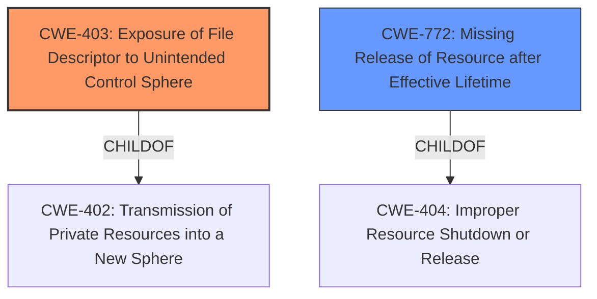

# Analysis Report for CVE-2020-28012

# Vulnerability Analysis Report: CVE-2020-28012

## Description


## Analysis (with Relationship Data)

# Summary
| CWE ID | CWE Name | Confidence | CWE Abstraction Level | CWE Vulnerability Mapping Label | CWE-Vulnerability Mapping Notes |
|---|---|---|---|---|---|
| CWE-403 | Exposure of File Descriptor to Unintended Control Sphere ('File Descriptor Leak') | 1.0 | Base | Allowed | Primary CWE |
| CWE-772 | Missing Release of Resource after Effective Lifetime | 0.6 | Base | Allowed | Secondary CWE |

## Evidence and Confidence

*   **Confidence Score:** 0.9
*   **Evidence Strength:** HIGH

## Relationship Analysis
The primary CWE is CWE-403, which is a Base level CWE. It is a child of CWE-402 (Transmission of Private Resources into a New Sphere ('Resource Leak')), which is a Class level CWE. CWE-772 is a child of CWE-404 and peer of CWE-405.



## Vulnerability Chain
The vulnerability chain starts with the **missing close-on-exec flag**, which leads to the **exposure of a file descriptor to an unintended control sphere**. This allows an unprivileged process to write to a privileged pipe, potentially leading to local privilege escalation.

## Summary of Analysis
The initial assessment pointed strongly towards CWE-403, given the vulnerability description and the CVE summary both explicitly mention "**Exposure of File Descriptor to Unintended Control Sphere**". The analysis also considered CWE-772 since the file descriptor was not released.

The evidence provided in the vulnerability description and CVE Reference Links Content Summary sections clearly supports the classification. The CVE summary states that "The write end of this communication pipe is not set to close-on-exec, meaning that the file descriptor for the pipe remains open in the spawned filter process." This directly aligns with the description of CWE-403.

CWE-403 is at the Base level of abstraction, which is the preferred level.

**CWE-403: Exposure of File Descriptor to Unintended Control Sphere ('File Descriptor Leak')**
*   **How the vulnerability's details match the CWE's characteristics:** The vulnerability occurs because the rda\_interpret function in Exim uses a privileged pipe that lacks a close-on-exec flag. This means that the file descriptor for the pipe remains open in child processes (unintended control sphere), allowing them to perform unauthorized I/O operations.
*   **The security implications and potential impact:** This allows an unprivileged local attacker to write crafted data through the pipe to the privileged Exim process, leading to local privilege escalation.
*   **Any parent-child relationships or chain patterns that influenced your mapping:** CWE-403 is a child of CWE-402 (Transmission of Private Resources into a New Sphere ('Resource Leak')).
*   **Whether the weakness is primary or secondary in the vulnerability:** This is the primary weakness.
*   **How the official MITRE mapping guidance influenced your decision:** The mapping guidance states that CWE-403 is at the Base level of abstraction, which is preferred, and the description aligns well with the vulnerability.

**CWE-772: Missing Release of Resource after Effective Lifetime**
*   **How the vulnerability's details match the CWE's characteristics:** The file descriptor is not closed after the child process no longer needs it.
*   **The security implications and potential impact:** While the primary impact is the exposure, a secondary concern is the potential for resource exhaustion if many file descriptors are left open.
*   **Any parent-child relationships or chain patterns that influenced your mapping:** CWE-772 is a child of CWE-404 (Improper Resource Shutdown or Release).
*   **Whether the weakness is primary or secondary in the vulnerability:** This is a secondary weakness.
*   **How the official MITRE mapping guidance influenced your decision:** The mapping guidance states that CWE-772 is at the Variant level of abstraction, which is preferred, and the description aligns well with the vulnerability.

**CWEs Considered But Not Used:**

*   **CWE-668: Exposure of Resource to Wrong Sphere:** While this is related, it is a higher-level Class CWE, and CWE-403 provides a more specific description of the vulnerability. The mapping guidance discourages its use when lower-level CWEs are applicable.
*   **CWE-404: Improper Resource Shutdown or Release:** This is a Class level CWE. The more specific CWE-772 is more appropriate.
*   **CWE-497: Exposure of Sensitive System Information to an Unauthorized Control Sphere:** This CWE focuses on the exposure of system-level information, which is not the primary concern here. The vulnerability is about the exposure of a file descriptor.
*   **CWE-59: Improper Link Resolution Before File Access ('Link Following'):** This is not relevant because the vulnerability is not related to symbolic links or path traversal.


## CWE Relationship Analysis

Current CWEs represent these abstraction levels: .


### Vulnerability Chain Analysis

**Chain starting from CWE-402:**
- 402 (Transmission of Private Resources into a New Sphere ('Resource Leak')) - ROOT


**Chain starting from CWE-404:**
- 404 (Improper Resource Shutdown or Release) - ROOT


### CWE Relationship Diagram

```mermaid
graph TD
    classDef primary fill:#f96,stroke:#333,stroke-width:2px
    classDef secondary fill:#69f,stroke:#333
    classDef tertiary fill:#9e9,stroke:#333
```


*Report generated on 2025-04-02 03:38:40*
