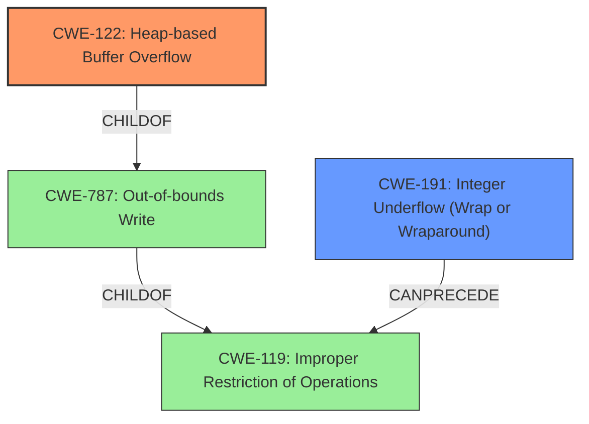

# Enhanced Analysis for CVE-2020-28013

# Summary
| CWE ID | CWE Name | Confidence | CWE Abstraction Level | CWE Vulnerability Mapping Label | CWE-Vulnerability Mapping Notes |
|---|---|---|---|---|---|
| CWE-122 | Heap-based Buffer Overflow | 1.0 | Variant | Primary | Allowed |
| CWE-191 | Integer Underflow (Wrap or Wraparound) | 0.8 | Base | Secondary | Allowed |

## Evidence and Confidence

*   **Confidence Score:** 0.9
*   **Evidence Strength:** HIGH

## Relationship Analysis
The primary weakness is a heap-based buffer overflow (CWE-122), which is a variant of the more general out-of-bounds write (CWE-787). The root cause stems from mishandling negative sizes in `strncpy`, leading to an integer underflow (CWE-191), which then results in the buffer overflow. CWE-191 can precede CWE-119 (Improper Restriction of Operations within the Bounds of a Memory Buffer), and CWE-122 is a child of CWE-787 (Out-of-bounds Write), which in turn is a child of CWE-119.



## Vulnerability Chain
The vulnerability chain starts with the **mishandling of negative sizes** (potentially caused by an integer underflow CWE-191), which leads to a **heap-based buffer overflow** (CWE-122), ultimately resulting in privilege escalation.

## Summary of Analysis
The primary weakness is clearly a heap-based buffer overflow (CWE-122), as the `strncpy` function writes past the allocated buffer on the heap due to a negative size being interpreted as a large unsigned value. The vulnerability description and CVE Reference Links Content Summary provide strong evidence for this. The root cause appears to be an integer underflow (CWE-191) when calculating the size parameter for `strncpy`.

The evidence supports the selection of CWE-122 as the primary CWE because the **heap-based buffer overflow** is explicitly mentioned in the vulnerability description and the CVE Reference Links Content Summary. "The `strncpy()` function, when given a negative size, interprets it as a very large unsigned value causing it to write past the allocated buffer."

CWE-191 is chosen as a secondary CWE to explain how the negative size occurs in the first place. "The vulnerability occurs when the variables `s` and `ss` are both equal to `end`, and then `ss` is decremented. The subsequent calculation `ss-s` results in `-1`." This is an example of an integer underflow.

The retriever results identified CWE-119 (Improper Restriction of Operations within the Bounds of a Memory Buffer) as a top candidate, but this is a Class-level CWE and is too general. CWE-122 is a more specific Variant of CWE-787 (Out-of-bounds Write), which is a child of CWE-119, making CWE-122 a more accurate representation of the vulnerability.

CWE-190 (Integer Overflow or Wraparound) was also considered, but the vulnerability involves a subtraction resulting in a negative value, which aligns better with CWE-191 (Integer Underflow).

Therefore, CWE-122 and CWE-191 are the most appropriate CWEs, accurately capturing the weakness and its root cause, respectively.

Relevant CWE Information:

# Enhanced Context (25 CWEs)
The following CWEs were identified as potentially relevant to this vulnerability:

## CWE-191: Integer Underflow (Wrap or Wraparound)
**Abstraction Level**: Base
**Similarity Score**: 0.78
**Source**: dense

**Description**:
The product subtracts one value from another, such that the result is less than the minimum allowable integer value, which produces a value that is not equal to the correct result.

**Mapping Guidance**:
- Usage: Allowed
- Rationale: This CWE entry is at the Base level of abstraction, which is a preferred level of abstraction for mapping to the root causes of vulnerabilities.

## CWE-789: Memory Allocation with Excessive Size Value
**Abstraction Level**: Variant
**Similarity Score**: 0.77
**Source**: dense

**Description**:
The product allocates memory based on an untrusted, large size value, but it does not ensure that the size is within expected limits, allowing arbitrary amounts of memory to be allocated.

**Mapping Guidance**:
- Usage: Allowed
- Rationale: This CWE entry is at the Variant level of abstraction, which is a preferred level of abstraction for mapping to the root causes of vulnerabilities.

## CWE-131: Incorrect Calculation of Buffer Size
**Abstraction Level**: Base
**Similarity Score**: 0.77
**Source**: dense

**Description**:
The product does not correctly calculate the size to be used when allocating a buffer, which could lead to a buffer overflow.

**Mapping Guidance**:
- Usage: Allowed
- Rationale: This CWE entry is at the Base level of abstraction, which is a preferred level of abstraction for mapping to the root causes of vulnerabilities.

## CWE-405: Asymmetric Resource Consumption (Amplification)
**Abstraction Level**: Class
**Similarity Score**: 0.76
**Source**: dense

**Description**:
The product does not properly control situations in which an adversary can cause the product to consume or produce excessive resources without requiring the adversary to invest equivalent work or otherwise prove authorization, i.e., the adversary's influence is "asymmetric."

**Mapping Guidance**:
- Usage: Allowed-with-Review
- Rationale: This CWE entry is a Class and might have Base-level children that would be more appropriate

## CWE-124: Buffer Underwrite ('Buffer Underflow')
**Abstraction Level**: Base
**Similarity Score**: 0.76
**Source**: dense

**Description**:
The product writes to a buffer using an index or pointer that references a memory location prior to the beginning of the buffer.

**Mapping Guidance**:
- Usage: Allowed
- Rationale: This CWE entry is at the Base level of abstraction, which is a preferred level of abstraction for mapping to the root causes of vulnerabilities.

## CWE-1325: Improperly Controlled Sequential Memory Allocation
**Abstraction Level**: Base
**Similarity Score**: 0.76
**Source**: dense

**Description**:
The product manages a group of objects or resources and performs a separate memory allocation for each object, but it does not properly limit the total amount of memory that is consumed by all of the combined objects.

**Mapping Guidance**:
- Usage: Allowed
- Rationale: This CWE entry is at the Base level of abstraction, which is a preferred level of abstraction for mapping to the root causes of vulnerabilities.

## CWE-190: Integer Overflow or Wraparound
**Abstraction Level**: Base
**Similarity Score**: 0.76
**Source**: dense

**Description**:
The product performs a calculation that can
         produce an integer overflow or wraparound when the logic
         assumes that the resulting value will always be larger than
         the original value. This occurs when an integer value is
         incremented to a value that is too large to store in the
         associated representation. When this occurs, the value may
         become a very small or negative number.

**Mapping Guidance**:
- Usage: Allowed
- Rationale: This CWE entry is at the Base level of abstraction, which is a preferred level of abstraction for mapping to the root causes of vulnerabilities.

## CWE-126: Buffer Over-read
**Abstraction Level**: Variant
**Similarity Score**: 0.75
**Source**: dense

**Description**:
The product reads from a buffer using buffer access mechanisms such as indexes or pointers that reference memory locations after the targeted buffer.

**Mapping Guidance**:
- Usage: Allowed
- Rationale: This CWE entry is at the Variant level of abstraction, which is a preferred level of abstraction for mapping to the root causes of vulnerabilities.

## CWE-805: Buffer Access with Incorrect Length Value
**Abstraction Level**: Base
**Similarity Score**: 0.75
**Source**: dense

**Description**:
The product uses a sequential operation to read or write a buffer, but it uses an incorrect length value that causes it to access memory that is outside of the bounds of the buffer.

**Mapping Guidance**:
- Usage


## CWE Relationship Analysis

Current CWEs represent these abstraction levels: .


### Vulnerability Chain Analysis

**Chain starting from CWE-787:**
- 787 (Out-of-bounds Write) - ROOT


**Chain starting from CWE-805:**
- 805 (Buffer Access with Incorrect Length Value) - ROOT


### CWE Relationship Diagram

```mermaid
graph TD
    classDef primary fill:#f96,stroke:#333,stroke-width:2px
    classDef secondary fill:#69f,stroke:#333
    classDef tertiary fill:#9e9,stroke:#333
```