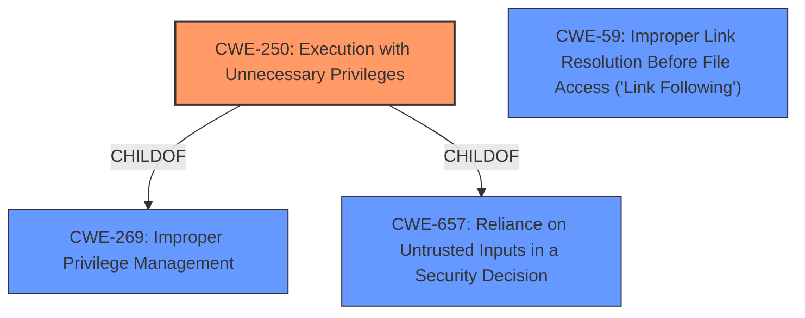

# Enhanced Analysis for CVE-2020-28014

# Summary

| CWE ID | CWE Name | Confidence | CWE Abstraction Level | CWE Vulnerability Mapping Label | CWE-Vulnerability Mapping Notes |
|---|---|---|---|---|---|
| CWE-250 | Execution with Unnecessary Privileges | 0.9 | Base | Allowed | Primary CWE |
| CWE-59 | Improper Link Resolution Before File Access ('Link Following') | 0.6 | Base | Allowed | Secondary Candidate |

## Evidence and Confidence

*   **Confidence Score:** 0.75
*   **Evidence Strength:** HIGH

## Relationship Analysis
The primary relationship that influenced my decision was the ChildOf relationship between CWE-250 and CWE-269 (Improper Privilege Management) and CWE-657 (Reliance on Untrusted Inputs in a Security Decision). While CWE-269 is a broader class, CWE-250 provides a more specific description of the vulnerability. CWE-59 has a PeerOf relationship to other file access issues but is not the primary weakness.



## Vulnerability Chain
The vulnerability chain starts with the Exim mail server using **unnecessary privileges** (CWE-250) when handling the `-oP` option. This allows an attacker to **overwrite root-owned files**, leading to a potential **denial of service**.

## Summary of Analysis
Initially, the most relevant aspect of the vulnerability appeared to be the ability to overwrite files with root privileges. However, after a closer review, the root cause lies in the fact that Exim is executing with unnecessary privileges when handling the `-oP` option, allowing the `exim` user to specify an arbitrary file path for the PID file, which is then created or updated with root privileges. This is a clear case of **Execution with Unnecessary Privileges (CWE-250)**.

The evidence supporting this decision is:

*   **Vulnerability Description:** "Exim 4 before 4.94.2 allows **Execution with Unnecessary Privileges**. The -oP option is available to the exim user, and allows a denial of service because root-owned files can be overwritten."
*   **CVE Reference Links Content Summary:** "The vulnerability stems from the Exim mail server's handling of the `-oP` command-line option...An attacker with `exim` user privileges can use this option to specify an arbitrary file path. When Exim attempts to create or update this pid file, it does so with root privileges."

While **Improper Link Resolution Before File Access ('Link Following') (CWE-59)** was considered, it is a secondary concern. The primary issue is that Exim is running with elevated privileges that it doesn't need, and the `-oP` option exacerbates this problem. If Exim did not run with unnecessary privileges, the ability to specify an arbitrary file path would not be a significant security issue. The evidence for CWE-59 is that the attacker can specify a file and overwrite its content.

I am choosing **CWE-250** as the primary CWE because it directly addresses the root cause of the vulnerability. The `-oP` option allows an attacker to leverage these **unnecessary privileges** to overwrite files and cause a denial of service. This aligns with the description of CWE-250, which states, "The product performs an operation at a privilege level that is higher than the minimum level required, which creates new weaknesses or amplifies the consequences of other weaknesses."

Relevant CWE Information:

*   **CWE-250:** Directly reflects the root cause of the vulnerability: Exim executing with unnecessary privileges.
*   **CWE-59:** A secondary concern related to the file overwrite, but not the primary root cause.

Other CWEs Considered but Not Used:

*   CWE-269 (Improper Privilege Management): Too broad. CWE-250 is more specific.
*   CWE-653 (Improper Isolation or Compartmentalization): Related, but not the primary issue.
*   CWE-266 (Incorrect Privilege Assignment): Not as accurate as CWE-250.
*   CWE-274 (Improper Handling of Insufficient Privileges): Not applicable.
*   CWE-267 (Privilege Defined With Unsafe Actions): Close, but CWE-250 is a better fit.
*   CWE-667 (Improper Locking): Not related.
*   CWE-668 (Exposure of Resource to Wrong Sphere): Too broad.
*   CWE-280 (Improper Handling of Insufficient Permissions or Privileges): Not applicable.
*   CWE-754 (Improper Check for Unusual or Exceptional Conditions): Not related.
*   CWE-404 (Improper Resource Shutdown or Release): Not related.
*   CWE-190 (Integer Overflow or Wraparound): Not related.
*   CWE-362 (Concurrent Execution using Shared Resource with Improper Synchronization ('Race Condition')) - Not related.
*   CWE-367 (Time-of-check Time-of-use (TOCTOU) Race Condition) - Not related.
*   CWE-1284 (Improper Validation of Specified Quantity in Input) - Not related.
*   CWE-123 (Write-what-where Condition) - The content of the written data is not directly controllable.
*   CWE-476 (NULL Pointer Dereference) - Not related.
*   CWE-363 (Race Condition Enabling Link Following) - Only applicable if a race condition is present, which isn't explicit.
*   CWE-681 (Incorrect Conversion between Numeric Types) - Not related.
*   CWE-170 (Improper Null Termination) - Not related.
*   CWE-1284 (Improper Validation of Specified Quantity in Input) - Not related.
*   CWE-416 (Use After Free) - Not related.
*   CWE-125 (Out-of-bounds Read) - Not related.
*   CWE-195 (Signed to Unsigned Conversion Error) - Not related.

The selected CWEs are at the optimal level of specificity, with CWE-250 being a Base-level CWE that accurately represents the root cause.


## CWE Relationship Analysis

Current CWEs represent these abstraction levels: .


### Vulnerability Chain Analysis

**Chain starting from CWE-754:**
- 754 (Improper Check for Unusual or Exceptional Conditions) - ROOT


**Chain starting from CWE-123:**
- 123 (Write-what-where Condition) - ROOT


### CWE Relationship Diagram

```mermaid
graph TD
    classDef primary fill:#f96,stroke:#333,stroke-width:2px
    classDef secondary fill:#69f,stroke:#333
    classDef tertiary fill:#9e9,stroke:#333
```