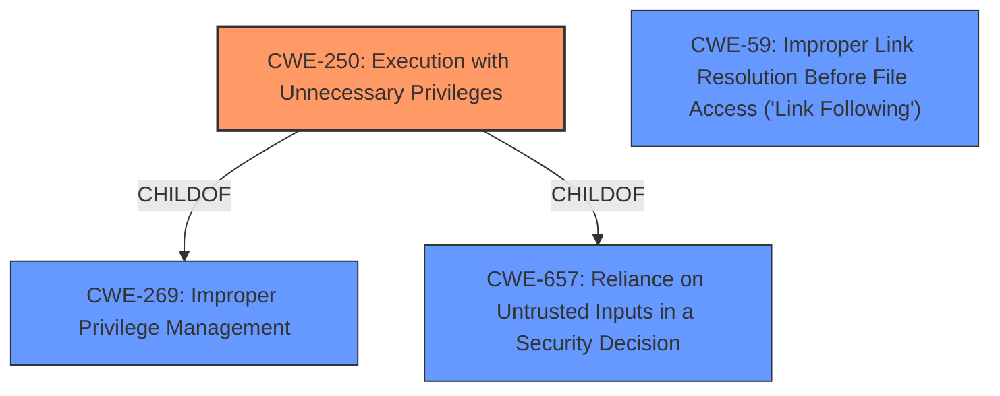

# Analysis for CVE-2020-28014

# Summary

| CWE ID | CWE Name | Confidence | CWE Abstraction Level | CWE Vulnerability Mapping Label | CWE-Vulnerability Mapping Notes |
|---|---|---|---|---|---|
| CWE-250 | Execution with Unnecessary Privileges | 0.9 | Base | Allowed | Primary CWE |
| CWE-59 | Improper Link Resolution Before File Access ('Link Following') | 0.6 | Base | Allowed | Secondary Candidate |

## Evidence and Confidence

*   **Confidence Score:** 0.75
*   **Evidence Strength:** HIGH

## Relationship Analysis
The primary relationship that influenced my decision was the ChildOf relationship between CWE-250 and CWE-269 (Improper Privilege Management) and CWE-657 (Reliance on Untrusted Inputs in a Security Decision). While CWE-269 is a broader class, CWE-250 provides a more specific description of the vulnerability. CWE-59 has a PeerOf relationship to other file access issues but is not the primary weakness.

## Vulnerability Chain
The vulnerability chain starts with the Exim mail server using **unnecessary privileges** (CWE-250) when handling the `-oP` option. This allows an attacker to **overwrite root-owned files**, leading to a potential **denial of service**.

## Summary of Analysis
Initially, the most relevant aspect of the vulnerability appeared to be the ability to overwrite files with root privileges. However, after a closer review, the root cause lies in the fact that Exim is executing with unnecessary privileges when handling the `-oP` option, allowing the `exim` user to specify an arbitrary file path for the PID file, which is then created or updated with root privileges. This is a clear case of **Execution with Unnecessary Privileges (CWE-250)**.

The evidence supporting this decision is:

*   **Vulnerability Description:** "Exim 4 before 4.94.2 allows **Execution with Unnecessary Privileges**. The -oP option is available to the exim user, and allows a denial of service because root-owned files can be overwritten."
*   **CVE Reference Links Content Summary:** "The vulnerability stems from the Exim mail server's handling of the `-oP` command-line option...An attacker with `exim` user privileges can use this option to specify an arbitrary file path. When Exim attempts to create or update this pid file, it does so with root privileges."

While **Improper Link Resolution Before File Access ('Link Following') (CWE-59)** was considered, it is a secondary concern. The primary issue is that Exim is running with elevated privileges that it doesn't need, and the `-oP` option exacerbates this problem. If Exim did not run with unnecessary privileges, the ability to specify an arbitrary file path would not be a significant security issue. The evidence for CWE-59 is that the attacker can specify a file and overwrite its content.

I am choosing **CWE-250** as the primary CWE because it directly addresses the root cause of the vulnerability. The `-oP` option allows an attacker to leverage these **unnecessary privileges** to overwrite files and cause a denial of service. This aligns with the description of CWE-250, which states, "The product performs an operation at a privilege level that is higher than the minimum level required, which creates new weaknesses or amplifies the consequences of other weaknesses."

Relevant CWE Information:

*   **CWE-250:** Directly reflects the root cause of the vulnerability: Exim executing with unnecessary privileges.
*   **CWE-59:** A secondary concern related to the file overwrite, but not the primary root cause.

Other CWEs Considered but Not Used:

*   CWE-269 (Improper Privilege Management): Too broad. CWE-250 is more specific.
*   CWE-653 (Improper Isolation or Compartmentalization): Related, but not the primary issue.
*   CWE-266 (Incorrect Privilege Assignment): Not as accurate as CWE-250.
*   CWE-274 (Improper Handling of Insufficient Privileges): Not applicable.
*   CWE-267 (Privilege Defined With Unsafe Actions): Close, but CWE-250 is a better fit.
*   CWE-667 (Improper Locking): Not related.
*   CWE-668 (Exposure of Resource to Wrong Sphere): Too broad.
*   CWE-280 (Improper Handling of Insufficient Permissions or Privileges): Not applicable.
*   CWE-754 (Improper Check for Unusual or Exceptional Conditions): Not related.
*   CWE-404 (Improper Resource Shutdown or Release): Not related.
*   CWE-190 (Integer Overflow or Wraparound): Not related.
*   CWE-362 (Concurrent Execution using Shared Resource with Improper Synchronization ('Race Condition')) - Not related.
*   CWE-367 (Time-of-check Time-of-use (TOCTOU) Race Condition) - Not related.
*   CWE-1284 (Improper Validation of Specified Quantity in Input) - Not related.
*   CWE-123 (Write-what-where Condition) - The content of the written data is not directly controllable.
*   CWE-476 (NULL Pointer Dereference) - Not related.
*   CWE-363 (Race Condition Enabling Link Following) - Only applicable if a race condition is present, which isn't explicit.
*   CWE-681 (Incorrect Conversion between Numeric Types) - Not related.
*   CWE-170 (Improper Null Termination) - Not related.
*   CWE-1284 (Improper Validation of Specified Quantity in Input) - Not related.
*   CWE-416 (Use After Free) - Not related.
*   CWE-125 (Out-of-bounds Read) - Not related.
*   CWE-195 (Signed to Unsigned Conversion Error) - Not related.

The selected CWEs are at the optimal level of specificity, with CWE-250 being a Base-level CWE that accurately represents the root cause.

# Enhanced Query for CVE-2020-28014

## Vulnerability Description
Exim 4 before 4.94.2 allows Execution with Unnecessary Privileges. The -oP option is available to the exim user, and allows a denial of service because root-owned files can be overwritten.

### Vulnerability Description Key Phrases
- **impact:** denial of service
- **vector:** overwriting root-owned files
- **attacker:** exim user
- **product:** Exim
- **version:** 4 before 4.94.2
- **component:** -oP option

## CVE Reference Links Content Summary
Based on the provided content, here's an analysis of CVE-2020-28014:

**Root Cause of Vulnerability:**

The vulnerability stems from the Exim mail server's handling of the `-oP` command-line option, which is used to override the path for the daemon's PID file. An attacker with `exim` user privileges can use this option to specify an arbitrary file path. When Exim attempts to create or update this pid file, it does so with root privileges.

**Weaknesses/Vulnerabilities Present:**

*   **Arbitrary File Creation/Overwrite:** The `-oP` option allows an attacker to create a file at any location on the filesystem that the root user can access. If the specified file already exists, the content will be overwritten.
*   **Privilege Escalation:** The vulnerability is exploitable due to Exim operating with root privileges when creating or overwriting the specified file.

**Impact of Exploitation:**

*   An attacker can create or overwrite arbitrary files with root privileges.
*   When combined with other vulnerabilities (like CVE-2020-28007 or CVE-2020-28008), this can lead to an attacker gaining full root privileges.

**Attack Vectors:**

*   **Command-Line Option Abuse:** An attacker with access to the `exim` user can invoke the `exim4` binary with the `-oP` option, specifying the arbitrary file path they want to create/overwrite.

**Required Attacker Capabilities/Position:**

*   **Low-Privilege Access:** The attacker needs to have compromised the `exim` user account. This can be achieved by exploiting other vulnerabilities in Exim or other means of compromising the host.
*   **Ability to Execute Commands:** The attacker must have the ability to execute commands as the `exim` user.

**Details Beyond CVE Description**

The provided material gives more detail than a typical CVE description:

*   It provides a code example illustrating how an attacker can use the `-oP` option to create a file.
*   It explains how this vulnerability can be chained with others (CVE-2020-28007 and CVE-2020-28008) to escalate to full root access.
*   The content also mentions that the file content itself is not directly controllable by the attacker, but the overwrite capability alone provides a significant attack vector.
*   It shows the interaction of `-oP` with the `-oX 0` option.

This information goes into more detail than a typical CVE description.

## Retriever Results

### Top Combined Results

| Rank | CWE ID | Name | Abstraction | Usage  | Retrievers | Individual Scores |
|------|--------|------|-------------|-------|------------|-------------------|
| 1 | 250 | Execution with Unnecessary Privileges | Base | Allowed | sparse | 0.081 |
| 2 | 59 | Improper Link Resolution Before File Access ('Link Following') | Base | Allowed | sparse | 0.071 |
| 3 | 122 | Heap-based Buffer Overflow | Variant | Allowed | sparse | 0.057 |
| 4 | 121 | Stack-based Buffer Overflow | Variant | Allowed | sparse | 0.056 |
| 5 | 362 | Concurrent Execution using Shared Resource with Improper Synchronization ('Race Condition') | Class | Allowed-with-Review | sparse | 0.055 |
| 6 | 403 | Exposure of File Descriptor to Unintended Control Sphere ('File Descriptor Leak') | Base | Allowed | dense | 0.435 |
| 7 | 363 | Race Condition Enabling Link Following | Base | Allowed | graph | 0.003 |
| 8 | 190 | Integer Overflow or Wraparound | Base | Allowed | sparse | 0.055 |
| 9 | 144 | Improper Neutralization of Line Delimiters | Variant | Allowed | sparse | 0.054 |
| 10 | 269 | Improper Privilege Management | Class | Discouraged | sparse | 0.054 |

# Complete CWE Specifications

## CWE-250: Execution with Unnecessary Privileges
**Abstraction:** Base
**Status:** Draft

### Description
The product performs an operation at a privilege level that is higher than the minimum level required, which creates new weaknesses or amplifies the consequences of other weaknesses.

### Extended Description

New weaknesses can be exposed because running with extra privileges, such as root or Administrator, can disable the normal security checks being performed by the operating system or surrounding environment. Other pre-existing weaknesses can turn into security vulnerabilities if they occur while operating at raised privileges.

Privilege management functions can behave in some less-than-obvious ways, and they have different quirks on different platforms. These inconsistencies are particularly pronounced if you are transitioning from one non-root user to another. Signal handlers and spawned processes run at the privilege of the owning process, so if a process is running as root when a signal fires or a sub-process is executed, the signal handler or sub-process will operate with root privileges.

### Alternative Terms
None

### Relationships
ChildOf -> CWE-269
ChildOf -> CWE-657

### Mapping Guidance
**Usage:** Allowed
**Rationale:** This CWE entry is at the Base level of abstraction, which is a preferred level of abstraction for mapping to the root causes of vulnerabilities.
**Comments:** Carefully read both the name and description to ensure that this mapping is an appropriate fit. Do not try to 'force' a mapping to a lower-level Base/Variant simply to comply with this preferred level of abstraction.
**Reasons:**
- Acceptable-Use

### Additional Notes
**[Relationship]** There is a close association with CWE-653 (Insufficient Separation of Privileges). CWE-653 is about providing separate components for each privilege; CWE-250 is about ensuring that each component has the least amount of privileges possible.

**[Maintenance]** CWE-271, CWE-272, and CWE-250 are all closely related and possibly overlapping. CWE-271 is probably better suited as a category. Both CWE-272 and CWE-250 are in active use by the community. The "least privilege" phrase has multiple interpretations.

**[Maintenance]** The Taxonomy_Mappings to ISA/IEC 62443 were added in CWE 4.10, but they are still under review and might change in future CWE versions. These draft mappings were performed by members of the "Mapping CWE to 62443" subgroup of the CWE-CAPEC ICS/OT Special Interest Group (SIG), and their work is incomplete as of CWE 4.10. The mappings are included to facilitate discussion and review by the broader ICS/OT community, and they are likely to change in future CWE versions.

### Observed Examples
- **CVE-2007-4217:** FTP client program on a certain OS runs with setuid privileges and has a buffer overflow. Most clients do not need extra privileges, so an overflow is not a vulnerability for those clients.
- **CVE-2008-1877:** Program runs with privileges and calls another program with the same privileges, which allows read of arbitrary files.
- **CVE-2007-5159:** OS incorrectly installs a program with setuid privileges, allowing users to gain privileges.

## CWE-59: Improper Link Resolution Before File Access ('Link Following')
**Abstraction:** Base
**Status:** Draft

### Description
The product attempts to access a file based on the filename, but it does not properly prevent that filename from identifying a link or shortcut that resolves to an unintended resource.

### Extended Description
Not provided

### Alternative Terms
insecure temporary file: Some people use the phrase "insecure temporary file" when referring to a link following weakness, but other weaknesses can produce insecure temporary files without any symlink involvement at all.
Zip Slip: "Zip slip" is an attack that uses file archives (e.g., ZIP, tar, rar, etc.) that contain filenames with path traversal sequences that cause the files to be written outside of the directory under which the archive is expected to be extracted [REF-1282]. It is most commonly used for relative path traversal (CWE-23) and link following (CWE-59).

### Relationships
ChildOf -> CWE-706
ChildOf -> CWE-706

### Mapping Guidance
**Usage:** Allowed
**Rationale:** This CWE entry is at the Base level of abstraction, which is a preferred level of abstraction for mapping to the root causes of vulnerabilities.
**Comments:** Carefully read both the name and description to ensure that this mapping is an appropriate fit. Do not try to 'force' a mapping to a lower-level Base/Variant simply to comply with this preferred level of abstraction.
**Reasons:**
- Acceptable-Use

### Additional Notes
**[Theoretical]** 

Link following vulnerabilities are Multi-factor Vulnerabilities (MFV). They are the combination of multiple elements: file or directory permissions, filename predictability, race conditions, and in some cases, a design limitation in which there is no mechanism for performing atomic file creation operations.

Some potential factors are race conditions, permissions, and predictability.

### Observed Examples
- **CVE-1999-1386:** Some versions of Perl follow symbolic links when running with the -e option, which allows local users to overwrite arbitrary files via a symlink attack.
- **CVE-2000-1178:** Text editor follows symbolic links when creating a rescue copy during an abnormal exit, which allows local users to overwrite the files of other users.
- **CVE-2004-0217:** Antivirus update allows local users to create or append to arbitrary files via a symlink attack on a logfile.

## CWE-122: Heap-based Buffer Overflow
**Abstraction:** Variant
**Status:** Draft

### Description
A heap overflow condition is a buffer overflow, where the buffer that can be overwritten is allocated in the heap portion of memory, generally meaning that the buffer was allocated using a routine such as malloc().

### Extended Description
Not provided

### Alternative Terms
None

### Relationships
ChildOf -> CWE-788
ChildOf -> CWE-787

### Mapping Guidance
**Usage:** Allowed
**Rationale:** This CWE entry is at the Variant level of abstraction, which is a preferred level of abstraction for mapping to the root causes of vulnerabilities.
**Comments:** Carefully read both the name and description to ensure that this mapping is an appropriate fit. Do not try to 'force' a mapping to a lower-level Base/Variant simply to comply with this preferred level of abstraction.
**Reasons:**
- Acceptable-Use

### Additional Notes
**[Relationship]** Heap-based buffer overflows are usually just as dangerous as stack-based buffer overflows.

### Observed Examples
- **CVE-2021-43537:** Chain: in a web browser, an unsigned 64-bit integer is forcibly cast to a 32-bit integer (CWE-681) and potentially leading to an integer overflow (CWE-190). If an integer overflow occurs, this can cause heap memory corruption (CWE-122)
- **CVE-2007-4268:** Chain: integer signedness error (CWE-195) passes signed comparison, leading to heap overflow (CWE-122)
- **CVE-2009-2523:** Chain: product does not handle when an input string is not NULL terminated (CWE-170), leading to buffer over-read (CWE-125) or heap-based buffer overflow (CWE-122).

## CWE-121: Stack-based Buffer Overflow
**Abstraction:** Variant
**Status:** Draft

### Description
A stack-based buffer overflow condition is a condition where the buffer being overwritten is allocated on the stack (i.e., is a local variable or, rarely, a parameter to a function).

### Extended Description
Not provided

### Alternative Terms
Stack Overflow: "Stack Overflow" is often used to mean the same thing as stack-based buffer overflow, however it is also used on occasion to mean stack exhaustion, usually a result from an excessively recursive function call. Due to the ambiguity of the term, use of stack overflow to describe either circumstance is discouraged.

### Relationships
ChildOf -> CWE-788
ChildOf -> CWE-787

### Mapping Guidance
**Usage:** Allowed
**Rationale:** This CWE entry is at the Variant level of abstraction, which is a preferred level of abstraction for mapping to the root causes of vulnerabilities.
**Comments:** Carefully read both the name and description to ensure that this mapping is an appropriate fit. Do not try to 'force' a mapping to a lower-level Base/Variant simply to comply with this preferred level of abstraction.
**Reasons:**
- Acceptable-Use

### Additional Notes
**[Other]** Stack-based buffer overflows can instantiate in return address overwrites, stack pointer overwrites or frame pointer overwrites. They can also be considered function pointer overwrites, array indexer overwrites or write-what-where condition, etc.

### Observed Examples
- **CVE-2021-35395:** Stack-based buffer overflows in SFK for wifi chipset used for IoT/embedded devices, as exploited in the wild per CISA KEV.

## CWE-362: Concurrent Execution using Shared Resource with Improper Synchronization ('Race Condition')
**Abstraction:** Class
**Status:** Draft

### Description
The product contains a concurrent code sequence that requires temporary, exclusive access to a shared resource, but a timing window exists in which the shared resource can be modified by another code sequence operating concurrently.

### Extended Description

A race condition occurs within concurrent environments, and it is effectively a property of a code sequence. Depending on the context, a code sequence may be in the form of a function call, a small number of instructions, a series of program invocations, etc.

A race condition violates these properties, which are closely related:

  - Exclusivity - the code sequence is given exclusive access to the shared resource, i.e., no other code sequence can modify properties of the shared resource before the original sequence has completed execution.

  - Atomicity - the code sequence is behaviorally atomic, i.e., no other thread or process can concurrently execute the same sequence of instructions (or a subset) against the same resource.

A race condition exists when an "interfering code sequence" can still access the shared resource, violating exclusivity.

The interfering code sequence could be "trusted" or "untrusted." A trusted interfering code sequence occurs within the product; it cannot be modified by the attacker, and it can only be invoked indirectly. An untrusted interfering code sequence can be authored directly by the attacker, and typically it is external to the vulnerable product.

### Alternative Terms
Race Condition

### Relationships
ChildOf -> CWE-691
CanPrecede -> CWE-416
CanPrecede -> CWE-476

### Mapping Guidance
**Usage:** Allowed-with-Review
**Rationale:** This CWE entry is a Class and might have Base-level children that would be more appropriate
**Comments:** Examine children of this entry to see if there is a better fit
**Reasons:**
- Abstraction

### Additional Notes
**[Maintenance]** The relationship between race conditions and synchronization problems (CWE-662) needs to be further developed. They are not necessarily two perspectives of the same core concept, since synchronization is only one technique for avoiding race conditions, and synchronization can be used for other purposes besides race condition prevention.

**[Research Gap]** Race conditions in web applications are under-studied and probably under-reported. However, in 2008 there has been growing interest in this area.

**[Research Gap]** Much of the focus of race condition research has been in Time-of-check Time-of-use (TOCTOU) variants (CWE-367), but many race conditions are related to synchronization problems that do not necessarily require a time-of-check.

**[Research Gap]** From a classification/taxonomy perspective, the relationships between concurrency and program state need closer investigation and may be useful in organizing related issues.

### Observed Examples
- **CVE-2022-29527:** Go application for cloud management creates a world-writable sudoers file that allows local attackers to inject sudo rules and escalate privileges to root by winning a race condition.
- **CVE-2021-1782:** Chain: improper locking (CWE-667) leads to race condition (CWE-362), as exploited in the wild per CISA KEV.
- **CVE-2021-0920:** Chain: mobile platform race condition (CWE-362) leading to use-after-free (CWE-416), as exploited in the wild per CISA KEV.

## CWE-403: Exposure of File Descriptor to Unintended Control Sphere ('File Descriptor Leak')
**Abstraction:** Base
**Status:** Draft

### Description
A process does not close sensitive file descriptors before invoking a child process, which allows the child to perform unauthorized I/O operations using those descriptors.

### Extended Description
When a new process is forked or executed, the child process inherits any open file descriptors. When the child process has fewer privileges than the parent process, this might introduce a vulnerability if the child process can access the file descriptor but does not have the privileges to access the associated file.

### Alternative Terms
File descriptor leak: While this issue is frequently called a file descriptor leak, the "leak" term is often used in two different ways - exposure of a resource, or consumption of a resource. Use of this term could cause confusion.

### Relationships
ChildOf -> CWE-402

### Mapping Guidance
**Usage:** Allowed
**Rationale:** This CWE entry is at the Base level of abstraction, which is a preferred level of abstraction for mapping to the root causes of vulnerabilities.
**Comments:** Carefully read both the name and description to ensure that this mapping is an appropriate fit. Do not try to 'force' a mapping to a lower-level Base/Variant simply to comply with this preferred level of abstraction.
**Reasons:**
- Acceptable-Use

### Observed Examples
- **CVE-2003-0740:** Server leaks a privileged file descriptor, allowing the server to be hijacked.
- **CVE-2004-1033:** File descriptor leak allows read of restricted files.
- **CVE-2000-0094:** Access to restricted resource using modified file descriptor for stderr.

## CWE-363: Race Condition Enabling Link Following
**Abstraction:** Base
**Status:** Draft

### Description
The product checks the status of a file or directory before accessing it, which produces a race condition in which the file can be replaced with a link before the access is performed, causing the product to access the wrong file.

### Extended Description
While developers might expect that there is a very narrow time window between the time of check and time of use, there is still a race condition. An attacker could cause the product to slow down (e.g. with memory consumption), causing the time window to become larger. Alternately, in some situations, the attacker could win the race by performing a large number of attacks.

### Alternative Terms
None

### Relationships
ChildOf -> CWE-367
CanPrecede -> CWE-59

### Mapping Guidance
**Usage:** Allowed
**Rationale:** This CWE entry is at the Base level of abstraction, which is a preferred level of abstraction for mapping to the root causes of vulnerabilities.
**Comments:** Carefully read both the name and description to ensure that this mapping is an appropriate fit. Do not try to 'force' a mapping to a lower-level Base/Variant simply to comply with this preferred level of abstraction.
**Reasons:**
- Acceptable-Use

### Additional Notes
**[Relationship]** This is already covered by the "Link Following" weakness (CWE-59). It is included here because so many people associate race conditions with link problems; however, not all link following issues involve race conditions.

## CWE-190: Integer Overflow or Wraparound
**Abstraction:** Base
**Status:** Stable

### Description
The product performs a calculation that can
         produce an integer overflow or wraparound when the logic
         assumes that the resulting value will always be larger than
         the original value. This occurs when an integer value is
         incremented to a value that is too large to store in the
         associated representation. When this occurs, the value may
         become a very small or negative number.

### Extended Description
Not provided

### Alternative Terms
Overflow: The terms "overflow" and "wraparound" are used interchangeably by some people, but they can have more precise distinctions by others. See Terminology Notes.
Wraparound: The terms "overflow" and "wraparound" are used interchangeably by some people, but they can have more precise distinctions by others. See Terminology Notes.
wrap, wrap-around, wrap around: Alternate spellings of "wraparound"

### Relationships
ChildOf -> CWE-682
ChildOf -> CWE-682
ChildOf -> CWE-20
CanPrecede -> CWE-119

### Mapping Guidance
**Usage:** Allowed
**Rationale:** This CWE entry is at the Base level of abstraction, which is a preferred level of abstraction for mapping to the root causes of vulnerabilities.
**Comments:** Be careful of terminology problems with "overflow," "underflow," and "wraparound" - see Terminology Notes. Carefully read both the name and description to ensure that this mapping is an appropriate fit. Do not try to 'force' a mapping to a lower-level Base/Variant simply to comply with this preferred level of abstraction.
**Reasons:**
- Acceptable-Use
**Suggested Alternatives:**
- CWE-191: Integer Underflow (Wrap or Wraparound). Consider CWE-191 when the result is less than the minimum value that can be represented (sometimes called "underflows").

### Additional Notes
**[Relationship]** Integer overflows can be primary to buffer overflows when they cause less memory to be allocated than expected.

**[Terminology]** 

"Integer overflow" is sometimes used to cover several types of errors, including signedness errors, or buffer overflows that involve manipulation of integer data types instead of characters. Part of the confusion results from the fact that 0xffffffff is -1 in a signed context. Other confusion also arises because of the role that integer overflows have in chains.

A "wraparound" is a well-defined, standard behavior that follows specific rules for how to handle situations when the intended numeric value is too large or too small to be represented, as specified in standards such as C11.

"Overflow" is sometimes conflated with "wraparound" but typically indicates a non-standard or undefined behavior.

The "overflow" term is sometimes used to indicate cases where either the maximum or the minimum is exceeded, but others might only use "overflow" to indicate exceeding the maximum while using "underflow" for exceeding the minimum.

Some people use "overflow" to mean any value outside the representable range - whether greater than the maximum, or less than the minimum - but CWE uses "underflow" for cases in which the intended result is less than the minimum.

See [REF-1440] for additional explanation of the ambiguity of terminology.

**[Other]** While there may be circumstances in which the logic intentionally relies on wrapping - such as with modular arithmetic in timers or counters - it can have security consequences if the wrap is unexpected. This is especially the case if the integer overflow can be triggered using user-supplied inputs.

### Observed Examples
- **CVE-2021-43537:** Chain: in a web browser, an unsigned 64-bit integer is forcibly cast to a 32-bit integer (CWE-681) and potentially leading to an integer overflow (CWE-190). If an integer overflow occurs, this can cause heap memory corruption (CWE-122)
- **CVE-2022-21668:** Chain: Python library does not limit the resources used to process images that specify a very large number of bands (CWE-1284), leading to excessive memory consumption (CWE-789) or an integer overflow (CWE-190).
- **CVE-2022-0545:** Chain: 3D renderer has an integer overflow (CWE-190) leading to write-what-where condition (CWE-123) using a crafted image.

## CWE-144: Improper Neutralization of Line Delimiters
**Abstraction:** Variant
**Status:** Draft

### Description
The product receives input from an upstream component, but it does not neutralize or incorrectly neutralizes special elements that could be interpreted as line delimiters when they are sent to a downstream component.

### Extended Description
As data is parsed, an injected/absent/malformed delimiter may cause the process to take unexpected actions.

### Alternative Terms
None

### Relationships
ChildOf -> CWE-140
CanAlsoBe -> CWE-93

### Mapping Guidance
**Usage:** Allowed
**Rationale:** This CWE entry is at the Variant level of abstraction, which is a preferred level of abstraction for mapping to the root causes of vulnerabilities.
**Comments:** Carefully read both the name and description to ensure that this mapping is an appropriate fit. Do not try to 'force' a mapping to a lower-level Base/Variant simply to comply with this preferred level of abstraction.
**Reasons:**
- Acceptable-Use

### Additional Notes
**[Relationship]** Depending on the language and syntax being used, this could be the same as the record delimiter (CWE-143).

### Observed Examples
- **CVE-2002-0267:** Linebreak in field of PHP script allows admin privileges when written to data file.

## CWE-269: Improper Privilege Management
**Abstraction:** Class
**Status:** Draft

### Description
The product does not properly assign, modify, track, or check privileges for an actor, creating an unintended sphere of control for that actor.

### Extended Description
Not provided

### Alternative Terms
None

### Relationships
ChildOf -> CWE-284

### Mapping Guidance
**Usage:** Discouraged
**Rationale:** CWE-269 is commonly misused. It can be conflated with "privilege escalation," which is a technical impact that is listed in many low-information vulnerability reports [REF-1287]. It is not useful for trend analysis.
**Comments:** If an error or mistake allows privilege escalation, then use the CWE ID for that mistake. Avoid using CWE-269 when only phrases such as "privilege escalation" or "gain privileges" are available, as these indicate technical impact of the vulnerability - not the root cause weakness. If the root cause seems to be directly related to privileges, then examine the children of CWE-269 for additional hints, such as Execution with Unnecessary Privileges (CWE-250) or Incorrect Privilege Assignment (CWE-266).
**Reasons:**
- Frequent Misuse

### Additional Notes
**[Maintenance]** The relationships between privileges, permissions, and actors (e.g. users and groups) need further refinement within the Research view. One complication is that these concepts apply to two different pillars, related to control of resources (CWE-664) and protection mechanism failures (CWE-693).

### Observed Examples
- **CVE-2001-1555:** Terminal privileges are not reset when a user logs out.
- **CVE-2001-1514:** Does not properly pass security context to child processes in certain cases, allows privilege escalation.
- **CVE-2001-0128:** Does not properly compute roles.

