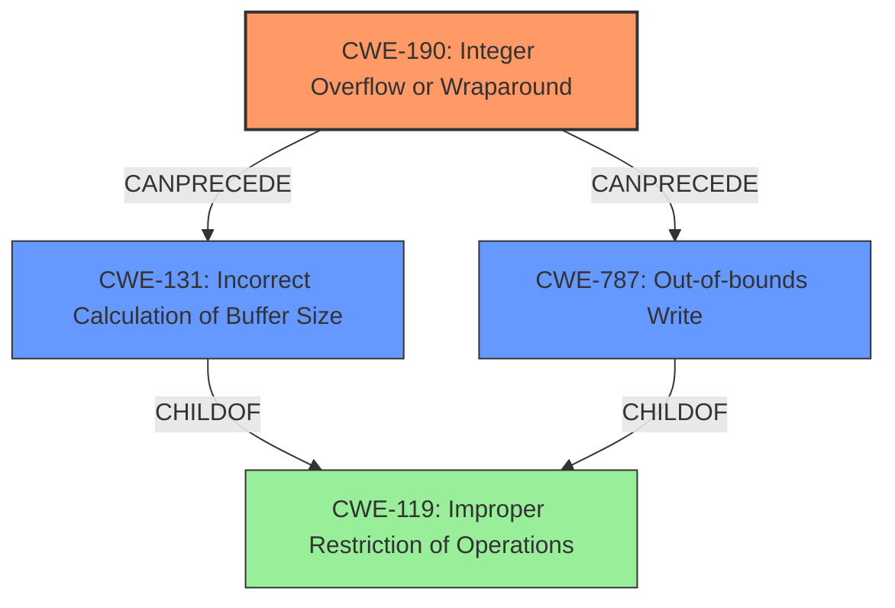

# Raw Analyzer Response for CVE-2020-28017

# Summary
| CWE ID | CWE Name | Confidence | CWE Abstraction Level | CWE Vulnerability Mapping Label | CWE-Vulnerability Mapping Notes |
|---|---|---|---|---|---|
| CWE-190 | Integer Overflow or Wraparound | 1.0 | Base | Allowed | Primary CWE |
| CWE-131 | Incorrect Calculation of Buffer Size | 0.7 | Base | Allowed | Secondary Candidate |
| CWE-787 | Out-of-bounds Write | 0.6 | Base | Allowed | Secondary Candidate |

## Evidence and Confidence

*   **Confidence Score:** 0.8
*   **Evidence Strength:** HIGH

## Relationship Analysis
The primary CWE is CWE-190, which describes the **integer overflow**. This can **precede** CWE-119 (Improper Restriction of Operations within the Bounds of a Memory Buffer). The overflow can also lead to an **incorrect calculation of buffer size** (CWE-131) and consequently an **out-of-bounds write** (CWE-787), which are childs of CWE-119. The relationship between CWE-190, CWE-131, CWE-787, and CWE-119 helped solidify the choice of CWE-190 as the root cause, with CWE-131 and CWE-787 representing the subsequent impact.

## Vulnerability Chain
The vulnerability chain starts with an **integer overflow** (CWE-190), leading to an **incorrect calculation of the buffer size** (CWE-131). This results in a smaller-than-expected buffer being allocated, which eventually leads to an **out-of-bounds write** (CWE-787) during the `memcpy` operation.

## Summary of Analysis
The initial analysis correctly identified the root cause as an **integer overflow** (CWE-190) in the `receive_add_recipient` function, triggered by a large number of recipients. The "CVE Reference Links Content Summary" section confirms this by stating: "The vulnerability is due to an **integer overflow** in the `receive_add_recipient()` function." The summary also mentions that the **integer overflow** leads to a negative value being passed to `store_get()`, causing a heap back-jump and subsequent heap overflow.

The selection of CWE-190 is further supported by the "Retriever Results," which lists it as the top candidate with a high score. The relationship analysis highlights that CWE-190 can precede CWE-131 and CWE-787, which represent the consequences of the overflow.

CWE-131 (Incorrect Calculation of Buffer Size) was considered because the **integer overflow** leads to an **incorrect buffer size calculation**. The evidence for this is the statement: "When the number of recipients exceeds a certain threshold (52,428,800), the multiplication `recipients_list_max * sizeof(recipient_item)` overflows, resulting in a negative value."

CWE-787 (Out-of-bounds Write) was also considered because the undersized buffer allocation eventually results in a heap overflow. The evidence for this is the statement: "A subsequent memcpy results in a 'forward-overflow' which leads to overwriting the heap."

The selected CWEs are at the optimal level of specificity, with CWE-190 representing the root cause and CWE-131 and CWE-787 representing the direct consequences. The MITRE mapping guidance allows the use of Base-level CWEs like CWE-190, CWE-131, and CWE-787, which are preferred for mapping root causes.

Relevant CWE Information:
# Enhanced Context (25 CWEs)
The following CWEs were identified as potentially relevant to this vulnerability:

## CWE-681: Incorrect Conversion between Numeric Types
**Abstraction Level**: Base
**Similarity Score**: 0.79
**Source**: dense

**Description**:
When converting from one data type to another, such as long to integer, data can be omitted or translated in a way that produces unexpected values. If the resulting values are used in a sensitive context, then dangerous behaviors may occur.

**Mapping Guidance**:
- Usage: Allowed
- Rationale: This CWE entry is at the Base level of abstraction, which is a preferred level of abstraction for mapping to the root causes of vulnerabilities.

CWE-681 was considered but not chosen as the primary weakness because the core issue is not about a general type conversion, but specifically about an arithmetic overflow during the multiplication of two integer values that leads to allocation and subsequently a buffer overflow.

## CWE-191: Integer Underflow (Wrap or Wraparound)
**Abstraction Level**: Base
**Similarity Score**: 0.79
**Source**: dense

**Description**:
The product subtracts one value from another, such that the result is less than the minimum allowable integer value, which produces a value that is not equal to the correct result.

**Mapping Guidance**:
- Usage: Allowed
- Rationale: This CWE entry is at the Base level of abstraction, which is a preferred level of abstraction for mapping to the root causes of vulnerabilities.

CWE-191 was considered but is not the precise weakness, as it describes a subtraction that results in a value below the minimum allowable integer value. In contrast, the vulnerability description indicates an overflow, where the multiplication of `recipients_list_max * sizeof(recipient_item)` results in a value exceeding the maximum allowable integer value.

## CWE-197: Numeric Truncation Error
**Abstraction Level**: Base
**Similarity Score**: 0.77
**Source**: dense

**Description**:
Truncation errors occur when a primitive is cast to a primitive of a smaller size and data is lost in the conversion.

**Mapping Guidance**:
- Usage: Allowed
- Rationale: This CWE entry is at the Base level of abstraction, which is a preferred level of abstraction for mapping to the root causes of vulnerabilities.

CWE-197 was considered, but the vulnerability is not directly related to truncation. The core issue is related to arithmetic overflow.

## CWE-195: Signed to Unsigned Conversion Error
**Abstraction Level**: Variant
**Similarity Score**: 0.76
**Source**: dense

**Description**:
The product uses a signed primitive and performs a cast to an unsigned primitive, which can produce an unexpected value if the value of the signed primitive can not be represented using an unsigned primitive.

**Mapping Guidance**:
- Usage: Allowed
- Rationale: This CWE entry is at the Variant level of abstraction, which is a preferred level of abstraction for mapping to the root causes of vulnerabilities.

CWE-195 was considered. However, the primary issue is not a signed to unsigned conversion error, but an integer overflow during the multiplication of two integer values.

## CWE-680: Integer Overflow to Buffer Overflow
**Abstraction Level**: Compound
**Similarity Score**: 0.75
**Source**: dense

**Description**:
The product performs a calculation to determine how much memory to allocate, but an integer overflow can occur that causes less memory to be allocated than expected, leading to a buffer overflow.

**Mapping Guidance**:
- Usage: Discouraged
- Rationale: This CWE entry is a named chain, which combines multiple weaknesses.

CWE-680 was considered but ultimately not chosen because it is a compound CWE. It is discouraged to use compound CWEs when the individual weaknesses can be mapped separately. Instead, CWE-190, CWE-131 and CWE-787 are mapped individually.

## CWE-131: Incorrect Calculation of Buffer Size
**Abstraction Level**: Base
**Similarity Score**: 0.75
**Source**: dense

**Description**:
The product does not correctly calculate the size to be used when allocating a buffer, which could lead to a buffer overflow.

**Mapping Guidance**:
- Usage: Allowed
- Rationale: This CWE entry is at the Base level of abstraction, which is a preferred level of abstraction for mapping to the root causes of vulnerabilities.

CWE-131 was selected as a secondary CWE, since the integer overflow leads to an incorrect buffer size calculation.

## CWE-190: Integer Overflow or Wraparound
**Abstraction Level**: Base
**