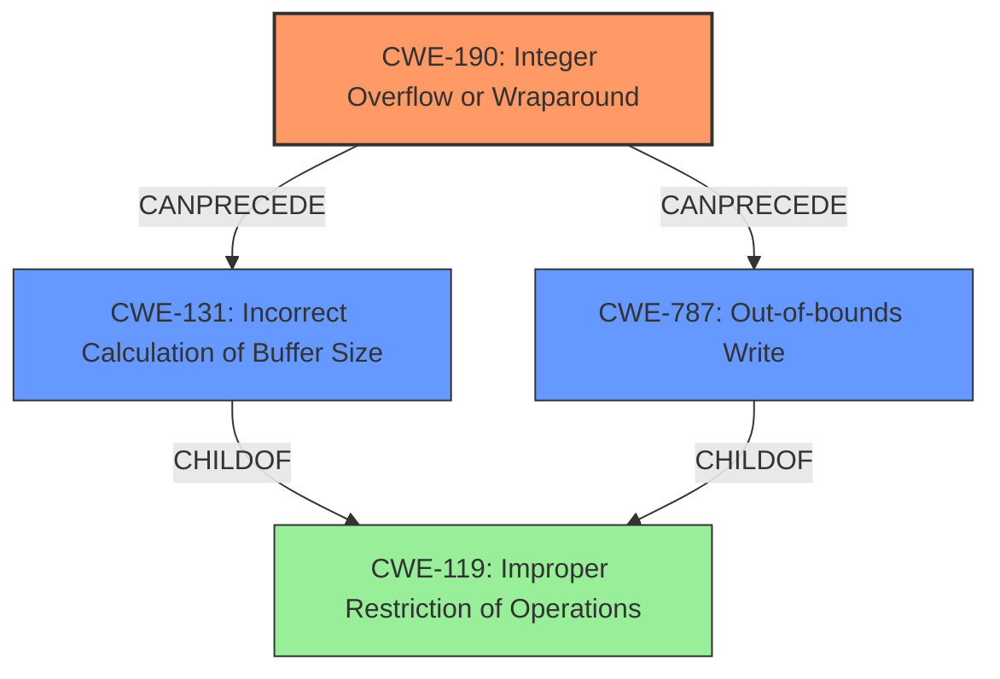

# Analysis for CVE-2020-28017

# Summary
| CWE ID | CWE Name | Confidence | CWE Abstraction Level | CWE Vulnerability Mapping Label | CWE-Vulnerability Mapping Notes |
|---|---|---|---|---|---|
| CWE-190 | Integer Overflow or Wraparound | 1.0 | Base | Allowed | Primary CWE |
| CWE-131 | Incorrect Calculation of Buffer Size | 0.7 | Base | Allowed | Secondary Candidate |
| CWE-787 | Out-of-bounds Write | 0.6 | Base | Allowed | Secondary Candidate |

## Evidence and Confidence

*   **Confidence Score:** 0.8
*   **Evidence Strength:** HIGH

## Relationship Analysis
The primary CWE is CWE-190, which describes the **integer overflow**. This can **precede** CWE-119 (Improper Restriction of Operations within the Bounds of a Memory Buffer). The overflow can also lead to an **incorrect calculation of buffer size** (CWE-131) and consequently an **out-of-bounds write** (CWE-787), which are childs of CWE-119. The relationship between CWE-190, CWE-131, CWE-787, and CWE-119 helped solidify the choice of CWE-190 as the root cause, with CWE-131 and CWE-787 representing the subsequent impact.

## Vulnerability Chain
The vulnerability chain starts with an **integer overflow** (CWE-190), leading to an **incorrect calculation of the buffer size** (CWE-131). This results in a smaller-than-expected buffer being allocated, which eventually leads to an **out-of-bounds write** (CWE-787) during the `memcpy` operation.

## Summary of Analysis
The initial analysis correctly identified the root cause as an **integer overflow** (CWE-190) in the `receive_add_recipient` function, triggered by a large number of recipients. The "CVE Reference Links Content Summary" section confirms this by stating: "The vulnerability is due to an **integer overflow** in the `receive_add_recipient()` function." The summary also mentions that the **integer overflow** leads to a negative value being passed to `store_get()`, causing a heap back-jump and subsequent heap overflow.

The selection of CWE-190 is further supported by the "Retriever Results," which lists it as the top candidate with a high score. The relationship analysis highlights that CWE-190 can precede CWE-131 and CWE-787, which represent the consequences of the overflow.

CWE-131 (Incorrect Calculation of Buffer Size) was considered because the **integer overflow** leads to an **incorrect buffer size calculation**. The evidence for this is the statement: "When the number of recipients exceeds a certain threshold (52,428,800), the multiplication `recipients_list_max * sizeof(recipient_item)` overflows, resulting in a negative value."

CWE-787 (Out-of-bounds Write) was also considered because the undersized buffer allocation eventually results in a heap overflow. The evidence for this is the statement: "A subsequent memcpy results in a 'forward-overflow' which leads to overwriting the heap."

The selected CWEs are at the optimal level of specificity, with CWE-190 representing the root cause and CWE-131 and CWE-787 representing the direct consequences. The MITRE mapping guidance allows the use of Base-level CWEs like CWE-190, CWE-131, and CWE-787, which are preferred for mapping root causes.

Relevant CWE Information:
# Enhanced Context (25 CWEs)
The following CWEs were identified as potentially relevant to this vulnerability:

## CWE-681: Incorrect Conversion between Numeric Types
**Abstraction Level**: Base
**Similarity Score**: 0.79
**Source**: dense

**Description**:
When converting from one data type to another, such as long to integer, data can be omitted or translated in a way that produces unexpected values. If the resulting values are used in a sensitive context, then dangerous behaviors may occur.

**Mapping Guidance**:
- Usage: Allowed
- Rationale: This CWE entry is at the Base level of abstraction, which is a preferred level of abstraction for mapping to the root causes of vulnerabilities.

CWE-681 was considered but not chosen as the primary weakness because the core issue is not about a general type conversion, but specifically about an arithmetic overflow during the multiplication of two integer values that leads to allocation and subsequently a buffer overflow.

## CWE-191: Integer Underflow (Wrap or Wraparound)
**Abstraction Level**: Base
**Similarity Score**: 0.79
**Source**: dense

**Description**:
The product subtracts one value from another, such that the result is less than the minimum allowable integer value, which produces a value that is not equal to the correct result.

**Mapping Guidance**:
- Usage: Allowed
- Rationale: This CWE entry is at the Base level of abstraction, which is a preferred level of abstraction for mapping to the root causes of vulnerabilities.

CWE-191 was considered but is not the precise weakness, as it describes a subtraction that results in a value below the minimum allowable integer value. In contrast, the vulnerability description indicates an overflow, where the multiplication of `recipients_list_max * sizeof(recipient_item)` results in a value exceeding the maximum allowable integer value.

## CWE-197: Numeric Truncation Error
**Abstraction Level**: Base
**Similarity Score**: 0.77
**Source**: dense

**Description**:
Truncation errors occur when a primitive is cast to a primitive of a smaller size and data is lost in the conversion.

**Mapping Guidance**:
- Usage: Allowed
- Rationale: This CWE entry is at the Base level of abstraction, which is a preferred level of abstraction for mapping to the root causes of vulnerabilities.

CWE-197 was considered, but the vulnerability is not directly related to truncation. The core issue is related to arithmetic overflow.

## CWE-195: Signed to Unsigned Conversion Error
**Abstraction Level**: Variant
**Similarity Score**: 0.76
**Source**: dense

**Description**:
The product uses a signed primitive and performs a cast to an unsigned primitive, which can produce an unexpected value if the value of the signed primitive can not be represented using an unsigned primitive.

**Mapping Guidance**:
- Usage: Allowed
- Rationale: This CWE entry is at the Variant level of abstraction, which is a preferred level of abstraction for mapping to the root causes of vulnerabilities.

CWE-195 was considered. However, the primary issue is not a signed to unsigned conversion error, but an integer overflow during the multiplication of two integer values.

## CWE-680: Integer Overflow to Buffer Overflow
**Abstraction Level**: Compound
**Similarity Score**: 0.75
**Source**: dense

**Description**:
The product performs a calculation to determine how much memory to allocate, but an integer overflow can occur that causes less memory to be allocated than expected, leading to a buffer overflow.

**Mapping Guidance**:
- Usage: Discouraged
- Rationale: This CWE entry is a named chain, which combines multiple weaknesses.

CWE-680 was considered but ultimately not chosen because it is a compound CWE. It is discouraged to use compound CWEs when the individual weaknesses can be mapped separately. Instead, CWE-190, CWE-131 and CWE-787 are mapped individually.

## CWE-131: Incorrect Calculation of Buffer Size
**Abstraction Level**: Base
**Similarity Score**: 0.75
**Source**: dense

**Description**:
The product does not correctly calculate the size to be used when allocating a buffer, which could lead to a buffer overflow.

**Mapping Guidance**:
- Usage: Allowed
- Rationale: This CWE entry is at the Base level of abstraction, which is a preferred level of abstraction for mapping to the root causes of vulnerabilities.

CWE-131 was selected as a secondary CWE, since the integer overflow leads to an incorrect buffer size calculation.

## CWE-190: Integer Overflow or Wraparound
**Abstraction Level**: Base
**

# Enhanced Query for CVE-2020-28017

## Vulnerability Description
Exim 4 before 4.94.2 allows Integer Overflow to Buffer Overflow in receive_add_recipient via an e-mail message with fifty million recipients. NOTE remote exploitation may be difficult because of resource consumption.

### Vulnerability Description Key Phrases
- **rootcause:** **integer overflow**
- **impact:** buffer overflow
- **vector:** e-mail message with fifty million recipients
- **product:** Exim
- **version:** 4 before 4.94.2
- **component:** receive_add_recipient

## CVE Reference Links Content Summary
The provided content is related to CVE-2020-28017.

**Root Cause of Vulnerability:**

The vulnerability is due to an integer overflow in the `receive_add_recipient()` function. This function allocates memory to store recipient information as Exim receives RCPT TO commands.

**Weaknesses/Vulnerabilities Present:**

*   **Integer Overflow:** When the number of recipients exceeds a certain threshold (52,428,800), the multiplication `recipients_list_max * sizeof(recipient_item)` overflows, resulting in a negative value.
*   **Heap Back-Jump:** The negative size is then passed to `store_get()`, which causes a "back-jump," decreasing the memory pointer.
*   **Heap Overflow:** A subsequent memcpy results in a "forward-overflow" which leads to overwriting the heap.

**Impact of Exploitation:**

*   **Unauthenticated Remote Code Execution:** Although difficult to exploit in default configurations due to large memory requirements (25GB+), it can result in unauthenticated RCE as the 'exim' user.

**Attack Vectors:**

*   **Remote Attack:** Sending a large number of `RCPT TO` commands to the Exim server to trigger the overflow.
*  **Local Attack:** Using the `-bS` option and `smtp_setup_batch_msg()` which does not use ACLs

**Required Attacker Capabilities/Position:**

*   **Remote:**
    *   An attacker must be able to connect to the Exim server and send SMTP commands.
    *  The attacker must send a very large number of RCPT TO commands to trigger the vulnerability
*   **Local:**
    * The attacker needs local access on the machine where Exim is running.
    * The attacker must send a very large number of RCPT TO commands via the `-bS` command to trigger the vulnerability.

**Additional Details:**

*   The document explains how a back-jump and forward-overflow combination, made possible through Exim's memory allocator, allows for overwriting critical configuration strings in heap.
*   The document notes this vulnerability exists since the beginning of Exim's Git history (2004).
*   The document outlines the reason it was difficult to exploit this vulnerability (large memory consumption and time complexity), and why the researchers opted to exploit CVE-2020-28020 instead.

## Retriever Results

### Top Combined Results

| Rank | CWE ID | Name | Abstraction | Usage  | Retrievers | Individual Scores |
|------|--------|------|-------------|-------|------------|-------------------|
| 1 | 190 | Integer Overflow or Wraparound | Base | Allowed | alternate_terms | 0.800 |
| 2 | 122 | Heap-based Buffer Overflow | Variant | Allowed | sparse | 0.203 |
| 3 | 124 | Buffer Underwrite ('Buffer Underflow') | Base | Allowed | sparse | 0.199 |
| 4 | 704 | Incorrect Type Conversion or Cast | Class | Allowed-with-Review | sparse | 0.196 |
| 5 | 1284 | Improper Validation of Specified Quantity in Input | Base | Allowed | sparse | 0.191 |
| 6 | 409 | Improper Handling of Highly Compressed Data (Data Amplification) | Base | Allowed | dense | 0.491 |
| 7 | 843 | Access of Resource Using Incompatible Type ('Type Confusion') | Base | Allowed | graph | 0.002 |
| 8 | 191 | Integer Underflow (Wrap or Wraparound) | Base | Allowed | sparse | 0.186 |
| 9 | 195 | Signed to Unsigned Conversion Error | Variant | Allowed | sparse | 0.184 |
| 10 | 681 | Incorrect Conversion between Numeric Types | Base | Allowed | sparse | 0.182 |

# Complete CWE Specifications

## CWE-190: Integer Overflow or Wraparound
**Abstraction:** Base
**Status:** Stable

### Description
The product performs a calculation that can
         produce an integer overflow or wraparound when the logic
         assumes that the resulting value will always be larger than
         the original value. This occurs when an integer value is
         incremented to a value that is too large to store in the
         associated representation. When this occurs, the value may
         become a very small or negative number.

### Extended Description
Not provided

### Alternative Terms
Overflow: The terms "overflow" and "wraparound" are used interchangeably by some people, but they can have more precise distinctions by others. See Terminology Notes.
Wraparound: The terms "overflow" and "wraparound" are used interchangeably by some people, but they can have more precise distinctions by others. See Terminology Notes.
wrap, wrap-around, wrap around: Alternate spellings of "wraparound"

### Relationships
ChildOf -> CWE-682
ChildOf -> CWE-682
ChildOf -> CWE-20
CanPrecede -> CWE-119

### Mapping Guidance
**Usage:** Allowed
**Rationale:** This CWE entry is at the Base level of abstraction, which is a preferred level of abstraction for mapping to the root causes of vulnerabilities.
**Comments:** Be careful of terminology problems with "overflow," "underflow," and "wraparound" - see Terminology Notes. Carefully read both the name and description to ensure that this mapping is an appropriate fit. Do not try to 'force' a mapping to a lower-level Base/Variant simply to comply with this preferred level of abstraction.
**Reasons:**
- Acceptable-Use
**Suggested Alternatives:**
- CWE-191: Integer Underflow (Wrap or Wraparound). Consider CWE-191 when the result is less than the minimum value that can be represented (sometimes called "underflows").

### Additional Notes
**[Relationship]** Integer overflows can be primary to buffer overflows when they cause less memory to be allocated than expected.

**[Terminology]** 

"Integer overflow" is sometimes used to cover several types of errors, including signedness errors, or buffer overflows that involve manipulation of integer data types instead of characters. Part of the confusion results from the fact that 0xffffffff is -1 in a signed context. Other confusion also arises because of the role that integer overflows have in chains.

A "wraparound" is a well-defined, standard behavior that follows specific rules for how to handle situations when the intended numeric value is too large or too small to be represented, as specified in standards such as C11.

"Overflow" is sometimes conflated with "wraparound" but typically indicates a non-standard or undefined behavior.

The "overflow" term is sometimes used to indicate cases where either the maximum or the minimum is exceeded, but others might only use "overflow" to indicate exceeding the maximum while using "underflow" for exceeding the minimum.

Some people use "overflow" to mean any value outside the representable range - whether greater than the maximum, or less than the minimum - but CWE uses "underflow" for cases in which the intended result is less than the minimum.

See [REF-1440] for additional explanation of the ambiguity of terminology.

**[Other]** While there may be circumstances in which the logic intentionally relies on wrapping - such as with modular arithmetic in timers or counters - it can have security consequences if the wrap is unexpected. This is especially the case if the integer overflow can be triggered using user-supplied inputs.

### Observed Examples
- **CVE-2021-43537:** Chain: in a web browser, an unsigned 64-bit integer is forcibly cast to a 32-bit integer (CWE-681) and potentially leading to an integer overflow (CWE-190). If an integer overflow occurs, this can cause heap memory corruption (CWE-122)
- **CVE-2022-21668:** Chain: Python library does not limit the resources used to process images that specify a very large number of bands (CWE-1284), leading to excessive memory consumption (CWE-789) or an integer overflow (CWE-190).
- **CVE-2022-0545:** Chain: 3D renderer has an integer overflow (CWE-190) leading to write-what-where condition (CWE-123) using a crafted image.

## CWE-122: Heap-based Buffer Overflow
**Abstraction:** Variant
**Status:** Draft

### Description
A heap overflow condition is a buffer overflow, where the buffer that can be overwritten is allocated in the heap portion of memory, generally meaning that the buffer was allocated using a routine such as malloc().

### Extended Description
Not provided

### Alternative Terms
None

### Relationships
ChildOf -> CWE-788
ChildOf -> CWE-787

### Mapping Guidance
**Usage:** Allowed
**Rationale:** This CWE entry is at the Variant level of abstraction, which is a preferred level of abstraction for mapping to the root causes of vulnerabilities.
**Comments:** Carefully read both the name and description to ensure that this mapping is an appropriate fit. Do not try to 'force' a mapping to a lower-level Base/Variant simply to comply with this preferred level of abstraction.
**Reasons:**
- Acceptable-Use

### Additional Notes
**[Relationship]** Heap-based buffer overflows are usually just as dangerous as stack-based buffer overflows.

### Observed Examples
- **CVE-2021-43537:** Chain: in a web browser, an unsigned 64-bit integer is forcibly cast to a 32-bit integer (CWE-681) and potentially leading to an integer overflow (CWE-190). If an integer overflow occurs, this can cause heap memory corruption (CWE-122)
- **CVE-2007-4268:** Chain: integer signedness error (CWE-195) passes signed comparison, leading to heap overflow (CWE-122)
- **CVE-2009-2523:** Chain: product does not handle when an input string is not NULL terminated (CWE-170), leading to buffer over-read (CWE-125) or heap-based buffer overflow (CWE-122).

## CWE-124: Buffer Underwrite ('Buffer Underflow')
**Abstraction:** Base
**Status:** Incomplete

### Description
The product writes to a buffer using an index or pointer that references a memory location prior to the beginning of the buffer.

### Extended Description
This typically occurs when a pointer or its index is decremented to a position before the buffer, when pointer arithmetic results in a position before the beginning of the valid memory location, or when a negative index is used.

### Alternative Terms
buffer underrun: Some prominent vendors and researchers use the term "buffer underrun". "Buffer underflow" is more commonly used, although both terms are also sometimes used to describe a buffer under-read (CWE-127).

### Relationships
ChildOf -> CWE-786
ChildOf -> CWE-787

### Mapping Guidance
**Usage:** Allowed
**Rationale:** This CWE entry is at the Base level of abstraction, which is a preferred level of abstraction for mapping to the root causes of vulnerabilities.
**Comments:** Carefully read both the name and description to ensure that this mapping is an appropriate fit. Do not try to 'force' a mapping to a lower-level Base/Variant simply to comply with this preferred level of abstraction.
**Reasons:**
- Acceptable-Use

### Additional Notes
**[Relationship]** This could be resultant from several errors, including a bad offset or an array index that decrements before the beginning of the buffer (see CWE-129).

### Observed Examples
- **CVE-2021-24018:** buffer underwrite in firmware verification routine allows code execution via a crafted firmware image
- **CVE-2002-2227:** Unchecked length of SSLv2 challenge value leads to buffer underflow.
- **CVE-2007-4580:** Buffer underflow from a small size value with a large buffer (length parameter inconsistency, CWE-130)

## CWE-704: Incorrect Type Conversion or Cast
**Abstraction:** Class
**Status:** Incomplete

### Description
The product does not correctly convert an object, resource, or structure from one type to a different type.

### Extended Description
Not provided

### Alternative Terms
None

### Relationships
ChildOf -> CWE-664

### Mapping Guidance
**Usage:** Allowed-with-Review
**Rationale:** This CWE entry is a Class and might have Base-level children that would be more appropriate
**Comments:** Examine children of this entry to see if there is a better fit
**Reasons:**
- Abstraction

### Observed Examples
- **CVE-2021-43537:** Chain: in a web browser, an unsigned 64-bit integer is forcibly cast to a 32-bit integer (CWE-681) and potentially leading to an integer overflow (CWE-190). If an integer overflow occurs, this can cause heap memory corruption (CWE-122)
- **CVE-2022-3979:** Chain: data visualization program written in PHP uses the "!=" operator instead of the type-strict "!==" operator (CWE-480) when validating hash values, potentially leading to an incorrect type conversion (CWE-704)

## CWE-1284: Improper Validation of Specified Quantity in Input
**Abstraction:** Base
**Status:** Incomplete

### Description
The product receives input that is expected to specify a quantity (such as size or length), but it does not validate or incorrectly validates that the quantity has the required properties.

### Extended Description

Specified quantities include size, length, frequency, price, rate, number of operations, time, and others. Code may rely on specified quantities to allocate resources, perform calculations, control iteration, etc. When the quantity is not properly validated, then attackers can specify malicious quantities to cause excessive resource allocation, trigger unexpected failures, enable buffer overflows, etc.

### Alternative Terms
None

### Relationships
ChildOf -> CWE-20
ChildOf -> CWE-20
CanPrecede -> CWE-789

### Mapping Guidance
**Usage:** Allowed
**Rationale:** This CWE entry is at the Base level of abstraction, which is a preferred level of abstraction for mapping to the root causes of vulnerabilities.
**Comments:** Carefully read both the name and description to ensure that this mapping is an appropriate fit. Do not try to 'force' a mapping to a lower-level Base/Variant simply to comply with this preferred level of abstraction.
**Reasons:**
- Acceptable-Use

### Additional Notes
**[Maintenance]** This entry is still under development and will continue to see updates and content improvements.

### Observed Examples
- **CVE-2022-21668:** Chain: Python library does not limit the resources used to process images that specify a very large number of bands (CWE-1284), leading to excessive memory consumption (CWE-789) or an integer overflow (CWE-190).
- **CVE-2008-1440:** lack of validation of length field leads to infinite loop
- **CVE-2008-2374:** lack of validation of string length fields allows memory consumption or buffer over-read

## CWE-409: Improper Handling of Highly Compressed Data (Data Amplification)
**Abstraction:** Base
**Status:** Incomplete

### Description
The product does not handle or incorrectly handles a compressed input with a very high compression ratio that produces a large output.

### Extended Description
An example of data amplification is a "decompression bomb," a small ZIP file that can produce a large amount of data when it is decompressed.

### Alternative Terms
None

### Relationships
ChildOf -> CWE-405

### Mapping Guidance
**Usage:** Allowed
**Rationale:** This CWE entry is at the Base level of abstraction, which is a preferred level of abstraction for mapping to the root causes of vulnerabilities.
**Comments:** Carefully read both the name and description to ensure that this mapping is an appropriate fit. Do not try to 'force' a mapping to a lower-level Base/Variant simply to comply with this preferred level of abstraction.
**Reasons:**
- Acceptable-Use

### Observed Examples
- **CVE-2009-1955:** XML bomb in web server module
- **CVE-2003-1564:** Parsing library allows XML bomb

## CWE-843: Access of Resource Using Incompatible Type ('Type Confusion')
**Abstraction:** Base
**Status:** Incomplete

### Description
The product allocates or initializes a resource such as a pointer, object, or variable using one type, but it later accesses that resource using a type that is incompatible with the original type.

### Extended Description

When the product accesses the resource using an incompatible type, this could trigger logical errors because the resource does not have expected properties. In languages without memory safety, such as C and C++, type confusion can lead to out-of-bounds memory access.

While this weakness is frequently associated with unions when parsing data with many different embedded object types in C, it can be present in any application that can interpret the same variable or memory location in multiple ways.

This weakness is not unique to C and C++. For example, errors in PHP applications can be triggered by providing array parameters when scalars are expected, or vice versa. Languages such as Perl, which perform automatic conversion of a variable of one type when it is accessed as if it were another type, can also contain these issues.

### Alternative Terms
Object Type Confusion

### Relationships
ChildOf -> CWE-704
ChildOf -> CWE-704
CanPrecede -> CWE-119

### Mapping Guidance
**Usage:** Allowed
**Rationale:** This CWE entry is at the Base level of abstraction, which is a preferred level of abstraction for mapping to the root causes of vulnerabilities.
**Comments:** Carefully read both the name and description to ensure that this mapping is an appropriate fit. Do not try to 'force' a mapping to a lower-level Base/Variant simply to comply with this preferred level of abstraction.
**Reasons:**
- Acceptable-Use

### Additional Notes
**[Applicable Platform]** 

This weakness is possible in any type-unsafe programming language.

**[Research Gap]** 

Type confusion weaknesses have received some attention by applied researchers and major software vendors for C and C++ code. Some publicly-reported vulnerabilities probably have type confusion as a root-cause weakness, but these may be described as "memory corruption" instead.

For other languages, there are very few public reports of type confusion weaknesses. These are probably under-studied. Since many programs rely directly or indirectly on loose typing, a potential "type confusion" behavior might be intentional, possibly requiring more manual analysis.

### Observed Examples
- **CVE-2010-4577:** Type confusion in CSS sequence leads to out-of-bounds read.
- **CVE-2011-0611:** Size inconsistency allows code execution, first discovered when it was actively exploited in-the-wild.
- **CVE-2010-0258:** Improperly-parsed file containing records of different types leads to code execution when a memory location is interpreted as a different object than intended.

## CWE-191: Integer Underflow (Wrap or Wraparound)
**Abstraction:** Base
**Status:** Draft

### Description
The product subtracts one value from another, such that the result is less than the minimum allowable integer value, which produces a value that is not equal to the correct result.

### Extended Description
This can happen in signed and unsigned cases.

### Alternative Terms
Integer underflow: 

"Integer underflow" is sometimes used to identify signedness errors in which an originally positive number becomes negative as a result of subtraction. However, there are cases of bad subtraction in which unsigned integers are involved, so it's not always a signedness issue.

"Integer underflow" is occasionally used to describe array index errors in which the index is negative.

### Relationships
ChildOf -> CWE-682
ChildOf -> CWE-682

### Mapping Guidance
**Usage:** Allowed
**Rationale:** This CWE entry is at the Base level of abstraction, which is a preferred level of abstraction for mapping to the root causes of vulnerabilities.
**Comments:** Carefully read both the name and description to ensure that this mapping is an appropriate fit. Do not try to 'force' a mapping to a lower-level Base/Variant simply to comply with this preferred level of abstraction.
**Reasons:**
- Acceptable-Use

### Observed Examples
- **CVE-2004-0816:** Integer underflow in firewall via malformed packet.
- **CVE-2004-1002:** Integer underflow by packet with invalid length.
- **CVE-2005-0199:** Long input causes incorrect length calculation.

## CWE-195: Signed to Unsigned Conversion Error
**Abstraction:** Variant
**Status:** Draft

### Description
The product uses a signed primitive and performs a cast to an unsigned primitive, which can produce an unexpected value if the value of the signed primitive can not be represented using an unsigned primitive.

### Extended Description

It is dangerous to rely on implicit casts between signed and unsigned numbers because the result can take on an unexpected value and violate assumptions made by the program.

Often, functions will return negative values to indicate a failure. When the result of a function is to be used as a size parameter, using these negative return values can have unexpected results. For example, if negative size values are passed to the standard memory copy or allocation functions they will be implicitly cast to a large unsigned value. This may lead to an exploitable buffer overflow or underflow condition.

### Alternative Terms
None

### Relationships
ChildOf -> CWE-681
ChildOf -> CWE-681
ChildOf -> CWE-681
CanPrecede -> CWE-119

### Mapping Guidance
**Usage:** Allowed
**Rationale:** This CWE entry is at the Variant level of abstraction, which is a preferred level of abstraction for mapping to the root causes of vulnerabilities.
**Comments:** Carefully read both the name and description to ensure that this mapping is an appropriate fit. Do not try to 'force' a mapping to a lower-level Base/Variant simply to comply with this preferred level of abstraction.
**Reasons:**
- Acceptable-Use

### Observed Examples
- **CVE-2007-4268:** Chain: integer signedness error (CWE-195) passes signed comparison, leading to heap overflow (CWE-122)

## CWE-681: Incorrect Conversion between Numeric Types
**Abstraction:** Base
**Status:** Draft

### Description
When converting from one data type to another, such as long to integer, data can be omitted or translated in a way that produces unexpected values. If the resulting values are used in a sensitive context, then dangerous behaviors may occur.

### Extended Description
Not provided

### Alternative Terms
None

### Relationships
ChildOf -> CWE-704
ChildOf -> CWE-704
CanPrecede -> CWE-682

### Mapping Guidance
**Usage:** Allowed
**Rationale:** This CWE entry is at the Base level of abstraction, which is a preferred level of abstraction for mapping to the root causes of vulnerabilities.
**Comments:** Carefully read both the name and description to ensure that this mapping is an appropriate fit. Do not try to 'force' a mapping to a lower-level Base/Variant simply to comply with this preferred level of abstraction.
**Reasons:**
- Acceptable-Use

### Observed Examples
- **CVE-2022-2639:** Chain: integer coercion error (CWE-192) prevents a return value from indicating an error, leading to out-of-bounds write (CWE-787)
- **CVE-2021-43537:** Chain: in a web browser, an unsigned 64-bit integer is forcibly cast to a 32-bit integer (CWE-681) and potentially leading to an integer overflow (CWE-190). If an integer overflow occurs, this can cause heap memory corruption (CWE-122)
- **CVE-2007-4268:** Chain: integer signedness error (CWE-195) passes signed comparison, leading to heap overflow (CWE-122)

