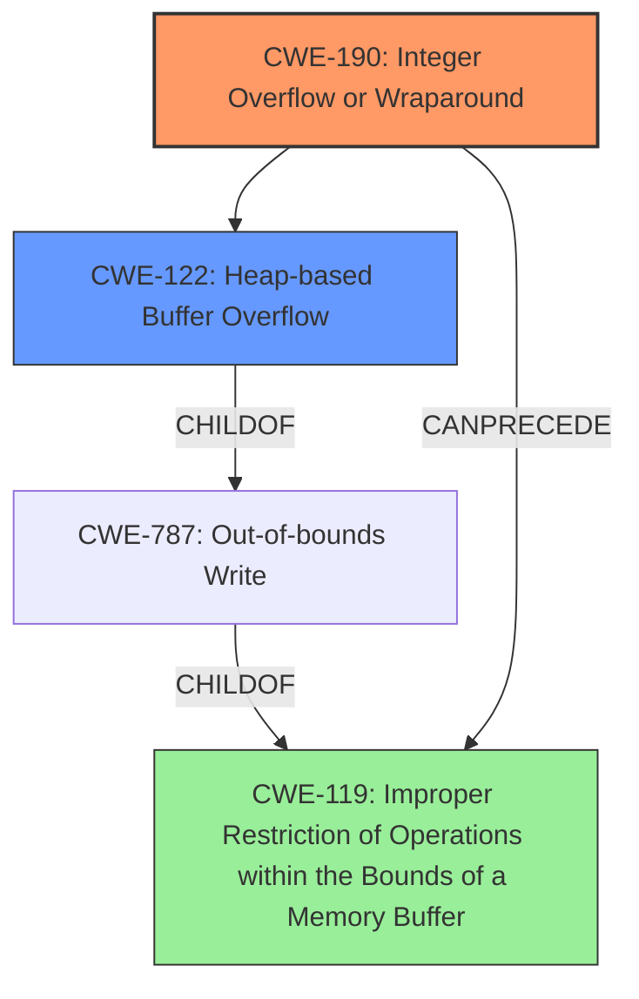

# Analysis for CVE-2020-28020

# Summary
| CWE ID | CWE Name | Confidence | CWE Abstraction Level | CWE Vulnerability Mapping Label | CWE-Vulnerability Mapping Notes |
|---|---|---|---|---|---|
| CWE-190 | Integer Overflow or Wraparound | 1.0 | Base | Allowed | Primary CWE. The product **performs a calculation that can produce an integer overflow** or wraparound when the logic assumes that the resulting value will always be larger than the original value. |
| CWE-122 | Heap-based Buffer Overflow | 0.8 | Variant | Allowed | Secondary CWE. The **integer overflow** caused a negative value to be used for memory allocation, which corrupted the heap, leading to a heap-based buffer overflow. |

## Evidence and Confidence

*   **Confidence Score:** 0.9
*   **Evidence Strength:** HIGH

## Relationship Analysis
The primary weakness is **CWE-190 [Integer Overflow or Wraparound]**, which is a Base CWE. The integer overflow leads to **CWE-122 [Heap-based Buffer Overflow]**, a Variant CWE. CWE-190 can precede CWE-119 [Improper Restriction of Operations within the Bounds of a Memory Buffer], a more general form of buffer overflow.

## Vulnerability Chain
The chain of events is as follows:
1.  **Mishandling of continuation lines** in headers leads to an **integer overflow** (CWE-190).
2.  The **integer overflow** results in memory corruption, specifically a heap-based buffer overflow (CWE-122).
3.  The buffer overflow enables remote code execution.

## Summary of Analysis
The primary vulnerability is the **integer overflow** (CWE-190) due to the **mishandling of continuation lines** during header-length restriction. This leads to memory corruption, specifically a heap-based buffer overflow (CWE-122), enabling remote code execution.

The evidence from the vulnerability description includes:
*   "Exim 4 before 4.92 allows Integer Overflow to Buffer Overflow, in which an unauthenticated remote attacker can execute arbitrary code by leveraging the **mishandling of continuation lines** during header-length restriction."
*   "Integer overflow in the `header_size` variable within the `receive_msg()` function... This overflow occurs when processing overly large mail headers containing only continuation lines... `header_size *= 2;` without sufficient checks, leading to an integer overflow."
*   "The integer overflow leads to memory corruption by causing a negative value for header_size, which is then used for memory allocation (`store_get(header_size)`)."

Based on this evidence, CWE-190 is the most appropriate primary CWE, as it directly reflects the root cause. CWE-122 is a secondary CWE, representing the resulting heap-based buffer overflow. Both are at appropriate levels of abstraction (Base and Variant, respectively).

CWEs considered but not used:

*   CWE-680 [Integer Overflow to Buffer Overflow] was considered. However, this is a Compound CWE and the guidance discourages its use when the individual weaknesses can be mapped separately. Therefore, mapping to CWE-190 and CWE-122 is more precise.
*   CWE-1284 [Improper Validation of Specified Quantity in Input] was considered, but the core issue is not the lack of input validation, but the integer overflow.
*   CWE-119 [Improper Restriction of Operations within the Bounds of a Memory Buffer] is too high-level. The more specific CWE-122 is more appropriate.