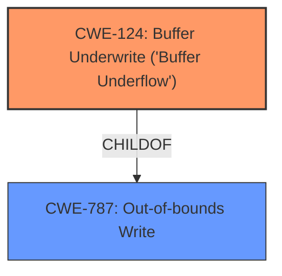

# Enhanced Analysis for CVE-2020-28024

# Summary
| CWE ID  | CWE Name                                         | Confidence | CWE Abstraction Level | CWE Vulnerability Mapping Label | CWE-Vulnerability Mapping Notes |
| ------- | ------------------------------------------------ | ---------- | --------------------- | ------------------------------- | ------------------------------- |
| CWE-124 | Buffer Underwrite ('Buffer Underflow')           | 1.0        | Base                  | Primary                         | Allowed                         |
| CWE-787 | Out-of-bounds Write                                | 0.7       | Base                  | Secondary                       | Allowed                         |

## Evidence and Confidence

*   **Confidence Score:** 0.9
*   **Evidence Strength:** HIGH

## Relationship Analysis
The primary CWE is CWE-124 (Buffer Underwrite), which directly reflects the **weakness** described in the vulnerability. CWE-787 (Out-of-bounds Write) is a parent of CWE-124 and represents the general class of the vulnerability. CWE-124 is a child of CWE-787 because a buffer underwrite is a specific type of out-of-bounds write.



## Vulnerability Chain
The vulnerability chain starts with the incorrect implementation of the `smtp_ungetc()` function, leading to a **heap buffer underflow**. This **underwrite** allows writing to memory locations prior to the allocated buffer, potentially leading to arbitrary code execution or a crash.

## Summary of Analysis
The analysis strongly supports the selection of CWE-124 as the primary CWE. The **Vulnerability Description** and **CVE Reference Links Content Summary** clearly indicate a **buffer underwrite** condition. The `smtp_ungetc()` function **incorrectly** decrements the `smtp_inptr` without proper bounds checking, resulting in an out-of-bounds write to memory locations before the allocated buffer.

The evidence from the **Vulnerability Description Key Phrases** states the **weakness** is a "**buffer underwrite**". The **CVE Reference Links Content Summary** states that the "**Heap Buffer Underflow**" is within the `smtp_ungetc()` function and the code decrements `smtp_inptr` without checking if it goes below the beginning of `smtp_inbuffer`, causing an out-of-bounds write.

CWE-124 accurately captures this **weakness**, as it describes writing to a buffer using an index or pointer that references a memory location prior to the beginning of the buffer. This aligns perfectly with the vulnerability's technical details.

CWE-787 is included as a secondary CWE because it is a parent of CWE-124, representing the broader category of out-of-bounds writes. This provides additional context and captures the general class of the vulnerability.

The chosen CWEs are at the optimal level of specificity. CWE-124 is a base-level CWE that directly describes the **buffer underwrite**, while CWE-787 provides a broader classification.

Relevant CWE Information:

# Enhanced Context (25 CWEs)
The following CWEs were identified as potentially relevant to this vulnerability:

## CWE-131: Incorrect Calculation of Buffer Size
**Abstraction Level**: Base
**Similarity Score**: 0.76
**Source**: dense

**Description**:
The product does not correctly calculate the size to be used when allocating a buffer, which could lead to a buffer overflow.

**Mapping Guidance**:
- Usage: Allowed
- Rationale: This CWE entry is at the Base level of abstraction, which is a preferred level of abstraction for mapping to the root causes of vulnerabilities.

*Not Selected:* This CWE is about the calculation of the buffer size, but the described vulnerability isn't about the calculation of the buffer size, but an **improper** check to ensure the pointer does not **underwrite** before the start of the buffer.

## CWE-191: Integer Underflow (Wrap or Wraparound)
**Abstraction Level**: Base
**Similarity Score**: 0.76
**Source**: dense

**Description**:
The product subtracts one value from another, such that the result is less than the minimum allowable integer value, which produces a value that is not equal to the correct result.

**Mapping Guidance**:
- Usage: Allowed
- Rationale: This CWE entry is at the Base level of abstraction, which is a preferred level of abstraction for mapping to the root causes of vulnerabilities.

*Not Selected:* This CWE is about subtracting one value from another, but the described vulnerability is not about the subtraction, but rather the missing check after the subtraction.

## CWE-74: Improper Neutralization of Special Elements in Output Used by a Downstream Component ('Injection')
**Abstraction Level**: Class
**Similarity Score**: 0.75
**Source**: dense

**Description**:
The product constructs all or part of a command, data structure, or record using externally-influenced input from an upstream component, but it does not neutralize or incorrectly neutralizes special elements that could modify how it is parsed or interpreted when it is sent to a downstream component.

**Mapping Guidance**:
- Usage: Discouraged
- Rationale: CWE-74 is high-level and often misused when lower-level weaknesses are more appropriate.

*Not Selected:* This CWE is about injection, but the described vulnerability isn't about injection of special elements.

## CWE-129: Improper Validation of Array Index
**Abstraction Level**: Variant
**Similarity Score**: 0.75
**Source**: dense

**Description**:
The product uses untrusted input when calculating or using an array index, but the product does not validate or incorrectly validates the index to ensure the index references a valid position within the array.

**Mapping Guidance**:
- Usage: Allowed
- Rationale: This CWE entry is at the Variant level of abstraction, which is a preferred level of abstraction for mapping to the root causes of vulnerabilities.

*Not Selected:* This CWE is about validation of an array index, but the described vulnerability is about **improper** checking of the buffer pointer before the start of the buffer.

## CWE-125: Out-of-bounds Read
**Abstraction Level**: Base
**Similarity Score**: 0.74
**Source**: dense

**Description**:
The product reads data past the end, or before the beginning, of the intended buffer.

**Mapping Guidance**:
- Usage: Allowed
- Rationale: This CWE entry is at the Base level of abstraction, which is a preferred level of abstraction for mapping to the root causes of vulnerabilities.

*Not Selected:* This CWE is about reading out of bounds, but the described vulnerability is about writing out of bounds.

## CWE-667: Improper Locking
**Abstraction Level**: Class
**Similarity Score**: 0.74
**Source**: dense

**Description**:
The product does not properly acquire or release a lock on a resource, leading to unexpected resource state changes and behaviors.

**Mapping Guidance**:
- Usage: Allowed-with-Review
- Rationale: This CWE entry is a Class and might have Base-level children that would be more appropriate

*Not Selected:* This CWE is about locking, but the described vulnerability isn't about locking.

## CWE-193: Off-by-one Error
**Abstraction Level**: Base
**Similarity Score**: 0.74
**Source**: dense

**Description**:
A product calculates or uses an incorrect maximum or minimum value that is 1 more, or 1 less, than the correct value.

**Mapping Guidance**:
- Usage: Allowed
- Rationale: This CWE entry is at the Base level of abstraction, which is a preferred level of abstraction for mapping to the root causes of vulnerabilities.

*Not Selected:* This CWE is about an off-by-one error, but the described vulnerability isn't about an off-by-one error, but an out of bounds write before the buffer.

## CWE-1289: Improper Validation of Unsafe Equivalence in Input
**Abstraction Level**: Base
**Similarity Score**: 0.74
**Source**: dense

**Description**:
The product receives an input value that is used as a resource identifier or other type of reference, but it does not validate or incorrectly validates that the input is equivalent to a potentially-unsafe value.

**Mapping Guidance**:
- Usage: Allowed
- Rationale: This CWE entry is at the Base level of abstraction, which is a preferred level of abstraction for mapping to the root causes of vulnerabilities.

*Not Selected:* This CWE is about validation of input, but the described vulnerability isn't about validation of input.

## CWE-681: Incorrect Conversion between Numeric Types
**Abstraction Level**: Base
**Similarity Score**: 0.74
**Source**: dense

**Description**:
When converting from one data type to another, such as long to integer, data can be omitted or translated in a way that produces unexpected values. If the resulting values are used in a sensitive context, then dangerous behaviors may occur


## CWE Relationship Analysis

Current CWEs represent these abstraction levels: .


### Vulnerability Chain Analysis

**Chain starting from CWE-667:**
- 667 (Improper Locking) - ROOT


**Chain starting from CWE-787:**
- 787 (Out-of-bounds Write) - ROOT


### CWE Relationship Diagram

```mermaid
graph TD
    classDef primary fill:#f96,stroke:#333,stroke-width:2px
    classDef secondary fill:#69f,stroke:#333
    classDef tertiary fill:#9e9,stroke:#333
```