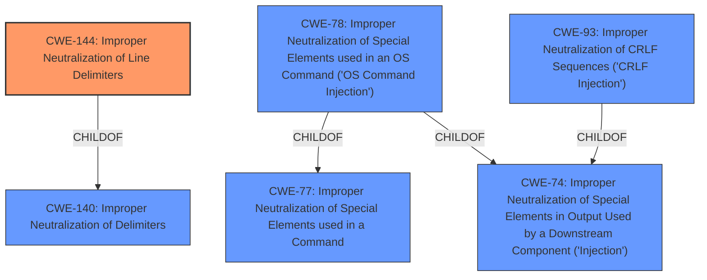

# Analysis for CVE-2020-28026

# Summary
| CWE ID | CWE Name | Confidence | CWE Abstraction Level | CWE Vulnerability Mapping Label | CWE-Vulnerability Mapping Notes |
|---|---|---|---|---|---|
| CWE-144 | Improper Neutralization of Line Delimiters | 1 | Variant | Allowed | Primary CWE |
| CWE-78 | Improper Neutralization of Special Elements used in an OS Command ('OS Command Injection') | 0.5 | Base | Allowed | Secondary Candidate |
| CWE-93 | Improper Neutralization of CRLF Sequences ('CRLF Injection') | 0.5 | Base | Allowed | Secondary Candidate |

## Evidence and Confidence

*   **Confidence Score:** 0.8
*   **Evidence Strength:** HIGH

## Relationship Analysis
The primary CWE, CWE-144, is a Variant of CWE-140, indicating it's a specific type of improper neutralization. CWE-78 and CWE-93 are also related to injection issues, with CWE-78 being a child of CWE-77 and CWE-74, and CWE-93 being a child of CWE-74. The relationships suggest a possible chain where improper neutralization leads to command injection or other injection-related vulnerabilities. The abstraction levels (Variant for CWE-144, Base for CWE-78 and CWE-93) guided the selection towards the most specific applicable CWE.

## Vulnerability Chain
The vulnerability chain starts with the **improper neutralization of line delimiters** (CWE-144) when handling the ORCPT parameter. This leads to the ability to inject newlines into the spool header file, which can then allow unauthenticated remote attackers to execute arbitrary commands as root. This could be seen as leading to OS Command Injection (CWE-78), or CRLF Injection (CWE-93) although these are less direct than the initial **improper neutralization**.

## Summary of Analysis
The initial assessment pointed towards CWE-144 as the primary weakness due to the explicit mention of "**Improper Neutralization of Line Delimiters**" in the vulnerability description. The analysis of CVE Reference Links Content Summary further supports this, stating that the vulnerability stems from "Line truncation in `spool_read_header()` due to inconsistent buffer handling" and "New-line injection through a combination of line truncation and crafted ORCPT parameters."

The retriever results also ranked CWE-144 as the top match. The relationship graph shows that CWE-144 is a variant of CWE-140, which is "Improper Neutralization of Delimiters". This hierarchical relationship confirms that CWE-144 is a specific instance of a more general class of weaknesses.

While the ultimate impact is arbitrary command execution as root, the immediate cause is the **failure to properly handle line delimiters**, making CWE-144 the most accurate and specific classification. The possibility of command injection (CWE-78) or CRLF injection (CWE-93) exists as a secondary consequence, but the root cause is the **improper handling of delimiters**.

CWE-74 was considered but rejected because it's a class-level CWE and more specific entries like CWE-78, CWE-93, and CWE-144 are more applicable.

*   **CWE-144: Improper Neutralization of Line Delimiters**
    *   **Technical Explanation:** The vulnerability involves the **improper handling of line delimiters** in the ORCPT parameter within Exim. By injecting newlines, an attacker can manipulate the spool header file.
    *   **Security Implications:** This can lead to arbitrary command execution as root, as mentioned in the vulnerability description.
    *   **Relationship:** Variant of CWE-140 (Improper Neutralization of Delimiters).
    *   **Mapping Guidance:** Allowed usage, as it is a Variant level of abstraction and accurately represents the weakness.
    *   **Evidence:** Vulnerability Description Key Phrases: "**Improper Neutralization of Line Delimiters**". CVE Reference Links Content Summary: "New-line injection through a combination of line truncation and crafted ORCPT parameters."
    *   **Confidence:** 1

*   **CWE-78: Improper Neutralization of Special Elements used in an OS Command ('OS Command Injection')**
    *   **Technical Explanation:** While the primary weakness is line delimiter handling, the ability to inject commands suggests a potential for OS command injection. An attacker crafts specific commands.
    *   **Security Implications:** This can lead to arbitrary command execution as root.
    *   **Relationship:** ChildOf CWE-77, CWE-74. CanAlsoBe CWE-88.
    *   **Mapping Guidance:** Allowed usage, as it is a Base level of abstraction.
    *   **Evidence:** Vulnerability Description Key Phrases: "execute arbitrary commands as root". CVE Reference Links Content Summary: "An attacker can inject new lines into the spool header file... potentially leading to arbitrary code execution."
    *   **Confidence:** 0.5

*   **CWE-93: Improper Neutralization of CRLF Sequences ('CRLF Injection')**
    *   **Technical Explanation:** The injected newlines are technically CRLF sequences.
    *   **Security Implications:** Could lead to modification of mail headers or other injection-related attacks.
    *   **Relationship:** ChildOf CWE-74. CanPrecede CWE-117.
    *   **Mapping Guidance:** Allowed usage, as it is a Base level of abstraction.
    *   **Evidence:** The vulnerability description describes the improper neutralization of line delimiters.
    *   **Confidence:** 0.5