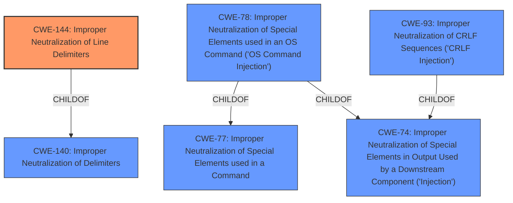

# Analysis for CVE-2020-28026

# Summary
| CWE ID | CWE Name | Confidence | CWE Abstraction Level | CWE Vulnerability Mapping Label | CWE-Vulnerability Mapping Notes |
|---|---|---|---|---|---|
| CWE-144 | Improper Neutralization of Line Delimiters | 1 | Variant | Allowed | Primary CWE |
| CWE-78 | Improper Neutralization of Special Elements used in an OS Command ('OS Command Injection') | 0.5 | Base | Allowed | Secondary Candidate |
| CWE-93 | Improper Neutralization of CRLF Sequences ('CRLF Injection') | 0.5 | Base | Allowed | Secondary Candidate |

## Evidence and Confidence

*   **Confidence Score:** 0.8
*   **Evidence Strength:** HIGH

## Relationship Analysis
The primary CWE, CWE-144, is a Variant of CWE-140, indicating it's a specific type of improper neutralization. CWE-78 and CWE-93 are also related to injection issues, with CWE-78 being a child of CWE-77 and CWE-74, and CWE-93 being a child of CWE-74. The relationships suggest a possible chain where improper neutralization leads to command injection or other injection-related vulnerabilities. The abstraction levels (Variant for CWE-144, Base for CWE-78 and CWE-93) guided the selection towards the most specific applicable CWE.



## Vulnerability Chain
The vulnerability chain starts with the **improper neutralization of line delimiters** (CWE-144) when handling the ORCPT parameter. This leads to the ability to inject newlines into the spool header file, which can then allow unauthenticated remote attackers to execute arbitrary commands as root. This could be seen as leading to OS Command Injection (CWE-78), or CRLF Injection (CWE-93) although these are less direct than the initial **improper neutralization**.

## Summary of Analysis
The initial assessment pointed towards CWE-144 as the primary weakness due to the explicit mention of "**Improper Neutralization of Line Delimiters**" in the vulnerability description. The analysis of CVE Reference Links Content Summary further supports this, stating that the vulnerability stems from "Line truncation in `spool_read_header()` due to inconsistent buffer handling" and "New-line injection through a combination of line truncation and crafted ORCPT parameters."

The retriever results also ranked CWE-144 as the top match. The relationship graph shows that CWE-144 is a variant of CWE-140, which is "Improper Neutralization of Delimiters". This hierarchical relationship confirms that CWE-144 is a specific instance of a more general class of weaknesses.

While the ultimate impact is arbitrary command execution as root, the immediate cause is the **failure to properly handle line delimiters**, making CWE-144 the most accurate and specific classification. The possibility of command injection (CWE-78) or CRLF injection (CWE-93) exists as a secondary consequence, but the root cause is the **improper handling of delimiters**.

CWE-74 was considered but rejected because it's a class-level CWE and more specific entries like CWE-78, CWE-93, and CWE-144 are more applicable.

*   **CWE-144: Improper Neutralization of Line Delimiters**
    *   **Technical Explanation:** The vulnerability involves the **improper handling of line delimiters** in the ORCPT parameter within Exim. By injecting newlines, an attacker can manipulate the spool header file.
    *   **Security Implications:** This can lead to arbitrary command execution as root, as mentioned in the vulnerability description.
    *   **Relationship:** Variant of CWE-140 (Improper Neutralization of Delimiters).
    *   **Mapping Guidance:** Allowed usage, as it is a Variant level of abstraction and accurately represents the weakness.
    *   **Evidence:** Vulnerability Description Key Phrases: "**Improper Neutralization of Line Delimiters**". CVE Reference Links Content Summary: "New-line injection through a combination of line truncation and crafted ORCPT parameters."
    *   **Confidence:** 1

*   **CWE-78: Improper Neutralization of Special Elements used in an OS Command ('OS Command Injection')**
    *   **Technical Explanation:** While the primary weakness is line delimiter handling, the ability to inject commands suggests a potential for OS command injection. An attacker crafts specific commands.
    *   **Security Implications:** This can lead to arbitrary command execution as root.
    *   **Relationship:** ChildOf CWE-77, CWE-74. CanAlsoBe CWE-88.
    *   **Mapping Guidance:** Allowed usage, as it is a Base level of abstraction.
    *   **Evidence:** Vulnerability Description Key Phrases: "execute arbitrary commands as root". CVE Reference Links Content Summary: "An attacker can inject new lines into the spool header file... potentially leading to arbitrary code execution."
    *   **Confidence:** 0.5

*   **CWE-93: Improper Neutralization of CRLF Sequences ('CRLF Injection')**
    *   **Technical Explanation:** The injected newlines are technically CRLF sequences.
    *   **Security Implications:** Could lead to modification of mail headers or other injection-related attacks.
    *   **Relationship:** ChildOf CWE-74. CanPrecede CWE-117.
    *   **Mapping Guidance:** Allowed usage, as it is a Base level of abstraction.
    *   **Evidence:** The vulnerability description describes the improper neutralization of line delimiters.
    *   **Confidence:** 0.5

# Enhanced Query for CVE-2020-28026

## Vulnerability Description
Exim 4 before 4.94.2 has **Improper Neutralization of Line Delimiters**, relevant in non-default configurations that enable Delivery Status Notification (DSN). Certain uses of ORCPT= can place a newline into a spool header file, and indirectly allow unauthenticated remote attackers to execute arbitrary commands as root.

### Vulnerability Description Key Phrases
- **rootcause:** **Improper Neutralization of Line Delimiters**
- **impact:** execute arbitrary commands as root
- **vector:** Certain uses of ORCPT= can place a newline into a spool header file
- **attacker:** unauthenticated remote attackers
- **product:** Exim
- **version:** 4 before 4.94.2

## CVE Reference Links Content Summary
```
{
  "vulnerability": {
    "root_cause": "The `spool_read_header()` function in Exim uses `fgets()` to read lines from a spool header file into a fixed-size buffer (big_buffer). While it dynamically enlarges the buffer if a line is truncated, this mechanism is not applied consistently across the function. Specifically, the second section of the function, which handles recipient processing, does not have this dynamic buffer enlargement. When DSN is enabled, the ORCPT parameter, which can be arbitrarily long, can be written to the spool header file, causing truncation of the recipient line when read with fgets().",
    "weaknesses": [
      "Line truncation in `spool_read_header()` due to inconsistent buffer handling.",
      "Lack of proper size checks when handling the ORCPT parameter.",
      "New-line injection through a combination of line truncation and crafted ORCPT parameters."
    ],
    "impact": "An attacker can inject new lines into the spool header file by sending a RCPT TO command with a long ORCPT parameter. This could potentially allow an attacker to influence how the mail is handled, potentially leading to arbitrary code execution. It's a weaker form of the new line injection as in CVE-2020-28015 and CVE-2020-28021.",
     "attack_vectors": [
      "Sending an email to a vulnerable Exim server with a crafted RCPT TO command that includes a long ORCPT parameter. This requires DSN (Delivery Status Notification) to be enabled."
    ],
    "required_capabilities": [
      "Ability to send emails to the vulnerable Exim server.",
      "DSN must be enabled on the vulnerable server."
    ],
        "additional_details": "The vulnerability is triggered when `spool_read_header` processes a recipient with an excessively long `ORCPT` parameter which results in a line longer than the buffer used to read lines from the spool file.  Since the buffer is not enlarged in this section of the code, a new line can be injected. An attacker can leverage this vulnerability to trigger an out-of-bounds read and write by controlling the injected line. The proof of concept further utilizes CVE-2020-28022 to read the ORCPT parameter out of bounds, making it possible to reliably control the end of the truncated line, leading to the injection of a crafted new line."
  }
}
```

## Retriever Results

### Top Combined Results

| Rank | CWE ID | Name | Abstraction | Usage  | Retrievers | Individual Scores |
|------|--------|------|-------------|-------|------------|-------------------|
| 1 | 144 | Improper Neutralization of Line Delimiters | Variant | Allowed | sparse | 0.588 |
| 2 | 88 | Improper Neutralization of Argument Delimiters in a Command ('Argument Injection') | Base | Allowed | sparse | 0.261 |
| 3 | 93 | Improper Neutralization of CRLF Sequences ('CRLF Injection') | Base | Allowed | sparse | 0.243 |
| 4 | 250 | Execution with Unnecessary Privileges | Base | Allowed | sparse | 0.237 |
| 5 | 78 | Improper Neutralization of Special Elements used in an OS Command ('OS Command Injection') | Base | Allowed | sparse | 0.232 |
| 6 | 146 | Improper Neutralization of Expression/Command Delimiters | Variant | Allowed | dense | 0.575 |
| 7 | 145 | Improper Neutralization of Section Delimiters | Variant | Allowed | graph | 0.002 |
| 8 | 95 | Improper Neutralization of Directives in Dynamically Evaluated Code ('Eval Injection') | Variant | Allowed | sparse | 0.229 |
| 9 | 74 | Improper Neutralization of Special Elements in Output Used by a Downstream Component ('Injection') | Class | Discouraged | sparse | 0.229 |
| 10 | 113 | Improper Neutralization of CRLF Sequences in HTTP Headers ('HTTP Request/Response Splitting') | Variant | Allowed | sparse | 0.224 |


# Complete CWE Specifications


## CWE-144: Improper Neutralization of Line Delimiters
**Abstraction:** Variant
**Status:** Draft

### Description
The product receives input from an upstream component, but it does not neutralize or incorrectly neutralizes special elements that could be interpreted as line delimiters when they are sent to a downstream component.

### Extended Description
As data is parsed, an injected/absent/malformed delimiter may cause the process to take unexpected actions.

### Alternative Terms
None

### Relationships
ChildOf -> CWE-140
CanAlsoBe -> CWE-93

### Mapping Guidance
**Usage:** Allowed
**Rationale:** This CWE entry is at the Variant level of abstraction, which is a preferred level of abstraction for mapping to the root causes of vulnerabilities.
**Comments:** Carefully read both the name and description to ensure that this mapping is an appropriate fit. Do not try to 'force' a mapping to a lower-level Base/Variant simply to comply with this preferred level of abstraction.
**Reasons:**
- Acceptable-Use


### Additional Notes
**[Relationship]** Depending on the language and syntax being used, this could be the same as the record delimiter (CWE-143).


### Observed Examples
- **CVE-2002-0267:** Linebreak in field of PHP script allows admin privileges when written to data file.


## CWE-88: Improper Neutralization of Argument Delimiters in a Command ('Argument Injection')
**Abstraction:** Base
**Status:** Draft

### Description
The product constructs a string for a command to be executed by a separate component
in another control sphere, but it does not properly delimit the
intended arguments, options, or switches within that command string.

### Extended Description


When creating commands using interpolation into a string, developers may assume that only the arguments/options that they specify will be processed. This assumption may be even stronger when the programmer has encoded the command in a way that prevents separate commands from being provided maliciously, e.g. in the case of shell metacharacters. When constructing the command, the developer may use whitespace or other delimiters that are required to separate arguments when the command. However, if an attacker can provide an untrusted input that contains argument-separating delimiters, then the resulting command will have more arguments than intended by the developer. The attacker may then be able to change the behavior of the command. Depending on the functionality supported by the extraneous arguments, this may have security-relevant consequences.


### Alternative Terms
None

### Relationships
ChildOf -> CWE-77
ChildOf -> CWE-74
ChildOf -> CWE-77
ChildOf -> CWE-77

### Mapping Guidance
**Usage:** Allowed
**Rationale:** This CWE entry is at the Base level of abstraction, which is a preferred level of abstraction for mapping to the root causes of vulnerabilities.
**Comments:** Carefully read both the name and description to ensure that this mapping is an appropriate fit. Do not try to 'force' a mapping to a lower-level Base/Variant simply to comply with this preferred level of abstraction.
**Reasons:**
- Acceptable-Use


### Additional Notes
**[Relationship]** At one layer of abstraction, this can overlap other weaknesses that have whitespace problems, e.g. injection of javascript into attributes of HTML tags.


### Observed Examples
- **CVE-2022-36069:** Python-based dependency management tool avoids OS command injection when generating Git commands but allows injection of optional arguments with input beginning with a dash (CWE-88), potentially allowing for code execution.
- **CVE-1999-0113:** Canonical Example - "-froot" argument is passed on to another program, where the "-f" causes execution as user "root"
- **CVE-2001-0150:** Web browser executes Telnet sessions using command line arguments that are specified by the web site, which could allow remote attackers to execute arbitrary commands.


## CWE-93: Improper Neutralization of CRLF Sequences ('CRLF Injection')
**Abstraction:** Base
**Status:** Draft

### Description
The product uses CRLF (carriage return line feeds) as a special element, e.g. to separate lines or records, but it does not neutralize or incorrectly neutralizes CRLF sequences from inputs.

### Extended Description
Not provided

### Alternative Terms
None

### Relationships
ChildOf -> CWE-74
CanPrecede -> CWE-117

### Mapping Guidance
**Usage:** Allowed
**Rationale:** This CWE entry is at the Base level of abstraction, which is a preferred level of abstraction for mapping to the root causes of vulnerabilities.
**Comments:** Carefully read both the name and description to ensure that this mapping is an appropriate fit. Do not try to 'force' a mapping to a lower-level Base/Variant simply to comply with this preferred level of abstraction.
**Reasons:**
- Acceptable-Use


### Observed Examples
- **CVE-2002-1771:** CRLF injection enables spam proxy (add mail headers) using email address or name.
- **CVE-2002-1783:** CRLF injection in API function arguments modify headers for outgoing requests.
- **CVE-2004-1513:** Spoofed entries in web server log file via carriage returns


## CWE-250: Execution with Unnecessary Privileges
**Abstraction:** Base
**Status:** Draft

### Description
The product performs an operation at a privilege level that is higher than the minimum level required, which creates new weaknesses or amplifies the consequences of other weaknesses.

### Extended Description


New weaknesses can be exposed because running with extra privileges, such as root or Administrator, can disable the normal security checks being performed by the operating system or surrounding environment. Other pre-existing weaknesses can turn into security vulnerabilities if they occur while operating at raised privileges.


Privilege management functions can behave in some less-than-obvious ways, and they have different quirks on different platforms. These inconsistencies are particularly pronounced if you are transitioning from one non-root user to another. Signal handlers and spawned processes run at the privilege of the owning process, so if a process is running as root when a signal fires or a sub-process is executed, the signal handler or sub-process will operate with root privileges.


### Alternative Terms
None

### Relationships
ChildOf -> CWE-269
ChildOf -> CWE-657

### Mapping Guidance
**Usage:** Allowed
**Rationale:** This CWE entry is at the Base level of abstraction, which is a preferred level of abstraction for mapping to the root causes of vulnerabilities.
**Comments:** Carefully read both the name and description to ensure that this mapping is an appropriate fit. Do not try to 'force' a mapping to a lower-level Base/Variant simply to comply with this preferred level of abstraction.
**Reasons:**
- Acceptable-Use


### Additional Notes
**[Relationship]** There is a close association with CWE-653 (Insufficient Separation of Privileges). CWE-653 is about providing separate components for each privilege; CWE-250 is about ensuring that each component has the least amount of privileges possible.

**[Maintenance]** CWE-271, CWE-272, and CWE-250 are all closely related and possibly overlapping. CWE-271 is probably better suited as a category. Both CWE-272 and CWE-250 are in active use by the community. The "least privilege" phrase has multiple interpretations.

**[Maintenance]** The Taxonomy_Mappings to ISA/IEC 62443 were added in CWE 4.10, but they are still under review and might change in future CWE versions. These draft mappings were performed by members of the "Mapping CWE to 62443" subgroup of the CWE-CAPEC ICS/OT Special Interest Group (SIG), and their work is incomplete as of CWE 4.10. The mappings are included to facilitate discussion and review by the broader ICS/OT community, and they are likely to change in future CWE versions.


### Observed Examples
- **CVE-2007-4217:** FTP client program on a certain OS runs with setuid privileges and has a buffer overflow. Most clients do not need extra privileges, so an overflow is not a vulnerability for those clients.
- **CVE-2008-1877:** Program runs with privileges and calls another program with the same privileges, which allows read of arbitrary files.
- **CVE-2007-5159:** OS incorrectly installs a program with setuid privileges, allowing users to gain privileges.


## CWE-78: Improper Neutralization of Special Elements used in an OS Command ('OS Command Injection')
**Abstraction:** Base
**Status:** Stable

### Description
The product constructs all or part of an OS command using externally-influenced input from an upstream component, but it does not neutralize or incorrectly neutralizes special elements that could modify the intended OS command when it is sent to a downstream component.

### Extended Description


This weakness can lead to a vulnerability in environments in which the attacker does not have direct access to the operating system, such as in web applications. Alternately, if the weakness occurs in a privileged program, it could allow the attacker to specify commands that normally would not be accessible, or to call alternate commands with privileges that the attacker does not have. The problem is exacerbated if the compromised process does not follow the principle of least privilege, because the attacker-controlled commands may run with special system privileges that increases the amount of damage.


There are at least two subtypes of OS command injection:


  - The application intends to execute a single, fixed program that is under its own control. It intends to use externally-supplied inputs as arguments to that program. For example, the program might use system("nslookup [HOSTNAME]") to run nslookup and allow the user to supply a HOSTNAME, which is used as an argument. Attackers cannot prevent nslookup from executing. However, if the program does not remove command separators from the HOSTNAME argument, attackers could place the separators into the arguments, which allows them to execute their own program after nslookup has finished executing.

  - The application accepts an input that it uses to fully select which program to run, as well as which commands to use. The application simply redirects this entire command to the operating system. For example, the program might use "exec([COMMAND])" to execute the [COMMAND] that was supplied by the user. If the COMMAND is under attacker control, then the attacker can execute arbitrary commands or programs. If the command is being executed using functions like exec() and CreateProcess(), the attacker might not be able to combine multiple commands together in the same line.

From a weakness standpoint, these variants represent distinct programmer errors. In the first variant, the programmer clearly intends that input from untrusted parties will be part of the arguments in the command to be executed. In the second variant, the programmer does not intend for the command to be accessible to any untrusted party, but the programmer probably has not accounted for alternate ways in which malicious attackers can provide input.

### Alternative Terms
Shell injection
Shell metacharacters
OS Command Injection

### Relationships
ChildOf -> CWE-77
ChildOf -> CWE-74
ChildOf -> CWE-77
ChildOf -> CWE-77
CanAlsoBe -> CWE-88

### Mapping Guidance
**Usage:** Allowed
**Rationale:** This CWE entry is at the Base level of abstraction, which is a preferred level of abstraction for mapping to the root causes of vulnerabilities.
**Comments:** Carefully read both the name and description to ensure that this mapping is an appropriate fit. Do not try to 'force' a mapping to a lower-level Base/Variant simply to comply with this preferred level of abstraction.
**Reasons:**
- Acceptable-Use


### Additional Notes
**[Terminology]** The "OS command injection" phrase carries different meanings to different people. For some people, it only refers to cases in which the attacker injects command separators into arguments for an application-controlled program that is being invoked. For some people, it refers to any type of attack that can allow the attacker to execute OS commands of their own choosing. This usage could include untrusted search path weaknesses (CWE-426) that cause the application to find and execute an attacker-controlled program. Further complicating the issue is the case when argument injection (CWE-88) allows alternate command-line switches or options to be inserted into the command line, such as an "-exec" switch whose purpose may be to execute the subsequent argument as a command (this -exec switch exists in the UNIX "find" command, for example). In this latter case, however, CWE-88 could be regarded as the primary weakness in a chain with CWE-78.

**[Research Gap]** More investigation is needed into the distinction between the OS command injection variants, including the role with argument injection (CWE-88). Equivalent distinctions may exist in other injection-related problems such as SQL injection.


### Observed Examples
- **CVE-2020-10987:** OS command injection in Wi-Fi router, as exploited in the wild per CISA KEV.
- **CVE-2020-10221:** Template functionality in network configuration management tool allows OS command injection, as exploited in the wild per CISA KEV.
- **CVE-2020-9054:** Chain: improper input validation (CWE-20) in username parameter, leading to OS command injection (CWE-78), as exploited in the wild per CISA KEV.


## CWE-146: Improper Neutralization of Expression/Command Delimiters
**Abstraction:** Variant
**Status:** Incomplete

### Description
The product receives input from an upstream component, but it does not neutralize or incorrectly neutralizes special elements that could be interpreted as expression or command delimiters when they are sent to a downstream component.

### Extended Description
As data is parsed, an injected/absent/malformed delimiter may cause the process to take unexpected actions.

### Alternative Terms
None

### Relationships
ChildOf -> CWE-140

### Mapping Guidance
**Usage:** Allowed
**Rationale:** This CWE entry is at the Variant level of abstraction, which is a preferred level of abstraction for mapping to the root causes of vulnerabilities.
**Comments:** Carefully read both the name and description to ensure that this mapping is an appropriate fit. Do not try to 'force' a mapping to a lower-level Base/Variant simply to comply with this preferred level of abstraction.
**Reasons:**
- Acceptable-Use


### Additional Notes
**[Relationship]** A shell metacharacter (covered in CWE-150) is one example of a potential delimiter that may need to be neutralized.


## CWE-145: Improper Neutralization of Section Delimiters
**Abstraction:** Variant
**Status:** Incomplete

### Description
The product receives input from an upstream component, but it does not neutralize or incorrectly neutralizes special elements that could be interpreted as section delimiters when they are sent to a downstream component.

### Extended Description


As data is parsed, an injected/absent/malformed delimiter may cause the process to take unexpected actions.


One example of a section delimiter is the boundary string in a multipart MIME message. In many cases, doubled line delimiters can serve as a section delimiter.


### Alternative Terms
None

### Relationships
ChildOf -> CWE-140
CanAlsoBe -> CWE-93

### Mapping Guidance
**Usage:** Allowed
**Rationale:** This CWE entry is at the Variant level of abstraction, which is a preferred level of abstraction for mapping to the root causes of vulnerabilities.
**Comments:** Carefully read both the name and description to ensure that this mapping is an appropriate fit. Do not try to 'force' a mapping to a lower-level Base/Variant simply to comply with this preferred level of abstraction.
**Reasons:**
- Acceptable-Use


### Additional Notes
**[Relationship]** Depending on the language and syntax being used, this could be the same as the record delimiter (CWE-143).


## CWE-95: Improper Neutralization of Directives in Dynamically Evaluated Code ('Eval Injection')
**Abstraction:** Variant
**Status:** Incomplete

### Description
The product receives input from an upstream component, but it does not neutralize or incorrectly neutralizes code syntax before using the input in a dynamic evaluation call (e.g. "eval").

### Extended Description
This may allow an attacker to execute arbitrary code, or at least modify what code can be executed.

### Alternative Terms
None

### Relationships
ChildOf -> CWE-94

### Mapping Guidance
**Usage:** Allowed
**Rationale:** This CWE entry is at the Variant level of abstraction, which is a preferred level of abstraction for mapping to the root causes of vulnerabilities.
**Comments:** Carefully read both the name and description to ensure that this mapping is an appropriate fit. Do not try to 'force' a mapping to a lower-level Base/Variant simply to comply with this preferred level of abstraction.
**Reasons:**
- Acceptable-Use


### Additional Notes
**[Other]** Factors: special character errors can play a role in increasing the variety of code that can be injected, although some vulnerabilities do not require special characters at all, e.g. when a single function without arguments can be referenced and a terminator character is not necessary.


### Observed Examples
- **CVE-2024-4181:** Framework for LLM applications allows eval injection via a crafted response from a hosting provider.
- **CVE-2022-2054:** Python compiler uses eval() to execute malicious strings as Python code.
- **CVE-2021-22204:** Chain: regex in EXIF processor code does not correctly determine where a string ends (CWE-625), enabling eval injection (CWE-95), as exploited in the wild per CISA KEV.


## CWE-74: Improper Neutralization of Special Elements in Output Used by a Downstream Component ('Injection')
**Abstraction:** Class
**Status:** Incomplete

### Description
The product constructs all or part of a command, data structure, or record using externally-influenced input from an upstream component, but it does not neutralize or incorrectly neutralizes special elements that could modify how it is parsed or interpreted when it is sent to a downstream component.

### Extended Description
Software or other automated logic has certain assumptions about what constitutes data and control respectively. It is the lack of verification of these assumptions for user-controlled input that leads to injection problems. Injection problems encompass a wide variety of issues -- all mitigated in very different ways and usually attempted in order to alter the control flow of the process. For this reason, the most effective way to discuss these weaknesses is to note the distinct features that classify them as injection weaknesses. The most important issue to note is that all injection problems share one thing in common -- i.e., they allow for the injection of control plane data into the user-controlled data plane. This means that the execution of the process may be altered by sending code in through legitimate data channels, using no other mechanism. While buffer overflows, and many other flaws, involve the use of some further issue to gain execution, injection problems need only for the data to be parsed.

### Alternative Terms
None

### Relationships
ChildOf -> CWE-707

### Mapping Guidance
**Usage:** Discouraged
**Rationale:** CWE-74 is high-level and often misused when lower-level weaknesses are more appropriate.
**Comments:** Examine the children and descendants of this entry to find a more precise mapping.
**Reasons:**
- Frequent Misuse
- Abstraction


### Additional Notes
**[Theoretical]** Many people treat injection only as an input validation problem (CWE-20) because many people do not distinguish between the consequence/attack (injection) and the protection mechanism that prevents the attack from succeeding. However, input validation is only one potential protection mechanism (output encoding is another), and there is a chaining relationship between improper input validation and the improper enforcement of the structure of messages to other components. Other issues not directly related to input validation, such as race conditions, could similarly impact message structure.


### Observed Examples
- **CVE-2024-5184:** API service using a large generative AI model allows direct prompt injection to leak hard-coded system prompts or execute other prompts.
- **CVE-2022-36069:** Python-based dependency management tool avoids OS command injection when generating Git commands but allows injection of optional arguments with input beginning with a dash (CWE-88), potentially allowing for code execution.
- **CVE-1999-0067:** Canonical example of OS command injection. CGI program does not neutralize "|" metacharacter when invoking a phonebook program.


## CWE-113: Improper Neutralization of CRLF Sequences in HTTP Headers ('HTTP Request/Response Splitting')
**Abstraction:** Variant
**Status:** Incomplete

### Description
The product receives data from an HTTP agent/component (e.g., web server, proxy, browser, etc.), but it does not neutralize or incorrectly neutralizes CR and LF characters before the data is included in outgoing HTTP headers.

### Extended Description


 HTTP agents or components may include a web server, load balancer, reverse proxy, web caching proxy, application firewall, web browser, etc. Regardless of the role, they are expected to maintain coherent, consistent HTTP communication state across all components. However, including unexpected data in an HTTP header allows an attacker to specify the entirety of the HTTP message that is rendered by the client HTTP agent (e.g., web browser) or back-end HTTP agent (e.g., web server), whether the message is part of a request or a response. 


When an HTTP request contains unexpected CR and LF characters, the server may respond with an output stream that is interpreted as "splitting" the stream into two different HTTP messages instead of one. CR is carriage return, also given by %0d or \r, and LF is line feed, also given by %0a or \n.


In addition to CR and LF characters, other valid/RFC compliant special characters and unique character encodings can be utilized, such as HT (horizontal tab, also given by %09 or \t) and SP (space, also given as + sign or %20).


These types of unvalidated and unexpected data in HTTP message headers allow an attacker to control the second "split" message to mount attacks such as server-side request forgery, cross-site scripting, and cache poisoning attacks.


HTTP response splitting weaknesses may be present when:


  1. Data enters a web application through an untrusted source, most frequently an HTTP request.

  1. The data is included in an HTTP response header sent to a web user without neutralizing malicious characters that can be interpreted as separator characters for headers.


### Alternative Terms
HTTP Request Splitting
HTTP Response Splitting

### Relationships
ChildOf -> CWE-93
CanPrecede -> CWE-79
ChildOf -> CWE-20
ChildOf -> CWE-436

### Mapping Guidance
**Usage:** Allowed
**Rationale:** This CWE entry is at the Variant level of abstraction, which is a preferred level of abstraction for mapping to the root causes of vulnerabilities.
**Comments:** Carefully read both the name and description to ensure that this mapping is an appropriate fit. Do not try to 'force' a mapping to a lower-level Base/Variant simply to comply with this preferred level of abstraction.
**Reasons:**
- Acceptable-Use


### Observed Examples
- **CVE-2020-15811:** Chain: Proxy uses a substring search instead of parsing the Transfer-Encoding header (CWE-697), allowing request splitting (CWE-113) and cache poisoning
- **CVE-2021-41084:** Scala-based HTTP interface allows request splitting and response splitting through header names, header values, status reasons, and URIs
- **CVE-2018-12116:** Javascript-based framework allows request splitting through a path option of an HTTP request

