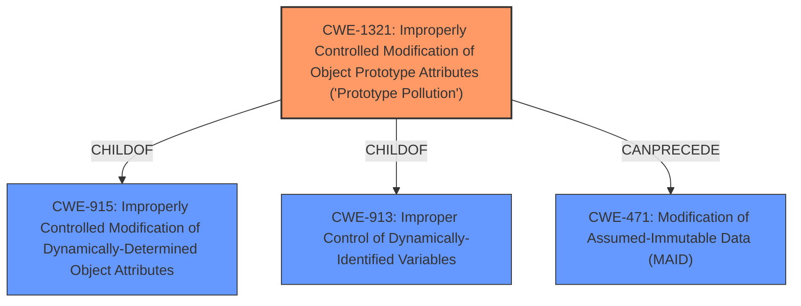

# Raw Analyzer Response for CVE-2020-28267

# Summary
| CWE ID | CWE Name | Confidence | CWE Abstraction Level | CWE Vulnerability Mapping Label | CWE-Vulnerability Mapping Notes |
|---|---|---|---|---|---|
| CWE-1321 | Improperly Controlled Modification of Object Prototype Attributes ('Prototype Pollution') | 1.0 | Variant | Allowed | Primary CWE |

## Evidence and Confidence

*   **Confidence Score:** 1.0
*   **Evidence Strength:** HIGH

## Relationship Analysis
The primary identified CWE is CWE-1321, which is a Variant-level CWE. It has hierarchical relationships (ChildOf) with CWE-915 and CWE-913, and a chain relationship (CanPrecede) with CWE-471. This suggests that CWE-1321 is a specific type of weakness related to object attribute modification and can potentially lead to modification of assumed immutable data.

## Vulnerability Chain
The vulnerability chain starts with **Improperly Controlled Modification of Object Prototype Attributes ('Prototype Pollution')** (CWE-1321), which allows an attacker to modify object prototypes. This can lead to a denial of service or potentially remote code execution.

## Summary of Analysis
The analysis is based on the provided evidence, which includes the vulnerability description, key phrases, and CVE reference summary. The key phrase "prototype pollution" directly indicates **Improperly Controlled Modification of Object Prototype Attributes ('Prototype Pollution')** (CWE-1321). The CVE reference summary confirms this by stating, "The module did not check for the type of object before assigning value to the property, leading to a Prototype Pollution vulnerability," and explicitly listing CWE-1321 as a weakness. The retriever results also rank CWE-1321 as the top candidate.

The graph relationships confirm that CWE-1321 is a specific variant of broader weaknesses related to object attribute modification (CWE-915, CWE-913) and can lead to further issues like modification of assumed immutable data (CWE-471).

The decision to select CWE-1321 is based on its direct mention in the CVE reference summary, the clear description of the vulnerability as "prototype pollution," and the high ranking in the retriever results. The CWE is at the optimal level of specificity, as it precisely describes the vulnerability's root cause.

Other CWEs Considered:

*   CWE-843: Access of Resource Using Incompatible Type ('Type Confusion') - This was considered but deemed less relevant because the vulnerability is specifically about modifying object prototypes rather than using an incompatible type.
*   CWE-1188: Initialization of a Resource with an Insecure Default - Not applicable as the issue is with modifying existing prototypes, not insecure defaults.
*   CWE-20: Improper Input Validation - While input validation could potentially prevent this, it is not the direct cause. CWE-1321 more precisely describes the root cause.
*   CWE-470: Use of Externally-Controlled Input to Select Classes or Code ('Unsafe Reflection') - Not relevant as the vulnerability does not involve reflection.
*   CWE-190: Integer Overflow or Wraparound and CWE-1284: Improper Validation of Specified Quantity in Input - These are not applicable to the prototype pollution vulnerability.