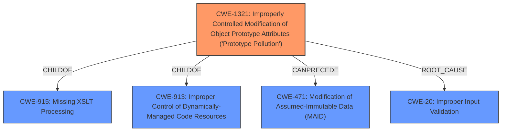

# Enhanced Analysis for CVE-2020-28280

# Summary
| CWE ID | CWE Name | Confidence | CWE Abstraction Level | CWE Vulnerability Mapping Label | CWE-Vulnerability Mapping Notes |
|---|---|---|---|---|---|
| CWE-1321 | Improperly Controlled Modification of Object Prototype Attributes ('Prototype Pollution') | 1.0 | Variant | Allowed | Primary CWE |
| CWE-20 | Improper Input Validation | 0.7 | Class | Discouraged | Secondary Candidate |

## Evidence and Confidence

*   **Confidence Score:** 0.9
*   **Evidence Strength:** HIGH

## Relationship Analysis
The primary CWE, CWE-1321, is a Variant of CWE-915 (Missing XSLT Processing) and CWE-913 (Improper Control of Dynamically-Managed Code Resources). It can precede CWE-471 (Modification of Assumed-Immutable Data (MAID)). This indicates a potential chain where prototype pollution leads to modification of immutable data. CWE-20 is a Class level CWE that is discouraged to use but is added since the root cause is from missing input validation that leads to prototype pollution



## Vulnerability Chain
The vulnerability chain starts with the **lack of input validation**, leading to **prototype pollution**, which can then result in denial of service or potentially remote code execution.

## Summary of Analysis
The analysis indicates a clear case of prototype pollution due to **improper input validation** within the `predefine` npm package. The `merge()` function's failure to validate properties before assignment allows injection into `Object.prototype`.

The primary CWE selection of CWE-1321 is strongly supported by:
-   The **Vulnerability Description Key Phrases**, which identifies "**prototype pollution**" as the **rootcause**.
-   The **CVE Reference Links Content Summary**, which indicates that the `merge()` function doesn't check if a property being assigned exists or is part of the object's prototype chain. The summary explicitly states that the vulnerability stems from a **lack of proper input validation** and allows an attacker to inject properties into the `Object.prototype` by providing a crafted input with the `__proto__` property.
-   **CWE for similar CVE Descriptions** which lists CWE-1321 as the Primary CWE Match and Top CWE.
-   The **Retriever Results**, which lists CWE-1321 as the top match.

The evidence clearly supports the selection of CWE-1321 as the primary weakness, describing how **prototype pollution** is achieved via a crafted input. The selection is further reinforced by the fact that CWE-1321 is a Variant, indicating a higher level of specificity.

CWE-20 is included as a secondary candidate to specify the **improper input validation** that leads to the prototype pollution.

Other CWEs Considered:

*   CWE-119 (Improper Restriction of Operations within the Bounds of a Memory Buffer): While the vulnerability can lead to memory corruption, it is not the direct cause, so this CWE is not as accurate.
*   CWE-120 (Buffer Copy without Checking Size of Input): This CWE is not applicable since the issue is not related to buffer copying.
*   CWE-787 (Out-of-bounds Write): While prototype pollution *can* lead to this, it's not the direct mechanism, and CWE-1321 is more precise.
*   CWE-843 (Access of Resource Using Incompatible Type ('Type Confusion')): While there may be type issues, it's not the primary weakness being exploited.
*   CWE-125 (Out-of-bounds Read): Not relevant, as the primary issue is writing to the prototype.
*   CWE-190 (Integer Overflow or Wraparound): Integer issues are not directly involved.
*   CWE-770 (Allocation of Resources Without Limits or Throttling): Not related to resource allocation limits.

The selected CWEs are at the optimal level of specificity because they accurately reflect the **root cause** and nature of the vulnerability, supported by direct evidence from the vulnerability description and related resources.


## CWE Relationship Analysis

Current CWEs represent these abstraction levels: .


### Vulnerability Chain Analysis

**Chain starting from CWE-787:**
- 787 (Out-of-bounds Write) - ROOT


**Chain starting from CWE-843:**
- 843 (Access of Resource Using Incompatible Type ('Type Confusion')) - ROOT


### CWE Relationship Diagram

```mermaid
graph TD
    classDef primary fill:#f96,stroke:#333,stroke-width:2px
    classDef secondary fill:#69f,stroke:#333
    classDef tertiary fill:#9e9,stroke:#333
```