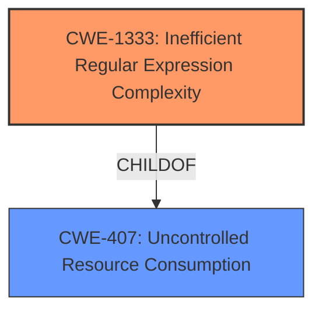

# Analysis for CVE-2020-28469

# Summary

| CWE ID    | CWE Name                                                      | Confidence | CWE Abstraction Level | CWE Vulnerability Mapping Label | CWE-Vulnerability Mapping Notes |
| --------- | ------------------------------------------------------------- | ---------- | --------------------- | ------------------------------- | ----------------------------- |
| CWE-1333  | Inefficient Regular Expression Complexity                     | 1.0        | Base                  | Allowed                         | Primary CWE                   |

## Evidence and Confidence

*   **Confidence Score:** 1.0
*   **Evidence Strength:** HIGH

## Relationship Analysis

The primary relationship influencing the decision is the ChildOf relationship between CWE-1333 and CWE-407 (Uncontrolled Resource Consumption). This indicates that the **inefficient regular expression** leads to excessive CPU consumption, which is a type of uncontrolled resource consumption. The vulnerability description explicitly mentions that the ReDoS vulnerability can cause the system to excessively consume CPU resources.

## Vulnerability Chain

The vulnerability chain starts with the **improper enclosure regex**, which leads to an **inefficient regular expression** (CWE-1333), which results in a Regular Expression Denial of Service (ReDoS) condition, and ultimately causes excessive CPU consumption and Denial of Service.

## Summary of Analysis

The analysis is based on the vulnerability description and the CVE Reference Links Content Summary. The key phrase from the Vulnerability Description is "**improper enclosure regex**". The CVE Reference Links Content Summary states: "The vulnerability is due to a Regular Expression Denial of Service (ReDoS) vulnerability in the `enclosure` regex used to check for strings ending in an enclosure containing a path separator." It also states: "Weakness: Inefficient regular expression that can lead to catastrophic backtracking, resulting in excessive CPU consumption."

The Retriever Results list CWE-1333 (Inefficient Regular Expression Complexity) as the top result with a similarity score of 0.184. The description of CWE-1333 matches the vulnerability description, stating: "The product uses a regular expression with an inefficient, possibly exponential worst-case computational complexity that consumes excessive CPU cycles." The usage for CWE-1333 is "Allowed" and the rationale is "This CWE entry is at the Base level of abstraction, which is a preferred level of abstraction for mapping to the root causes of vulnerabilities."

Therefore, CWE-1333 is the most appropriate CWE for this vulnerability, as it directly describes the root cause of the ReDoS vulnerability. It is also at the recommended "Base" level of abstraction.

Other CWEs considered but not used:

*   CWE-95 (Improper Neutralization of Directives in Dynamically Evaluated Code ('Eval Injection')): This CWE is not applicable because the vulnerability does not involve dynamic code evaluation.
*   CWE-22 (Improper Limitation of a Pathname to a Restricted Directory ('Path Traversal')): This CWE is not applicable because the vulnerability is related to regular expression complexity, not path traversal.
*   CWE-345 (Insufficient Verification of Data Authenticity): This CWE is not applicable because the vulnerability does not involve insufficient verification of data authenticity.
*   CWE-625 (Permissive Regular Expression): Although the vulnerability involves a regular expression, the primary issue is the inefficiency and complexity of the expression, rather than it being too permissive.
*   CWE-185 (Incorrect Regular Expression): While this is close, CWE-1333 is more specific about the complexity aspect.
* CWE-73 (External Control of File Name or Path): The vulnerability doesn't involve external control of file names or paths.

Relevant CWE Information:

# Enhanced Context (25 CWEs)

## CWE-41: Improper Resolution of Path Equivalence
**Abstraction Level**: Base
**Similarity Score**: 0.77
**Source**: dense

**Description**:
The product is vulnerable to file system contents disclosure through path equivalence. Path equivalence involves the use of special characters in file and directory names. The associated manipulations are intended to generate multiple names for the same object.

**Mapping Guidance**:
- Usage: Allowed
- Rationale: This CWE entry is at the Base level of abstraction, which is a preferred level of abstraction for mapping to the root causes of vulnerabilities.

## CWE-113: Improper Neutralization of CRLF Sequences in HTTP Headers ('HTTP Request/Response Splitting')
**Abstraction Level**: Variant
**Similarity Score**: 0.76
**Source**: dense

**Description**:
The product receives data from an HTTP agent/component (e.g., web server, proxy, browser, etc.), but it does not neutralize or incorrectly neutralizes CR and LF characters before the data is included in outgoing HTTP headers.

**Mapping Guidance**:
- Usage: Allowed
- Rationale: This CWE entry is at the Variant level of abstraction, which is a preferred level of abstraction for mapping to the root causes of vulnerabilities.

## CWE-74: Improper Neutralization of Special Elements in Output Used by a Downstream Component ('Injection')
**Abstraction Level**: Class
**Similarity Score**: 0.76
**Source**: dense

**Description**:
The product constructs all or part of a command, data structure, or record using externally-influenced input from an upstream component, but it does not neutralize or incorrectly neutralizes special elements that could modify how it is parsed or interpreted when it is sent to a downstream component.

**Mapping Guidance**:
- Usage: Discouraged
- Rationale: CWE-74 is high-level and often misused when lower-level weaknesses are more appropriate.

## CWE-23: Relative Path Traversal
**Abstraction Level**: Base
**Similarity Score**: 0.76
**Source**: dense

**Description**:
The product uses external input to construct a pathname that should be within a restricted directory, but it does not properly neutralize sequences such as ".." that can resolve to a location that is outside of that directory.

**Mapping Guidance**:
- Usage: Allowed
- Rationale: This CWE entry is at the Base level of abstraction, which is a preferred level of abstraction for mapping to the root causes of vulnerabilities.

## CWE-138: Improper Neutralization of Special Elements
**Abstraction Level**: Class
**Similarity Score**: 0.75
**Source**: dense

**Description**:
The product receives input from an upstream component, but it does not neutralize or incorrectly neutralizes special elements that could be interpreted as control elements or syntactic markers when they are sent to a downstream component.

**Mapping Guidance**:
- Usage: Discouraged
- Rationale: This CWE entry is a level-1 Class (i.e., a child of a Pillar). It might have lower-level children that would be more appropriate

## CWE-1289: Improper Validation of Unsafe Equivalence in Input
**Abstraction Level**: Base
**Similarity Score**: 0.75
**Source**: dense

**Description**:
The product receives an input value that is used as a resource identifier or other type of reference, but it does not validate or incorrectly validates that the input is equivalent to a potentially-unsafe value.

**Mapping Guidance**:
- Usage: Allowed
- Rationale: This CWE entry is at the Base level of abstraction, which is a preferred level of abstraction for mapping to the root causes of vulnerabilities.

## CWE-212: Improper Removal of Sensitive Information Before Storage or Transfer
**Abstraction Level**: Base
**Similarity Score**: 0.75
**Source**: dense

**Description**:
The product stores, transfers, or shares a resource that contains sensitive information, but it does not properly remove that information before the product makes the resource available to unauthorized actors.

**Mapping Guidance**:
- Usage: Allowed
- Rationale: This CWE entry is at the Base level of abstraction, which is a preferred level of abstraction for mapping to the root causes of vulnerabilities.

## CWE-668: Exposure of Resource to Wrong Sphere
**Abstraction Level**: Class
**Similarity Score**: 0.75
**Source**: dense

**Description**:
The product exposes a resource to the wrong control sphere, providing unintended actors with inappropriate access to the resource.

**Mapping Guidance**:
- Usage: Discouraged
- Rationale: CWE-668 is high-level and is often misused as a catch-all when lower-level CWE IDs might be applicable. It is sometimes used for low-information vulnerability reports [REF-1287]. It is a level-1 Class (i.e., a child of a Pillar). It is not useful for trend analysis.

## CWE-184: Incomplete List of Disallowed Inputs
**Abstraction Level**: Base
**Similarity Score**: 0.75
**Source**: dense

**Description**:
The product implements a protection mechanism that relies on a list of inputs (or properties of inputs) that are not allowed by policy or otherwise require other action to neutralize before additional processing takes place, but the list is incomplete.

**Mapping Guidance**:
-