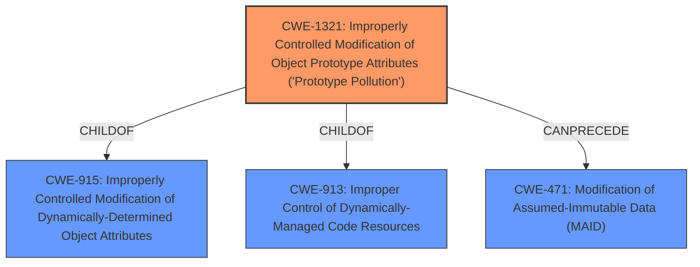

# Analysis for CVE-2020-28499

# Summary
| CWE ID    | CWE Name                                                                                             | Confidence | CWE Abstraction Level | CWE Vulnerability Mapping Label | CWE-Vulnerability Mapping Notes |
| --------- | ---------------------------------------------------------------------------------------------------- | ---------- | --------------------- | ------------------------------- | ------------------------------- |
| CWE-1321  | Improperly Controlled Modification of Object Prototype Attributes ('Prototype Pollution')             | 1          | Variant               | Allowed                       | Primary CWE                     |
| CWE-915 | Improperly Controlled Modification of Dynamically-Determined Object Attributes              | 0.7        | Base               | Allowed                       | Secondary CWE                     |

## Evidence and Confidence

*   **Confidence Score:** 1
*   **Evidence Strength:** HIGH

## Relationship Analysis
The primary CWE selected is CWE-1321, which is a Variant of CWE-915 and CWE-913, providing a more specific classification of the vulnerability. CWE-1321 is also documented to be able to precede CWE-471. This hierarchy helps to pinpoint the specific nature of the prototype pollution issue. The variant level of abstraction is preferred.

## Vulnerability Chain
The vulnerability chain involves:
1.  **Root Cause:** **Improper control** over modification of object prototype attributes (**Prototype Pollution** - CWE-1321).
2.  **Weakness:** The `_recursiveMerge` function **doesn't properly sanitize input**, allowing the injection of `__proto__` properties.
3.  **Impact:** Modification of `Object.prototype` leading to Denial of Service (DoS), Remote Code Execution (RCE), or property injection.

## Summary of Analysis
The analysis strongly supports CWE-1321 as the primary weakness. The vulnerability description clearly states "**Prototype Pollution** via _recursiveMerge", which aligns perfectly with CWE-1321's definition: "The product receives input from an upstream component that specifies attributes that are to be initialized or updated in an object, but it does not properly control modifications of attributes of the object prototype." The evidence from "CVE Reference Links Content Summary" confirms that the **root cause** is an "Unsafe Recursive Merge" function that "fails to handle the `__proto__` property correctly." This directly leads to **prototype pollution**.

The retriever results also list CWE-1321 as the top candidate. The hierarchical relationships show that CWE-1321 is a variant of more general CWEs, making it the most specific and accurate choice. The graph relationships confirm this, and the MITRE mapping guidance allows for its use at the Variant level.

CWE-915 ("Improperly Controlled Modification of Dynamically-Determined Object Attributes") was considered because CWE-1321 is a child of it, and it generally describes the **improper control** over object attributes. However, CWE-1321 is more specific to **prototype pollution**, making it the better fit.

CWE-471 ("Modification of Assumed-Immutable Data (MAID)") was also considered because prototype properties are often assumed to be immutable. However, the **root cause** is the **improper control** during merging, not necessarily the immutability assumption.

The final decision to use CWE-1321 is based on its direct relevance to the vulnerability description, the retriever results, the hierarchical relationships, and the MITRE mapping guidance.

Relevant CWE Information:

# Enhanced Context (25 CWEs)
The following CWEs were identified as potentially relevant to this vulnerability:

## CWE-915: Improperly Controlled Modification of Dynamically-Determined Object Attributes
**Abstraction Level**: Base
**Similarity Score**: 0.77
**Source**: dense

**Description**:
The product receives input from an upstream component that specifies multiple attributes, properties, or fields that are to be initialized or updated in an object, but it does not properly control which attributes can be modified.

**Mapping Guidance**:
- Usage: Allowed
- Rationale: This CWE entry is at the Base level of abstraction, which is a preferred level of abstraction for mapping to the root causes of vulnerabilities.

**Technical Explanation:** CWE-915 is a good secondary candidate, as it describes the general case of **improperly controlled modification** of object attributes. The **vulnerability** involves **improperly controlling** the modification of the object prototype, which is a specific type of dynamically-determined object attribute. This makes it a relevant, though less specific, CWE. Confidence = 0.7.

## CWE-74: Improper Neutralization of Special Elements in Output Used by a Downstream Component ('Injection')
**Abstraction Level**: Class
**Similarity Score**: 0.75
**Source**: dense

**Description**:
The product constructs all or part of a command, data structure, or record using externally-influenced input from an upstream component, but it does not neutralize or incorrectly neutralizes special elements that could modify how it is parsed or interpreted when it is sent to a downstream component.

**Mapping Guidance**:
- Usage: Discouraged
- Rationale: CWE-74 is high-level and often misused when lower-level weaknesses are more appropriate.

**Technical Explanation:** CWE-74 is not an appropriate match. While prototype pollution could be seen as a form of "injection", CWE-74 is too general. The more specific CWE-1321 and its parents (like CWE-915) are better choices.

## CWE-99: Improper Control of Resource Identifiers ('Resource Injection')
**Abstraction Level**: Class
**Similarity Score**: 0.75
**Source**: dense

**Description**:
The product receives input from an upstream component, but it does not restrict or incorrectly restricts the input before it is used as an identifier for a resource that may be outside the intended sphere of control.

**Mapping Guidance**:
- Usage: Allowed-with-Review
- Rationale: This CWE entry is a Class and might have Base-level children that would be more appropriate

**Technical Explanation:** CWE-99 is not a suitable match. It focuses on **improper control** of resource *identifiers*, while the **vulnerability** is about **improper control** of object *attributes*.

## CWE-470: Use of Externally-Controlled Input to Select Classes or Code ('Unsafe Reflection')
**Abstraction Level**: Base
**Similarity Score**: 0.74
**Source**: dense

**Description**:
The product uses external input with reflection to select which classes or code to use, but it does not sufficiently prevent the input from selecting improper classes or code.

**Mapping Guidance**:
- Usage: Allowed
- Rationale: This CWE entry is at the Base level of abstraction, which is a preferred level of abstraction for mapping to the root causes of vulnerabilities.

**Technical Explanation:** CWE-470 is not an appropriate match. It relates to using external input to select classes or code via reflection, which is not the case here.

## CWE-184: Incomplete List of Disallowed Inputs
**Abstraction Level**: Base
**Similarity Score**: 0.74
**Source**: dense

**Description**:
The product implements a protection mechanism that relies on a list of inputs (or properties of inputs) that are not allowed by policy or otherwise require other action to neutralize before additional processing takes place, but the list is incomplete.

**Mapping Guidance**:
- Usage: Allowed
- Rationale: This CWE entry is at the Base level of abstraction, which is a preferred level of abstraction for mapping to the root causes of vulnerabilities.

**Technical Explanation:** CWE-184 is not a suitable match. The issue is not an incomplete list of disallowed inputs but rather the **improper handling** of certain inputs (specifically `__proto__`).

## CWE-138: Improper Neutralization of Special Elements
**Abstraction Level**: Class
**Similarity Score**: 0.74
**Source**: dense

**Description**:
The product receives input from an upstream component, but it does not neutralize or incorrectly neutralizes special elements that could be interpreted as control elements or syntactic markers when they are sent to a downstream component.

**Mapping Guidance**:
- Usage: Discouraged
- Rationale: This CWE entry is a level-1 Class (i.e., a child of a Pillar). It might have lower-level children that would be

# Enhanced Query for CVE-2020-28499

## Vulnerability Description
All versions of package merge are vulnerable to **Prototype Pollution** via _recursiveMerge .

### Vulnerability Description Key Phrases
- **weakness:** **Prototype Pollution**
- **product:** package merge
- **version:** All versions
- **component:** _recursiveMerge

## CVE Reference Links Content Summary
Based on the provided content, here's an analysis of CVE-2020-28499:

**Root Cause:**
The vulnerability stems from an unsafe recursive merge function (`_recursiveMerge`) within the `merge` library. This function doesn't properly sanitize input during object merging, making it vulnerable to prototype pollution.

**Weaknesses/Vulnerabilities:**
- **Prototype Pollution:** The core vulnerability is prototype pollution. By injecting a `__proto__` property into the source object during the merge operation, an attacker can modify the `Object.prototype`. This can lead to unintended behavior in JavaScript applications.
- **Unsafe Recursive Merge:** The recursive merge function fails to handle the `__proto__` property correctly. It recurses into the prototype chain when it should be sanitized.

**Impact of Exploitation:**
- **Denial of Service (DoS):** By polluting `Object.prototype` with unexpected values (e.g., an integer instead of a function), the application may fail or become unstable, leading to a denial of service.
- **Remote Code Execution (RCE):** If the application evaluates attributes of an object, such as using `eval(someobject.someattr)`, an attacker can inject malicious code via prototype pollution and achieve RCE.
- **Property Injection:** Attackers can inject arbitrary properties and values into objects that are then used by the application, potentially leading to privilege escalation or data corruption (e.g. injecting an `isAdmin` property).

**Attack Vectors:**
- The attack is triggered via the `_recursiveMerge` function when merging objects.
- The attacker needs to supply a malicious source object containing a `__proto__` property to the merge function.
- This attack vector is network based.

**Required Attacker Capabilities/Position:**
- An attacker needs to be able to influence the input to the vulnerable `merge` function, specifically the source object being merged. This can occur in a number of ways, including but not limited to:
    - Directly supplying data through API requests
    - Indirectly through user-controlled data.
    - Exploiting other vulnerabilities to manipulate the merge operation.

**Additional Details:**

* **Affected Library:** The vulnerability affects the `merge` npm package and `org.webjars.npm:merge` webjar package, versions prior to 2.1.1.
* **Proof of Concept (PoC):** The provided PoC code demonstrates how an attacker can pollute the prototype using a crafted JSON payload containing the `__proto__` property and then merge it with an existing object using the `merge.recursive` function. This modifies the prototype of all objects in the application.
* **Fix:** The recommended fix is to upgrade the `merge` package to version 2.1.1 or higher. This version contains a patch that prevents prototype pollution.

This content provides significantly more detail than a typical CVE description, including a PoC, explanation of the vulnerability, and mitigation strategies.

## Retriever Results

### Top Combined Results

| Rank | CWE ID | Name | Abstraction | Usage  | Retrievers | Individual Scores |
|------|--------|------|-------------|-------|------------|-------------------|
| 1 | 1321 | Improperly Controlled Modification of Object Prototype Attributes ('Prototype Pollution') | Variant | Allowed | sparse | 0.234 |
| 2 | 1188 | Initialization of a Resource with an Insecure Default | Base | Allowed | sparse | 0.080 |
| 3 | 843 | Access of Resource Using Incompatible Type ('Type Confusion') | Base | Allowed | sparse | 0.076 |
| 4 | 1333 | Inefficient Regular Expression Complexity | Base | Allowed | sparse | 0.070 |
| 5 | 377 | Insecure Temporary File | Class | Allowed-with-Review | sparse | 0.059 |
| 6 | 674 | Uncontrolled Recursion | Class | Allowed-with-Review | dense | 0.493 |
| 7 | 471 | Modification of Assumed-Immutable Data (MAID) | Base | Allowed | graph | 0.002 |
| 8 | 335 | Incorrect Usage of Seeds in Pseudo-Random Number Generator (PRNG) | Base | Allowed | sparse | 0.059 |
| 9 | 138 | Improper Neutralization of Special Elements | Class | Discouraged | sparse | 0.057 |
| 10 | 94 | Improper Control of Generation of Code ('Code Injection') | Base | Allowed-with-Review | sparse | 0.054 |

# Complete CWE Specifications

## CWE-1321: Improperly Controlled Modification of Object Prototype Attributes ('Prototype Pollution')
**Abstraction:** Variant
**Status:** Incomplete

### Description
The product receives input from an upstream component that specifies attributes that are to be initialized or updated in an object, but it does not properly control modifications of attributes of the object prototype.

### Extended Description

By adding or modifying attributes of an object prototype, it is possible to create attributes that exist on every object, or replace critical attributes with malicious ones. This can be problematic if the product depends on existence or non-existence of certain attributes, or uses pre-defined attributes of object prototype (such as hasOwnProperty, toString or valueOf).

This weakness is usually exploited by using a special attribute of objects called proto, constructor or prototype. Such attributes give access to the object prototype. This weakness is often found in code that assigns object attributes based on user input, or merges or clones objects recursively.

### Alternative Terms
None

### Relationships
ChildOf -> CWE-915
ChildOf -> CWE-913
CanPrecede -> CWE-471

### Mapping Guidance
**Usage:** Allowed
**Rationale:** This CWE entry is at the Variant level of abstraction, which is a preferred level of abstraction for mapping to the root causes of vulnerabilities.
**Comments:** Carefully read both the name and description to ensure that this mapping is an appropriate fit. Do not try to 'force' a mapping to a lower-level Base/Variant simply to comply with this preferred level of abstraction.
**Reasons:**
- Acceptable-Use

### Observed Examples
- **CVE-2018-3721:** Prototype pollution by merging objects.
- **CVE-2019-10744:** Prototype pollution by setting default values to object attributes recursively.
- **CVE-2019-11358:** Prototype pollution by merging objects recursively.

## CWE-1188: Initialization of a Resource with an Insecure Default
**Abstraction:** Base
**Status:** Incomplete

### Description
The product initializes or sets a resource with a default that is intended to be changed by the administrator, but the default is not secure.

### Extended Description

Developers often choose default values that leave the product as open and easy to use as possible out-of-the-box, under the assumption that the administrator can (or should) change the default value. However, this ease-of-use comes at a cost when the default is insecure and the administrator does not change it.

### Alternative Terms
None

### Relationships
ChildOf -> CWE-1419
ChildOf -> CWE-665

### Mapping Guidance
**Usage:** Allowed
**Rationale:** This CWE entry is at the Base level of abstraction, which is a preferred level of abstraction for mapping to the root causes of vulnerabilities.
**Comments:** Carefully read both the name and description to ensure that this mapping is an appropriate fit. Do not try to 'force' a mapping to a lower-level Base/Variant simply to comply with this preferred level of abstraction.
**Reasons:**
- Acceptable-Use

### Additional Notes
**[Maintenance]** This entry improves organization of concepts under initialization. The typical CWE model is to cover "Missing" and "Incorrect" behaviors. Arguably, this entry could be named as "Incorrect" instead of "Insecure." This might be changed in the near future.

### Observed Examples
- **CVE-2022-36349:** insecure default variable initialization in BIOS firmware for a hardware board allows DoS
- **CVE-2022-42467:** A generic database browser interface has a default mode that exposes a web server to the network, allowing queries to the database.

## CWE-843: Access of Resource Using Incompatible Type ('Type Confusion')
**Abstraction:** Base
**Status:** Incomplete

### Description
The product allocates or initializes a resource such as a pointer, object, or variable using one type, but it later accesses that resource using a type that is incompatible with the original type.

### Extended Description

When the product accesses the resource using an incompatible type, this could trigger logical errors because the resource does not have expected properties. In languages without memory safety, such as C and C++, type confusion can lead to out-of-bounds memory access.

While this weakness is frequently associated with unions when parsing data with many different embedded object types in C, it can be present in any application that can interpret the same variable or memory location in multiple ways.

This weakness is not unique to C and C++. For example, errors in PHP applications can be triggered by providing array parameters when scalars are expected, or vice versa. Languages such as Perl, which perform automatic conversion of a variable of one type when it is accessed as if it were another type, can also contain these issues.

### Alternative Terms
Object Type Confusion

### Relationships
ChildOf -> CWE-704
ChildOf -> CWE-704
CanPrecede -> CWE-119

### Mapping Guidance
**Usage:** Allowed
**Rationale:** This CWE entry is at the Base level of abstraction, which is a preferred level of abstraction for mapping to the root causes of vulnerabilities.
**Comments:** Carefully read both the name and description to ensure that this mapping is an appropriate fit. Do not try to 'force' a mapping to a lower-level Base/Variant simply to comply with this preferred level of abstraction.
**Reasons:**
- Acceptable-Use

### Additional Notes
**[Applicable Platform]** 

This weakness is possible in any type-unsafe programming language.

**[Research Gap]** 

Type confusion weaknesses have received some attention by applied researchers and major software vendors for C and C++ code. Some publicly-reported vulnerabilities probably have type confusion as a root-cause weakness, but these may be described as "memory corruption" instead.

For other languages, there are very few public reports of type confusion weaknesses. These are probably under-studied. Since many programs rely directly or indirectly on loose typing, a potential "type confusion" behavior might be intentional, possibly requiring more manual analysis.

### Observed Examples
- **CVE-2010-4577:** Type confusion in CSS sequence leads to out-of-bounds read.
- **CVE-2011-0611:** Size inconsistency allows code execution, first discovered when it was actively exploited in-the-wild.
- **CVE-2010-0258:** Improperly-parsed file containing records of different types leads to code execution when a memory location is interpreted as a different object than intended.

## CWE-1333: Inefficient Regular Expression Complexity
**Abstraction:** Base
**Status:** Draft

### Description
The product uses a regular expression with an inefficient, possibly exponential worst-case computational complexity that consumes excessive CPU cycles.

### Extended Description
Some regular expression engines have a feature called "backtracking". If the token cannot match, the engine "backtracks" to a position that may result in a different token that can match.
 Backtracking becomes a weakness if all of these conditions are met:

  - The number of possible backtracking attempts are exponential relative to the length of the input.

  - The input can fail to match the regular expression.

  - The input can be long enough.

 Attackers can create crafted inputs that intentionally cause the regular expression to use excessive backtracking in a way that causes the CPU consumption to spike. 

### Alternative Terms
ReDoS: ReDoS is an abbreviation of "Regular expression Denial of Service".
Regular Expression Denial of Service: While this term is attack-focused, this is commonly used to describe the weakness.
Catastrophic backtracking: This term is used to describe the behavior of the regular expression as a negative technical impact.

### Relationships
ChildOf -> CWE-407
ChildOf -> CWE-407

### Mapping Guidance
**Usage:** Allowed
**Rationale:** This CWE entry is at the Base level of abstraction, which is a preferred level of abstraction for mapping to the root causes of vulnerabilities.
**Comments:** Carefully read both the name and description to ensure that this mapping is an appropriate fit. Do not try to 'force' a mapping to a lower-level Base/Variant simply to comply with this preferred level of abstraction.
**Reasons:**
- Acceptable-Use

### Observed Examples
- **CVE-2020-5243:** server allows ReDOS with crafted User-Agent strings, due to overlapping capture groups that cause excessive backtracking.
- **CVE-2021-21317:** npm package for user-agent parser prone to ReDoS due to overlapping capture groups
- **CVE-2019-16215:** Markdown parser uses inefficient regex when processing a message, allowing users to cause CPU consumption and delay preventing processing of other messages.

## CWE-377: Insecure Temporary File
**Abstraction:** Class
**Status:** Incomplete

### Description
Creating and using insecure temporary files can leave application and system data vulnerable to attack.

### Extended Description
Not provided

### Alternative Terms
None

### Relationships
ChildOf -> CWE-668

### Mapping Guidance
**Usage:** Allowed-with-Review
**Rationale:** This CWE entry is a Class and might have Base-level children that would be more appropriate
**Comments:** Examine children of this entry to see if there is a better fit
**Reasons:**
- Abstraction

### Additional Notes
**[Other]** 

Applications require temporary files so frequently that many different mechanisms exist for creating them in the C Library and Windows(R) API. Most of these functions are vulnerable to various forms of attacks.

The functions designed to aid in the creation of temporary files can be broken into two groups based whether they simply provide a filename or actually open a new file. - Group 1: "Unique" Filenames: The first group of C Library and WinAPI functions designed to help with the process of creating temporary files do so by generating a unique file name for a new temporary file, which the program is then supposed to open. This group includes C Library functions like tmpnam(), tempnam(), mktemp() and their C++ equivalents prefaced with an _ (underscore) as well as the GetTempFileName() function from the Windows API. This group of functions suffers from an underlying race condition on the filename chosen. Although the functions guarantee that the filename is unique at the time it is selected, there is no mechanism to prevent another process or an attacker from creating a file with the same name after it is selected but before the application attempts to open the file. Beyond the risk of a legitimate collision caused by another call to the same function, there is a high probability that an attacker will be able to create a malicious collision because the filenames generated by these functions are not sufficiently randomized to make them difficult to guess. If a file with the selected name is created, then depending on how the file is opened the existing contents or access permissions of the file may remain intact. If the existing contents of the file are malicious in nature, an attacker may be able to inject dangerous data into the application when it reads data back from the temporary file. If an attacker pre-creates the file with relaxed access permissions, then data stored in the temporary file by the application may be accessed, modified or corrupted by an attacker. On Unix based systems an even more insidious attack is possible if the attacker pre-creates the file as a link to another important file. Then, if the application truncates or writes data to the file, it may unwittingly perform damaging operations for the attacker. This is an especially serious threat if the program operates with elevated permissions. Finally, in the best case the file will be opened with the a call to open() using the O_CREAT and O_EXCL flags or to CreateFile() using the CREATE_NEW attribute, which will fail if the file already exists and therefore prevent the types of attacks described above. However, if an attacker is able to accurately predict a sequence of temporary file names, then the application may be prevented from opening necessary temporary storage causing a denial of service (DoS) attack. This type of attack would not be difficult to mount given the small amount of randomness used in the selection of the filenames generated by these functions. - Group 2: "Unique" Files: The second group of C Library functions attempts to resolve some of the security problems related to temporary files by not only generating a unique file name, but also opening the file. This group includes C Library functions like tmpfile() and its C++ equivalents prefaced with an _ (underscore), as well as the slightly better-behaved C Library function mkstemp(). The tmpfile() style functions construct a unique filename and open it in the same way that fopen() would if passed the flags "wb+", that is, as a binary file in read/write mode. If the file already exists, tmpfile() will truncate it to size zero, possibly in an attempt to assuage the security concerns mentioned earlier regarding the race condition that exists between the selection of a supposedly unique filename and the subsequent opening of the selected file. However, this behavior clearly does not solve the function's security problems. First, an attacker can pre-create the file with relaxed access-permissions that will likely be retained by the file opened by tmpfile(). Furthermore, on Unix based systems if the attacker pre-creates the file as a link to another important file, the application may use its possibly elevated permissions to truncate that file, thereby doing damage on behalf of the attacker. Finally, if tmpfile() does create a new file, the access permissions applied to that file will vary from one operating system to another, which can leave application data vulnerable even if an attacker is unable to predict the filename to be used in advance. Finally, mkstemp() is a reasonably safe way create temporary files. It will attempt to create and open a unique file based on a filename template provided by the user combined with a series of randomly generated characters. If it is unable to create such a file, it will fail and return -1. On modern systems the file is opened using mode 0600, which means the file will be secure from tampering unless the user explicitly changes its access permissions. However, mkstemp() still suffers from the use of predictable file names and can leave an application vulnerable to denial of service attacks if an attacker causes mkstemp() to fail by predicting and pre-creating the filenames to be used.

### Observed Examples
- **CVE-2022-41954:** A library uses the Java File.createTempFile() method which creates a file with "-rw-r--r--" default permissions on Unix-like operating systems

## CWE-674: Uncontrolled Recursion
**Abstraction:** Class
**Status:** Draft

### Description
The product does not properly control the amount of recursion that takes place,  consuming excessive resources, such as allocated memory or the program stack.

### Extended Description
Not provided

### Alternative Terms
Stack Exhaustion

### Relationships
ChildOf -> CWE-834

### Mapping Guidance
**Usage:** Allowed-with-Review
**Rationale:** This CWE entry is a Class and might have Base-level children that would be more appropriate
**Comments:** Examine children of this entry to see if there is a better fit
**Reasons:**
- Abstraction

### Observed Examples
- **CVE-2007-1285:** Deeply nested arrays trigger stack exhaustion.
- **CVE-2007-3409:** Self-referencing pointers create infinite loop and resultant stack exhaustion.
- **CVE-2016-10707:** Javascript application accidentally changes input in a way that prevents a recursive call from detecting an exit condition.

## CWE-471: Modification of Assumed-Immutable Data (MAID)
**Abstraction:** Base
**Status:** Draft

### Description
The product does not properly protect an assumed-immutable element from being modified by an attacker.

### Extended Description
This occurs when a particular input is critical enough to the functioning of the application that it should not be modifiable at all, but it is. Certain resources are often assumed to be immutable when they are not, such as hidden form fields in web applications, cookies, and reverse DNS lookups.

### Alternative Terms
None

### Relationships
ChildOf -> CWE-664

### Mapping Guidance
**Usage:** Allowed
**Rationale:** This CWE entry is at the Base level of abstraction, which is a preferred level of abstraction for mapping to the root causes of vulnerabilities.
**Comments:** Carefully read both the name and description to ensure that this mapping is an appropriate fit. Do not try to 'force' a mapping to a lower-level Base/Variant simply to comply with this preferred level of abstraction.
**Reasons:**
- Acceptable-Use

### Additional Notes
**[Relationship]** MAID issues can be primary to many other weaknesses, and they are a major factor in languages that provide easy access to internal program constructs, such as PHP's register_globals and similar features. However, MAID issues can also be resultant from weaknesses that modify internal state; for example, a program might validate some data and store it in memory, but a buffer overflow could overwrite that validated data, leading to a change in program logic.

**[Theoretical]** There are many examples where the MUTABILITY property is a major factor in a vulnerability.

### Observed Examples
- **CVE-2002-1757:** Relies on $PHP_SELF variable for authentication.
- **CVE-2005-1905:** Gain privileges by modifying assumed-immutable code addresses that are accessed by a driver.

## CWE-335: Incorrect Usage of Seeds in Pseudo-Random Number Generator (PRNG)
**Abstraction:** Base
**Status:** Draft

### Description
The product uses a Pseudo-Random Number Generator (PRNG) but does not correctly manage seeds.

### Extended Description

 PRNGs are deterministic and, while their output appears random, they cannot actually create entropy. They rely on cryptographically secure and unique seeds for entropy so proper seeding is critical to the secure operation of the PRNG.

 Management of seeds could be broken down into two main areas: 

  -  (1) protecting seeds as cryptographic material (such as a cryptographic key); 

  -  (2) whenever possible, using a uniquely generated seed from a cryptographically secure source 

 PRNGs require a seed as input to generate a stream of numbers that are functionally indistinguishable from random numbers. While the output is, in many cases, sufficient for cryptographic uses, the output of any PRNG is directly determined by the seed provided as input. If the seed can be ascertained by a third party, the entire output of the PRNG can be made known to them. As such, the seed should be kept secret and should ideally not be able to be guessed. For example, the current time may be a poor seed. Knowing the approximate time the PRNG was seeded greatly reduces the possible key space. 

 Seeds do not necessarily need to be unique, but reusing seeds may open up attacks if the seed is discovered. 

### Alternative Terms
None

### Relationships
ChildOf -> CWE-330
ChildOf -> CWE-330

### Mapping Guidance
**Usage:** Allowed
**Rationale:** This CWE entry is at the Base level of abstraction, which is a preferred level of abstraction for mapping to the root causes of vulnerabilities.
**Comments:** Carefully read both the name and description to ensure that this mapping is an appropriate fit. Do not try to 'force' a mapping to a lower-level Base/Variant simply to comply with this preferred level of abstraction.
**Reasons:**
- Acceptable-Use

### Additional Notes
**[Maintenance]** As of CWE 4.5, terminology related to randomness, entropy, and predictability can vary widely. Within the developer and other communities, "randomness" is used heavily. However, within cryptography, "entropy" is distinct, typically implied as a measurement. There are no commonly-used definitions, even within standards documents and cryptography papers. Future versions of CWE will attempt to define these terms and, if necessary, distinguish between them in ways that are appropriate for different communities but do not reduce the usability of CWE for mapping, understanding, or other scenarios.

### Observed Examples
- **CVE-2020-7010:** Cloud application on Kubernetes generates passwords using a weak random number generator based on deployment time.
- **CVE-2019-11495:** server uses erlang:now() to seed the PRNG, which results in a small search space for potential random seeds
- **CVE-2018-12520:** Product's PRNG is not seeded for the generation of session IDs

## CWE-138: Improper Neutralization of Special Elements
**Abstraction:** Class
**Status:** Draft

### Description
The product receives input from an upstream component, but it does not neutralize or incorrectly neutralizes special elements that could be interpreted as control elements or syntactic markers when they are sent to a downstream component.

### Extended Description
Most languages and protocols have their own special elements such as characters and reserved words. These special elements can carry control implications. If product does not prevent external control or influence over the inclusion of such special elements, the control flow of the program may be altered from what was intended. For example, both Unix and Windows interpret the symbol < ("less than") as meaning "read input from a file".

### Alternative Terms
None

### Relationships
ChildOf -> CWE-707

### Mapping Guidance
**Usage:** Discouraged
**Rationale:** This CWE entry is a level-1 Class (i.e., a child of a Pillar). It might have lower-level children that would be more appropriate
**Comments:** Examine children of this entry to see if there is a better fit
**Reasons:**
- Abstraction

### Additional Notes
**[Relationship]** This weakness can be related to interpretation conflicts or interaction errors in intermediaries (such as proxies or application firewalls) when the intermediary's model of an endpoint does not account for protocol-specific special elements.

**[Relationship]** See this entry's children for different types of special elements that have been observed at one point or another. However, it can be difficult to find suitable CVE examples. In an attempt to be complete, CWE includes some types that do not have any associated observed example.

**[Research Gap]** This weakness is probably under-studied for proprietary or custom formats. It is likely that these issues are fairly common in applications that use their own custom format for configuration files, logs, meta-data, messaging, etc. They would only be found by accident or with a focused effort based on an understanding of the format.

### Observed Examples
- **CVE-2001-0677:** Read arbitrary files from mail client by providing a special MIME header that is internally used to store pathnames for attachments.
- **CVE-2000-0703:** Setuid program does not cleanse special escape sequence before sending data to a mail program, causing the mail program to process those sequences.
- **CVE-2003-0020:** Multi-channel issue. Terminal escape sequences not filtered from log files.

## CWE-94: Improper Control of Generation of Code ('Code Injection')
**Abstraction:** Base
**Status:** Draft

### Description
The product constructs all or part of a code segment using externally-influenced input from an upstream component, but it does not neutralize or incorrectly neutralizes special elements that could modify the syntax or behavior of the intended code segment.

### Extended Description

When a product allows a user's input to contain code syntax, it might be possible for an attacker to craft the code in such a way that it will alter the intended control flow of the product. Such an alteration could lead to arbitrary code execution.

Injection problems encompass a wide variety of issues -- all mitigated in very different ways. For this reason, the most effective way to discuss these weaknesses is to note the distinct features which classify them as injection weaknesses. The most important issue to note is that all injection problems share one thing in common -- i.e., they allow for the injection of control plane data into the user-controlled data plane. This means that the execution of the process may be altered by sending code in through legitimate data channels, using no other mechanism. While buffer overflows, and many other flaws, involve the use of some further issue to gain execution, injection problems need only for the data to be parsed. The most classic instantiations of this category of weakness are SQL injection and format string vulnerabilities.

### Alternative Terms
None

### Relationships
ChildOf -> CWE-74
ChildOf -> CWE-74
ChildOf -> CWE-913

### Mapping Guidance
**Usage:** Allowed-with-Review
**Rationale:** This entry is frequently misused for vulnerabilities with a technical impact of "code execution," which does not by itself indicate a root cause weakness, since dozens of weaknesses can enable code execution.
**Comments:** This weakness only applies when the product's functionality intentionally constructs all or part of a code segment. It could be that executing code could be the result of other weaknesses that do not involve the construction of code segments.
**Reasons:**
- Frequent Misuse
- Frequent Misinterpretation

### Observed Examples
- **CVE-2023-29374:** Math component in an LLM framework translates user input into a Python expression that is input into the Python exec() method, allowing code execution - one variant of a "prompt injection" attack.
- **CVE-2024-5565:** Python-based library uses an LLM prompt containing user input to dynamically generate code that is then fed as input into the Python exec() method, allowing code execution - one variant of a "prompt injection" attack.
- **CVE-2024-4181:** Framework for LLM applications allows eval injection via a crafted response from a hosting provider.

