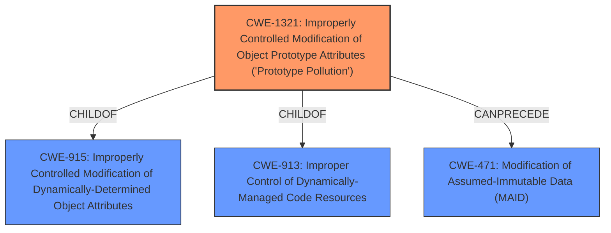

# Analysis Report for CVE-2020-28499

# Vulnerability Analysis Report: CVE-2020-28499

## Description


## Analysis (with Relationship Data)

# Summary
| CWE ID    | CWE Name                                                                                             | Confidence | CWE Abstraction Level | CWE Vulnerability Mapping Label | CWE-Vulnerability Mapping Notes |
| --------- | ---------------------------------------------------------------------------------------------------- | ---------- | --------------------- | ------------------------------- | ------------------------------- |
| CWE-1321  | Improperly Controlled Modification of Object Prototype Attributes ('Prototype Pollution')             | 1          | Variant               | Allowed                       | Primary CWE                     |
| CWE-915 | Improperly Controlled Modification of Dynamically-Determined Object Attributes              | 0.7        | Base               | Allowed                       | Secondary CWE                     |

## Evidence and Confidence

*   **Confidence Score:** 1
*   **Evidence Strength:** HIGH

## Relationship Analysis
The primary CWE selected is CWE-1321, which is a Variant of CWE-915 and CWE-913, providing a more specific classification of the vulnerability. CWE-1321 is also documented to be able to precede CWE-471. This hierarchy helps to pinpoint the specific nature of the prototype pollution issue. The variant level of abstraction is preferred.



## Vulnerability Chain
The vulnerability chain involves:
1.  **Root Cause:** **Improper control** over modification of object prototype attributes (**Prototype Pollution** - CWE-1321).
2.  **Weakness:** The `_recursiveMerge` function **doesn't properly sanitize input**, allowing the injection of `__proto__` properties.
3.  **Impact:** Modification of `Object.prototype` leading to Denial of Service (DoS), Remote Code Execution (RCE), or property injection.

## Summary of Analysis
The analysis strongly supports CWE-1321 as the primary weakness. The vulnerability description clearly states "**Prototype Pollution** via _recursiveMerge", which aligns perfectly with CWE-1321's definition: "The product receives input from an upstream component that specifies attributes that are to be initialized or updated in an object, but it does not properly control modifications of attributes of the object prototype." The evidence from "CVE Reference Links Content Summary" confirms that the **root cause** is an "Unsafe Recursive Merge" function that "fails to handle the `__proto__` property correctly." This directly leads to **prototype pollution**.

The retriever results also list CWE-1321 as the top candidate. The hierarchical relationships show that CWE-1321 is a variant of more general CWEs, making it the most specific and accurate choice. The graph relationships confirm this, and the MITRE mapping guidance allows for its use at the Variant level.

CWE-915 ("Improperly Controlled Modification of Dynamically-Determined Object Attributes") was considered because CWE-1321 is a child of it, and it generally describes the **improper control** over object attributes. However, CWE-1321 is more specific to **prototype pollution**, making it the better fit.

CWE-471 ("Modification of Assumed-Immutable Data (MAID)") was also considered because prototype properties are often assumed to be immutable. However, the **root cause** is the **improper control** during merging, not necessarily the immutability assumption.

The final decision to use CWE-1321 is based on its direct relevance to the vulnerability description, the retriever results, the hierarchical relationships, and the MITRE mapping guidance.

Relevant CWE Information:

# Enhanced Context (25 CWEs)
The following CWEs were identified as potentially relevant to this vulnerability:

## CWE-915: Improperly Controlled Modification of Dynamically-Determined Object Attributes
**Abstraction Level**: Base
**Similarity Score**: 0.77
**Source**: dense

**Description**:
The product receives input from an upstream component that specifies multiple attributes, properties, or fields that are to be initialized or updated in an object, but it does not properly control which attributes can be modified.

**Mapping Guidance**:
- Usage: Allowed
- Rationale: This CWE entry is at the Base level of abstraction, which is a preferred level of abstraction for mapping to the root causes of vulnerabilities.

**Technical Explanation:** CWE-915 is a good secondary candidate, as it describes the general case of **improperly controlled modification** of object attributes. The **vulnerability** involves **improperly controlling** the modification of the object prototype, which is a specific type of dynamically-determined object attribute. This makes it a relevant, though less specific, CWE. Confidence = 0.7.

## CWE-74: Improper Neutralization of Special Elements in Output Used by a Downstream Component ('Injection')
**Abstraction Level**: Class
**Similarity Score**: 0.75
**Source**: dense

**Description**:
The product constructs all or part of a command, data structure, or record using externally-influenced input from an upstream component, but it does not neutralize or incorrectly neutralizes special elements that could modify how it is parsed or interpreted when it is sent to a downstream component.

**Mapping Guidance**:
- Usage: Discouraged
- Rationale: CWE-74 is high-level and often misused when lower-level weaknesses are more appropriate.

**Technical Explanation:** CWE-74 is not an appropriate match. While prototype pollution could be seen as a form of "injection", CWE-74 is too general. The more specific CWE-1321 and its parents (like CWE-915) are better choices.

## CWE-99: Improper Control of Resource Identifiers ('Resource Injection')
**Abstraction Level**: Class
**Similarity Score**: 0.75
**Source**: dense

**Description**:
The product receives input from an upstream component, but it does not restrict or incorrectly restricts the input before it is used as an identifier for a resource that may be outside the intended sphere of control.

**Mapping Guidance**:
- Usage: Allowed-with-Review
- Rationale: This CWE entry is a Class and might have Base-level children that would be more appropriate

**Technical Explanation:** CWE-99 is not a suitable match. It focuses on **improper control** of resource *identifiers*, while the **vulnerability** is about **improper control** of object *attributes*.

## CWE-470: Use of Externally-Controlled Input to Select Classes or Code ('Unsafe Reflection')
**Abstraction Level**: Base
**Similarity Score**: 0.74
**Source**: dense

**Description**:
The product uses external input with reflection to select which classes or code to use, but it does not sufficiently prevent the input from selecting improper classes or code.

**Mapping Guidance**:
- Usage: Allowed
- Rationale: This CWE entry is at the Base level of abstraction, which is a preferred level of abstraction for mapping to the root causes of vulnerabilities.

**Technical Explanation:** CWE-470 is not an appropriate match. It relates to using external input to select classes or code via reflection, which is not the case here.

## CWE-184: Incomplete List of Disallowed Inputs
**Abstraction Level**: Base
**Similarity Score**: 0.74
**Source**: dense

**Description**:
The product implements a protection mechanism that relies on a list of inputs (or properties of inputs) that are not allowed by policy or otherwise require other action to neutralize before additional processing takes place, but the list is incomplete.

**Mapping Guidance**:
- Usage: Allowed
- Rationale: This CWE entry is at the Base level of abstraction, which is a preferred level of abstraction for mapping to the root causes of vulnerabilities.

**Technical Explanation:** CWE-184 is not a suitable match. The issue is not an incomplete list of disallowed inputs but rather the **improper handling** of certain inputs (specifically `__proto__`).

## CWE-138: Improper Neutralization of Special Elements
**Abstraction Level**: Class
**Similarity Score**: 0.74
**Source**: dense

**Description**:
The product receives input from an upstream component, but it does not neutralize or incorrectly neutralizes special elements that could be interpreted as control elements or syntactic markers when they are sent to a downstream component.

**Mapping Guidance**:
- Usage: Discouraged
- Rationale: This CWE entry is a level-1 Class (i.e., a child of a Pillar). It might have lower-level children that would be


## CWE Relationship Analysis

Current CWEs represent these abstraction levels: .


### Vulnerability Chain Analysis

**Chain starting from CWE-138:**
- 138 (Improper Neutralization of Special Elements) - ROOT


**Chain starting from CWE-74:**
- 74 (Improper Neutralization of Special Elements in Output Used by a Downstream Component ('Injection')) - ROOT


### CWE Relationship Diagram

```mermaid
graph TD
    classDef primary fill:#f96,stroke:#333,stroke-width:2px
    classDef secondary fill:#69f,stroke:#333
    classDef tertiary fill:#9e9,stroke:#333
```


*Report generated on 2025-04-02 07:38:43*
