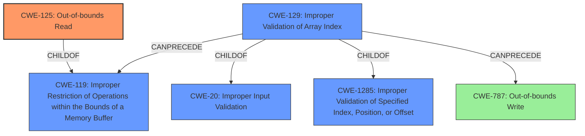

# Raw Analyzer Response for CVE-2020-28602

# Summary
| CWE ID | CWE Name | Confidence | CWE Abstraction Level | CWE Vulnerability Mapping Label | CWE-Vulnerability Mapping Notes |
|---|---|---|---|---|---|
| CWE-125 | Out-of-bounds Read | 1.0 | Base | Allowed | Primary |
| CWE-129 | Improper Validation of Array Index | 0.8 | Variant | Allowed | Secondary |
| CWE-787 | Out-of-bounds Write | 0.5 | Base | Allowed | Secondary |

## Evidence and Confidence

*   **Confidence Score:** 0.8
*   **Evidence Strength:** HIGH

## Relationship Analysis
The primary weakness is CWE-125 **Out-of-bounds Read**, because the vulnerability description clearly states that the **weakness** is an **out-of-bounds read**. CWE-125 is a base level CWE of CWE-119 **Improper Restriction of Operations within the Bounds of a Memory Buffer**. This implies that the program is reading outside the intended memory region. The secondary weakness is CWE-129 **Improper Validation of Array Index**, since the **root cause** of the vulnerability is the **lack of proper bounds checking when parsing Nef polygon data**. This means the code does not properly validate the array index. It is a variant of CWE-20 **Improper Input Validation** and CWE-1285 **Improper Validation of Specified Index, Position, or Offset**. CWE-787 **Out-of-bounds Write** was considered because type confusion can lead to arbitrary memory locations being assigned to object members which could lead to an out-of-bounds write.

## Vulnerability Chain
The vulnerability chain starts with **improper input validation** of the array index (CWE-129), leading to an **out-of-bounds read** (CWE-125). The out-of-bounds read, combined with type confusion can lead to code execution. A potential secondary issue is an **out-of-bounds write** (CWE-787) due to type confusion.

## Summary of Analysis
The initial analysis identified the primary issue as CWE-125 **Out-of-bounds Read** and CWE-129 **Improper Validation of Array Index** as a contributing factor. The vulnerability description explicitly mentions the **out-of-bounds read** (**weakness:** **out-of-bounds read**). The CVE reference summarizes the **root cause** as the **lack of proper bounds checking**, which leads to CWE-129.

> The root cause lies in the lack of proper bounds checking when parsing Nef polygon data. Specifically, the `PM_io_parser<PMDEC>::read_vertex()` function within the CGAL library reads an index from the input file and directly uses it to access the `Halfedge_of` vector, without verifying if the index is within the valid bounds of the vector.

The retriever results also support CWE-125 and CWE-129. CWE-125 is a base level CWE and accurately describes the vulnerability. CWE-129 is a variant and provides more specific information about the **improper validation of the array index**. The chosen CWEs are at the appropriate level of specificity, with CWE-125 describing the core issue and CWE-129 detailing the root cause.

Relevant CWE Information: