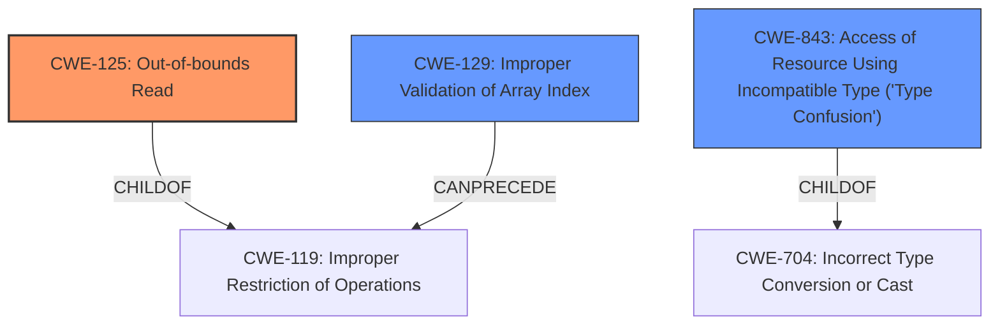

# Analysis for CVE-2020-28604

# Summary
| CWE ID | CWE Name | Confidence | CWE Abstraction Level | CWE Vulnerability Mapping Label | CWE-Vulnerability Mapping Notes |
|---|---|---|---|---|---|
| CWE-125 | Out-of-bounds Read | 1.0 | Base | Allowed | Primary CWE |
| CWE-843 | Access of Resource Using Incompatible Type ('Type Confusion') | 0.9 | Base | Allowed | Secondary CWE |
| CWE-129 | Improper Validation of Array Index | 0.8 | Variant | Allowed | Secondary CWE |

## Evidence and Confidence

*   **Confidence Score:** 0.9
*   **Evidence Strength:** HIGH

## Relationship Analysis
The primary weakness is **CWE-125** (Out-of-bounds Read), which is a base-level CWE. **CWE-125** is a child of **CWE-119** (Improper Restriction of Operations within the Bounds of a Memory Buffer). The vulnerability also involves **CWE-843** (Type Confusion), which can lead to out-of-bounds memory access and is a peer of **CWE-704** (Incorrect Type Conversion or Cast). Additionally, **CWE-129** (Improper Validation of Array Index) can precede **CWE-119**, indicating a potential cause for the out-of-bounds read.

## Vulnerability Chain
The vulnerability chain starts with a **malformed file** that leads to an **improper validation of array index** (**CWE-129**), resulting in an **out-of-bounds read** (**CWE-125**) and **type confusion** (**CWE-843**), which ultimately leads to **code execution**.

## Summary of Analysis
The initial assessment identified **CWE-125** as the primary weakness due to the explicit mention of an **out-of-bounds read** in the vulnerability description and CVE reference. The supporting evidence clearly states that the lack of bounds checking leads to reading memory outside the allocated vector. The evidence also indicates **type confusion** which is being mapped to **CWE-843**. **CWE-129** is included because the attacker controlled index `ene` is not validated, and is used to access the `Halfedge_of` array.

The graph relationships confirm that **CWE-125** is a base-level weakness under **CWE-119**, providing the appropriate level of specificity. The relationship between **CWE-129** and **CWE-119** further supports the inclusion of **CWE-129** as a contributing factor to the vulnerability.

The selection of **CWE-125**, **CWE-843**, and **CWE-129** is based on direct evidence from the vulnerability description and CVE reference, aligning with MITRE's mapping guidance for allowed usage and appropriate levels of abstraction.

Relevant CWE Information:

# Enhanced Context (25 CWEs)

## CWE-197: Numeric Truncation Error
**Abstraction Level**: Base
**Similarity Score**: 0.81
**Source**: dense

**Description**:
Truncation errors occur when a primitive is cast to a primitive of a smaller size and data is lost in the conversion.

**Mapping Guidance**:
- Usage: Allowed
- Rationale: This CWE entry is at the Base level of abstraction, which is a preferred level of abstraction for mapping to the root causes of vulnerabilities.

## CWE-191: Integer Underflow (Wrap or Wraparound)
**Abstraction Level**: Base
**Similarity Score**: 0.80
**Source**: dense

**Description**:
The product subtracts one value from another, such that the result is less than the minimum allowable integer value, which produces a value that is not equal to the correct result.

**Mapping Guidance**:
- Usage: Allowed
- Rationale: This CWE entry is at the Base level of abstraction, which is a preferred level of abstraction for mapping to the root causes of vulnerabilities.

## CWE-681: Incorrect Conversion between Numeric Types
**Abstraction Level**: Base
**Similarity Score**: 0.79
**Source**: dense

**Description**:
When converting from one data type to another, such as long to integer, data can be omitted or translated in a way that produces unexpected values. If the resulting values are used in a sensitive context, then dangerous behaviors may occur.

**Mapping Guidance**:
- Usage: Allowed
- Rationale: This CWE entry is at the Base level of abstraction, which is a preferred level of abstraction for mapping to the root causes of vulnerabilities.

## CWE-131: Incorrect Calculation of Buffer Size
**Abstraction Level**: Base
**Similarity Score**: 0.78
**Source**: dense

**Description**:
The product does not correctly calculate the size to be used when allocating a buffer, which could lead to a buffer overflow.

**Mapping Guidance**:
- Usage: Allowed
- Rationale: This CWE entry is at the Base level of abstraction, which is a preferred level of abstraction for mapping to the root causes of vulnerabilities.

## CWE-129: Improper Validation of Array Index
**Abstraction Level**: Variant
**Similarity Score**: 0.78
**Source**: dense

**Description**:
The product uses untrusted input when calculating or using an array index, but the product does not validate or incorrectly validates the index to ensure the index references a valid position within the array.

**Mapping Guidance**:
- Usage: Allowed
- Rationale: This CWE entry is at the Variant level of abstraction, which is a preferred level of abstraction for mapping to the root causes of vulnerabilities.

## CWE-125: Out-of-bounds Read
**Abstraction Level**: Base
**Similarity Score**: 0.78
**Source**: dense

**Description**:
The product reads data past the end, or before the beginning, of the intended buffer.

**Mapping Guidance**:
- Usage: Allowed
- Rationale: This CWE entry is at the Base level of abstraction, which is a preferred level of abstraction for mapping to the root causes of vulnerabilities.

## CWE-190: Integer Overflow or Wraparound
**Abstraction Level**: Base
**Similarity Score**: 0.77
**Source**: dense

**Description**:
The product performs a calculation that can
         produce an integer overflow or wraparound when the logic
         assumes that the resulting value will always be larger than
         the original value. This occurs when an integer value is
         incremented to a value that is too large to store in the
         associated representation. When this occurs, the value may
         become a very small or negative number.

**Mapping Guidance**:
- Usage: Allowed
- Rationale: This CWE entry is at the Base level of abstraction, which is a preferred level of abstraction for mapping to the root causes of vulnerabilities.

## CWE-193: Off-by-one Error
**Abstraction Level**: Base
**Similarity Score**: 0.77
**Source**: dense

**Description**:
A product calculates or uses an incorrect maximum or minimum value that is 1 more, or 1 less, than the correct value.

**Mapping Guidance**:
- Usage: Allowed
- Rationale: This CWE entry is at the Base level of abstraction, which is a preferred level of abstraction for mapping to the root causes of vulnerabilities.

## CWE-805: Buffer Access with Incorrect Length Value
**Abstraction Level**: Base
**Similarity Score**: 0.76
**Source**: dense

**Description**:
The product uses a sequential operation to read or write a buffer, but it uses an incorrect length value that causes it to access memory that is outside of the bounds of the buffer.

**Mapping Guidance**:
- Usage: Allowed
- Rationale: This CWE entry is at the Base level of abstraction, which is a preferred level of abstraction for mapping to the root causes of vulnerabilities.

## CWE-126: Buffer Over-read
**Abstraction Level**: Variant
**Similarity Score**: 0.76
**Source**: dense

**Description**:
The product reads from a buffer using buffer access mechanisms such as indexes or pointers that reference memory locations after the targeted buffer.

**Mapping Guidance**:
- Usage: Allowed
- R