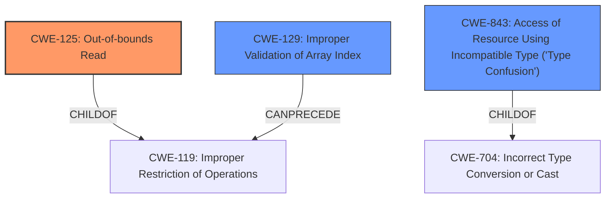

# Analysis for CVE-2020-28604

# Summary
| CWE ID | CWE Name | Confidence | CWE Abstraction Level | CWE Vulnerability Mapping Label | CWE-Vulnerability Mapping Notes |
|---|---|---|---|---|---|
| CWE-125 | Out-of-bounds Read | 1.0 | Base | Allowed | Primary CWE |
| CWE-843 | Access of Resource Using Incompatible Type ('Type Confusion') | 0.9 | Base | Allowed | Secondary CWE |
| CWE-129 | Improper Validation of Array Index | 0.8 | Variant | Allowed | Secondary CWE |

## Evidence and Confidence

*   **Confidence Score:** 0.9
*   **Evidence Strength:** HIGH

## Relationship Analysis
The primary weakness is **CWE-125** (Out-of-bounds Read), which is a base-level CWE. **CWE-125** is a child of **CWE-119** (Improper Restriction of Operations within the Bounds of a Memory Buffer). The vulnerability also involves **CWE-843** (Type Confusion), which can lead to out-of-bounds memory access and is a peer of **CWE-704** (Incorrect Type Conversion or Cast). Additionally, **CWE-129** (Improper Validation of Array Index) can precede **CWE-119**, indicating a potential cause for the out-of-bounds read.

## Vulnerability Chain
The vulnerability chain starts with a **malformed file** that leads to an **improper validation of array index** (**CWE-129**), resulting in an **out-of-bounds read** (**CWE-125**) and **type confusion** (**CWE-843**), which ultimately leads to **code execution**.

## Summary of Analysis
The initial assessment identified **CWE-125** as the primary weakness due to the explicit mention of an **out-of-bounds read** in the vulnerability description and CVE reference. The supporting evidence clearly states that the lack of bounds checking leads to reading memory outside the allocated vector. The evidence also indicates **type confusion** which is being mapped to **CWE-843**. **CWE-129** is included because the attacker controlled index `ene` is not validated, and is used to access the `Halfedge_of` array.

The graph relationships confirm that **CWE-125** is a base-level weakness under **CWE-119**, providing the appropriate level of specificity. The relationship between **CWE-129** and **CWE-119** further supports the inclusion of **CWE-129** as a contributing factor to the vulnerability.

The selection of **CWE-125**, **CWE-843**, and **CWE-129** is based on direct evidence from the vulnerability description and CVE reference, aligning with MITRE's mapping guidance for allowed usage and appropriate levels of abstraction.

Relevant CWE Information:

# Enhanced Context (25 CWEs)

## CWE-197: Numeric Truncation Error
**Abstraction Level**: Base
**Similarity Score**: 0.81
**Source**: dense

**Description**:
Truncation errors occur when a primitive is cast to a primitive of a smaller size and data is lost in the conversion.

**Mapping Guidance**:
- Usage: Allowed
- Rationale: This CWE entry is at the Base level of abstraction, which is a preferred level of abstraction for mapping to the root causes of vulnerabilities.

## CWE-191: Integer Underflow (Wrap or Wraparound)
**Abstraction Level**: Base
**Similarity Score**: 0.80
**Source**: dense

**Description**:
The product subtracts one value from another, such that the result is less than the minimum allowable integer value, which produces a value that is not equal to the correct result.

**Mapping Guidance**:
- Usage: Allowed
- Rationale: This CWE entry is at the Base level of abstraction, which is a preferred level of abstraction for mapping to the root causes of vulnerabilities.

## CWE-681: Incorrect Conversion between Numeric Types
**Abstraction Level**: Base
**Similarity Score**: 0.79
**Source**: dense

**Description**:
When converting from one data type to another, such as long to integer, data can be omitted or translated in a way that produces unexpected values. If the resulting values are used in a sensitive context, then dangerous behaviors may occur.

**Mapping Guidance**:
- Usage: Allowed
- Rationale: This CWE entry is at the Base level of abstraction, which is a preferred level of abstraction for mapping to the root causes of vulnerabilities.

## CWE-131: Incorrect Calculation of Buffer Size
**Abstraction Level**: Base
**Similarity Score**: 0.78
**Source**: dense

**Description**:
The product does not correctly calculate the size to be used when allocating a buffer, which could lead to a buffer overflow.

**Mapping Guidance**:
- Usage: Allowed
- Rationale: This CWE entry is at the Base level of abstraction, which is a preferred level of abstraction for mapping to the root causes of vulnerabilities.

## CWE-129: Improper Validation of Array Index
**Abstraction Level**: Variant
**Similarity Score**: 0.78
**Source**: dense

**Description**:
The product uses untrusted input when calculating or using an array index, but the product does not validate or incorrectly validates the index to ensure the index references a valid position within the array.

**Mapping Guidance**:
- Usage: Allowed
- Rationale: This CWE entry is at the Variant level of abstraction, which is a preferred level of abstraction for mapping to the root causes of vulnerabilities.

## CWE-125: Out-of-bounds Read
**Abstraction Level**: Base
**Similarity Score**: 0.78
**Source**: dense

**Description**:
The product reads data past the end, or before the beginning, of the intended buffer.

**Mapping Guidance**:
- Usage: Allowed
- Rationale: This CWE entry is at the Base level of abstraction, which is a preferred level of abstraction for mapping to the root causes of vulnerabilities.

## CWE-190: Integer Overflow or Wraparound
**Abstraction Level**: Base
**Similarity Score**: 0.77
**Source**: dense

**Description**:
The product performs a calculation that can
         produce an integer overflow or wraparound when the logic
         assumes that the resulting value will always be larger than
         the original value. This occurs when an integer value is
         incremented to a value that is too large to store in the
         associated representation. When this occurs, the value may
         become a very small or negative number.

**Mapping Guidance**:
- Usage: Allowed
- Rationale: This CWE entry is at the Base level of abstraction, which is a preferred level of abstraction for mapping to the root causes of vulnerabilities.

## CWE-193: Off-by-one Error
**Abstraction Level**: Base
**Similarity Score**: 0.77
**Source**: dense

**Description**:
A product calculates or uses an incorrect maximum or minimum value that is 1 more, or 1 less, than the correct value.

**Mapping Guidance**:
- Usage: Allowed
- Rationale: This CWE entry is at the Base level of abstraction, which is a preferred level of abstraction for mapping to the root causes of vulnerabilities.

## CWE-805: Buffer Access with Incorrect Length Value
**Abstraction Level**: Base
**Similarity Score**: 0.76
**Source**: dense

**Description**:
The product uses a sequential operation to read or write a buffer, but it uses an incorrect length value that causes it to access memory that is outside of the bounds of the buffer.

**Mapping Guidance**:
- Usage: Allowed
- Rationale: This CWE entry is at the Base level of abstraction, which is a preferred level of abstraction for mapping to the root causes of vulnerabilities.

## CWE-126: Buffer Over-read
**Abstraction Level**: Variant
**Similarity Score**: 0.76
**Source**: dense

**Description**:
The product reads from a buffer using buffer access mechanisms such as indexes or pointers that reference memory locations after the targeted buffer.

**Mapping Guidance**:
- Usage: Allowed
- R

# Enhanced Query for CVE-2020-28604

## Vulnerability Description
Multiple code execution vulnerabilities exists in the Nef polygon-parsing functionality of CGAL libcgal CGAL-5.1.1. A specially crafted malformed file can lead to an **out-of-bounds read** and **type confusion**, which could lead to code execution. An attacker can provide malicious input to trigger any of these vulnerabilities. An oob read vulnerability exists in Nef_2/PM_io_parser.h PM_io_parserread_hedge() e->set_next().

### Vulnerability Description Key Phrases
- **rootcause:** **out-of-bounds read**
- **weakness:** **type confusion**
- **impact:** code execution
- **vector:** specially crafted malformed file
- **product:** CGAL libcgal
- **version:** CGAL-5.1.1
- **component:** Nef polygon-parsing functionality

## CVE Reference Links Content Summary
Based on the provided content, here's an analysis of CVE-2020-28604:

**Root Cause of Vulnerability:**

The root cause lies in the lack of bounds checking within the CGAL library's Nef polygon parsing code. Specifically, when parsing a `.nef3` file, the code reads integer indices from the file and uses them to access various vectors of object handles (e.g., `Edge_of`, `Vertex_of`, `SFace_of`). There are no checks to ensure these indices are within the valid bounds of the vectors.

**Weaknesses/Vulnerabilities Present:**

-   **Out-of-Bounds Read:** The primary vulnerability is an out-of-bounds read. By providing a crafted `.nef3` file with malicious indices, an attacker can cause the code to read memory outside of the allocated vector, leading to a crash or other undefined behavior.
-   **Type Confusion:** Because the out-of-bounds read can result in the use of memory that isn't the correct type, it can lead to type confusion errors in which the code attempts to treat data as if it's of the expected type, leading to crashes or other unexpected results.

Specifically for CVE-2020-28604:
- An out-of-bounds read vulnerability exists in `Nef_2/PM_io_parser.h` `PM_io_parser::read_hedge()` when setting the `next` halfedge with `e->set_next(Halfedge_of[ene]);` where `ene` is an attacker-controlled index and is not validated to be within the bounds of `Halfedge_of`.

**Impact of Exploitation:**

-   **Code Execution:** The most severe impact is the potential for arbitrary code execution. Because the incorrect memory accesses can corrupt program state, they can also be used to modify code pointers or other vulnerable memory locations to redirect the program to execute malicious code.
-   **Denial of Service (DoS):** Even without achieving code execution, the out-of-bounds reads can lead to crashes, effectively causing a denial of service.

**Attack Vectors:**

-   **Malicious Input File:** The attack vector is through a specially crafted `.nef3` file. An attacker would need to provide this malformed file as input to an application or service that uses the vulnerable CGAL library to parse Nef polygons.

**Required Attacker Capabilities/Position:**

-   **Ability to Supply Input:** An attacker needs to have the ability to supply the malicious `.nef3` file to the targeted application or service. This could be through a file upload, network connection, or other means of input.
-   **No Privileges Required:** The vulnerability can be exploited without requiring any specific user privileges.

**Summary of CVE-2020-28604:**

Specifically, CVE-2020-28604 refers to an out-of-bounds read in the `read_hedge` function in the `Nef_2` component of the CGAL library. This occurs when setting the `next` member, `e->set_next(Halfedge_of[ene]);`, where `ene` is an attacker-controlled index, and it is not validated before being used to access `Halfedge_of`, resulting in an out-of-bounds memory read.

This vulnerability is one of a large batch of similar vulnerabilities, all related to the same lack of bounds checking in the Nef polygon parsing code. The impact is severe due to the potential for arbitrary code execution or denial of service. The attack vector is through a maliciously crafted input file.

The provided content offers a detailed explanation of the vulnerabilities, including code snippets and crash information. The Talos report is particularly useful for understanding the mechanics of the exploit.

## Retriever Results

### Top Combined Results

| Rank | CWE ID | Name | Abstraction | Usage  | Retrievers | Individual Scores |
|------|--------|------|-------------|-------|------------|-------------------|
| 1 | 843 | Access of Resource Using Incompatible Type ('Type Confusion') | Base | Allowed | alternate_terms | 0.700 |
| 2 | 129 | Improper Validation of Array Index | Variant | Allowed | sparse | 0.861 |
| 3 | 125 | Out-of-bounds Read | Base | Allowed | sparse | 0.534 |
| 4 | 190 | Integer Overflow or Wraparound | Base | Allowed | sparse | 0.406 |
| 5 | 1284 | Improper Validation of Specified Quantity in Input | Base | Allowed | sparse | 0.384 |
| 6 | 193 | Off-by-one Error | Base | Allowed | dense | 0.558 |
| 7 | 128 | Wrap-around Error | Base | Allowed | graph | 0.002 |
| 8 | 787 | Out-of-bounds Write | Base | Allowed | sparse | 0.381 |
| 9 | 122 | Heap-based Buffer Overflow | Variant | Allowed | sparse | 0.378 |
| 10 | 197 | Numeric Truncation Error | Base | Allowed | sparse | 0.377 |

# Complete CWE Specifications

## CWE-843: Access of Resource Using Incompatible Type ('Type Confusion')
**Abstraction:** Base
**Status:** Incomplete

### Description
The product allocates or initializes a resource such as a pointer, object, or variable using one type, but it later accesses that resource using a type that is incompatible with the original type.

### Extended Description

When the product accesses the resource using an incompatible type, this could trigger logical errors because the resource does not have expected properties. In languages without memory safety, such as C and C++, type confusion can lead to out-of-bounds memory access.

While this weakness is frequently associated with unions when parsing data with many different embedded object types in C, it can be present in any application that can interpret the same variable or memory location in multiple ways.

This weakness is not unique to C and C++. For example, errors in PHP applications can be triggered by providing array parameters when scalars are expected, or vice versa. Languages such as Perl, which perform automatic conversion of a variable of one type when it is accessed as if it were another type, can also contain these issues.

### Alternative Terms
Object Type Confusion

### Relationships
ChildOf -> CWE-704
ChildOf -> CWE-704
CanPrecede -> CWE-119

### Mapping Guidance
**Usage:** Allowed
**Rationale:** This CWE entry is at the Base level of abstraction, which is a preferred level of abstraction for mapping to the root causes of vulnerabilities.
**Comments:** Carefully read both the name and description to ensure that this mapping is an appropriate fit. Do not try to 'force' a mapping to a lower-level Base/Variant simply to comply with this preferred level of abstraction.
**Reasons:**
- Acceptable-Use

### Additional Notes
**[Applicable Platform]** 

This weakness is possible in any type-unsafe programming language.

**[Research Gap]** 

Type confusion weaknesses have received some attention by applied researchers and major software vendors for C and C++ code. Some publicly-reported vulnerabilities probably have type confusion as a root-cause weakness, but these may be described as "memory corruption" instead.

For other languages, there are very few public reports of type confusion weaknesses. These are probably under-studied. Since many programs rely directly or indirectly on loose typing, a potential "type confusion" behavior might be intentional, possibly requiring more manual analysis.

### Observed Examples
- **CVE-2010-4577:** Type confusion in CSS sequence leads to out-of-bounds read.
- **CVE-2011-0611:** Size inconsistency allows code execution, first discovered when it was actively exploited in-the-wild.
- **CVE-2010-0258:** Improperly-parsed file containing records of different types leads to code execution when a memory location is interpreted as a different object than intended.

## CWE-129: Improper Validation of Array Index
**Abstraction:** Variant
**Status:** Draft

### Description
The product uses untrusted input when calculating or using an array index, but the product does not validate or incorrectly validates the index to ensure the index references a valid position within the array.

### Extended Description
Not provided

### Alternative Terms
out-of-bounds array index
index-out-of-range
array index underflow

### Relationships
ChildOf -> CWE-1285
ChildOf -> CWE-20
CanPrecede -> CWE-119
CanPrecede -> CWE-823
CanPrecede -> CWE-789

### Mapping Guidance
**Usage:** Allowed
**Rationale:** This CWE entry is at the Variant level of abstraction, which is a preferred level of abstraction for mapping to the root causes of vulnerabilities.
**Comments:** Carefully read both the name and description to ensure that this mapping is an appropriate fit. Do not try to 'force' a mapping to a lower-level Base/Variant simply to comply with this preferred level of abstraction.
**Reasons:**
- Acceptable-Use

### Additional Notes
**[Relationship]** This weakness can precede uncontrolled memory allocation (CWE-789) in languages that automatically expand an array when an index is used that is larger than the size of the array, such as JavaScript.

**[Theoretical]** An improperly validated array index might lead directly to the always-incorrect behavior of "access of array using out-of-bounds index."

### Observed Examples
- **CVE-2005-0369:** large ID in packet used as array index
- **CVE-2001-1009:** negative array index as argument to POP LIST command
- **CVE-2003-0721:** Integer signedness error leads to negative array index

## CWE-125: Out-of-bounds Read
**Abstraction:** Base
**Status:** Draft

### Description
The product reads data past the end, or before the beginning, of the intended buffer.

### Extended Description
Not provided

### Alternative Terms
OOB read: Shorthand for "Out of bounds" read

### Relationships
ChildOf -> CWE-119
ChildOf -> CWE-119
ChildOf -> CWE-119
ChildOf -> CWE-119

### Mapping Guidance
**Usage:** Allowed
**Rationale:** This CWE entry is at the Base level of abstraction, which is a preferred level of abstraction for mapping to the root causes of vulnerabilities.
**Comments:** Carefully read both the name and description to ensure that this mapping is an appropriate fit. Do not try to 'force' a mapping to a lower-level Base/Variant simply to comply with this preferred level of abstraction.
**Reasons:**
- Acceptable-Use

### Observed Examples
- **CVE-2023-1018:** The reference implementation code for a Trusted Platform Module does not implement length checks on data, allowing for an attacker to read 2 bytes past the end of a buffer.
- **CVE-2020-11899:** Out-of-bounds read in IP stack used in embedded systems, as exploited in the wild per CISA KEV.
- **CVE-2014-0160:** Chain: "Heartbleed" bug receives an inconsistent length parameter (CWE-130) enabling an out-of-bounds read (CWE-126), returning memory that could include private cryptographic keys and other sensitive data.

## CWE-190: Integer Overflow or Wraparound
**Abstraction:** Base
**Status:** Stable

### Description
The product performs a calculation that can
         produce an integer overflow or wraparound when the logic
         assumes that the resulting value will always be larger than
         the original value. This occurs when an integer value is
         incremented to a value that is too large to store in the
         associated representation. When this occurs, the value may
         become a very small or negative number.

### Extended Description
Not provided

### Alternative Terms
Overflow: The terms "overflow" and "wraparound" are used interchangeably by some people, but they can have more precise distinctions by others. See Terminology Notes.
Wraparound: The terms "overflow" and "wraparound" are used interchangeably by some people, but they can have more precise distinctions by others. See Terminology Notes.
wrap, wrap-around, wrap around: Alternate spellings of "wraparound"

### Relationships
ChildOf -> CWE-682
ChildOf -> CWE-682
ChildOf -> CWE-20
CanPrecede -> CWE-119

### Mapping Guidance
**Usage:** Allowed
**Rationale:** This CWE entry is at the Base level of abstraction, which is a preferred level of abstraction for mapping to the root causes of vulnerabilities.
**Comments:** Be careful of terminology problems with "overflow," "underflow," and "wraparound" - see Terminology Notes. Carefully read both the name and description to ensure that this mapping is an appropriate fit. Do not try to 'force' a mapping to a lower-level Base/Variant simply to comply with this preferred level of abstraction.
**Reasons:**
- Acceptable-Use
**Suggested Alternatives:**
- CWE-191: Integer Underflow (Wrap or Wraparound). Consider CWE-191 when the result is less than the minimum value that can be represented (sometimes called "underflows").

### Additional Notes
**[Relationship]** Integer overflows can be primary to buffer overflows when they cause less memory to be allocated than expected.

**[Terminology]** 

"Integer overflow" is sometimes used to cover several types of errors, including signedness errors, or buffer overflows that involve manipulation of integer data types instead of characters. Part of the confusion results from the fact that 0xffffffff is -1 in a signed context. Other confusion also arises because of the role that integer overflows have in chains.

A "wraparound" is a well-defined, standard behavior that follows specific rules for how to handle situations when the intended numeric value is too large or too small to be represented, as specified in standards such as C11.

"Overflow" is sometimes conflated with "wraparound" but typically indicates a non-standard or undefined behavior.

The "overflow" term is sometimes used to indicate cases where either the maximum or the minimum is exceeded, but others might only use "overflow" to indicate exceeding the maximum while using "underflow" for exceeding the minimum.

Some people use "overflow" to mean any value outside the representable range - whether greater than the maximum, or less than the minimum - but CWE uses "underflow" for cases in which the intended result is less than the minimum.

See [REF-1440] for additional explanation of the ambiguity of terminology.

**[Other]** While there may be circumstances in which the logic intentionally relies on wrapping - such as with modular arithmetic in timers or counters - it can have security consequences if the wrap is unexpected. This is especially the case if the integer overflow can be triggered using user-supplied inputs.

### Observed Examples
- **CVE-2021-43537:** Chain: in a web browser, an unsigned 64-bit integer is forcibly cast to a 32-bit integer (CWE-681) and potentially leading to an integer overflow (CWE-190). If an integer overflow occurs, this can cause heap memory corruption (CWE-122)
- **CVE-2022-21668:** Chain: Python library does not limit the resources used to process images that specify a very large number of bands (CWE-1284), leading to excessive memory consumption (CWE-789) or an integer overflow (CWE-190).
- **CVE-2022-0545:** Chain: 3D renderer has an integer overflow (CWE-190) leading to write-what-where condition (CWE-123) using a crafted image.

## CWE-1284: Improper Validation of Specified Quantity in Input
**Abstraction:** Base
**Status:** Incomplete

### Description
The product receives input that is expected to specify a quantity (such as size or length), but it does not validate or incorrectly validates that the quantity has the required properties.

### Extended Description

Specified quantities include size, length, frequency, price, rate, number of operations, time, and others. Code may rely on specified quantities to allocate resources, perform calculations, control iteration, etc. When the quantity is not properly validated, then attackers can specify malicious quantities to cause excessive resource allocation, trigger unexpected failures, enable buffer overflows, etc.

### Alternative Terms
None

### Relationships
ChildOf -> CWE-20
ChildOf -> CWE-20
CanPrecede -> CWE-789

### Mapping Guidance
**Usage:** Allowed
**Rationale:** This CWE entry is at the Base level of abstraction, which is a preferred level of abstraction for mapping to the root causes of vulnerabilities.
**Comments:** Carefully read both the name and description to ensure that this mapping is an appropriate fit. Do not try to 'force' a mapping to a lower-level Base/Variant simply to comply with this preferred level of abstraction.
**Reasons:**
- Acceptable-Use

### Additional Notes
**[Maintenance]** This entry is still under development and will continue to see updates and content improvements.

### Observed Examples
- **CVE-2022-21668:** Chain: Python library does not limit the resources used to process images that specify a very large number of bands (CWE-1284), leading to excessive memory consumption (CWE-789) or an integer overflow (CWE-190).
- **CVE-2008-1440:** lack of validation of length field leads to infinite loop
- **CVE-2008-2374:** lack of validation of string length fields allows memory consumption or buffer over-read

## CWE-193: Off-by-one Error
**Abstraction:** Base
**Status:** Draft

### Description
A product calculates or uses an incorrect maximum or minimum value that is 1 more, or 1 less, than the correct value.

### Extended Description
Not provided

### Alternative Terms
off-by-five: An "off-by-five" error was reported for sudo in 2002 (CVE-2002-0184), but that is more like a "length calculation" error.

### Relationships
ChildOf -> CWE-682
ChildOf -> CWE-682
CanPrecede -> CWE-617
CanPrecede -> CWE-170
CanPrecede -> CWE-119

### Mapping Guidance
**Usage:** Allowed
**Rationale:** This CWE entry is at the Base level of abstraction, which is a preferred level of abstraction for mapping to the root causes of vulnerabilities.
**Comments:** Carefully read both the name and description to ensure that this mapping is an appropriate fit. Do not try to 'force' a mapping to a lower-level Base/Variant simply to comply with this preferred level of abstraction.
**Reasons:**
- Acceptable-Use

### Additional Notes
**[Relationship]** This is not always a buffer overflow. For example, an off-by-one error could be a factor in a partial comparison, a read from the wrong memory location, an incorrect conditional, etc.

### Observed Examples
- **CVE-2003-0252:** Off-by-one error allows remote attackers to cause a denial of service and possibly execute arbitrary code via requests that do not contain newlines.
- **CVE-2001-1391:** Off-by-one vulnerability in driver allows users to modify kernel memory.
- **CVE-2002-0083:** Off-by-one error allows local users or remote malicious servers to gain privileges.

## CWE-128: Wrap-around Error
**Abstraction:** Base
**Status:** Incomplete

### Description
Wrap around errors occur whenever a value is incremented past the maximum value for its type and therefore "wraps around" to a very small, negative, or undefined value.

### Extended Description
Not provided

### Alternative Terms
None

### Relationships
ChildOf -> CWE-682
CanPrecede -> CWE-119
PeerOf -> CWE-190

### Mapping Guidance
**Usage:** Allowed
**Rationale:** This CWE entry is at the Base level of abstraction, which is a preferred level of abstraction for mapping to the root causes of vulnerabilities.
**Comments:** Carefully read both the name and description to ensure that this mapping is an appropriate fit. Do not try to 'force' a mapping to a lower-level Base/Variant simply to comply with this preferred level of abstraction.
**Reasons:**
- Acceptable-Use

### Additional Notes
**[Relationship]** The relationship between overflow and wrap-around needs to be examined more closely, since several entries (including CWE-190) are closely related.

## CWE-787: Out-of-bounds Write
**Abstraction:** Base
**Status:** Draft

### Description
The product writes data past the end, or before the beginning, of the intended buffer.

### Extended Description
Not provided

### Alternative Terms
Memory Corruption: Often used to describe the consequences of writing to memory outside the bounds of a buffer, or to memory that is otherwise invalid.

### Relationships
ChildOf -> CWE-119
ChildOf -> CWE-119
ChildOf -> CWE-119
ChildOf -> CWE-119

### Mapping Guidance
**Usage:** Allowed
**Rationale:** This CWE entry is at the Base level of abstraction, which is a preferred level of abstraction for mapping to the root causes of vulnerabilities.
**Comments:** Carefully read both the name and description to ensure that this mapping is an appropriate fit. Do not try to 'force' a mapping to a lower-level Base/Variant simply to comply with this preferred level of abstraction.
**Reasons:**
- Acceptable-Use

### Observed Examples
- **CVE-2023-1017:** The reference implementation code for a Trusted Platform Module does not implement length checks on data, allowing for an attacker to write 2 bytes past the end of a buffer.
- **CVE-2021-21220:** Chain: insufficient input validation (CWE-20) in browser allows heap corruption (CWE-787), as exploited in the wild per CISA KEV.
- **CVE-2021-28664:** GPU kernel driver allows memory corruption because a user can obtain read/write access to read-only pages, as exploited in the wild per CISA KEV.

## CWE-122: Heap-based Buffer Overflow
**Abstraction:** Variant
**Status:** Draft

### Description
A heap overflow condition is a buffer overflow, where the buffer that can be overwritten is allocated in the heap portion of memory, generally meaning that the buffer was allocated using a routine such as malloc().

### Extended Description
Not provided

### Alternative Terms
None

### Relationships
ChildOf -> CWE-788
ChildOf -> CWE-787

### Mapping Guidance
**Usage:** Allowed
**Rationale:** This CWE entry is at the Variant level of abstraction, which is a preferred level of abstraction for mapping to the root causes of vulnerabilities.
**Comments:** Carefully read both the name and description to ensure that this mapping is an appropriate fit. Do not try to 'force' a mapping to a lower-level Base/Variant simply to comply with this preferred level of abstraction.
**Reasons:**
- Acceptable-Use

### Additional Notes
**[Relationship]** Heap-based buffer overflows are usually just as dangerous as stack-based buffer overflows.

### Observed Examples
- **CVE-2021-43537:** Chain: in a web browser, an unsigned 64-bit integer is forcibly cast to a 32-bit integer (CWE-681) and potentially leading to an integer overflow (CWE-190). If an integer overflow occurs, this can cause heap memory corruption (CWE-122)
- **CVE-2007-4268:** Chain: integer signedness error (CWE-195) passes signed comparison, leading to heap overflow (CWE-122)
- **CVE-2009-2523:** Chain: product does not handle when an input string is not NULL terminated (CWE-170), leading to buffer over-read (CWE-125) or heap-based buffer overflow (CWE-122).

## CWE-197: Numeric Truncation Error
**Abstraction:** Base
**Status:** Incomplete

### Description
Truncation errors occur when a primitive is cast to a primitive of a smaller size and data is lost in the conversion.

### Extended Description
When a primitive is cast to a smaller primitive, the high order bits of the large value are lost in the conversion, potentially resulting in an unexpected value that is not equal to the original value. This value may be required as an index into a buffer, a loop iterator, or simply necessary state data. In any case, the value cannot be trusted and the system will be in an undefined state. While this method may be employed viably to isolate the low bits of a value, this usage is rare, and truncation usually implies that an implementation error has occurred.

### Alternative Terms
None

### Relationships
ChildOf -> CWE-681
ChildOf -> CWE-681
ChildOf -> CWE-681
CanAlsoBe -> CWE-195
CanAlsoBe -> CWE-196
CanAlsoBe -> CWE-192
CanAlsoBe -> CWE-194

### Mapping Guidance
**Usage:** Allowed
**Rationale:** This CWE entry is at the Base level of abstraction, which is a preferred level of abstraction for mapping to the root causes of vulnerabilities.
**Comments:** Carefully read both the name and description to ensure that this mapping is an appropriate fit. Do not try to 'force' a mapping to a lower-level Base/Variant simply to comply with this preferred level of abstraction.
**Reasons:**
- Acceptable-Use

### Additional Notes
**[Research Gap]** This weakness has traditionally been under-studied and under-reported, although vulnerabilities in popular software have been published in 2008 and 2009.

### Observed Examples
- **CVE-2020-17087:** Chain: integer truncation (CWE-197) causes small buffer allocation (CWE-131) leading to out-of-bounds write (CWE-787) in kernel pool, as exploited in the wild per CISA KEV.
- **CVE-2009-0231:** Integer truncation of length value leads to heap-based buffer overflow.
- **CVE-2008-3282:** Size of a particular type changes for 64-bit platforms, leading to an integer truncation in document processor causes incorrect index to be generated.

