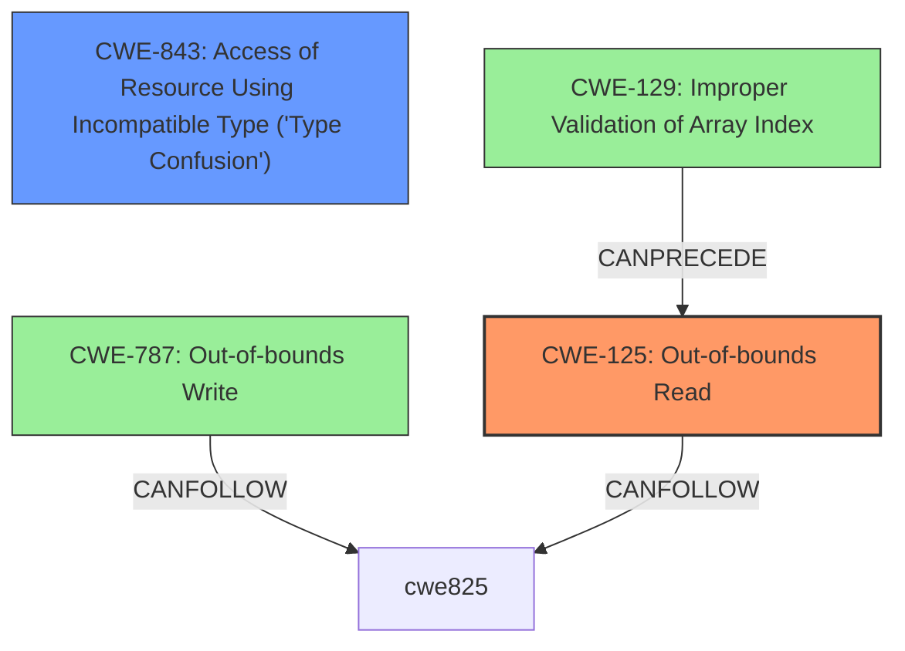

# Analysis for CVE-2020-28607

# Summary
| CWE ID  | CWE Name  | Confidence | CWE Abstraction Level | CWE Vulnerability Mapping Label | CWE-Vulnerability Mapping Notes |
|---|---|---|---|---|---|
| CWE-125 | Out-of-bounds Read | 0.9 | Base | Allowed | Primary CWE |
| CWE-843 | Access of Resource Using Incompatible Type ('Type Confusion') | 0.7 | Base | Allowed | Secondary Candidate |

## Evidence and Confidence

*   **Confidence Score:** 0.8
*   **Evidence Strength:** MEDIUM

## Relationship Analysis
The primary weakness identified is CWE-125 **Out-of-bounds Read**, which occurs due to reading data beyond the intended buffer. A secondary weakness, **Type Confusion** CWE-843, also contributes to the vulnerability.

## Vulnerability Chain
The vulnerability chain involves the following sequence:
1.  A malformed file is provided as input to the Nef polygon-parsing functionality.
2.  This leads to an **Out-of-bounds Read (CWE-125)**.
3.  It also leads to **Type Confusion (CWE-843)**.
4.  The combination of these weaknesses can lead to code execution.

## Summary of Analysis
The primary weakness is **CWE-125 Out-of-bounds Read** because the vulnerability description explicitly mentions an **out-of-bounds read** in the `PM_io_parserread_face() set_halfedge()` function. The description states: "A specially crafted malformed file can lead to an **out-of-bounds read** and **type confusion**, which could lead to code execution."

CWE-843, **Access of Resource Using Incompatible Type ('Type Confusion')**, is considered a secondary weakness because the description also explicitly mentions "type confusion".

The retriever results provided several candidate CWEs with high scores, including CWE-129, CWE-190 and CWE-787. However, CWE-125 and CWE-843 are more directly supported by the vulnerability description.

I considered CWE-787 **Out-of-bounds Write** since the impact is Code Execution, but the vulnerability description only mentions **out-of-bounds read**, so I did not select it.

The selected CWEs are at the optimal level of specificity (Base) because they accurately represent the weaknesses described in the vulnerability.

# Enhanced Query for CVE-2020-28607

# Vulnerability Description

    Multiple code execution vulnerabilities exists in the Nef polygon-parsing functionality of CGAL libcgal CGAL-5.1.1. A specially crafted malformed file can lead to an **out-of-bounds read** and **type confusion**, which could lead to code execution. An attacker can provide malicious input to trigger any of these vulnerabilities. An oob read vulnerability exists in Nef_2/PM_io_parser.h PM_io_parserread_face() set_halfedge().

    # Keyphrase-Specific CWE Analysis
    This vulnerability contains multiple keyphrases that may map to different CWEs. 
    Please analyze each keyphrase separately and determine the most appropriate CWE(s) for each.

    ## WEAKNESS: 'out-of-bounds read'

Relevant CWEs for this WEAKNESS:

### 1. CWE-129: Improper Validation of Array Index (Score: 842.85)

The product uses untrusted input when calculating or using an array index, but the product does not validate or incorrectly validates the index to ensure the index references a valid position within the array....

### 2. CWE-125: Out-of-bounds Read (Score: 541.68)

The product reads data past the end, or before the beginning, of the intended buffer....

### 3. CWE-190: Integer Overflow or Wraparound (Score: 412.23)

The product performs a calculation that can
         produce an integer overflow or wraparound when the logic
         assumes that the resulting value will always be larger than
         the original value. This occurs when an integer value is
         incremented to a value that is too large to st...

### 4. CWE-193: Off-by-one Error (Score: 391.93)

A product calculates or uses an incorrect maximum or minimum value that is 1 more, or 1 less, than the correct value....

### 5. CWE-787: Out-of-bounds Write (Score: 391.31)

The product writes data past the end, or before the beginning, of the intended buffer....

## WEAKNESS: 'type confusion'

Relevant CWEs for this WEAKNESS:

### 1. CWE-129: Improper Validation of Array Index (Score: 842.85)

The product uses untrusted input when calculating or using an array index, but the product does not validate or incorrectly validates the index to ensure the index references a valid position within the array....

### 2. CWE-125: Out-of-bounds Read (Score: 541.68)

The product reads data past the end, or before the beginning, of the intended buffer....

### 3. CWE-190: Integer Overflow or Wraparound (Score: 412.23)

The product performs a calculation that can
         produce an integer overflow or wraparound when the logic
         assumes that the resulting value will always be larger than
         the original value. This occurs when an integer value is
         incremented to a value that is too large to st...

### 4. CWE-843: Access of Resource Using Incompatible Type ('Type Confusion') (Score: 362.79)

The product allocates or initializes a resource such as a pointer, object, or variable using one type, but it later accesses that resource using a type that is incompatible with the original type....

### 5. CWE-197: Numeric Truncation Error (Score: 347.60)

Truncation errors occur when a primitive is cast to a primitive of a smaller size and data is lost in the conversion....

## IMPACT: 'code execution'

Relevant CWEs for this IMPACT:

### 1. CWE-129: Improper Validation of Array Index (Score: 842.85)

The product uses untrusted input when calculating or using an array index, but the product does not validate or incorrectly validates the index to ensure the index references a valid position within the array....

### 2. CWE-125: Out-of-bounds Read (Score: 541.68)

The product reads data past the end, or before the beginning, of the intended buffer....

### 3. CWE-190: Integer Overflow or Wraparound (Score: 412.23)

The product performs a calculation that can
         produce an integer overflow or wraparound when the logic
         assumes that the resulting value will always be larger than
         the original value. This occurs when an integer value is
         incremented to a value that is too large to st...

### 4. CWE-787: Out-of-bounds Write (Score: 391.31)

The product writes data past the end, or before the beginning, of the intended buffer....

### 5. CWE-1284: Improper Validation of Specified Quantity in Input (Score: 120.77)

The product receives input that is expected to specify a quantity (such as size or length), but it does not validate or incorrectly validates that the quantity has the required properties....

## ATTACKER: 'attacker'

Relevant CWEs for this ATTACKER:

### 1. CWE-129: Improper Validation of Array Index (Score: 842.85)

The product uses untrusted input when calculating or using an array index, but the product does not validate or incorrectly validates the index to ensure the index references a valid position within the array....

### 2. CWE-125: Out-of-bounds Read (Score: 541.68)

The product reads data past the end, or before the beginning, of the intended buffer....

### 3. CWE-190: Integer Overflow or Wraparound (Score: 412.23)

The product performs a calculation that can
         produce an integer overflow or wraparound when the logic
         assumes that the resulting value will always be larger than
         the original value. This occurs when an integer value is
         incremented to a value that is too large to st...

### 4. CWE-787: Out-of-bounds Write (Score: 391.31)

The product writes data past the end, or before the beginning, of the intended buffer....

### 5. CWE-1284: Improper Validation of Specified Quantity in Input (Score: 120.77)

The product receives input that is expected to specify a quantity (such as size or length), but it does not validate or incorrectly validates that the quantity has the required properties....

## PRODUCT: 'CGAL libcgal'

Relevant CWEs for this PRODUCT:

### 1. CWE-129: Improper Validation of Array Index (Score: 842.85)

The product uses untrusted input when calculating or using an array index, but the product does not validate or incorrectly validates the index to ensure the index references a valid position within the array....

### 2. CWE-125: Out-of-bounds Read (Score: 541.68)

The product reads data past the end, or before the beginning, of the intended buffer....

### 3. CWE-190: Integer Overflow or Wraparound (Score: 412.23)

The product performs a calculation that can
         produce an integer overflow or wraparound when the logic
         assumes that the resulting value will always be larger than
         the original value. This occurs when an integer value is
         incremented to a value that is too large to st...

### 4. CWE-787: Out-of-bounds Write (Score: 391.31)

The product writes data past the end, or before the beginning, of the intended buffer....

### 5. CWE-1284: Improper Validation of Specified Quantity in Input (Score: 120.77)

The product receives input that is expected to specify a quantity (such as size or length), but it does not validate or incorrectly validates that the quantity has the required properties....

## VERSION: 'CGAL-5.1.1'

Relevant CWEs for this VERSION:

### 1. CWE-129: Improper Validation of Array Index (Score: 842.85)

The product uses untrusted input when calculating or using an array index, but the product does not validate or incorrectly validates the index to ensure the index references a valid position within the array....

### 2. CWE-125: Out-of-bounds Read (Score: 541.68)

The product reads data past the end, or before the beginning, of the intended buffer....

### 3. CWE-190: Integer Overflow or Wraparound (Score: 412.23)

The product performs a calculation that can
         produce an integer overflow or wraparound when the logic
         assumes that the resulting value will always be larger than
         the original value. This occurs when an integer value is
         incremented to a value that is too large to st...

### 4. CWE-787: Out-of-bounds Write (Score: 391.31)

The product writes data past the end, or before the beginning, of the intended buffer....

### 5. CWE-1284: Improper Validation of Specified Quantity in Input (Score: 120.77)

The product receives input that is expected to specify a quantity (such as size or length), but it does not validate or incorrectly validates that the quantity has the required properties....

## COMPONENT: 'Nef polygon-parsing functionality'

Relevant CWEs for this COMPONENT:

### 1. CWE-129: Improper Validation of Array Index (Score: 842.85)

The product uses untrusted input when calculating or using an array index, but the product does not validate or incorrectly validates the index to ensure the index references a valid position within the array....

### 2. CWE-125: Out-of-bounds Read (Score: 541.68)

The product reads data past the end, or before the beginning, of the intended buffer....

### 3. CWE-190: Integer Overflow or Wraparound (Score: 412.23)

The product performs a calculation that can
         produce an integer overflow or wraparound when the logic
         assumes that the resulting value will always be larger than
         the original value. This occurs when an integer value is
         incremented to a value that is too large to st...

### 4. CWE-787: Out-of-bounds Write (Score: 391.31)

The product writes data past the end, or before the beginning, of the intended buffer....

### 5. CWE-120: Buffer Copy without Checking Size of Input ('Classic Buffer Overflow') (Score: 128.83)

The product copies an input buffer to an output buffer without verifying that the size of the input buffer is less than the size of the output buffer, leading to a buffer overflow....

    # Analysis Instructions
    1. For each keyphrase, identify the most appropriate CWE(s) that represent the weakness.
    2. Consider how the different keyphrases might relate to each other in the vulnerability chain.
    3. Provide a final determination of primary CWE(s) and any secondary CWEs.
    4. Format your response using the standard analysis template.

    Please analyze how these different weaknesses interact and provide a comprehensive CWE classification.
    