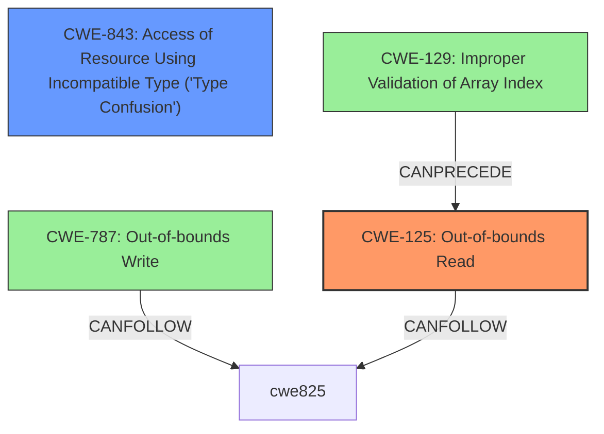

# Analysis Report for CVE-2020-28607

# Vulnerability Analysis Report: CVE-2020-28607

## Description


## Analysis (with Relationship Data)

# Summary
| CWE ID  | CWE Name  | Confidence | CWE Abstraction Level | CWE Vulnerability Mapping Label | CWE-Vulnerability Mapping Notes |
|---|---|---|---|---|---|
| CWE-125 | Out-of-bounds Read | 0.9 | Base | Allowed | Primary CWE |
| CWE-843 | Access of Resource Using Incompatible Type ('Type Confusion') | 0.7 | Base | Allowed | Secondary Candidate |

## Evidence and Confidence

*   **Confidence Score:** 0.8
*   **Evidence Strength:** MEDIUM

## Relationship Analysis
The primary weakness identified is CWE-125 **Out-of-bounds Read**, which occurs due to reading data beyond the intended buffer. A secondary weakness, **Type Confusion** CWE-843, also contributes to the vulnerability.



## Vulnerability Chain
The vulnerability chain involves the following sequence:
1.  A malformed file is provided as input to the Nef polygon-parsing functionality.
2.  This leads to an **Out-of-bounds Read (CWE-125)**.
3.  It also leads to **Type Confusion (CWE-843)**.
4.  The combination of these weaknesses can lead to code execution.

## Summary of Analysis
The primary weakness is **CWE-125 Out-of-bounds Read** because the vulnerability description explicitly mentions an **out-of-bounds read** in the `PM_io_parserread_face() set_halfedge()` function. The description states: "A specially crafted malformed file can lead to an **out-of-bounds read** and **type confusion**, which could lead to code execution."

CWE-843, **Access of Resource Using Incompatible Type ('Type Confusion')**, is considered a secondary weakness because the description also explicitly mentions "type confusion".

The retriever results provided several candidate CWEs with high scores, including CWE-129, CWE-190 and CWE-787. However, CWE-125 and CWE-843 are more directly supported by the vulnerability description.

I considered CWE-787 **Out-of-bounds Write** since the impact is Code Execution, but the vulnerability description only mentions **out-of-bounds read**, so I did not select it.

The selected CWEs are at the optimal level of specificity (Base) because they accurately represent the weaknesses described in the vulnerability.


## CWE Relationship Analysis

Current CWEs represent these abstraction levels: .


### Vulnerability Chain Analysis

**Chain starting from CWE-787:**
- 787 (Out-of-bounds Write) - ROOT


**Chain starting from CWE-843:**
- 843 (Access of Resource Using Incompatible Type ('Type Confusion')) - ROOT


### CWE Relationship Diagram

```mermaid
graph TD
    classDef primary fill:#f96,stroke:#333,stroke-width:2px
    classDef secondary fill:#69f,stroke:#333
    classDef tertiary fill:#9e9,stroke:#333
```


*Report generated on 2025-04-01 23:30:47*
