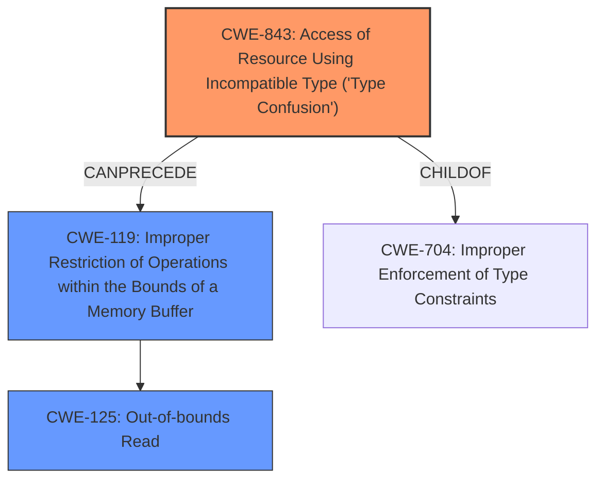

# Enhanced Analysis for CVE-2020-28611

# Summary
| CWE ID  | CWE Name                                                     | Confidence | CWE Abstraction Level | CWE Vulnerability Mapping Label | CWE-Vulnerability Mapping Notes |
| :-------- | :----------------------------------------------------------- | :--------- | :-------------------- | :------------------------------ | :------------------------------ |
| CWE-843   | Access of Resource Using Incompatible Type ('Type Confusion') | 0.9        | Base                  | Primary                         | Allowed                         |
| CWE-125   | Out-of-bounds Read                                           | 0.9        | Base                  | Secondary                       | Allowed                         |

## Evidence and Confidence

*   **Confidence Score:** 0.9
*   **Evidence Strength:** HIGH

## Relationship Analysis
The primary weakness is **type confusion**, which can lead to an **out-of-bounds read**, ultimately resulting in code execution. CWE-843 (Type Confusion) is a peer of CWE-704 (Incorrect Type Conversion or Cast), both being children of CWE-704 (Improper Enforcement of Type Constraints). CWE-843 can precede CWE-119 (Improper Restriction of Operations within the Bounds of a Memory Buffer), which in turn can lead to CWE-125 (Out-of-bounds Read). The abstraction levels are appropriate, with both CWE-843 and CWE-125 being at the Base level.



## Vulnerability Chain
The chain of events is as follows:
1.  **Type Confusion (CWE-843)**: A resource is accessed using an incompatible type.
2.  **Improper Restriction of Operations within the Bounds of a Memory Buffer (CWE-119)**: The type confusion leads to memory corruption.
3.  **Out-of-bounds Read (CWE-125)**: The memory corruption allows reading data beyond the intended buffer.
4.  **Code Execution (Impact)**: The **out-of-bounds read** enables an attacker to execute arbitrary code.

## Summary of Analysis
The analysis is based on the provided vulnerability description, which clearly indicates both an **out-of-bounds read** and **type confusion**. The description states: "Multiple code execution vulnerabilities exists in the Nef polygon-parsing functionality of CGAL libcgal CGAL-5.1.1. A specially crafted malformed file can lead to an **out-of-bounds read** and **type confusion**, which could lead to code execution."

The graph relationships support the selection of CWE-843 as the primary cause, leading to CWE-125. CWE-843 is the root cause, and CWE-125 is a direct consequence.

The selected CWEs are at the optimal level of specificity, as they accurately represent the **weaknesses** described in the vulnerability. CWE-843 describes the **type confusion**, and CWE-125 describes the **out-of-bounds read**.

Relevant CWE Information:

# Enhanced Context (25 CWEs)
The following CWEs were identified as potentially relevant to this vulnerability:

## CWE-843: Access of Resource Using Incompatible Type ('Type Confusion')
**Abstraction Level**: Base
**Similarity Score**: 362.79 (for 'type confusion' keyphrase)
**Source**: sparse

**Description**:
The product allocates or initializes a resource such as a pointer, object, or variable using one type, but it later accesses that resource using a type that is incompatible with the original type.

**Mapping Guidance**:
- Usage: Allowed
- Rationale: This CWE entry is at the Base level of abstraction, which is a preferred level of abstraction for mapping to the root causes of vulnerabilities.

## CWE-125: Out-of-bounds Read
**Abstraction Level**: Base
**Similarity Score**: 555.80 (for 'out-of-bounds read' keyphrase)
**Source**: sparse

**Description**:
The product reads data past the end, or before the beginning, of the intended buffer.

**Mapping Guidance**:
- Usage: Allowed
- Rationale: This CWE entry is at the Base level of abstraction, which is a preferred level of abstraction for mapping to the root causes of vulnerabilities.

### Other CWEs Considered But Not Used:

*   **CWE-129: Improper Validation of Array Index:** While this could be related to the **out-of-bounds read**, the vulnerability description explicitly mentions **type confusion** as a separate issue, making CWE-843 a more appropriate primary CWE. Therefore, CWE-129 is not used.
*   **CWE-190: Integer Overflow or Wraparound:** This is not directly indicated in the description, so it's not selected.
*   **CWE-787: Out-of-bounds Write:** The description mentions an **out-of-bounds read**, not a write, so this is not selected.
*   **CWE-1284: Improper Validation of Specified Quantity in Input:** While a malformed file is mentioned, the core issues are **type confusion** and **out-of-bounds read**, making this less relevant.
*   **CWE-120: Buffer Copy without Checking Size of Input ('Classic Buffer Overflow'):** This is related to buffer overflows, but the vulnerability description specifies **type confusion** and **out-of-bounds read** as distinct issues.
*   **CWE-197: Numeric Truncation Error:** While this could be related to **type confusion**, the description doesn't mention truncation specifically, so CWE-843 is more appropriate.


## CWE Relationship Analysis

Current CWEs represent these abstraction levels: .


### Vulnerability Chain Analysis

**Chain starting from CWE-1284:**
- 1284 (Improper Validation of Specified Quantity in Input) - ROOT


**Chain starting from CWE-787:**
- 787 (Out-of-bounds Write) - ROOT


### CWE Relationship Diagram

```mermaid
graph TD
    classDef primary fill:#f96,stroke:#333,stroke-width:2px
    classDef secondary fill:#69f,stroke:#333
    classDef tertiary fill:#9e9,stroke:#333
```